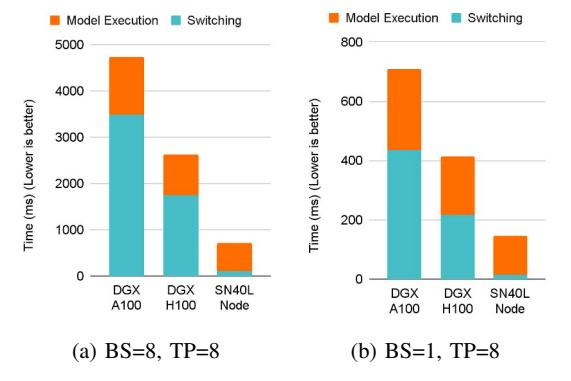
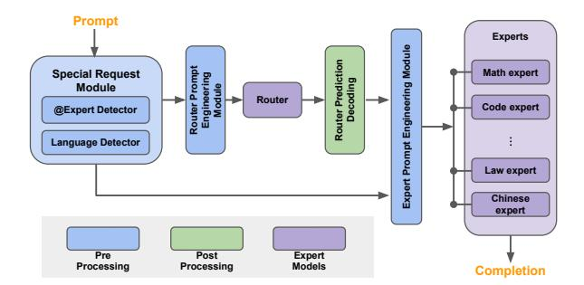
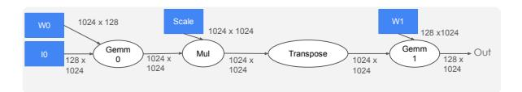

# I. INTRODUCTION

Recent advances in the training and inference of large language models (LLMs) has taken the world by storm. Stateof-the-art generative AI/ML applications like ChatGPT [1] and Gemini [2] are built on top of *monolithic LLMs* that can have billions or trillions of parameters. They are trained with curated datasets that consist of trillions of tokens scraped from the web. However, training and serving a state-ofthe-art monolithic LLM is both an extraordinarily expensive affair and a complex systems engineering challenge. Training requires building and operating a supercomputer composed of thousands of hosts, purpose-built networks, power and cooling infrastructure, and thousands of accelerators – typically GPUs [3], [4] or TPUs [5]–[8]. The prohibitive cost and expertise required to train and serve 100s of billions of parameters put state-of-the-art AI capabilities out of reach for many academic researchers and smaller organizations, especially when on-premise deployments are needed. For instance, compute costs to train OpenAI's GPT-4 is estimated to be \$78 million USD, and Google's Gemini Ultra to be \$191 million USD [9]. Building and deploying large monolithic models may not be sustainable for hyperscalers [10] or any organization needing capable AI models continuously trained and updated on their data [11]–[13]. Finally, systems that cater to monolothic models have scaled compute TFLOPs much faster than memory bandwidth and capacity, creating the memory wall [14] where the memory system can no longer feed the compute efficiently.

The ML research community has responded with ecosystems of much smaller, modular models that are just as capable, but are cheaper and easier to train and serve [15]–[18]. Smaller models like the 8B-parameter Llama 3.1 [19], Llama2 [20], and Mistral 7B [21] are often adequate. They might not match the performance of larger models over a *general* suite of tasks, but smaller models can deliver superior accuracy on a narrower set of *specialized* tasks for

Fig. 1: CoE latency breakdown between model switching and model execution to generate 20 output tokens from a Llama2- 7B expert The SN40L RDU executes CoEs efficiently by combining streaming dataflow and a novel three-tier memory hierarchy of SRAM, HBM, and DDR.

which they have been fine-tuned [22], [23]. For example, Flan-T5-XL only has 3B parameters, but it surpasses the 175B-parameter GPT-3's MMLU score by nearly 10% [24]. Proof points like these have bolstered community activity in building and training smaller models by specializing base models to a domain, by fine-tuning base models to a specific task or group of tasks [25], [26], and by distilling or compressing larger models into smaller models. Furthermore, *compositions* of such smaller models have been shown to demonstrate emergent behavior that matches large monolithic models [27]–[31]. They bring AI within reach to a broader community.

We believe that successful AI systems of the future will host and execute many small models efficiently. This is reflected both in directions pursued successfully in academia [15], [28]– [31], and new products that are being adopted in industry [32]– [34]. CoE-like compound AI systems play a pivotal role in advancing the AI frontier [35], [36]. In this paper, we refer to such modular systems with compositions of specialized smaller models as *Composition of Experts (CoE)*.

A CoE consists of several small expert models working in tandem on a task. Outputs from one expert determine which expert(s) to execute next. Running an expert involves loading model parameter weights to the accelerator's main memory, and then executing the model. Consequently, executing a CoE involves a sequence of model switching and model execution. Current state-of-the-art AI accelerators do not handle this sequence of operations efficiently, as shown in Figure 1.

Efficiently accelerating a *CoE* boils down to executing expert models efficiently while minimizing model switching costs. We break this down into three key requirements:

1) *Aggressive* Operator Fusion and Pipeline Parallelism to execute expert models efficiently. Smaller models have lower operational intensity [37]–[39] and complex access patterns between operators [40]. Conventional operator fusion techniques [41]–[43] achieve limited

- success across arbitrary access patterns.
- 2) High-Bandwidth Memory to exploit temporal and spatial locality in weights and intermediate results during generative inference, and
- 3) High-Capacity Memory to minimize switching costs and store the parameters of many expert models

In this paper, we describe a hardware/software solution that overcomes the memory wall by addressing the challenges above.

We first describe the Samba-CoE, a trillion parameter CoE system with 150 8B expert models, and how running it efficiently requires hardware support for aggressive operator fusion and a novel memory system. We present the SambaNova SN40L Reconfigurable Dataflow Unit (RDU), a commercial dataflow accelerator that combines streaming dataflow parallelism with a novel three-tier memory system containing large on-chip SRAM, HBM, and DDR DRAM that is directly attached to the accelerator.

The RDU's streaming dataflow architecture allows us to fuse *hundreds* of complex operations with arbitrary access patterns into a single kernel call – without requiring the programmer to write that kernel by hand. This delivers large speedups by exploiting on-chip hardware support for mixtures of pipeline, data, and tensor parallelism. Our aggressive fusion techniques are well beyond the capabilities of state-of-the-art techniques used with conventional architectures [37], [41]–[43].

Fabricated using TSMC 5nm technology, the SN40L RDU is a 2.5D Chip-on-Wafer-on-Substrate (CoWoS) chiplet-based design containing two SN40L Reconfigurable Dataflow Dies (RDDs) and HBM. Each SN40L RDU socket has 638 BF16 TFLOPS of peak compute performance using 1040 distributed Pattern Compute Units (PCUs). These are complemented by 1040 distributed Pattern Memory Units (PMUs) that in aggregate provide hundreds of TBps of on-chip memory bandwidth along with high bank-level parallelism within and across PMUs. Flexible on-chip address generation logic provides high bandwidth for arbitrary tensor memory access patterns. The three memory tiers in SN40L are: 520 MiB of on-chip PMU SRAM, 64 GiB of co-packaged HBM, and up to 1.5 TiB of DDR DRAM (using pluggable DIMMs). Models are loaded from DDR to HBM at over 1 TB/s in a single SN40L Node.

We quantify and discuss the impact of streaming dataflow parallelism on several real world benchmarks, showing speedups ranging from 2× to 13× over an optimized baseline. We deploy Samba-CoE on a single *SN40L Node* that contains eight SN40L RDU sockets and a host. We discuss the performance of Samba-CoE on the SN40L Node compared to DGX A100 and DGX H100. We show that for CoE inference deployments, the SN40L reduces machine footprint by up to 19×, speeds up model switching time by 15× to 31×, and achieves an overall speedup of 3.7× to 6.6× over DGX H100 and DGX A100, respectively.

This paper is organized as follows: Section II describes Samba-CoE, our trillion parameter CoE. Section III describes streaming dataflow and its challenges that translate to key hardware requirements. Section IV describes the SN40L hardware architecture in detail and lists key changes from prior RDUs [44], [45]. Section V describes the software support for managing DDR and HBM. Section VI quantifies the benefits of streaming dataflow as well as the performance of Samba-CoE. Section VII discusses key learnings from the hardware/software codesign process. Section VIII covers related work. We conclude in Section IX.

#### II. BACKGROUND: COMPOSITION OF EXPERTS

In this section, we describe one instance of a CoE built and deployed on the SN40L, called *Samba-CoE*. Figure 2 shows the Samba-CoE pipeline from prompt to response.

Samba-CoE consists of several expert models and a router model. Each expert is fine-tuned in a specific domain. We leveraged several excellent expert models fine-tuned on domains like coding, math, and language translation from the open source community. The router is another specialist model that dynamically assigns each input prompt to the most relevant expert. For instance, a math-related query would be routed to the math expert, while a coding question would go to the code expert.

The Samba-CoE is inspired by the Mixture-of-Experts (MoE) architecture [46], but has a few key differences. Although both MoEs and CoEs are more sparsely activated than a traditional dense monolithic model, MoEs are less flexible than CoEs. MoEs need to be trained/fine-tuned as a single model, similar to monolithic models, whereas CoEs are composed out of independently and heterogeneous expert models that are trained/fine-tuned independently of each other. CoEs are also more capable: prior work has shown that CoEs can outperform both MoEs [28], [29] as well as large monolithic models like GPT-3.5 and GPT-4 [33], [34]. We note that CoEs and MoEs are orthogonal techniques that can be easily combined: a CoE can leverage expert models that are implemented internally as MoEs.

For simplicity, in this paper, the router model and expert models are all derived from Llama2-7B [20]. Note that the router and expert models do not need to be homogeneous they can be different architectures with different numbers of parameters. Llama2-7B was chosen as the basis for this work due to its convenient size, impressive capabilities, and strong community support. The CoE concept and the Samba-CoE system are not limited to Llama2.

#### III. HARDWARE REQUIREMENTS FOR COE

CoE execution time is broken down into model execution time and model switching time, as seen in Figure 1. Minimizing CoE execution time can be used to either reduce the machine footprint per user or increase the number of users supported under a given footprint. To reduce model execution time, we show the advantages of streaming dataflow over conventional operator fusion. To minimize model switching time, we motivate the need for both a high-capacity accelerator-local DDR interface and HBM.

Fig. 2: Samba-CoE Pipeline from prompt to completion.

Fig. 3: An example dataflow graph showing a simplified version of the Monarch FFT decomposition [40].

#### A. Streaming Dataflow

Conventional Operator Fusion is Insufficient: Operator fusion is a common optimization technique to increase operational intensity and improve hardware utilization [37], [40]–[43], [47], [48]. Fusion also reduces the number of kernel calls required to run a model and amortizes kernel launch overheads. However, expert models often contain operators with low operational intensity [49], [50] coupled with complex access patterns involving shuffles and transposes [40]. Complex access patterns severely restricts the efficacy of fusion on GPUs. Frameworks like PyTorch2 [43] and TensorRT [42] have documented restrictions on patterns that are explicitly not supported for fusion. Consequently, many complex fused kernels are still handwritten [47], [48] for GPUs.

Figure 3 depicts a simplified Monarch FFT decomposition [40] with tensor shapes annotated on the edges. Table I shows the impact of fusion on the operational intensity. Higher operation intensity allows applications to achieve roofline performance for a given target accelerator. For instance, an A100 GPU has a TFLOPS/TBps ratio of approximately 300/2 = 150, meaning kernels with operation intensities less than 150 FLOPs/byte are memory-bound on the A100. In Table I, the first two rows are memory bound on A100, and the last row is compute bound.

| Fusion Level            | Operation Intensity (Ops / Byte) |  |  |
|-------------------------|----------------------------------|--|--|
| No Fusion               | 39.5                             |  |  |
| Gemm0 - Mul - Transpose | 102.6                            |  |  |
| Fully Spatially Fused   | 410.4                            |  |  |

TABLE I: Impact of different levels of fusion on operation intensity for the example in Figure 3. Without full fusion, this example will be memory bound on most architectures.

However, GPUs cannot fuse all of Figure 3 for the following reasons:

- 1) Rigid memory hierarchy and programming model creates data movement bottlenecks: A GPU kernel is launched with a grid of thread blocks. The grid structure is fixed for the duration of the kernel. Fusing *Gemm0* and *Mul* would be trivial. However, *Transpose* forces threads to access values from threads in other SMs, triggering a data exchange across SMs via the shared cache and HBM. As there is no other means to transfer data between SMs, this lack of flexibility creates a bottleneck at the shared cache and HBM
- 2) Insufficient on-chip SRAM capacity forces materialization of the output of *Transpose* to HBM, preventing a fusion opportunity.
- 3) No pipeline parallelism exploited between operators: Higher order Monarch FFT decompositions (studied in Section VI) create many small matrix multiplies that are 32 × 32 × 32 or smaller, which do not utilize all SMs efficiently. However, there is abundant pipelinelevel parallelism across all the matrix multiplies and element-wise operators. The GPU SIMT programming model does not provide a straightforward way to execute the operators in Figure 3 as a pipeline.

