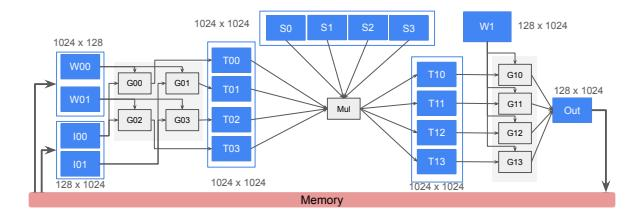
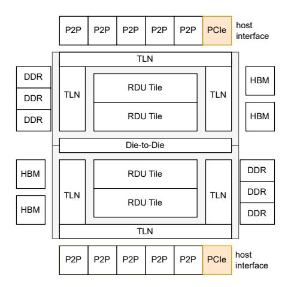
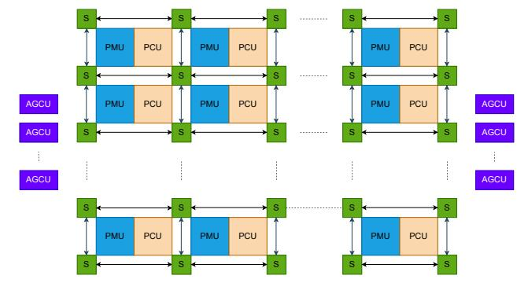
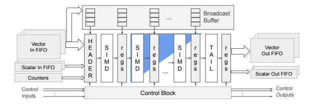
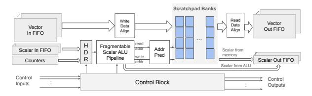
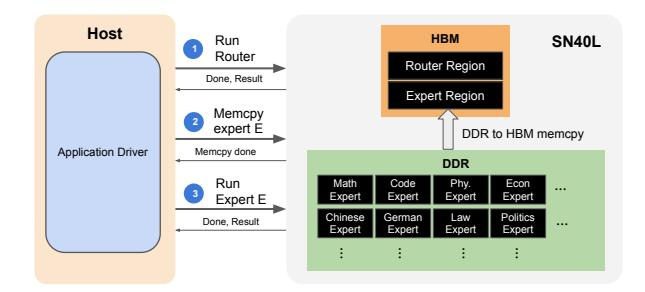

# Streaming Dataflow enables Pipelining and Automatic Fusion with Arbitrary Access Patterns:

Unlike conventional fusion, *streaming dataflow* executes operators as a coarse-grained pipeline. Tensors are tiled and streamed through this pipeline. Tiles can have *any arbitrary read and write access patterns* between operators.

Figure 4 depicts the spatially fused implementation. Blue boxes represent on-chip buffer units, and gray boxes represent on-chip compute units. The operators Gemm0, Mul, and Gemm1 are executed as stages in a coarse-grained pipeline. The blue memory units in between serve as decoupling stage buffers that hold intermediate results. More compute units are assigned to Gemm0 and Gemm1 as they account for a larger fraction of the total operations. Input and output bandwidths to and from stage buffers are matched to their respective stages by using the appropriate number of memory units. For instance, logical stage buffer I0 is partitioned into two memory units I00 and I01 to match the required input bandwidth to Gemm0. Buffer S0 - S3 is partitioned into four memory units for capacity reasons. The transpose operation is fused into buffers T0\* and T1\* as an access pattern.

We distill the observations from above into the following list of on-chip architecture features to enable streaming dataflow:

- 1) Composable memory units: A single memory unit provides a fixed capacity and bandwidth. As capacity and bandwidth needs vary across on-chip tensors, hardware should support programmable interleaving of logical addresses across memory units.
- 2) Address generation bandwidth and flexibility: High data bandwidth requires high address generation bandwidth. Furthermore, each memory unit should

Fig. 4: A spatially fused implementation of Figure 3. Blue boxes are on-chip buffers, gray boxes are compute units, and edges are on-chip communication.

- support non-blocking concurrent reads and writes to implement stage buffers efficiently. In short, the address generation hardware should allow generating multiple concurrent addresses at high throughput for arbitrarily complex address expressions
- 3) Systolic and streaming compute: ML accelerator architectures often implement systolic arrays to increase compute density for GEMM-like operations. However, in many ML models, GEMMs are frequently followed by element-wise operators and reductions which require high throughput streaming compute capability.
- 4) One-to-many, many-to-one, and data reordering: Disparities between the number of producer and consumer units create one-producer-to-many-consumers and many-producers-to-one-consumer traffic streams that also require flow control. For one-to-many, hardware support is required to create fan-out paths in the interconnect from the source to a program-decided set of destinations. For many-to-one traffic, data from different paths can arrive out-of-order at the destination. The out-of-order sequence must often be put back in order to match the program's expectation at the destination. In other words, hardware must provide a protocol to reorder data streams. Finally, program-controlled bandwidth management (e.g., throttling) and routing are necessary to satisfy streams with differing bandwidth requirements. All of this hardware support needs to be usable by automatic place-and-route algorithms within the compiler.

## *B. Model Hosting and Switching Costs*

HBM's limited capacity limits the number of experts that can be in a CoE when hosted on a GPU or TPU. With HBM alone, running large CoEs requires either (a) using more machines for HBM capacity, which increases costs, complicates deployment, and introduces load balancing challenges, or (b) using the host's memory, which increases switching latency, as shown in Figure 1. Higher capacity DDR memory that is attached directly to the accelerator reduces both model hosting and model switching costs. Furthermore, CoEs exhibit temporal locality in expert parameters, as they are used multiple times (during autoregressive decoding, for instance). HBM plays a key role in exploiting this temporal data locality by acting as a software-managed caching tier between DDR and SRAM.

Consequently, we conclude that systems to execute composition of smaller models need two types of off-chip memories: (1) high-bandwidth memory to exploit temporal locality of expert parameters, and (2) high-capacity memory to store expert parameters in a small footprint.

In the next section, we describe the SN40L Reconfigurable Dataflow Unit which is built on the above principles.

#### IV. SN40L HARDWARE ARCHITECTURE

The SN40L dataflow accelerator is fabricated using TSMC's 5FF process and packaged as a dual die socket using Chip-on-Wafer-on-Substrate (CoWoS) multi-chip packaging technology. Table II lists key chip parameters for the SN40L RDU. Figure 5 shows the salient components of the SN40L, which are described below.

RDU Tile: A coarse-grained reconfigurable array of dataflow cores. Consists of Pattern Compute Units (PCUs), Pattern Memory Units (PMUs), and Address Generation and Coalescing Units (AGCUs) that are connected together in a two-dimensional mesh interconnect called the Reconfigurable Dataflow Network (RDN).

Memory Interfaces: The SN40L interfaces with two tiers of off-chip memories – HBM and DDR. Both memory spaces are software managed. The DDR tier can have a peak memory capacity of 1.5 TiB at a peak bandwidth of over 200 GB/s. The HBM tier has 64 GiB of capacity with a peak bandwidth of about 2 TB/s per socket.

Die-to-Die (D2D) Interface: SN40L tile components can stream data between two dies directly without going through off-chip memory.

Host Interface: SN40L interfaces with a host x86 CPU using a PCIe link. This interface supports DMA between host and device off-chip memory as well as direct communication between the host and the tile.

Peer-to-Peer (P2P) Interfaces: Connects an SN40L to other SN40L RDUs. A peer-to-peer protocol described in section IV-D provides primitives to implement collective communication primitives.

Top Level Network (TLN): This network connects an SN40L tile to the host, memory, and peer-to-peer interfaces.

Figure 6 illustrates an SN40L tile with the key dataflow components: PCUs, PMUs, RDN switches, and AGCUs. The following subsections describe them in more detail.

#### *A. Pattern Compute Unit (PCU)*

The PCU in SN40L provides the systolic and streaming compute capabilities in the SN40L. The PCU's datapath consists of a header, body, and tail. The header consumes incoming dataflows and drives the body section. The PCU's body section is configurable as an output stationary systolic array or as a pipelined SIMD core with multiple stages of vector compute. The tail performs special element-wise functions and drives the output FIFOs. This enables efficient

Fig. 5: Block Diagram of the 2-die SN40L showing high-level components and interfaces.

| Parameter            | Value                      |  |
|----------------------|----------------------------|--|
| Compute Capability   | 638 BFLOAT16 (BF16) TFLOPs |  |
| SRAM Capacity        | 520 MB                     |  |
| HBM Capacity         | 64 GB                      |  |
| HBM Bandwidth        | 1.8 TB/s                   |  |
| DDR Capacity         | 1.5 TB                     |  |
| DDR Bandwidth        | 200 GB/s                   |  |
| PCU Count            | 1040                       |  |
| PMU Count            | 1040                       |  |
| Clock Frequency      | < 2 GHz                    |  |
| Technology, Die Size | 5nm, < 650 mm2             |  |
| Dies per socket      | 2                          |  |

TABLE II: Chip parameters for the SN40L RDU.

Fig. 6: Block Diagram of the SN40L Tile: PCUs, PMUs, RDN switches, AGCUs. Connections between AGCU and switches is not shown.

Fig. 7: PCU block diagram showing components for systolic and SIMD operation with cross-lane reduction.

Fig. 8: PMU ALUs, predication, and data alignment units.

execution of GEMM-like operations, element-wise operations, or reductions.

Figure 7 illustrates the PCU as both 2D systolic array and as a SIMD core. The systolic array accelerates matrix multiplications like Gemm0 and Gemm1 in Figure 3. Inputs to the systolic array are streamed left-to-right and top-to-bottom through a structure called broadcast buffer. Accumulated results are drained left-to-right to output FIFOs through the tail unit. Matrix multiplication can be parallelized further across multiple PCUs, similar to the depiction in Figure 4. As a SIMD core, the PCU executes a parallel multidimensional tensor operation in a fully pipelined fashion, like Mul in Figure 4. Each SIMD stage supports common arithmetic, logical, and bit-wise operations in FP32, BF16, and INT32 formats. The PCU can be configured to implement an optional cross-lane reduction network, shown as the blue triangle in the figure. Lane-wise reductions are also supported, in pure SIMD fashion. Counters track loop iterations and generate control events when they reach the programmed maximum value, indicating that a loop has completed execution.

The tail section supports transcendental functions, random number generation, stochastic rounding, and format conversions. A tail operation can be fused and pipelined with compute in the body section.

An operation can be parallelized across multiple PCUs in a data parallel, tensor parallel, or pipeline parallel fashion. Data parallelism is achieved by partitioning inputs and outputs to create multiple independent data streams that are processed by different PCUs. Tensor parallelism is achieved by forking into data parallel streams, then joining them. Pipeline parallelism is achieved by chaining multiple PCUs together to fuse operations and increase operational intensity.

#### B. Pattern Memory Unit (PMU)

The PMU in SN40L provides the on-chip memory capacity, bandwidth, and addressing flexibility for efficient operator

fusion. Figure 8 shows the high-level block diagram of the PMU. PMUs are used to store on-chip tensors like inputs, parameters, metadata, and intermediate results. For example, all blue blocks in Figure 4 correspond to PMUs. The key PMU components are described below.

**Scratchpad banks:** Each PMU contains a programmer-managed scratchpad memory that is organized as an array of SRAM instances. The SRAM array collectively supports concurrent writes and reads.

Scalar ALU Pipeline: A PMU contains several stages of integer ALUs that can be configured to generate read and write addresses concurrently to flexibly access a tensor in the scratchpad. PMU ALUs implement a set of special complex instructions like bitfield extraction and shift-and-set, that are frequently used in address computations. This enables producing complex addresses more efficiently with fewer ALU stages, and hence lesser latency. The ALU pipeline also has a path to ingest scalars as operands from the scalar RDN, and output computed values as scalars into the scalar RDN. This path facilitates addressing composability: complex integer calculations can be broken up and mapped across several PMUs if needed.

As described in section III and shown in Figure 4 (buffers T00-T03 and T10-T13), stage buffers in a spatially fused kernel require concurrent reads and writes which may have different access patterns. While not universally true, we have anecdotally observed scenarios where write and read access patterns for a tensor inversely affect each other's complexity; a complex write access pattern often enables a simpler read access pattern and vice versa. The scalar ALU pipeline allows software to exploit this insight. It can be partitioned into independent read and write address generation pipelines with a software-configured number of stages allocated to each access. Address Predication and Banking: Figure 4 shows that a single logical tensor can span multiple PMUs due to capacity needs (S0-S3), bandwidth needs (W00-W01 and I00-I01), or both (T00 - T03 and T10 - T13). The PMU enables this by providing hooks to programmatically control tensor address interleaving across PMUs. Specifically, each PMU can be programmed with a range of valid addresses for that PMU, or a programmable predicate bit per generated address. An addresses is processed if it is within the programmed range or a valid predicate, and dropped otherwise. Furthermore, addresses are mapped to scratchpad banks using bank bit locations that can be programmed by software.

**Data Alignment Unit:** The data alignment unit supports common tensor transformation operations like transpose, cross-lane vector permute, vector-unaligned accesses, lookup table (LUT), data format, and data layout conversions. Tensors to be transposed are written in a special diagonally striped format across the scratchpad banks that enables reading the same tensor in both regular and transposed format at full bandwidth. This capability enables implementing the *transpose* operator in Figure 3 as a read-write access pattern optimization between buffers T00-T03 and T10-T13 in Figure 4.

#### C. Reconfigurable Dataflow Network (RDN)

The RDN is the on-chip programmable interconnect that facilitates communication between PCUs, PMUs, and AGCUs. The RDN consists of three physical fabrics - vector, scalar, and control. The vector and scalar fabrics are packet-switched. The control fabric is circuit-switched and consists of a bundle of single bit wires that can be individually routed. The vector fabric is the primary conduit for tensor data. The scalar fabric is mainly used to transport metadata such as a addresses but in some cases it can also be used to carry data or control. The control fabric is used to carry tokens for distributed coarsegrain flow control and to collectively orchestrate the execution of a graph. Control tokens typically correspond to counter 'done' events that indicate the end of a loop, as discussed briefly in Section IV-A.

The RDN is implemented using a mesh of non-blocking switches. As shown in Figures 7 and 8, inbound scalar and vector packets to units from switches land in input FIFOs, and exit via output FIFOs. Transmissions on the vector and scalar fabric are subject to credit-based flow control at every hop. Packet streams are also end-to-end flow controlled between communicating units on the RDN through a combination of coarse-grained software tokens, fine-grained hardware credits, and forward progress guarantees in hardware. The routing tables for all three RDN fabrics are configured by software using a place-and-route (PnR) layer within the compiler.

We now describe the mechanics of supporting the key communication patterns identified in Section III.

- Multi-cast and Programmable routing: Routing of packets on the scalar and vector fabrics is done either dynamically using a 2-D dimension order route or as software-controlled static flow routes. In static flow routing, software assigns a flow ID field to a packet stream, which is carried with the packet. The flow ID field is decoded at every switch port and reassigned prior to forwarding the packet to its next destination. The static flow routing mechanism supports packet multi-casting through the switches.
- Many-to-one and Data Reordering: Vector packets contain a metadata field called *sequence ID*, which is the primary mechanism to support arbitrary many-to-one streams on-chip. Vector output ports of units are equipped with programmable logic to generate sequence IDs for each output vector. This way, sequence IDs can be programmed by software to represent the logical vector order for a given operation across multiple sources. The sequence ID field is used as an input operand in a PMU to compute the write addresses to reorder the packets.

#### D. Address Generation and Coalescing Unit (AGCU)

The AGCU is a reconfigurable dataflow bridge for the RDU tile to access local device memory (HBM/DDR), host memory, remote RDU device memory, and remote RDU tiles via the TLN. On the tile-side, it acts like a dataflow core by exposing RDN vector, scalar, and control ports. On the TLN-side, it generates read and write requests and coalesces the responses.

Fig. 9: Simplified sequence of operations for Samba-CoE on SN40L. Router weights are in HBM. Expert weights are in DDR, with a region pre-allocated in HBM for the "current" expert(s).

It is equipped with a scalar address generation pipeline and counters, bearing some similarities to the PMU logic (sans SRAM). The address generation pipeline consists of It also provides an address translation layer for memory management. **Peer-to-Peer:** The AGCU supports a peer-to-peer (P2P) communication protocol to directly stream data between RDU tiles on different sockets without involving DDR or HBM. The P2P protocol enables building collective communication primitives between RDUs such as *AllReduce*.

Kernel Launch Orchestration: The AGCU implements a kernel launch mechanism which consists of sequence of three commands: Program Load, Argument Load, and Kernel Execute. Running a model involves executing a schedule of kernel launches, which can be *software-orchestrated* or *hardware-orchestrated*. Software orchestration allows more flexible scheduling of kernels and provides more host software visibility into model execution. However, software orchestration incurs overheads that can impact performance. Hardware orchestration offloads a static kernel schedule to the dedicated hardware in the AGCUs, which significantly reduces the overheads. In section VI, we quantify and discuss the impact of software vs. hardware-orchestrated execution on various benchmarks.

#### V. SOFTWARE SUPPORT

Here we describe how Samba-CoE is deployed on SN40L. Samba-CoE consists of 150 Llama2-7B experts with a total of over 1T parameters. It is deployed on a single SN40L node with eight RDU sockets. Figure 9 shows how Samba-CoE leverages both DDR and HBM, along with a simplified flow of events for a single prompt. Weights for all 150 experts are held in high capacity DDR, while weights for the router are held in HBM. A single Samba-CoE inference has three highlevel steps: (1) Run the router to determine the expert, (2) Copy the expert from DDR to HBM, and (3) Run the expert. After the model switch, the expert model's weights are read multiple times in the auto-regressive decoding loop to generate multiple tokens. This inherent model-level temporal locality in Samba-CoE is exploited by moving the weights to HBM.

However, this does impose additional burdens on the software stack to manage multiple non-uniform memory spaces. In this section, we discuss the software infrastructure we built in between the application layer and the SN40L's low-level runtime driver to implement this vision.

#### *A. Memory Allocation*

One of our goals for this system design was to make device memory management transparent to the application developer. To that end, we added automatic heterogeneous device memory management into the SN40L compiler. The starting assumption is to use HBM by default as long as everything fits. We therefore use DDR for two main purposes: 1) spilling data from HBM to DDR when a given model's resident memory is too large to fit in HBM, and 2) holding all of the other models that are part of the CoE but are currently inactive. Note that while there is a nontrivial performance cost in moving data between HBM and DDR, it's still significantly cheaper than it would be to spill all the way back to host's memory, as quantified in Figure 1). In this section, we focus on the first use case, and discuss the second in Section V-B.

We found that aggressive garbage collection is required to fit models like Llama2 7B from Table III in the 64 GiB HBM capacity per socket. However typical dynamic garbage collection schemes have far too much overhead for this use case, as it would require us to frequently return control back to the CPU to reorganize the SN40L's memory in the middle of the application. Instead we exploited the fact that the SN40L's programming model has neither dynamic memory allocation nor pointer aliasing, so we can therefore perform symbol lifetime analysis statically and implement garbage collection by assigning multiple logical symbols to the same device virtual addresses as long as their lifetimes don't overlap.

Finally, symbols to be spilled to DDR are determined when the memory still doesn't fit. As there is an order of magnitude bandwidth difference between the two memories, we analyze the temporal locality of each symbol and its transfer footprint to estimate the total bandwidth requirement for that symbol over the entire application. The symbols are then sorted by their aggregate transfer size, so that we will spill symbols with the smallest bandwidth requirement first. In practice we've found that for the LLM models in Table III, the weights receive highest priority to remain in HBM, while activation symbols and other intermediate results can be spilled if necessary. We are investigating further improvements to this algorithm.

