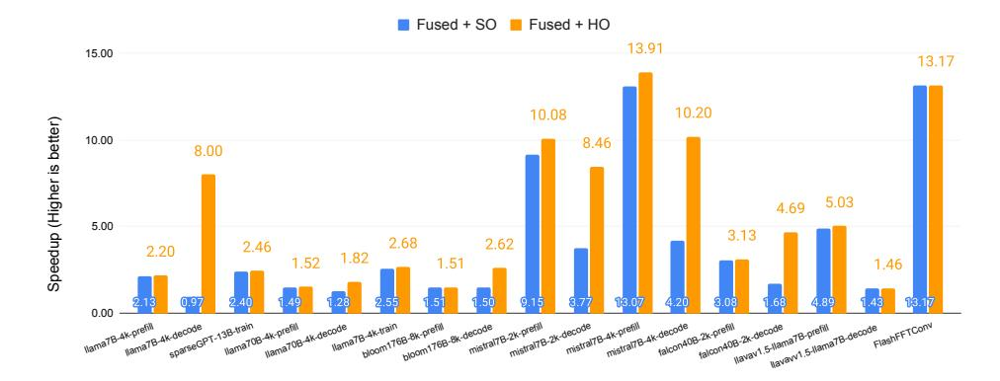
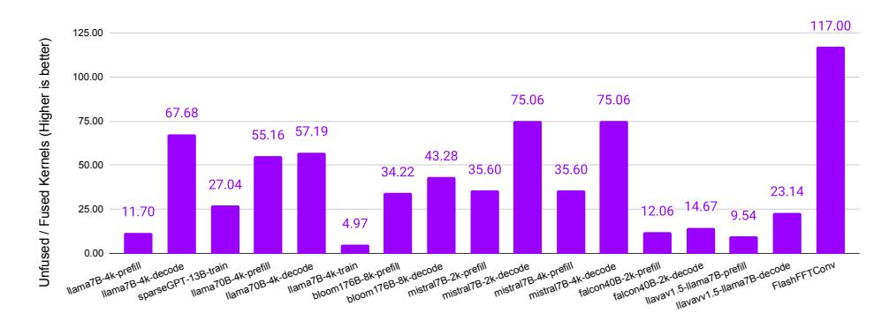
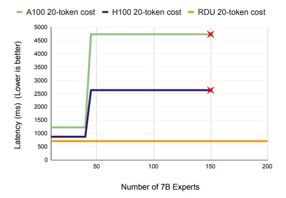
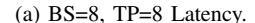
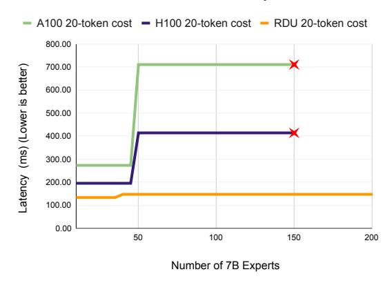
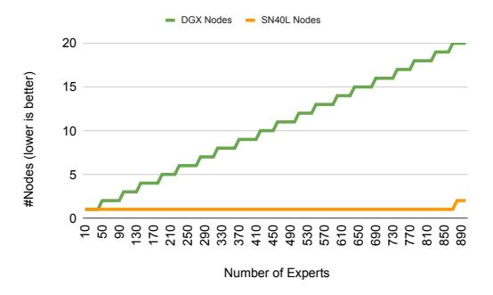

# VI. CASE STUDIES

In this section, we quantify and discuss the impact of operator fusion using several real world training and inference benchmarks. We then evaluate *Samba-CoE* on the SN40L Node and compare with the DGX A100 and DGX H100.

## *A. Impact of Operator Fusion*

*1) Benchmarks and Setup:* Table III describes the set of language model benchmarks used to quantify the impact of operator fusion. The benchmarks consist of several training and inference workloads of varying sizes. Among the inference workloads, we separate out the "prefill" phase – generating the first token – from the "decoding" phase – generating the second and subsequent tokens via autoregressive decoding. Autoregressive decoding steps take advantage of the KV cache [54], and has much lower compute and operational intensity compared to the prefill phase which constructs the KV cache. The compute graph structure of *FlashFFTConv* [40] is a complex version of the motivating example described in Section III.

All experiments other than *FlashFFTConv* are evaluated on a system containing eight SN40L sockets and one host, witht the exception of *FlashFFTConv*, which is a smaller kernel that

| Model                        | Size | Sequence Length | Configurations                              |
|------------------------------|------|--------------------|---------------------------------------------|
| llama2 [20]                  | 7B   | 4K                 | prefill, decode, train                      |
| sparseGPT [38]               | 13B  | 2K                 | train (87.5% sparse)                        |
| llama2 [20]                  | 70B  | 4K                 | prefill, decode                             |
| bloom [51]                   | 176B | 8K                 | prefill, decode                             |
| mistral [21]                 | 7B   | 2K, 4K             | prefill, decode                             |
| falcon [52]                  | 40B  | 2K                 | prefill, decode                             |
| llava1.5- multimodal [53] | 7B   | 4K                 | prefill, decode                             |
| FlashFFTConv [40]            | N/A  | 1M                 | FFT Convolution for long sequence models |

TABLE III: Benchmarks and their descriptions. Here, 'prefill' = First token generation, 'decode' = Autoregressive decoding token generation with KV cache, 'train' = training.

we evaluate on a single SN40L. We measure and compare the performance of each benchmark in three configurations:

- Unfused: Every PyTorch operator in the model is executed as one or more kernels on the SN40L, with intermediate results materialized to DDR or HBM. Kernels are scheduled for execution by software. Each kernel is still parallelized to run efficiently on the SN40L.
- Fused + Software Orchestrated (SO): Operators are fused into fewer kernels using a combination of automatic compiler optimizations and programmer hints. Kernel scheduling is performed from host software.
- Fused + Hardware Orchestrated (HO): Same fused kernels as above, but kernel scheduling is offloaded to hardware using the feature described in Section IV-D.
- *2) Benchmarking Results:* Figure 10 shows the impact of operator fusion on all the benchmarks. The blue bars quantify the impact of operator fusion. The orange bars quantify the impact of hardware-orchestrated kernel launches.

Operator Fusion Speedup Without fusion, *FlashFFTConv* has very low operational intensity and suffers from low performance. With fusion on the SN40L, the entire *FlashFFTConv* benchmark is executed with a single kernel launch, in a manner similar to the simplified diagram shown in 4. The increased operation intensity provides a speedup of 13× over the unfused baseline.

Inference prefill, training, and sparseGPT benchmarks achieve speedups in the 1.5× to 3× range. With spatial fusion, higher operation intensity is achieved with sufficient coarse-grained pipeline parallelism to keep the on-chip units occupied. For these benchmarks, batch size and sequence size provide the required level of pipeline parallelism to exploit the benefits of fusion.

In spite of having low operational intensity, autoregressive decoding inference benchmarks gain from fusion by eliminating the overheads of kernel launch and unnecessary HBM traffic. We observe speedups from 1× to 13×, with Mistral achieving the highest speedup.

| Model                   | Output tokens/second/user |
|-------------------------|------------------------------|
| Llama 3.1 Instruct 405B | 129                          |
| Llama 3.1 Instruct 70B  | 457                          |
| Llama 3.1 Instruct 8B   | 1042                         |

TABLE IV: Output tokens per second per user for Llama3.1 [19] models measured on 16 SN40L sockets. All variations use BF16 weights, and mixed BF16/FP32 activations. Sequence length of 8K is used.

Figure 11 compares the number of kernel call launches involved in executing various benchmarks in fused and unfused configurations. A ratio of 11× for *llama7B-4k-infprefill*, for instance, means that with operator fusion, *llama7B-4k-inf-prefill* was executed with 11× fewer kernel launches than its unfused baseline. This ratio quantifies the level of fusion performed in a given benchmark. For some benchmarks, higher numbers imply more aggressive fusion, like in the case of *FlashFFTConv* and *sparseGPT*. For others like *llama70B*, higher numbers are also due to the model's larger size.

Hardware-Orchestrated Kernel Launch Speedup: We now discuss the improvements obtained due to hardwareorchestrated kernel launches. Here, we see the opposite trend to the previous discussion: Autoregressive decoding inference benchmarks achieve a noticeable speedup of 1.4× to 8×. Kernels have very short execution times in these benchmarks, most of which is dominated by loading weights and other inputs. Consequently, kernel launch overheads start to account for a larger fraction of the total time. Offloading kernel scheduling to the SN40L cuts out the overheads of software scheduling to provide a speedup.

On the other hand, inference prefill and training benchmarks only see a maximum improvement of 1.1×. Each kernel executes for much longer in these benchmarks, and hence kernel launch overheads are amortized. The fused *FlashFFTConv* benchmark has just a single kernel call, which takes the same duration with both kernel scheduling methods.

#### *B. Llama3.1 on SN40L*

We demonstrate the impact of operator fusion on the performance of Llama 3.1 [19] on the SN40L. At the time of writing, Llama 3.1 is the most powerful open source model in the world with three variations - 8B, 70B, and 405B.

Table IV shows the token generation speeds for all Llama3.1 variants on 16 SN40L sockets. Speculative decoding [55] is employed on 70B and 405B models. As the SN40L fuses entire decoders into a single kernel call, almost all overheads in decoding is eliminated. Fusion enables using HBM bandwidth only for stream weights and KV cache values. Dataflow enables overlapping weight loads with computatation to achieve over 85% of HBM bandwidth. In contrast, stateof-the-art optimized GPU implementations on H100 rarely exceed 50% HBM bandwidth usage on weights and KV caches due to other inefficiencies. At the time of writing, the

Fig. 10: Measured benchmark speedups over an unfused baseline running on 8 SN40L sockets. SO = Software-Orchestrated, HO = Hardware-Orchestrated.

Fig. 11: Ratio of number of kernel calls in unfused vs. fused configurations.

SN40L is the fastest platform in the world for Llama3.1 405B inference. This is despite the fact that inference on SN40L is performed in full BF16 precision, while other optimized GPU implementations quantize weights to 8-bit formats [56].

#### C. Composition of Experts

We quantify the latency and system footprint of deploying Samba-CoE with increasing expert counts on the SN40L Node vs. DGX A100 and DGX H100. Table V summarizes the results. We study two scenarios with increasing expert counts: Latency Impact on a single node, and System Footprint Impact to sustain the same latency.

Latency Impact: We model two use cases: a chatbot conversation use case to produce 20 output tokens per input prompt, and a translation use case to produce 200 output tokens [57] The models and router are mapped as tensor-parallel over eight sockets (TP8) fashion on all platforms. The router and KV cache is always in HBM. The SN40L Node numbers are measured on real hardware. As Samba-CoE is not deployed on DGX, we estimate latencies using published model latency numbers [57] and optimistic model switching estimates based on DGX specs [58]–[61]. The total latency includes the time to run the router, copy the required expert weights, and running the expert. Two expert scenarios

| Metric                                     | vs. DGX A100 | vs. DGX H100 |
|--------------------------------------------|-----------------|-----------------|
| Overall Speedup, BS = 8, 20 output tokens  | 6.6×            | 3.7×            |
| Overall Speedup, BS = 1, 20 output tokens  | 4.8×            | 2.8×            |
| Expert Speedup, BS=1, 20 output tokens     | 2.0×            | 1.5×            |
| Overall Speedup, BS = 8, 200 output tokens | 4.2×            | 2.7×            |
| Overall Speedup, BS = 1, 200 output tokens | 3.9×            | 2.6×            |
| Expert Speedup, BS=1, 200 output tokens    | 3.2×            | 2.3×            |
| Model Switching Time                       | 31×             | 15×             |
| > 150 Experts                              | DGX OOM      | DGX OOM      |

TABLE V: Samba-CoE Performance Comparison between SN40L Node, DGX A100, and DGX H100.

are studied: generating 20 output tokens, and generating 200 output tokens. We optimistically assume on the DGX that the entire capacity of HBM and host memory is available to hold weights and the KV-cache (HBM-only).

We report latencies for batch size (BS) = 1 and BS=8 cases. Note that "batch" applies to the Samba-CoE model as a whole, and not to individual experts. BS=8 implies that the Samba-CoE model received 8 prompts in a batch. The router is first

(b) BS=1, TP=8 Latency.

Fig. 12: Samba-CoE latency comparison to generate 20 tokens with batch size=1 on the SN40L Node, DGX A100, and DGX H100. Batch size=8 and 200 token output configurations follows a similar trend, with speedups reported in Table V.

run with BS=8 to obtain the expert for each prompt. Each prompt in the sample could need a different expert, as samples in a batch have no relationship with each other. The required experts are then copied over to HBM. Each (prompt, expert) pair is then run sequentially.

Figure 12 compares latencies across the three platforms. We analyze these results in two broad categories:

Under 50 experts: All experts fit in HBM, so performance is limited by the expert execution time. The SN40L Node is  $2 \times$  faster than the DGX A100 and  $1.5 \times$  faster than the DGX H100 to generate 20 tokens. For 200 tokens, the speedup numbers are  $3.2 \times$  and  $2.3 \times$ , respectively. Note that generative inference is memory-bound, and the SN40L Node has comparable HBM bandwidth to A100 (and lower than H100). The speedups clearly demonstrate the benefits of streaming dataflow: the entire decoder layer is fused into a single kernel call, using almost 90% of the PCUs and PMUs, and saturating close to 85% of HBM bandwidth. Furthermore, as the model mostly contains multiple identical decoder layers, SN40L sees

Fig. 13: System footprint to sustain TP8 performance with increasing expert counts.

virtually zero kernel launch overheads.

Over 50 experts: Latency spikes on DGXs (around 50 7B experts) happens when experts spill over to host DRAM. For BS=8, the SN40L Node achieves a speedup of  $6.6\times$  and  $3.7\times$  over DGX A100 and DGX H100, respectively. For BS=1, the SN40L Node achieves speedups of  $4.8\times$  and  $2.8\times$  respectively. BS=8 requires copying a larger number of experts, and hence accounts for a larger fraction of the total time. Figures 1a and 1b show the time breakdown for expert switching vs. model execution. With over 1 TB/s of aggregate DDR-to-HBM bandwidth, the copy time on the SN40L Node is  $31\times$  faster than DGX A100 (which provides 32 GB/s host-to-GPU bandwidth [60]), and  $16\times$  faster than H100 (which provides 64 GB/s host-to-GPU bandwidth [61]). DGXs run out of memory at 150 experts.

**System Footprint Impact:** Next, we quantify the system footprint of increasing experts to sustain the same TP8 latency on each platform. Achieving this requires eliminating expert copies on the GPU. Consequently, all experts should reside in GPU HBM. Switching cost on the SN40L DDR to HBM is factored into the latency for SN40L.

A single SN40L Node can hold and serve a CoE of up to 850 experts at the TP8 latency. Achieving this with DGX would need 19 DGX nodes to hold all experts in HBM.

#### VII. LESSONS LEARNED

The SN40L is a complex system that is a product of the collective wisdom and hard work of many software and hardware engineers over multiple years. In this section, we discuss three lessons learned along the way.

Managing bandwidth in software: Software must manage bandwidth from various entities: Tile-level unit communication, HBM, DDR, die-to-die, peer-to-peer, and host bandwidth. Bandwidth translates to one or more concurrent data streams that flow in the TLN and RDN. To utilize more bandwidth from units like HBM, more load and store data streams need to be created by software. Conversely, units needing less bandwidth should be allocated fewer resources to avoid overprovisioning and wastage. Building a static bandwidth model in the compiler to model both application requirements and hardware characteristics was

essential to enable proper bandwidth allocation and traffic management. The investment into a good static bandwidth model paid off in other ways: applications can be analyzed and tuned for performance to a first order statically.

Performance debugging: Aggressive operator fusion and pipelining creates a lot of concurrent on-chip traffic streams which create bandwidth bottlenecks. We noticed that bandwidth issues often boiled down to one of two things: a network congestion, or a memory bank conflict. Performance counters in SN40L switches and PMUs count stalls and help identify hotspots in the SN40L tile. On RDN congestion, we observe that bursty traffic can easily slow down the entire kernel if left unmanaged. Programmable packet throttling capabilities in hardware enables software to reduce bursty behavior and mitigate many RDN congestion issues. To handle PMU bank conflicts, we observed that PMUs are often programmed as double buffers of arbitrary tensor shapes, and bank conflicts could be avoided if these buffers were statically mapped to different banks. Programmable bank bits described in Section IV-B helped act upon this insight and eliminate bank conflicts for such multi-buffer configurations.

Pipelined Compute and Collective Communication: To the higher levels of our compiler, the problem of mapping data/tensor/pipeline parallel dataflows across sockets is similar to the problem of mapping them within a socket. With the hardware peer-to-peer protocol described in Sec. IV-D, collective communication operators can be fused and pipelined with other computations into the same kernel, just like any other group of operators. Furthermore, the streaming peer-topeer protocol between SN40Ls avoided a hop to HBM in many cases which helped conserve some communication resources.

## VIII. RELATED WORK

*1) Commercial AI Accelerators:* In this section, we broadly discuss other commercial AI acceleration systems. As this is a competitive market segment, many details about contemporary AI hardware is often unknown or obscured.

Architectures like the NVIDIA A100 [3], H100 [4], AMD MI300X [62], Google TPUv4 [7], [8], and Intel Gaudi [63] are all AI accelerators with HBM. While these architectures differ widely in their programming model, memory system, and scale-up capabilities, they do not have a three-tier memory system required to execute large CoEs and huge models efficiently. Consequently, deploying CoE on them incurs the inefficiencies described in Section VI-C. Furthermore, the streaming dataflow in SN40L provides a unique differentiation over the above as quantified in Section VI. Prior studies quantify and exploit operator fusion on TPUs [37] and GPUs [47], [48], but do not perform the level of aggressive fusion described in this paper. Finally, the SN40L provides about 2.5× higher aggregate memory capacity per socket over the recently announced NVIDIA GH200 [64], which enables supporting much larger CoEs models on the SN40L.

Companies like Graphcore [65], Cerebras [66], Groq [67], and earlier generations of SambaNova's RDU [44], [45] offer alternate AI accelerators. However, they all lack the three-tier memory system required to execute CoEs efficiently. To the best of our knowledge, the SN40L is the only system that has demonstrated successfully deploying a trillion-parameter CoE and other huge models in a single node and achieve the reported performance.

- *2) Research Dataflow Architectures:* The topic of dataflow architectures has several prior publications covering various aspects of compute, memory, interconnect, and programming models, as covered in survey papers [68], [69]. To the best of our knowledge, SN40L is the first dataflow architecture that combines streaming dataflow with a three-tier memory system, and quantify its impact on real world benchmarks.
- *3) Operator Fusion:* Conventional operator fusion is a well-studied topic [37], [41]–[43]. However, streaming dataflow pipelines mapped on PCUs and PMUs commonly contain 20+ operators (see Figure 11) that are automatically generated from the Python framework level by the compiler. In contrast, conventional operator fusion targets 1-5 operators [41], [42] that are often handwritten [40], [47], [48], and with access pattern restrictions [43].
- *4) Parameter-efficient Fine-tuning Techniques (PEFT):* Techniques like LoRA [70] are commonly employed to shrink expert weights to small, low rank adapters applied to a base model. However, PEFT techniques do not achieve the same level of quality as Supervised Fine-Tuning (SFT) under several scenarios [71]–[75]. Consequently, the smaller expert models are often entire models that are specialized using additional training or SFT (there are over 9000 variants of Llama 2 on HuggingFace at the time of this writing).

#### IX. CONCLUSION

In this paper, we described *Composition of Experts (CoE)* as a modular and cost-efficient alternative to large monolithic LLMs. We described the Samba-CoE with 150 experts, and motivated hardware requirements for CoE. We then introduced the SN40L dataflow accelerator and the SN40L Node that is designed to solve the memory wall using streaming dataflow and a novel three-tier memory system. SN40L's memory system consists of on-chip distributed SRAM, off-chip HBM, and high capacity DDR DRAM. We discussed the software impact of managing address spaces across DDR and HBM, along with runtime complexities in deploying Samba-CoE on SN40L.We demonstrated that streaming dataflow provides a benefit of 2× to 13× over an unfused baseline. We showed that deploying Samba-CoE on the SN40L Node reduces machine footprint by up to 19×, speeds up expert copy time by 15× to 31×, and achieves an overall speedup of 3.7× to 6.6× over DGX H100 and DGX A100, respectively.

## ACKNOWLEDGMENT

We thank all hardware and software engineers at SambaNova Systems who worked on the SN40L RDU. Their tireless hard work and engineering creativity helped overcome numerous obstacles and enabled bringing up the SN40L RDU hardware and software stack in record time.

## REFERENCES

- [1] "Chatgpt," https://chat.openai.com/.
- [2] "Bard," https://bard.google.com/.
- [3] J. Choquette, W. Gandhi, O. Giroux, N. Stam, and R. Krashinsky, "Nvidia a100 tensor core gpu: Performance and innovation," *IEEE Micro*, vol. 41, no. 2, pp. 29–35, 2021.
- [4] J. Choquette, "Nvidia hopper gpu: Scaling performance," in *2022 IEEE Hot Chips 34 Symposium (HCS)*, 2022, pp. 1–46.
- [5] N. P. Jouppi, C. Young, N. Patil, D. Patterson, G. Agrawal, R. Bajwa *et al.*, "In-datacenter performance analysis of a tensor processing unit," in *Proceedings of the ACM/IEEE International Symposium on Computer Architecture (ISCA)*, 2017.
- [6] N. P. Jouppi, D. H. Yoon, G. Kurian, S. Li, N. Patil, J. Laudon *et al.*, "A domain-specific supercomputer for training deep neural networks," *Communications of the ACM*, vol. 63, no. 7, pp. 67–78, Jun. 2020.
- [7] N. P. Jouppi, D. H. Yoon, M. Ashcraft, M. Gottscho, T. B. Jablin, G. Kurian *et al.*, "Ten lessons from three generations shaped google's tpuv4i: Industrial product," in *Proceedings of the ACM/IEEE International Symposium on Computer Architecture (ISCA)*, 2021.
- [8] N. Jouppi, G. Kurian, S. Li, P. Ma, R. Nagarajan, L. Nai *et al.*, "Tpu v4: An optically reconfigurable supercomputer for machine learning with hardware support for embeddings," in *Proceedings of the ACM/IEEE International Symposium on Computer Architecture (ISCA)*, 2023.
- [9] N. Maslej, L. Fattorini, R. Perrault, V. Parli, A. Reuel, E. Brynjolfsson *et al.*, ""the ai index 2024 annual report," ai index steering committee, institute for human-centered ai, stanford university," 2024. [Online]. Available: https://aiindex.stanford.edu/wpcontent/uploads/2024/04/HAI AI-Index-Report-2024.pdf
- [10] "Microsoft's github copilot loses \$20 a month per user." [Online]. Available: https://aibusiness.com/nlp/github-copilot-loses-20-a-monthper-user
- [11] "Navigating the high cost of ai compute." [Online]. Available: https://a16z.com/navigating-the-high-cost-of-ai-compute/
- [12] "The inference cost of search disruption." [Online]. Available: https: //www.semianalysis.com/p/the-inference-cost-of-search-disruption
- [13] "Ai server cost analysis memory is the biggest loser." [Online]. Available: https://www.semianalysis.com/p/ai-server-costanalysis-memory-is
- [14] A. Gholami, Z. Yao, S. Kim, C. Hooper, M. W. Mahoney, and K. Keutzer, "Ai and memory wall," 2024.
- [15] "C. raffel, "build an ecosystem, not a monolith"." [Online]. Available: https://colinraffel.com/talks/simons2023build.pdf
- [16] S. Mukherjee, A. Mitra, G. Jawahar, S. Agarwal, H. Palangi, and A. Awadallah, "Orca: Progressive learning from complex explanation traces of gpt-4," 2023. [Online]. Available: https: //arxiv.org/abs/2306.02707
- [17] S. Gunasekar, Y. Zhang, J. Aneja, C. C. T. Mendes, A. D. Giorno, S. Gopi *et al.*, "Textbooks are all you need," 2023. [Online]. Available: https://arxiv.org/abs/2306.11644
- [18] A. Q. Jiang, A. Sablayrolles, A. Mensch, C. Bamford, D. S. Chaplot, D. de las Casas *et al.*, "Mistral 7b," 2023. [Online]. Available: https://arxiv.org/abs/2310.06825
- [19] A. Dubey, A. Jauhri, A. Pandey, A. Kadian, A. Al-Dahle, A. Letman *et al.*, "The llama 3 herd of models," 2024. [Online]. Available: https://arxiv.org/abs/2407.21783
- [20] H. Touvron, L. Martin, K. Stone, P. Albert, A. Almahairi, Y. Babaei *et al.*, "Llama 2: Open foundation and fine-tuned chat models," 2023. [Online]. Available: https://doi.org/10.48550/arXiv.2307.09288
- [21] A. Q. Jiang, A. Sablayrolles, A. Mensch, C. Bamford, D. S. Chaplot, D. de las Casas *et al.*, "Mistral 7b," 2023.
- [22] "Deepseek coder," https://deepseekcoder.github.io/.
- [23] B. Roziere, J. Gehring, F. Gloeckle, S. Sootla, I. Gat, X. E. Tan ` *et al.*, "Code llama: Open foundation models for code," 2023.
- [24] H. W. Chung, L. Hou, S. Longpre, B. Zoph, Y. Tay, W. Fedus *et al.*, "Scaling instruction-finetuned language models," 2022. [Online]. Available: https://doi.org/10.48550/arXiv.2210.11416
- [25] V. Sanh, A. Webson, C. Raffel, S. H. Bach, L. Sutawika, Z. Alyafeai *et al.*, "Multitask prompted training enables zero-shot task generalization," 2022. [Online]. Available: https://doi.org/10.48550/ arXiv.2110.08207
- [26] Y. Wang, S. Mishra, P. Alipoormolabashi, Y. Kordi, A. Mirzaei, A. Arunkumar *et al.*, "Super-naturalinstructions: Generalization via

- declarative instructions on 1600+ nlp tasks," 2022. [Online]. Available: https://doi.org/10.48550/arXiv.2204.07705
- [27] X. Lu, A. Liusie, V. Raina, Y. Zhang, and W. Beauchamp, "Blending is all you need: Cheaper, better alternative to trillion-parameters llm," 2024.
- [28] S. Gururangan, M. Li, M. Lewis, W. Shi, T. Althoff, N. A. Smith *et al.*, "Scaling expert language models with unsupervised domain discovery," 2023.
- [29] M. Li, S. Gururangan, T. Dettmers, M. Lewis, T. Althoff, N. A. Smith *et al.*, "Branch-train-merge: Embarrassingly parallel training of expert language models," 2022.
- [30] D. Jiang, X. Ren, and B. Y. Lin, "Llm-blender: Ensembling large language models with pairwise ranking and generative fusion," 2023.
- [31] K. Lu, H. Yuan, R. Lin, J. Lin, Z. Yuan, C. Zhou *et al.*, "Routing to the expert: Efficient reward-guided ensemble of large language models," 2023.
- [32] "Chai research," https://chai-research.com.
- [33] "Benchmarking samba-1," https://sambanova.ai/blog/benchmarkingsamba-1.
- [34] "Samba-coe v0.1 unlocking the power of routing to build a composition of experts," https://sambanova.ai/blog/samba-coe-v01-composition-ofexperts.
- [35] M. Zaharia, O. Khattab, L. Chen, J. Q. Davis, H. Miller, C. Potts *et al.*, "The shift from models to compound ai systems," https://bair.berkeley. edu/blog/2024/02/18/compound-ai-systems/, 2024.
- [36] A. Ng, "The batch, issue 246," https://www.deeplearning.ai/the-batch/ issue-246/, 2024.
- [37] D. Zhang, S. Huda, E. Songhori, K. Prabhu, Q. Le, A. Goldie *et al.*, "A full-stack search technique for domain optimized deep learning accelerators," in *Proceedings of the 27th ACM International Conference on Architectural Support for Programming Languages and Operating Systems*, ser. ASPLOS '22. New York, NY, USA: Association for Computing Machinery, 2022, p. 27–42. [Online]. Available: https://doi.org/10.1145/3503222.3507767
- [38] V. Srinivasan, D. Gandhi, U. Thakker, and R. Prabhakar, "Training large language models efficiently with sparsity and dataflow," 2023. [Online]. Available: https://arxiv.org/abs/2304.05511
- [39] S. Williams, A. Waterman, and D. Patterson, "Roofline: An insightful visual performance model for multicore architectures," *Communications of the ACM*, vol. 52, no. 4, pp. 65–76, 2009. [Online]. Available: https://dl.acm.org/doi/10.1145/1498765.1498785
- [40] D. Y. Fu, H. Kumbong, E. Nguyen, and C. Re, "Flashfftconv: Efficient ´ convolutions for long sequences with tensor cores," 2023.
- [41] A. Ivanov, N. Dryden, T. Ben-Nun, S. Li, and T. Hoefler, "Data movement is all you need: A case study on optimizing transformers," 2021.
- [42] "Tensorrt fusion," https://docs.nvidia.com/deeplearning/tensorrt/ archives/tensorrt-803/best-practices/index.html#enable-fusion.
- [43] "Pytorch 2: Faster machine learning through dynamic python bytecode transformation and graph compilation," https://pytorch.org/ assets/pytorch2-2.pdf.
- [44] R. Prabhakar and S. Jairath, "Sambanova sn10 rdu:accelerating software 2.0 with dataflow," in *2021 IEEE Hot Chips 33 Symposium (HCS)*, 2021, pp. 1–37.
- [45] R. Prabhakar, S. Jairath, and J. L. Shin, "Sambanova sn10 rdu: A 7nm dataflow architecture to accelerate software 2.0," in *2022 IEEE International Solid-State Circuits Conference (ISSCC)*, vol. 65, 2022, pp. 350–352.
- [46] R. A. Jacobs, M. I. Jordan, S. J. Nowlan, and G. E. Hinton, "Adaptive mixtures of local experts," *Neural Computation*, p. 79–87, Jan 1991. [Online]. Available: http://dx.doi.org/10.1162/neco.1991.3.1.79
- [47] T. Dao, D. Y. Fu, S. Ermon, A. Rudra, and C. Re, "Flashattention: Fast ´ and memory-efficient exact attention with io-awareness," 2022.
- [48] T. Dao, "Flashattention-2: Faster attention with better parallelism and work partitioning," 2023.
- [49] A. Gu and T. Dao, "Mamba: Linear-time sequence modeling with selective state spaces," 2023.
- [50] "Stripedhyena-7b," https://www.together.ai/blog/stripedhyena-7b.
- [51] B. Workshop, :, T. L. Scao, A. Fan, C. Akiki, E. Pavlick *et al.*, "Bloom: A 176b-parameter open-access multilingual language model," 2023.
- [52] E. Almazrouei, H. Alobeidli, A. Alshamsi, A. Cappelli, R. Cojocaru, M. Debbah *et al.*, "The falcon series of open language models," 2023.
- [53] H. Liu, C. Li, Q. Wu, and Y. J. Lee, "Visual instruction tuning," 2023.

- [54] R. Pope, S. Douglas, A. Chowdhery, J. Devlin, J. Bradbury, A. Levskaya *et al.*, "Efficiently scaling transformer inference," 2022.
- [55] Y. Leviathan, M. Kalman, and Y. Matias, "Fast inference from transformers via speculative decoding," 2023. [Online]. Available: https://arxiv.org/abs/2211.17192
- [56] A. Analysis, "Llama 3.1 405b: Api provider benchmarking and analysis," https://artificialanalysis.ai/models/llama-3-1-instruct-405b/providers,, September 2024.
- [57] "Llama-2 results, nvidia nemo," https://docs.nvidia.com/nemoframework/user-guide/latest/performance/llama.html.
- [58] "Nvidia dgx a100 datasheet," https://resources.nvidia.com/en-us-dgxsystems/dgx-ai.
- [59] "Nvidia dgx h100 datasheet," https://resources.nvidia.com/en-us-dgxsystems/ai-enterprise-dgx.
- [60] "Nvidia a100 80gb pcie gpu product brief," https://www.nvidia. com/content/dam/en-zz/Solutions/Data-Center/a100/pdf/PB-10577- 001 v02.pdf.
- [61] "Nvidia h100 tensor core gpu architecture," https://resources.nvidia.com/ en-us-tensor-core.
- [62] "Amd instinct mi300x accelerators." [Online]. Available: https: //www.amd.com/en/products/accelerators/instinct/mi300/mi300x.html
- [63] "Intel gaudi ai deep learning processor." [Online]. Available: https: //habana.ai/products/gaudi/
- [64] "Nvidia dgx gh200 datasheet," https://resources.nvidia.com/en-us-dgxgh200/nvidia-dgx-gh200-datasheet-web-us.
- [65] S. Knowles, "Graphcore," in *2021 IEEE Hot Chips 33 Symposium (HCS)*, 2021, pp. 1–25.
- [66] S. Lie, "Cerebras architecture deep dive: First look inside the hw/sw codesign for deep learning : Cerebras systems," in *2022 IEEE Hot Chips 34 Symposium (HCS)*, 2022, pp. 1–34.
- [67] D. Abts, G. Kimmell, A. Ling, J. Kim, M. Boyd, A. Bitar *et al.*, "A software-defined tensor streaming multiprocessor for large-scale machine learning," in *Proceedings of the 49th Annual International Symposium on Computer Architecture*, ser. ISCA '22. New York, NY, USA: Association for Computing Machinery, 2022, p. 567–580. [Online]. Available: https://doi.org/10.1145/3470496.3527405
- [68] A. Podobas, K. Sano, and S. Matsuoka, "A survey on coarsegrained reconfigurable architectures from a performance perspective," *IEEE Access*, vol. 8, p. 146719–146743, 2020. [Online]. Available: http://dx.doi.org/10.1109/ACCESS.2020.3012084
- [69] L. Liu, J. Zhu, Z. Li, Y. Lu, Y. Deng, J. Han *et al.*, "A survey of coarse-grained reconfigurable architecture and design: Taxonomy, challenges, and applications," *ACM Comput. Surv.*, vol. 52, no. 6, oct 2019. [Online]. Available: https://doi.org/10.1145/3357375
- [70] E. J. Hu, Y. Shen, P. Wallis, Z. Allen-Zhu, Y. Li, S. Wang *et al.*, "Lora: Low-rank adaptation of large language models," 2021.
- [71] H. Ivison, Y. Wang, V. Pyatkin, N. Lambert, M. Peters, P. Dasigi *et al.*, "Camels in a changing climate: Enhancing lm adaptation with tulu 2," 2023.
- [72] "Fine-tuning llms: Lora or full-parameter? an in-depth analysis with llama 2," https://www.anyscale.com/blog/fine-tuning-llms-lora-or-fullparameter-an-in-depth-analysis-with-llama-2.
- [73] W. Zou, Q. Li, J. Ge, C. Li, X. Shen, L. Huang *et al.*, "A comprehensive evaluation of parameter-efficient fine-tuning on software engineering tasks," 2023.
- [74] N. Mundra, S. Doddapaneni, R. Dabre, A. Kunchukuttan, R. Puduppully, and M. M. Khapra, "A comprehensive analysis of adapter efficiency," in *Proceedings of the 7th Joint International Conference on Data Science & Management of Data (11th ACM IKDD CODS and 29th COMAD)*, ser. CODS-COMAD '24. New York, NY, USA: Association for Computing Machinery, 2024, p. 136–154. [Online]. Available: https://doi.org/10.1145/3632410.3632463
- [75] B. Zhang, Z. Liu, C. Cherry, and O. Firat, "When scaling meets llm finetuning: The effect of data, model and finetuning method," 2024.