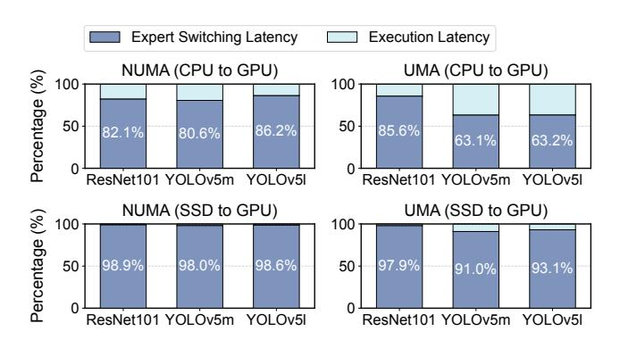
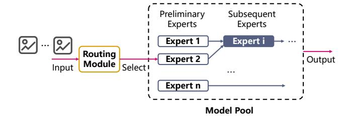
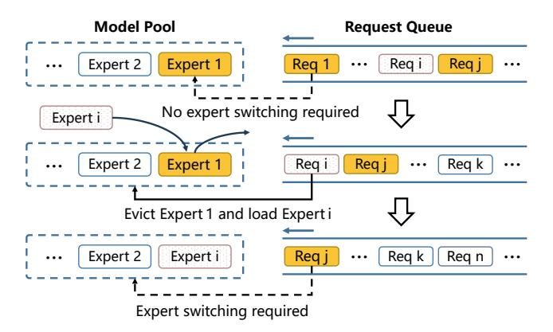

# 1 Introduction

Large language models (LLMs), such as GPT-4 [\[1\]](#page-12-0), have revolutionized modern AI applications. Traditionally, LLMs are monolithic, each encompassing billions or even trillions of parameters, demanding significant costs for both training

∗Xiaojian Liao and Limin Xiao are corresponding authors.

and fine-tuning. However, recent advances in machine learning research have shown that smaller experts [1](#page-0-0) , such as Code Llama-Python 7B [\[32\]](#page-13-1) and Flan-T5-XL 3B [\[4\]](#page-12-1), can outperform general monolithic LLMs on specialized tasks, delivering higher performance and improved accuracy.

The collaboration of multiple experts unlocks vast potential for scenarios demanding high precision in generated outcomes [\[3,](#page-12-2) [16,](#page-12-3) [27,](#page-12-4) [28,](#page-12-5) [30\]](#page-13-2). For instance, in intelligent manufacturing, automated circuit board inspection requires 99.9% detection accuracy, a level unattainable by a single model. Fortunately, the Collaboration-of-Experts (CoE) approach, where each expert is trained for distinct components, meets these stringent requirements.

CoE requires substantial memory, posing significant challenges for deployment, particularly on memory-constrained edge devices. For example, the previously mentioned circuit board inspection application involves over 300 experts (13B parameters, 60GB memory) and must run on edge devices for low latency and privacy. A typical edge device, such as one with an RTX 3080Ti GPU (12GB memory), cannot fit all experts in GPU memory. Thus, experts are offloaded to CPU memory or SSD, dynamically loaded into GPU memory during inference as needed.

However, frequent expert switching incurs significant overhead, severely degrading inference performance. [Fig](#page-1-0)[ure 1](#page-1-0) illustrates the proportion of expert switching latency relative to inference latency across various expert types, memory architectures, and I/O paths. Switching experts from SSD to GPU accounts for over 90% of inference latency on both NUMA and UMA devices. Even in unified memory architectures, transferring experts from CPU to GPU consumes over 60% of inference latency, possibly due to data reorganization by AI frameworks (e.g., PyTorch). Thus, minimizing expert switching is crucial for efficient CoE serving.

We initially explored expert management methods from MoE (Mixture of Experts) but found that directly applying these methods led to inefficient expert switching. The root cause is that expert management in existing MoE models relies on historical statistics (e.g., LRU), with low prediction accuracy, making it ineffective at precisely evicting experts least likely to be used.

Through further in-depth analysis [\(§3\)](#page-3-0), we identify that expert dependency, a key characteristic of CoE systems, is overlooked in existing CoE model serving frameworks, leading to unnecessary expert switching during inference. First, multiple requests may rely on the same expert, yet their positions in the queue could be spaced far apart. The state-of-theart system, Samba-CoE [\[29\]](#page-13-3), uses a first-come, first-served (FCFS) scheduling strategy. After the first request requiring expert 1 is completed, the second request, which does not

Figure 1. Proportion of expert switching latency and execution latency on devices with non-uniform memory architecture (NUMA) and uniform memory architecture (UMA). The SSD in the NUMA system is a MICRON MTFDDAK480TDS, with a read bandwidth of 530 MB/s. In the UMA system, the SSD is an APPLE SSD AP0512Z, with a read bandwidth of approximately 3000 MB/s.

need expert 1, may evict it to SSD. If the third request depends on expert 1, the system must switch it back into GPU memory. However, this expert switching could be avoided by reordering the second and third requests.

Second, dependencies can also exist between experts, where subsequent experts in an inference pipeline rely on the output of earlier ones. Samba-CoE uses the LRU (Least Recently Used) [\[23\]](#page-12-6) strategy to evict experts from GPU memory, but this is inefficient as it considers only historical usage. In contrast, CoE models can leverage pre-assessed usage probabilities and dependency relationships among experts, enabling more accurate and efficient expert management.

Moreover, determining the optimal memory allocation for experts in a CoE system is a complex task, especially on edge devices with varying architectures, and different computation and memory capabilities. Allocating more memory for storing experts reduces the frequency of expert switching but may limit the number of requests that can be processed concurrently (i.e., batch size) [\[2,](#page-12-7) [22\]](#page-12-8), leading to underutilization of computational resources. This tradeoff becomes even more intricate for CoE systems that leverage both GPU and CPU, given their significant differences in computational power and memory capacity.

We introduce CoServe [\(§4.1\)](#page-4-0), an efficient CoE model serving system on heterogeneous CPU and GPU with limited memory. Unlike existing expert management methods that rely on historical statistical information, the key idea of CoServe is to exploit expert dependency during inference scheduling and expert management, thereby reducing unnecessary expert switching. Inspired by our earlier analysis, CoServe introduces three techniques: dependency-aware request scheduling, dependency-aware expert management, and an optional offline profiler.

1For brevity, this paper uses the term 'experts' to refer to expert models specialized in a particular domain.

The dependency-aware request scheduling (§4.2) groups requests that rely on the same expert closer together within a defined window, minimizing the frequency of expert switching. It also dynamically distributes requests across different CPU and GPU queues, balancing the workload among queues to achieve lower task-level latency.

The dependency-aware expert management (§4.3) prioritizes evicting independent experts during expert switching, maximizing the use of limited CPU and GPU memory. Additionally, it utilizes pre-assessed usage probabilities for each expert rather than relying on historical statistics, thereby reducing the incidence of unnecessary expert switching.

To automatically adapt to different devices and identify the optimal configuration, the offline profiler is conducted once for each device before system initialization. By analyzing expert performance on the device through microbenchmarks, it determines suitable memory allocations (§4.4) during initialization and provides a performance matrix (§4.5) for each expert to enhance request scheduling.

We implement CoServe using PyTorch and deploy it on both NUMA and UMA devices. We evaluate CoServe in real-world intelligent manufacturing workloads (§5), which use multiple experts to detect different types of circuit board defects collaboratively. Compared to the state-of-the-art system (Samba-CoE), CoServe delivers a 4.5× to 12× improvement in terms of throughput. Ablation studies show that each of CoServe's techniques significantly increases efficiency.

To the best of our knowledge, CoServe is the first system to optimize the inference efficiency of CoE models from a system-level perspective by effectively leveraging scheduling and memory management. Our contributions can be summarized as follows:

- We conduct a study on designing an efficient CoE model serving system and identify expert dependency, which is a unique property of CoE, as a crucial factor in reducing expert switching frequency.
- We design and implement CoServe, an efficient CoE model serving system on heterogeneous CPU and GPU, empowered by a set of techniques.
- We evaluate CoServe in real-world production workloads, which demonstrates significant performance improvement compared to the state-of-the-art system.

### 2 Background

#### 2.1 CoE Model and Its Use Cases

CoE (Collaboration or Composition of Experts) integrates multiple expert models to accomplish a task. As shown in Figure 2, it consists of a routing module and several expert models. The routing module can be configured with user-defined rules or trained independently. Upon receiving an input (e.g., an image), it selects a preliminary expert for the first inference. The output then either guides the next expert selection or directly produces the final result.

**Figure 2.** Diagram of the Collaboration of Experts (CoE) model inference process.

Compared to monolithic models, the modular structure of CoE offers several advantages. First, CoE can achieve higher accuracy. While a single deep model for circuit board defect detection yields under 92% accuracy, the collaboration of multiple models increases accuracy to 99.9%.

Second, CoE simplifies training, as experts can be independently trained and fine-tuned, with the routing module configured manually. In contrast, MoE (Mixture of Experts) [14] requires joint training and fine-tuning of both experts and routers, making optimization challenging due to its large parameter count [9, 31, 40].

Third, CoE enables more efficient expert management by leveraging an independent routing module to accurately capture expert dependencies and compute expert usage probabilities. In contrast, MoE routing determines its output only at runtime, forcing it to rely solely on historical data for estimating expert usage probabilities and dependencies, which results in inherent inaccuracies.

Fourth, CoE offers greater flexibility and scalability, allowing the integration of diverse expert types to seamlessly achieve multi-model capabilities.

A key application of CoE is circuit board defect detection in intelligent manufacturing. The primary method, Automated Optical Inspection [25], achieves only 80–90% accuracy, while fully automated detection requires 99.9%. A single model is impractical, as its accuracy is limited to 92% due to component diversity. Fortunately, CoE improves accuracy to 99.98%, enabling full automation. In particular, each component has a dedicated classification expert to detect defects like damage. If no issues are found, an object detection expert verifies alignment and soldering direction. Multiple classification experts may share the same object detection expert (e.g., Expert i in Figure 2), illustrating shared expert usage.

Another example is Qihoo 360, which uses CoE to combine state-of-the-art models from different domains [12], such as code, math, and law. By analyzing user requests, the system selects the most appropriate model to handle the corresponding tasks. The results show that it can easily and efficiently boost performance by nearly 10%-20% compared to a single large model across different domains, while using significantly fewer resources for both training and inference.

Figure 3. Example of expert switching caused by the firstcome, first-served approach.

### 2.2 CoE Expert Offloading

GPU devices with limited memory (e.g., RTX3080Ti with 12GB GPU memory) may be unable to accommodate all CoE experts in GPU memory. For instance, circuit board defect detection tasks may require the collaboration of over 300 experts and demand memory capacities exceeding 60 GB.

To run CoE models on hardware with limited GPU memory, experts can be offloaded to CPU memory or disks, loading them into GPU memory as needed. This enables inference of CoE models of various sizes, provided there is sufficient CPU memory and disk space. For example, Samba-CoE [\[29\]](#page-13-3) stores frequently used experts in high-bandwidth memory (HBM) and offloads others to DDR. When an expert is missing from HBM, the system uses an LRU strategy to swap it from DDR, triggering an expert switch.

