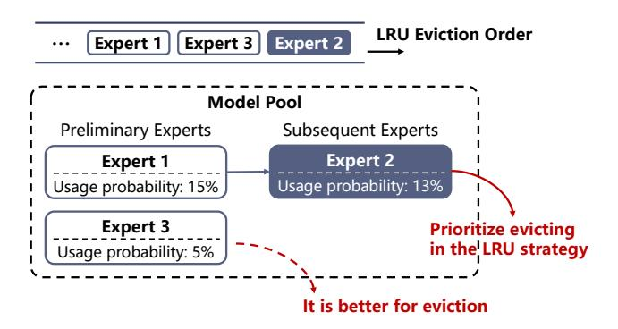
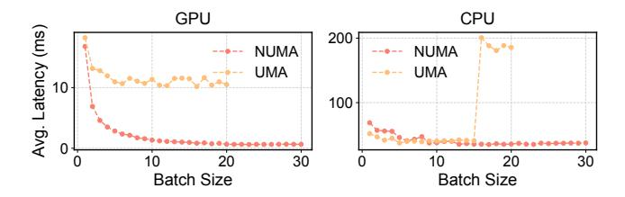
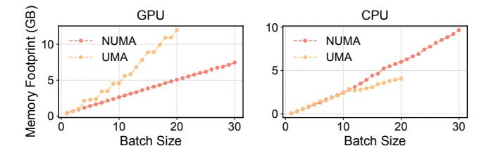
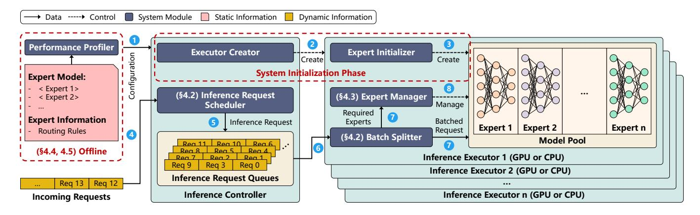
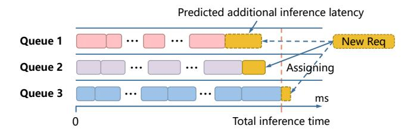
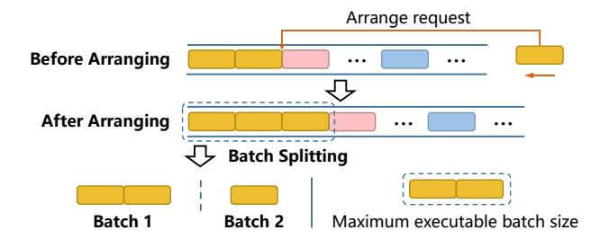
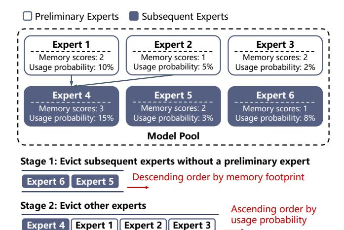
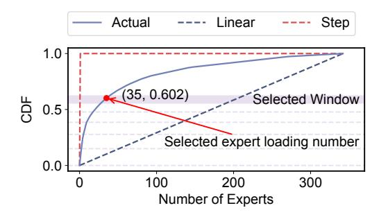
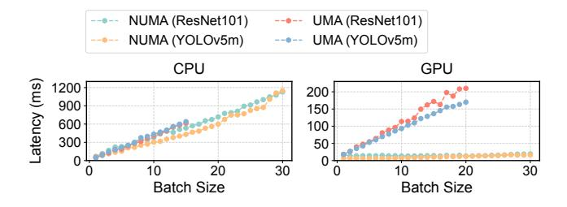

# 3 Motivation

Many applications require deploying models at the edge due to privacy and real-time processing needs. For example, in intelligent circuit board inspection, data must not be transmitted outside the factory. Additionally, if cloud-based inspection is used, data transmission latency (e.g., >50ms) may exceed edge inference latency (<40ms) for a single image, reducing overall detection efficiency.

Edge devices typically have limited memory, leading to frequent expert switching when the number of experts is large. For instance, in intelligent manufacturing facilities, setups such as an RTX3080Ti with 12 GB of GPU memory or a Jetson Xavier NX with 16 GB often require storing experts on disk and dynamically loading them for inference, which causes expert switching.

However, the expert switching approach significantly degrades inference performance. [Figure 1](#page-1-0) shows that expert switching latency (from SSD to GPU) accounts for over 90% of the total inference latency on GPUs for both NUMA (RTX 3080 Ti) and UMA (Apple M2) devices. Therefore, reducing

Figure 4. Example of expert eviction using the Least Recently Used (LRU) strategy.

the frequency of expert switching is crucial for improving inference efficiency, which is the primary focus of this study.

In this section, we thoroughly analyze the inefficiencies of the current CoE model inference system, Samba-CoE, and identify both the challenges and opportunities in designing a more efficient CoE inference system, with a focus on request scheduling [\(§4.2\)](#page-5-0), expert management [\(§4.3\)](#page-6-0), and memory management [\(§4.4\)](#page-6-1).

#### 3.1 Request Scheduling

Samba-CoE processes inference requests on a first-come, first-served basis. However, more effective request scheduling can avoid some of the resulting expert switching. For example, as shown in [Figure 3,](#page-3-1) both Request 1 and Request j require Expert 1 for inference. When processing Request 1, Expert 1 is already loaded, eliminating the need for expert switching. However, when Request i is processed next, Expert 1 is evicted to free memory for loading Expert i. Subsequently, when processing Request j, Expert 1 is no longer loaded, requiring expert switching. If Request j is scheduled to be processed immediately after Request 1, this expert switching can be avoided.

#### 3.2 Expert Management

Samba-CoE uses the Least Recently Used (LRU) strategy to manage experts. LRU relies on past usage data to predict each expert's future demand. However, these predictions can sometimes be inaccurate. Specifically, in one application scenario, an expert's usage probability tends to remain relatively stable due to the consistent data distribution [\[7\]](#page-12-13), leading to more accurate estimates of future demand. Because the CoE model's routing can be either user-defined or trained independently, we can leverage this routing mechanism to calculate each expert's usage probability based on actual data. As shown in [Figure 4,](#page-3-2) when using the LRU strategy for expert eviction, Expert 2 is evicted first, even though its usage probability is higher than that of Expert 3. In this

**Figure 5.** Trends in average inference latency with increasing batch size on NUMA and UMA devices.

case, evicting Expert 3 would be more appropriate. Therefore, when selecting a candidate expert to evict from GPU memory, relying on the pre-assessed usage probability can yield higher efficiency than the LRU approach.

#### 3.3 Memory Management

Memory for experts is divided into two parts: storing expert parameters and intermediate inference results. Batching multiple requests improves inference performance, as shown in Figure 5, where larger batch sizes reduce average latency (execution latency divided by batch size). However, beyond a point, benefits diminish. Increasing batch size also raises memory usage for intermediate results (Figure 6). For example, increasing ResNet101's batch size by one consumes as much memory as loading 1.5 experts on a NUMA GPU. This reduces the number of experts that can be stored in GPU memory. As a result, the frequency of expert switching may increase. Thus, balancing memory usage between expert loading and intermediate results remains a key challenge.

Devices often have both CPU and GPU, each exhibiting different performance characteristics and memory footprint depending on the batch size. For example, on a UMA device, GPU inference achieves the lowest average latency at a batch size of 6, while the CPU performs optimally at a batch size of 5 (Figure 5). The memory footprint also varies between the CPU and GPU even with the same batch size (Figure 6), due to different data organization methods used by AI frameworks on each. Similar patterns are consistently observed on NUMA devices as well. Additionally, the diverse architectures, computational power, and memory capabilities across different devices lead to varying optimal batch sizes and configurations for CoE inference. This diversity complicates the aforementioned memory tradeoff between expert loading and intermediate results.

#### 4 CoServe

We introduce CoServe, an efficient Collaboration-of-Experts (CoE) model serving system specifically designed for devices with limited memory. The key idea of CoServe is to reduce the frequency of expert switching by leveraging expert dependencies. In this section, we first provide a comprehensive overview of CoServe, followed by a detailed explanation of the techniques proposed.

**Figure 6.** Trends in memory footprint with increasing batch size on NUMA and UMA devices.

#### 4.1 CoServe Overview

Figure 7 illustrates the overall architecture of CoServe, which operates in three phases: offline, system initialization, and online. During the online phase, dependency-aware request scheduling (§ 4.2) and dependency-aware expert management (§4.3) are proposed to minimize the frequency of expert switching. In the offline phase, the optimal memory allocation (§ 4.4) and system configuration (§ 4.5) are generated to enhance inference efficiency.

**Offline.** To ensure CoServe runs efficiently on various devices, offline profiling is performed once for each device using a set of microbenchmarks to determine the optimal configuration. This process establishes the optimal memory allocation and the number of executors for both the CPU and GPU. Additionally, it evaluates the performance matrix (e.g., latency, memory footprint) to guide online operations and accurately estimates experts' usage probabilities for better system initialization.

**System initialization.** After obtaining the configuration information in the offline phase, the executor creator creates the inference executors (Steps 1 to 2 in Figure 7). Then, the expert initializer within the executor loads the experts into the model pool (Step 3). Experts are distributed into each executor in a round-robin manner, prioritized by descending usage probabilities, until the memory is fully utilized.

**Online.** When a request arrives, it is enqueued in an inference executor's request queue, awaiting processing. To minimize the frequency of expert switching, the inference request scheduler utilizes a dependency-aware scheduling method to efficiently assign requests to the appropriate executor and determine their execution order (Steps 4 to 5 in Figure 7). During execution, the batch splitter dynamically divides the batch of requests based on expert performance and the available memory at that moment (Step 6).

If the required expert is available in the model pool, the inference is executed directly (Step 7). Otherwise, an expert switching is needed, where the current expert is unloaded from the model pool to free up memory for loading the required expert (Step 8). To minimize the likelihood of future expert switching, the expert manager utilizes a dependency-aware approach to unload the experts with the lowest probability of future use.

Figure 7. CoServe architecture overview.

**Figure 8.** Example of request assignment. The yellow bars represent the predicted additional inference latency after a new request is added to each queue. The request is assigned to Queue 2, which offers the shortest additional inference latency while minimizing the total inference time.

#### 4.2 Dependency-aware Request Scheduling

The scheduling process is as follows. First, the request scheduler predicts the additional inference latency for each executor's request queue upon adding a new request. Then, the request is assigned to the most appropriate executor queue. Next, the scheduler arranges the order of the requests in the queue. Finally, the batch splitter divides the requests into multiple batches during inference for processing.

**Prediction of additional inference latency.** The additional inference latency consists of execution latency and expert switching latency.

In CoServe, execution latency is estimated as a constant. This estimation assumes that requests within a batch are processed using the same expert, as CoServe attempts to batch requests utilizing the same expert together. Specifically, we observe that the overall batch latency scales linearly with the number of requests, expressed as:  $latency = K \times (number\ of\ requests\ in\ the\ batch) + B$ , provided that all requests in the batch rely on the same expert for processing. The latency of the first request is K + B, while subsequent requests incur a latency of K. Both constants, K and B, are precisely measured during the offline phase (details in §4.5).

**Figure 9.** Example of request arranging and splitting. Identical colors represent requests utilizing the same expert. First, incoming requests are arranged to follow existing requests utilizing the same expert, grouping them together. Then, these requests are divided into multiple batches based on the current maximum executable batch size for inference.

The expert switching latency is either zero or the time required to load the expert. It is zero under two conditions. The first condition occurs when the expert is already present in the model pool, eliminating the need for loading. The second condition arises when the queue already contains requests utilizing the same expert, allowing the expert to be loaded during the processing of a preceding request.

Request assigning. A task comprises many continuously incoming requests. To complete the task as quickly as possible, the primary principle for assigning requests is minimizing the current total inference time across all executor queues. Since executors operate in parallel, the total inference time is determined by the queue with the longest inference time. For instance, as illustrated in Figure 8, the lengths of the queues correspond to their respective total inference times, with Queue 3 dictating the total time. The yellow bars indicate the additional inference latency incurred when a new request is added to each queue. Consequently, assigning the request to either Queue 1 or Queue 2 results in minimal total inference time.

When multiple assigning schemes achieve the same minimal total inference time, we select the queue that results in the smallest increase in inference latency for the new request. In [Figure 8,](#page-5-2) the request is assigned to Queue 2.

In summary, the assignment approach minimizes the current total inference time across all executors. It also preserves more assignment capacity for future requests, enabling more flexible scheduling options.

Request arranging. Once a request is assigned to a queue, the request scheduler arranges it behind other requests that use the same expert, if such requests are present in the queue. This groups requests that use the same expert together. For example, as illustrated in [Figure 9,](#page-5-3) requests utilizing the same expert are represented by identical colors. The incoming requests are arranged to follow existing requests that use the same expert. This strategy ensures that all requests using the same expert are processed together. By handling these requests as a group, the expert is loaded at most once, effectively preventing multiple expert switches.

Request splitting. The batch size for inference must not exceed the current maximum executable batch size. The batch splitter is used to enforce this constraint by dividing a set of requests into multiple batches, as shown in [Figure 9.](#page-5-3) The current maximum executable batch size is determined by two factors. The first factor is the largest batch size that the available memory can accommodate. The second factor is the maximum batch size measured by the performance profiler (see [§4.5\)](#page-7-0). The smaller of these two values is adopted as the current maximum executable batch size. This batching strategy maximizes the expert's inference efficiency while considering available resources.

#### 4.3 Dependency-aware Expert Management

When the required expert is not available in the model pool, it must be loaded for inference. If there is insufficient memory to accommodate the new expert, existing experts must be evicted to free up space. The expert manager utilizes a twostage eviction strategy that prioritizes the removal of experts with a low likelihood of future use.

First, the expert manager prioritizes evicting subsequent experts that lack preliminary dependencies. Since these experts are not executed until their preliminary experts are fully loaded, they can cause unnecessary memory waste. As illustrated in Stage 1 of [Figure 10,](#page-6-2) these experts are sorted in descending order of memory footprint and evicted sequentially until enough memory is available to load the new expert. This strategy minimizes the number of experts evicted while satisfying memory constraints.

If evicting all such experts does not free sufficient memory, the expert manager evicts experts based on their usage probability. Experts' usage probabilities can be determined during the offline phase. As depicted in Stage 2 of [Figure 10,](#page-6-2) experts are sorted in ascending order of usage probability and then evicted sequentially until adequate memory is available.

Figure 10. Example of the two-stage expert eviction strategy. The memory scores represent the normalized memory footprint of each expert.

This approach ensures that the model pool retains experts with the highest usage probabilities, thereby reducing the likelihood of future expert switching.

#### 4.4 Efficient Memory Management

Balancing memory allocation between expert loading and inference intermediate results is critically important. To address the memory trade-off challenges outlined in [§3.3](#page-4-3) for various processors and CoE models, we adopt two adaptive memory allocation strategies tailored to the computational capabilities of each device. On processors with limited computational performance, we ensure that the memory allocated to inference satisfies the requirements of the maximum batch size. Conversely, on high-performance processors, inference using the maximum batch size may consume all available memory. Therefore, it is essential to search for an appropriate allocation that balances the memory footprint between expert loading and intermediate results.

Memory allocation under limited computation performance. In processors with limited computational performance, the maximum batch size for experts is usually small and occupies minimal memory. For such processors, performing inference at the maximum batch size ensures optimal utilization of computational resources, with the remaining memory fully reserved for loading experts. The maximum batch size is determined in the offline phase [\(§4.5\)](#page-7-0).

Memory allocation under sufficient computation performance. When the maximum batch size for experts can occupy a substantial portion of the memory, we propose a search strategy that identifies suitable memory allocation. The search strategy relies on a CDF (cumulative distribution function) of expert usage, which is generated by the expert usage probabilities obtained offline (details in [§4.5\)](#page-7-0).

Figure 11. Example of cumulative distribution functions (CDF) for expert usage.

We first describe the characteristics of the CDF for expert usage. There are two extreme scenarios. The first scenario occurs when all experts have identical usage probabilities. The second scenario happens when the first expert has a 100% usage probability, and all other experts have 0%. [Figure 11](#page-7-1) illustrates these two cases with linear and step function CDFs. In real-world situations, experts have varying usage probabilities. By sorting the experts in descending order of usage probability, the resulting CDF curve falls between the linear and step functions (the Actual curve in [Figure 11\)](#page-7-1).

Next, we utilize a decay window approach to identify a suitable amount of memory for experts. The core idea is to apply a sliding decay window on the CDF, and then perform sample inference requests at the upper bounds of the window using a smaller, representative dataset sampled from the application scenario. The window where the throughput starts to drop is selected and the optimal number of experts is determined within the window. The dashed horizontal line in [Figure 11](#page-7-1) illustrates the window sliding process and the final selected window.

Initially, the lower bound of the window is set to 0, and the upper bound is the initial window size. The decay factor is defined in [Equation 1.](#page-7-2) Every time the window slides, its size is reduced by multiplying the original size with the decay factor. Starting from the first window, CoServe loads experts whose number equals the upper bound of the window and performs sample inference requests by a smaller dataset to generate a throughput value. Intuitively, the throughput will increase at the start due to more efficient use of computation, but it will drop when the memory contention between intermediate results and experts kicks in. Therefore, we apply the linear fitting method to predict the upward trend using the first N throughput values, as shown in [Equation 2.](#page-7-3) The window stops sliding when the actual upward trend deviates from expectations (e.g., the throughput starts to decline), as formulated in [Equation 3.](#page-7-4)

$$decay factor = 1 - \frac{initial \ window \ value}{100}$$
 (1)

$$f(N) = kN + b \tag{2}$$

Figure 12. Variation of execution latency with increasing batch sizes.

$$\frac{f(N+1) - actual \ result}{f(N+1)} > error \ margin \tag{3}$$

When the sliding process terminates, CoServe randomly selects a value within the window as the optimal number of experts to load, since the decay window gradually narrows the selection space, and differences between values within the window become negligible. Once the optimal number of experts is determined, memory is reserved accordingly, with the remaining memory allocated for batch inference.

#### 4.5 Configuration Information

In the offline phase, CoServe generates configuration information to guide online operations. Here, we present the configuration information mentioned in previous sections and explain how it is obtained. The configuration information consists of three components: expert performance metrics, expert information and user-configurable parameters.

Expert performance metrics include maximum batch size, execution latency, and memory footprint, profiled by running the microbenchmarks. The microbenchmarks leverage real-world samples to reflect the true performance of experts. Experts on GPU and CPU have distinct performance matrices and their performance matrices should be profiled individually. It is important to note that experts of the same model architecture are profiled only once, as their computation complexity (i.e., the number of parameters and floating point operations) is the same.

The maximum batch size is determined by running a microbenchmark with varying batch sizes, and a sample result is illustrated in [Figure 5.](#page-4-1) It is achieved when the average latency plateaus, indicating that the processor is nearly fully utilized. It is used for request splitting [\(§4.2\)](#page-5-0) and memory allocation under limited computation performance [\(§4.4\)](#page-6-1).

The execution latency is profiled by running the same microbenchmark used to calculate the maximum batch size. A sample result is present in [Figure 12.](#page-7-5) CoServe requires the gradient K and intercept B on the Y-axis. This metric is used to assist the prediction of additional inference latency [\(§4.2\)](#page-5-0).

During the profiling of the maximum batch size and execution latency, the loading latency and memory footprint of experts are also recorded. The loading latency is used to

predict the expert switching latency [\(§ 4.2\)](#page-5-0). The memory footprint is normalized to the memory score and used for expert management [\(§4.3\)](#page-6-0).

Expert information comprises routing rules and expert usage probabilities. Routing rules, provided by the user, are part of the CoE model and determine which experts to handle a given request.

There are two ways to obtain expert usage probabilities. First, if the routing rules are ambiguous (e.g., they rely on a trained routing model), we can run the CoE routing on a small, real-world sample dataset to record each expert's usage probability. Second, if the routing rules are predefined, expert usage probabilities can be calculated directly. For example, in circuit board inspection, users can specify which components are inspected by which experts. Because the distribution of component quantities is known, these probabilities are straightforward to compute. The expert usage probability is used to determine which experts are loaded during initialization [\(§4.1\)](#page-4-0), the order in which experts are evicted [\(§4.3\)](#page-6-0), and memory allocation [\(§4.4\)](#page-6-1).

User-configurable parameters include allocated memory scores and the number of executors. Although the optimal memory allocation and the number of executors can be determined by running microbenchmarks, users can still manually allocate memory using memory scores and specify the number of executors.

