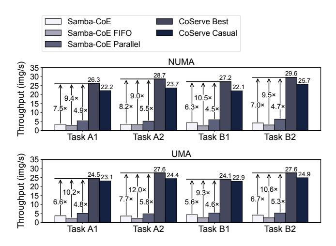
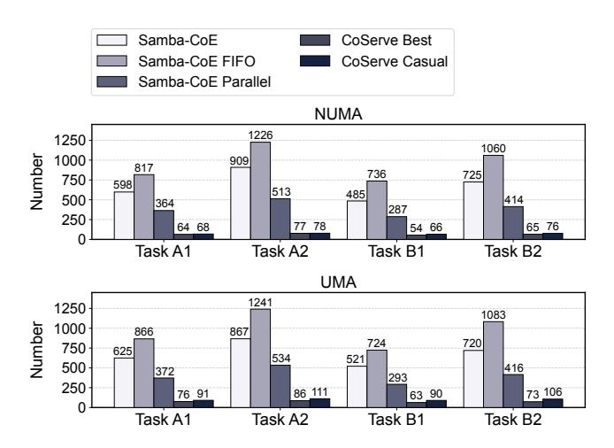
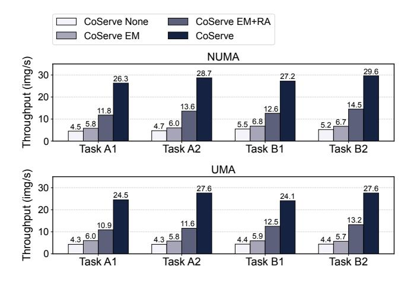
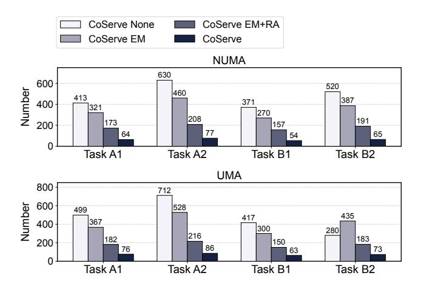
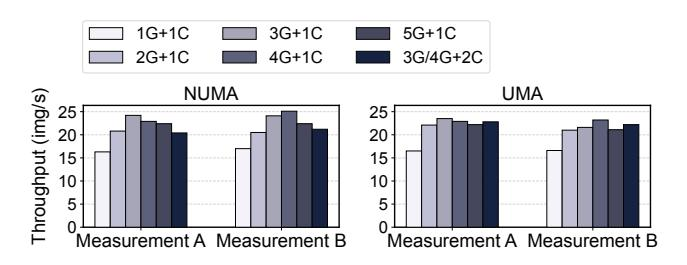
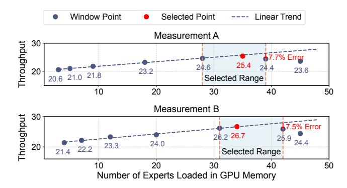
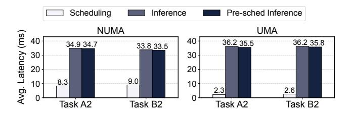

# 5 Evaluation

We evaluate CoServe against state-of-the-art CoE serving systems in a real-world intelligent manufacturing scenario. We begin with a description of the experimental setups, followed by a detailed presentation of the application results. Finally, we conduct ablation studies to analyze the impact of CoServe's design choices on performance.

#### 5.1 Evaluation Setting

Hardware. We conducted experiments on devices with nonunified memory architecture (NUMA) and unified memory architecture (UMA). The detailed hardware specifications are provided in [Table 1.](#page-8-1) CoServe is implemented using PyTorch, and our methods and implementations are designed to be hardware-agnostic.

Application. Since no publicly available CoE model exists for testing, we built a CoE model in a real-world intelligent manufacturing scenario to conduct circuit board quality inspection. We validate our system in this application.

Evaluation metrics. In circuit board inspection applications, circuit boards are continuously fed into the inspection system at fixed time intervals, requiring all target component images to be fully analyzed within a specified time frame (e.g., 3 minutes). However, real-time processing for individual images is not strictly mandatory. As a result, overall throughput serves as the primary performance metric.

Table 1. Hardware for evaluation.

|            | NUMA                    | UMA           |
|------------|-------------------------|---------------|
| GPU        | NVIDIA RTX3080Ti        | Apple M2      |
| CPU        | Intel Xeon Silver 4214R | Apple M2      |
| GPU Memory | 12 GB                   | 24 GB         |
| CPU Memory | 16 GB                   |               |
| SSD        | MTFD-DAK480TDS          | APPLE AP0512Z |

Workload. Circuit Board A comprises 352 component types, while Circuit Board B includes 342 component types. In real-world production, a component image is input every 4 ms. We delineated the evaluation into four tasks:

- Task A1: Continuously input 2,500 requests belonging to Circuit Board A.
- Task A2: Continuously input 3,500 requests belonging to Circuit Board A.
- Task B1: Continuously input 2,500 requests belonging to Circuit Board B.
- Task B2: Continuously input 3,500 requests belonging to Circuit Board B.

Models. A dedicated classification expert is specifically trained for each component to detect defects such as physical damage. For some components, after the classification expert confirms no issues, an additional object detection expert is used to further verify alignment points and determine if the soldering direction is correct. The classification experts are based on the ResNet101 [\[10\]](#page-12-14) architecture, with each expert having unique and specialized weights. The object detection experts utilize two architectures: YOLOv5m and YOLOv5l [\[17\]](#page-12-15). Multiple types of components may share the same object detection expert.

Baselines. To the best of our knowledge, Samba-CoE [\[29\]](#page-13-3) is currently the only system that has explored the deployment of large-scale CoE models. Therefore, it serves as the most suitable baseline for our evaluation. Building upon Samba-CoE, we establish three baseline systems.

1. Samba-CoE: When deploying this baseline on NUMA devices, experts are loaded into GPU memory for inference, utilizing CPU memory as a cache. Due to the large number of experts, it is not feasible to load all of them into GPU and CPU memory simultaneously. Therefore, during expert swapping, if an expert is present in CPU memory, it is loaded from there; otherwise, it is retrieved from SSD. On UMA devices, with a shared CPU-GPU memory architecture, tiered caching is not used, and experts are loaded directly from SSD. The expert replacement strategy is LRU, and since Samba-CoE lacks request scheduling optimization, we employ the first-come, first-served (FCFS) approach to handle requests.

Figure 13. Throughput of CoServe and baselines.

- 2. **Samba-CoE FIFO:** In this baseline, we modified the expert replacement strategy in Samba-CoE to use the commonly used First-In-First-Out (FIFO) [6] approach to evaluate its performance.
- 3. Samba-CoE Parallel: In this baseline, we create multiple parallel inference executors specifically for Samba-CoE to evaluate its performance. To ensure a fair and consistent comparison, the number of executors is matched to that of CoServe. The incoming inference requests are distributed among different inference executors in a round-robin manner.

#### 5.2 Application Results

**Throughput.** Figure 13 shows the throughput of CoServe compared to baseline methods across various tasks. CoServe Best refers to the results obtained by implementing optimal memory allocation strategies and configuring an appropriate number of inference executors. Overall, compared to Samba-CoE, CoServe achieves a throughput improvement of  $4.5\times$  to  $10.5\times$  over the baselines on NUMA devices and  $4.6\times$  to  $12\times$  on UMA devices.

CoServe Casual refers to a casually selected memory allocation and the number of executors. The specific configuration for CoServe Casual is as follows. On the GPU of NUMA devices, 75% of the memory is allocated for expert loading and 25% for batch inference. We configured three GPU executors for NUMA devices due to their robust computational capabilities and two GPU executors for UMA devices. Additionally, both NUMA and UMA devices are equipped with one CPU executor each.

Compared to the baselines, CoServe Casual achieves up to 8.5× and 10.6× improvements in throughput on NUMA and UMA devices, respectively. This indicates that even if users do not meticulously search for the optimal configuration and instead use intuitive settings, CoServe can still deliver excellent performance.

**Figure 14.** Number of expert switches for CoServe and baselines.

Compared to CoServe Best, CoServe Casual shows a minimum throughput decrease of 5.71% on NUMA devices, dropping from 24.5 to 23.1, and a maximum decrease of 18.75% on NUMA devices, from 27.2 to 22.1. These results demonstrate that selecting optimal memory allocation and the number of executors during the offline phase can effectively improve inference performance.

**Expert switching.** Figure 14 compares expert switches between CoServe and baseline methods. CoServe reduced expert switching by up to 93.87%, from 1,060 to 65 in Task B2 on NUMA devices, and by at least 78.5%, from 293 to 63 in Task B1 on UMA devices. These results demonstrate CoServe's significant improvement in inference efficiency by minimizing expert switches.

Compared to CoServe Casual, CoServe Best significantly reduces the number of expert switches. On NUMA devices, the reduction ranges from 1.28% to 18.18%, while on UMA devices, it ranges from 16.48% to 31.13%. This indicates that selecting optimal memory allocation and the appropriate number of executors during the offline phase can further reduce the number of expert switches.

#### 5.3 Ablation Studies

**Performance breakdown.** Figure 15 provides a detailed breakdown of the throughput improvements achieved by expert management and request scheduling. Request scheduling is further divided into request assigning and request arranging. CoServe None denotes the baseline system with no optimizations, which utilizes a FIFO strategy for expert replacement and request execution, distributing requests evenly across executors. CoServe EM introduces expert management optimization, while CoServe EM+RA further incorporates request arranging. The fully optimized system,

**Figure 15.** Breakdown of throughput for each optimization in CoServe.

labelled CoServe, integrates all optimizations: expert management, request arranging, and request assigning. The results indicate that each of these optimizations contributes to a significant increase in throughput.

The number of expert switches is shown in Figure 16. Each optimization reduces the number of expert switches, with the reduction proportionally related to the increase in throughput. This indicates that CoServe's optimizations effectively reduce the frequency of expert switching, thereby improving throughput.

Performance with different numbers of executors. In the offline phase, we use a portion of the data to test system throughput under different numbers of executors to select the optimal configuration. The results are shown in Figure 17. In the figure, G and C represent the number of GPU and CPU inference executors, respectively. As the number of CPU inference executors increases, the number of GPU inference executors is kept at the configuration that previously achieved the highest throughput. Some of these configurations include 3 GPU executors, while others have 4. On both NUMA and UMA devices, the configuration of 3 GPU executors and 1 CPU executor yields better performance for Task A, while 4 GPU executors and 1 CPU executor perform better for Task B. When the number of executors decreases, insufficient utilization of computational resources leads to performance degradation. Conversely, when the number of executors increases, the additional overhead introduced also results in performance loss.

Performance of different memory allocation. We applied the method described in  $\S4.4$  to find an appropriate selection window on the GPU of the NUMA device. The initial window size was set to 15, with a linear error rate of 5%. Figure 18 shows the throughput achieved as the number of loaded experts changes, corresponding to the upper and lower bounds of the sliding and decaying window. As the

**Figure 16.** Breakdown of the number of expert switches for each optimization in CoServe.

**Figure 17.** Throughput under different numbers of executors. G and C represent GPU and CPU executors.

number of loaded experts increases, throughput first rises and then falls. For Task A, the final selection window corresponds to loading 28 to 39 experts, with a linear error of 7.7%. We chose to load 35 experts, achieving a throughput of 25.4. For Task B, the final selection window corresponds to loading 31 to 42 experts, with a linear error of 7.5%. We chose to load 34 experts, achieving a throughput of 26.7. The fact that the peak throughput lies within the selected window demonstrates the effectiveness of our approach.

**Overhead analysis.** We study the overhead of CoServe by comparing the average latency of request scheduling with inference latency. Results are shown in Figure 19 and demonstrate that the latency of request scheduling is shorter than inference latency. In CoServe, request scheduling is performed by the CPU and occurs in parallel with inference processes in GPU executors. Since the scheduling is faster than inference, it does not cause any bottleneck or negatively impact GPU inference performance.

However, it still remains unclear whether the scheduling will significantly affect the CPU inference and further the overall performance. We conduct additional experiments by scheduling requests offline in advance and performing inference directly without any scheduling. This setup, referred to pre-sched inference (Figure 19), achieves the same request

**Figure 18.** Throughput measured at the window boundaries during the sliding window process.

sequence as CoServe but with zero scheduling overhead. The performance difference between regular inference and prescheduled inference quantifies the impact of scheduling on overall performance. We observe that the performance gap is less than 3%. These findings indicate that request scheduling has minimal impact on inference performance.

We measured the proportion of time spent on expert management relative to the total task time for each executor and calculated the average. The time spent on expert management does not exceed 0.2%. However, it leads to an improvement in throughput, making this overhead worthwhile.

#### 6 Related Work

#### 6.1 CoE and MoE Model

The multi-expert models are categorized into two types: Collaboration of Experts (CoE) and Mixture of Experts (MoE). Representative CoE models include Samba-CoE [29], Qihoo 360 CoE [12] and Bench-CoE [36], while MoE models are represented by Mixtral-MoE [15], JetMoE [33], Jamba [26], DeepSeekMoE [5], and Branch-Train-Mix [35].

The differences between CoE and MoE models are as follows. CoE models consist of multiple independent models, where each model is an independently trainable expert. Experts in CoE models can be easily managed individually, and they can be added or removed independently. MoE models, on the other hand, are composed of multiple experts within a single model, and training must occur as a whole. The router in CoE models can be manually adjusted, while in MoE models, the router is generated during training and cannot be optimized independently. Our work focuses on inference optimization for CoE models.

#### 6.2 Multi-Expert Inference Optimization

**CoE model inference optimization.** Samba-CoE [29] optimizes CoE model inference by offloading experts to DDR and loading them into HBM as needed, using an LRU strategy for replacement. However, there is still considerable room for improvement in request scheduling, expert management,

**Figure 19.** Average latency of request scheduling, inference, and pre-sched inference for a single request.

and memory management to enhance system efficiency. Shi *et al.* [34] use multithreading to deploy experts on both NPU and CPU simultaneously, boosting inference performance. However, they do not address the memory limitations that prevent loading a large number of experts at once.

**MoE model inference optimization.** For MoE model inference, many studies have optimized routing [11, 13, 21], expert scheduling [7, 18, 20, 38], quantization [8, 19, 39], and distributed inference [24, 37]. Our work specifically aims to optimize the inference efficiency of CoE models and is orthogonal to these approaches.

#### 7 Conclusion

In the inference of CoE models with a large number of experts, limited memory on resource-constrained edge devices leads to frequent expert switching, which significantly degrades inference performance. To address this critical issue, we propose CoServe, which effectively reduces expert switching through dependency-aware request scheduling and expert management. Additionally, offline measurements fully exploit device performance. Compared to state-of-the-art baselines, CoServe significantly improves throughput.

Due to the limited availability of models and test data, CoServe has been validated only in the circuit board defect detection application within the intelligent manufacturing scenario. However, for other CoE models, as long as the necessary routing module and expert models required by CoServe are provided, its design remains equally applicable. We hope our work offers valuable insights for the application, deployment, and serving of CoE models.

#### Acknowledgments

This work was supported by the National Key R&D Program of China under Grant No. 2023YFB4503100, the National Natural Science Foundation of China under Grant No. 62272026 and No. 62302257, and the State Key Laboratory of Complex & Critical Software Environment under Grant No. CCSE-2024ZX-10. We sincerely thank our shepherd, Antonia Zhai, for her invaluable support and guidance, as well as the anonymous reviewers for their comments and suggestions, which have greatly enhanced the quality of this paper.

