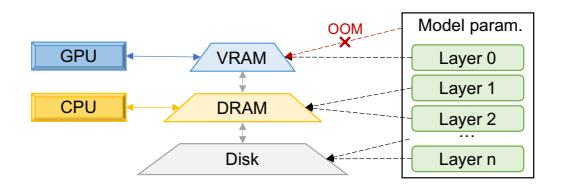
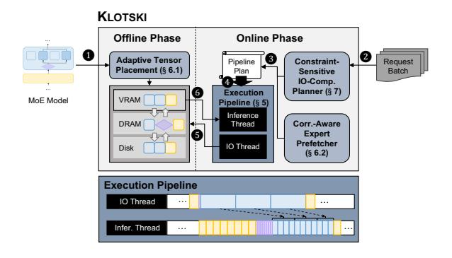

# 2.1 MoE Architecture & Inference

Since GShard [\[22\]](#page-13-17) introduced MoE structure into Transformer models, its potential to enhance the performance of large language models has been evident. MoE has gradually become one of the mainstream structures of large language models. Prominent models like GPT-4 [\[1\]](#page-13-18), Gemini 1.5 [\[35\]](#page-14-8), and Mixtral-8×7B all incorporate the MoE structure.

The MoE architecture consists of multiple MoE blocks, each containing an attention layer, an MoE layer, and two

Figure 2. Architecture and inference process of MoE models.

normalization layers, as illustrated in [Figure 2.](#page-2-0) The MoE layer comprises a gating network and multiple experts. The gating network is the key feature of the MoE architecture. It uses a softmax function to calculate the routing weights and activates the top-k experts. Existing research [\[23,](#page-13-14) [24,](#page-13-13) [43,](#page-14-5) [44\]](#page-14-9) indicates that the expert activation path of each token can reveal its characteristics, facilitating the prediction of future expert selections. Each expert is an FFN, and experts are sparsely activated, making MoE a feasible approach to training larger models. For each token, the final output of the MoE layer is a weighted sum of the selected experts' outputs.

The MoE inference process, like other LLMs, follows an autoregressive approach [\[36\]](#page-14-10), generating each new token based on the previous ones, as illustrated in [Figure 2.](#page-2-0) This process comprises two stages: prefill and decoding. In the prefill stage, the model processes the entire prompt simultaneously, which often leads to the activation of multiple experts. During the decoding stage, the model uses the previous token generated as input, iteratively generating new tokens until it generates the end-of-sequence (<EOS>) token or the maximum output length limit is reached.

Some recent literature [\[15,](#page-13-3) [23,](#page-13-14) [30,](#page-13-4) [45\]](#page-14-11) has focused on the optimization of MoE. DeepSpeed-MoE [\[30\]](#page-13-4) introduces a specialized MoE architecture called Pyramid-Residual MoE and employs staged knowledge distillation to obtain the Mixtureof-Students. This approach not only accelerates MoE training but also reduces inference latency and cost. Lina [\[23\]](#page-13-14), an extension of DeepSpeed-MoE, prioritizes all-to-all communication during training to enhance bandwidth and uses resource scheduling based on hot experts during inference to balance workload. However, these MoE systems primarily focus on latency-sensitive scenarios and place emphasis on MoE training. Klotski contributed to the memory optimization of MoE and is orthogonal to many of these works.

### 2.2 Offloading in LLM Inference

LLMs often have a large number of parameters, causing severe GPU memory bottlenecks during inference. Common memory optimisation techniques include quantization [\[12,](#page-13-19) [21,](#page-13-20) [38\]](#page-14-12), pruning [\[11,](#page-13-21) [26\]](#page-13-22), sparse attention [\[39,](#page-14-13) [47\]](#page-14-14), etc. Among these, offloading is a particularly effective strategy in resourceconstrained environments. As shown in [Figure 3,](#page-3-0) DRAM and disk often have at least dozens of times more memory than

**Figure 3.** Illustration of offloading an LLM in a multi-level storage system. Only a few layers of parameters can be placed in VRAM, and the rest are placed in DRAM and disk. param. refers to parameters.

VRAM. When it is difficult to store all model parameters in VRAM (as in the red line), offloading strategies offload tensors not currently involved in computation to DRAM or disk, freeing up a significant amount of VRAM (as in the black lines). Consequently, offloading strategies allow LLM inference to be performed with extremely small memory footprints. However, because the I/O speed between VRAM and DRAM is slower than the GPU's computing speed, frequent I/O will cause large delays in inference.

Early works [17, 29] proposed leveraging swapping during the training of Deep Neural Networks (DNNs) to reduce GPU memory demands. ZeRO-Offload [32] applied the offloading to the training of Transformer-based LLMs. ZeRO-Infinity [31] extended this approach by incorporating disk as an additional offloading destination. DeepSpeed-Inference [2], which includes the ZeRO-Inference component, applies offloading techniques to the inference, enabling LLM inference in resource-constrained environments. Flex-Gen [34] significantly improves inference throughput by solving linear programming problems within the computational graph. HeteGen [41] leverages heterogeneous parallel computing between CPU and GPU, reducing the need for parameter I/O and achieving better resource allocation. STI [14] maximizes IO/compute resource utilization through model sharding and elastic pipeline planning.

However, most offloading systems mentioned above are designed for dense models and are thus inadequate for supporting MoE inference. Mixtral-offloading [9] identified this limitation earlier and utilized LRU cache and quantization to load a subset of experts, enabling the inference of Mixtral-8×7B on consumer-grade hardware. Fiddler [20] designed CPU-GPU orchestration for MoE models, leveraging the computational power of CPUs to minimize data movement. MoE-Infinity [43] reduced the latency overhead through activation-aware expert prefetching and caching. Even if these works design accurate prefetch strategies or use the CPU to accelerate the inference of MoE, it is still difficult to balance the gap between computation and I/O, resulting in lots of bubbles in the pipeline. In contrast, Klotski minimizes the bubbles in the pipeline by simultaneously arranging the computations of multiple batches and making full use of the computing resources of the GPU.

**Table 1.** A comparison of the throughput (token/s) improvements when applying the I/O overlap strategy, designed for dense models, to a dense model (OPT) and an MoE model (Switch Transformers, decoder only). The compared results are shown in the same color block. The batch size is 4, and the sequence length is 512.

|           |             | Dense model |          | MoE model      |                 |  |
|-----------|-------------|-------------|----------|----------------|-----------------|--|
| М         | odel        | OPT-1.3B    | OPT-6.7B | switch-base-16 | switch-base-128 |  |
| Mod       | lel Size    | 2.6 GB      | 13.3 GB  | about 2.2 GB   | about 14 GB     |  |
|           | Original    | 14.3        | 3.3      | 13.63          | 2.52            |  |
| Thoughput | + Strategy  | 43.09       | 12.15    | 28.79          | 7.31            |  |
|           | Improvement | 201.33%     | 268.18%  | 111.23%        | 190.08%         |  |

### 3 Motivation

### 3.1 Shortcomings of Existing Work

While MoE brings numerous advantages, it also faces significant challenges related to GPU memory usage due to the large number of experts. According to existing work, the percentage of experts' parameters in Switch Transformers can reach up to 99% [8]. At the same time, these experts are sparsely activated. There is no need to keep them resident in expensive GPU memory. Therefore, the sparse activation feature of MoE makes offloading a highly suitable strategy to address its memory challenges. However, offloading is not a comprehensive solution, and will introduce new issues.

Many existing approaches for MoE focus on improving the accuracy of expert prefetching [8, 9, 18, 20]. However, due to the physical limitation that computation speed generally exceeds I/O speed [14, 34], the I/O time for a single expert is longer than the computation time. Thus, even with 100% accurate prefetching, there would still be substantial pipeline bubbles due to the extended I/O time for experts.

In offloading strategies for dense models, efforts have been made to overlap I/O with computation [14, 34, 41]. One effective method for achieving high-throughput inference is to overlap the I/O of the next layer with multiple computations of the current layer, keeping the GPU almost always in the computation state [34]. We applied this method to the inference of a dense model (OPT) and an MoE model (Switch Transformers) of similar model size, with results shown in Table 1. The results show that the improvement of using this strategy for dense models is significantly higher than for MoE models. This is because it uniformly prefetches the next layer during the computations of the current layer, without considering the special I/O resource demands of the MoE layer, which contains multiple FFNs. Other strategies designed for dense models are the same. Thus, direct application of the existing SOTA method, designed for dense models, to MoE models often results in a loss of performance.

From the above, we know that existing offloading strategies are insufficient for MoE models. There is still a need for

**Figure 4.** Construction process of strawman offloading strategy designed for MoE Models. Each row represents a batch.

an efficient offloading strategy that can extremely compress the bubbles in the pipeline for MoE inference.

### 3.2 A Strawman Offloading Strategy for MoE Models

To better adapt the aforementioned I/O overlapping strategy for MoE inference, we propose a strawman offloading strategy, the outline of whose construction process is shown in Figure 4. Two normalization layers are incorporated into the attention and MoE layers, respectively. Then we explain it incrementally from a simple offloading strategy as follows.

Firstly, as shown in Figure 4(a), a simple offloading strategy is executing computations sequentially following the architecture of the MoE model, prefetching parameters of the next layer while computing the current layer. However, due to the slower I/O speed compared to computation speed, eliminating bubbles in the pipeline of a single batch is unfeasible, leading to low inference efficiency.

Consequently, inspired by FlexGen [34], we opted to expand the computational graph to multiple batches, as illustrated in Figure 4(b). After loading the weights of a certain layer, the strawman strategy executes computations of multiple batches while loading the weights of the next layer in parallel, thereby achieving more overlap. Nevertheless, it also presents challenges: the MoE layer, consisting of a gate and several experts, is large, resulting in a long wait for the I/O of the entire layer. Moreover, not all experts are involved in the computation, resulting in unnecessary I/O.

Furthermore, to solve the problem, we partitioned the MoE layer into a gate layer and an expert layer, as depicted in Figure 4(c). During the computations of the attention layer, the strawman strategy only prefetches the weights of the gate and a subset of experts, effectively reducing inter-layer bubbles. Then, after the computations of each gate, we check whether the selected expert has already been selected. If not, we initiate the transfer of the expert. However, we still face two problems: (1) how to determine which and how many experts to prefetch, (2) as illustrated in Figure 7(c), assuming  $E_2$  has already been prefetched during the computations of the attention layer, while  $E_1$  is still undergoing transfer. The order of computations ( $E_2 \rightarrow E_1 \rightarrow E_2$ ) may stall in the second

**Figure 5.** The expert heatmaps in Mixtral-8×7B, decoder part of switch-base-8 and switch-base-16. The darker the color, the higher the frequency of selection.

step, while  $E_2$  in the third step could have been computed directly, resulting in unnecessary intra-layer bubbles.

For the problem (1), during MoE inference, there is a phenomenon of hot experts, where a few experts handle the majority of tokens [23, 24]. As shown in Figure 5, we recorded the expert selections for Switch Transformers and Mixtral-8×7B. It is evident that, with a high probability, tokens will be routed to hot experts. Furthermore, K (K equals k in top-k) experts usually cover most of the inputs. For example, during inference with Mixtral-8×7B, which uses the top-2 gate, tokens tend to select experts 1 and 3 in layer 14, with a total ratio of 53.7%. Similar situations can be clearly observed in other layers. Therefore, while performing multiple computations of the attention layer, we prefetch the gate and K experts as hot to reduce inter-layer bubbles.

For the problem (2), the strawman strategy adjusts the computation order of experts, overlaps the I/O of cold experts with the computations of hot experts. Since hot experts handle the majority of tokens across multiple batches, their computation time can provide more time for the transfer of subsequent experts.

Challenges. While the strawman strategy provides a comprehensive offloading approach tailored for MoE models, we encountered several challenges in its practical application. First, experts are data-sensitive [45], meaning that the hot experts may change when the input tokens vary; thus, it is challenging to dynamically identify hot experts. Second, in the actual inference process, the number of experts involved in computations is significantly higher than depicted in Figure 4(c); thus, it is challenging to orchestrate multi-batch expert computations. Third, the hardware environment for model inference is very diverse; thus, it is challenging to provide efficient inference in uncertain hardware environments.

### 4 Overview

To solve the above challenges, we propose Klotski, an inference engine designed for MoE that enables high-throughput MoE inference in resource-constrained environments. We show the system overview of Klotski in Figure 6.

**Figure 6.** System overview of KLOTSKI. Comp. refers to Compute, Corr. refers to Correlation, and Infer. refers to Inference. The blue, purple, and yellow graphics represent the expert, gate, and attention layers, respectively. The dotted line in the pipeline indicates that the computations within the curly brackets belong to the expert.

Firstly, during the offline phase, we aggregate heterogeneous memory from GPU, CPU, and disk for model deployment. We adaptively sense the memory limits in the current environment and allocate the MoE model tensors across the heterogeneous memory (①) accordingly. In the online phase, when request batches are inputted (②), the constraint-sensitive I/O-compute planner formulates a pipeline plan based on the current hardware constraints (③). If the MoE model is performed for the first time, the correlation-aware expert prefetcher generates an expert correlation table during the warm-up process to guide expert prefetching.

According to the settings in the pipeline plan, Klotski executes computations following the expert-aware multi-batch pipeline paradigm to achieve an execution pipeline with minimal bubbles (4). During inference, the I/O thread dynamically manages the transfer of tensors across heterogeneous memory (5). The inference thread reads the corresponding tensors from VRAM for computations (6). Additionally, the inference thread continuously updates the expert correlation table to further capture the data tendencies of the task.

