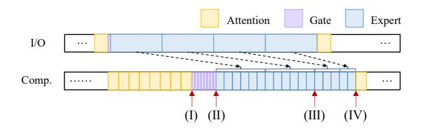
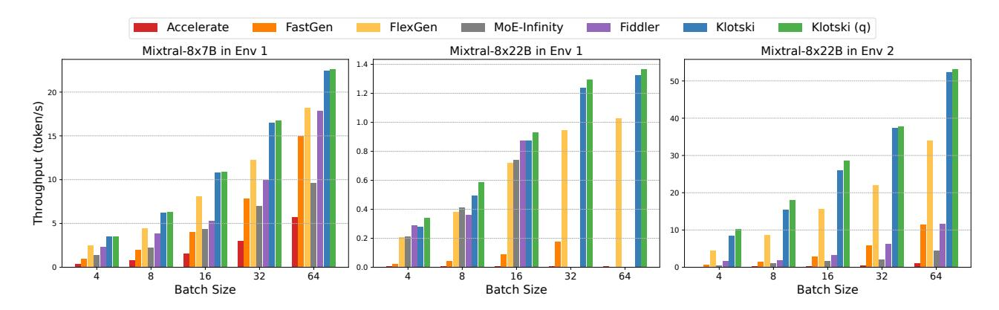

# 7 Constraint-Sensitive I/O-Compute Planner

**Planning Goal:** To minimize the total time T required to complete tasks under existing resource constraints, achieving an almost bubble-free pipeline as illustrated in Figure 9.

$$min \quad T = T_c + T_b$$

$$s.t. \quad M_{usage} < M_{GPU} + M_{CPU} + M_{disk},$$

$$M_{peak \ GPU} < M_{GPU}$$
(3)

The total time T is primarily composed of two parts:  $T_c$ and  $T_b$ , representing the total computation time and the total time occupied by bubbles, respectively.  $T_c$  mainly depends on hardware conditions. Our objective is to minimize  $T_b$  under the constraints of available memory, making it approach zero, as shown in Equation 3. In our system, the reduction of  $T_b$  is primarily influenced by two factors: (1) the placement of the tensors and (2) the batch size and the number of batches included in the batch group, denoted as n. Effective model placement can maximize the utilization of existing storage resources, thereby reducing some of the I/O demands, as considered in § 6.1. The batch size is typically a multiple of 4, leaving limited options for selection. However, determining the value of n is crucial. If n is too large, it will introduce a significant KV cache. Conversely, if *n* is too small, the total computation time for n batches may not overlap effectively with the I/O time of the next layer.

Figure 9. Multi-batch pipeline of Кьотsкі

To investigate the value of *n*, our primary focus lies on the inter-layer and intra-layer overlap in each MoE block. In Figure 9, we insert several arrows indicating the points where a specific tensor needs to start computing. These are interpreted as follows: (I) indicates the point where gate computations will begin, (II) marks the start of the computations for hot experts, (III) signifies the beginning of the computations for cold experts, and (IV) denotes the initiation of the next attention layer's computations. These arrows collectively suggest that the corresponding tensor I/O must be completed before these points to ensure that I/O and computation are overlapped. We list the four key positions with the respective inequalities that must be satisfied as follows.

$$\begin{cases} n * t_{c\_A} \ge t_{I/O\_G} & (4) \\ n * (t_{c\_A} + t_{c\_G}) \ge t_{I/O\_G} + K * t_{I/O\_E} & (5) \\ n * (t_{c\_A} + t_{c\_G}) + t_{c\_hot-E} \ge t_{I/O\_G} + (K+1)t_{I/O\_E} & (6) \\ n * (t_{c\_A} + t_{c\_G}) + t_{c\_hot-E} + \sum_{i \in Q}^{Q} t_{c\_E_i} \ge t_{I/O\_G} + (K+len(Q))t_{I/O\_E} + t_{I/O\_A} & (7) \end{cases}$$

where K denotes the number of prefetched hot experts,  $t_{c\_A}$ ,  $t_{c\_G}$ ,  $t_{c\_topk-E}$ ,  $t_{c\_E_i}$ , denote the time to compute attention, gate, hot experts and expert i, respectively,  $t_{I/O\_A}$ ,  $t_{I/O\_G}$ ,  $t_{I/O\_E}$ , denote the time to transfer attention weights, gate weights and weights of a single expert, respectively. The I/O times and computation times vary with hardware, model, and batch size. Additionally, the length of the queue Q of activated experts per layer is not fixed. We determine the length of each layer of Q based on statistical data.

In response to this, our planner operates primarily in two stages: (1) Measurement of the current hardware capability. Before the inference with an MoE model, Klotski measures the computation times and transmission durations of the model's various layers based on their shapes, data types, and other relevant information in the current environment. These results are cached locally. (2) Constraint solving. Klotski applies the measured data to the constraints from the inequality group to determine the optimal value of n. Assuming the final result is  $n \ge x$ , then  $n = \lceil x \rceil$ . At this point, n ensures a pipeline without bubbles. Further increasing n might improve throughput, but the increase will be marginal because the pipeline is already near bubble-free. However, this would introduce a significant burden of massive KV

caches on storage. Therefore, n should be set to the smallest integer that satisfies the inequality group. Additionally, if n becomes excessively large, manual adjustments to the strategy may be necessary. Since n is a positive integer, this process is not challenging.

Subsequently, we examine the potential outcomes of this strategy, considering both the most favorable and the least favorable scenarios. In the optimal scenario, all tokens select hot experts, thereby eliminating the need to consider inequalities (4) and (5). On the other hand, the worst-case scenario emerges when all tokens select cold experts, encompassing all other experts. In such instances, the value of  $t_{c\_hot-E}$  is equal to zero, rendering the prefetching strategy ineffective. Inadequate n may lead to a few intra-layer bubbles. However, intuitively, the probability of encountering such a worst-case scenario is very low.

**Compression** In particular, quantization and sparse attention are particularly well-suited for our work because they not only further reduce memory requirements but also decrease the amount of data transferred between heterogeneous memory, aiding in bubble reduction. Therefore, we incorporated two effective methods as options.

(1) Quantization. Existing knowledge indicates that the experts are highly robust to quantization [21]. They can be quantized to 3 bits without additional training or calibration data. Since the majority of weights in MoE models belong to experts, quantizing the experts can significantly reduce memory requirements and I/O delays with minimal precision loss. Before computation, we dequantize the tensors back to their original precision, further mitigating precision loss.

More specifically, we employ Half-Quadratic Quantization (HQQ) [3]. Quantization and dequantization are primarily achieved using the Equation 8.

$$Q_{z,s}(W) = W_q = round(W/s+z), \ Q_{z,s}^{-1}(W_q) = s(W_q-z)$$
 (8)

among them, the zero point z and the scale s are quantization parameters, which are determined through a robust optimization formula like Equation 9.

$$\underset{z, s}{\operatorname{argmin}} \left( W - Q_{z,s}^{-1} \left( Q_{z,s}(W) \right) \right) \tag{9}$$

In our study, to strike a balance between accuracy and transmission speed, we opt to preset that quantize both expert and attention tensors to 4 bits, using a group size of 64 and a zero scale group size of 128.

(2) Sparse Attention. In this work, processing multiple batches requires storing a large amount of KV cache. Sparse attention reduces the KV cache size and the cost of transferring it across heterogeneous memory. We incorporate the attention mechanism from StreamingLLM [39], which focuses only on the initial sink tokens and neighboring tokens to achieve effective inference. Additionally, this is optional as there are many models that have sparse strategies natively.

**Table 2.** Hardware environments for evaluation.

| Hardware  | Environment           | 1      | Environment 2            |        |  |
|-----------|-----------------------|--------|--------------------------|--------|--|
| Ilaiuwaic | Model                 | Memory | Model                    | Memory |  |
| GPU       | NVIDIA RTX 3090       | 24 GB  | NVIDIA H800              | 80 GB  |  |
| CPU       | Intel Xeon Gold 5318Y | 256 GB | Intel Xeon Platinum 8470 | 800GB  |  |
| Disk      | SSD                   | 2T     | SSD                      | 1T     |  |
| PCIe      | 4.0 x 16              |        | 5.0 x 16                 |        |  |
| Disk Read | 1 GB/s                |        | /                        |        |  |

## 8 Implementation

We implement Klotski on top of PyTorch [28] and Hugging Face Transformers [37] with over 3k LOC of Python. Expertaware multi-batch pipeline paradigm is implemented on top of FlexGen [34].

**Expert Correlation Table.** We acquire input data by randomly sampling from wikitext-2 [27]. Subsequently, we conduct inference with a batch size of 8 and a sequence length of 512. Expert selections during the inference are recorded and tabulated in JSON format. The choice of small batches is deliberate to avoid excessively large statistical values, which would render updates to the expert correlation table meaningless. We set the activation path length l=1 because we do not heavily rely on the accuracy of expert prefetching. A larger number of batches in a batch group already allows us to overlap communication and computation. Increasing l would add dimension to path recording, which increases the complexity of the table lookup and memory occupation.

Overlapping Computation and I/O. Klotski achieves I/O-computation overlap by orchestrating four CUDA streams: one for prefetching weights, another for transferring expert weights based on gating network results, a third for prefetching KV cache, and the last for storing new KV cache. Each stream operates asynchronously, executing its designated task independently. When certain data is needed, the corresponding stream will be synchronized.

### 9 Evaluation

### 9.1 Experimental Setup

Hardware. We evaluate Klotski in two different environments, as shown in the Table 2. We don't care about the speed of disk reading in environment 2, because there is enough CPU memory.

**Models and Datasets.** We evaluate Klotski using the open-source MoE models: Mixtral-8×7B and Mixtral-8×22B. They have 46.7B and 141B parameters in bfloat16 precision respectively. We use Mixtral-8×7B and Mixtral-8×22B in environment 1 and use Mixtral-8×22B in environment 2 only. This is because Environment 2 is not considered a resource-constrained environment for Mixtral-8×7B. The inputs are randomly sampled from wikitext-103 [27], which has rich text from various fields. We use batch sizes from 4 to 64, with a sequence input length of 512 and an output sequence length

of 32. We use throughput (generated tokens/generation time) as the metric, where generation time is the total time spent in the prefill and decode phases. We mainly evaluate the throughput of Klotski for different sizes of inputs and compare it with the baselines. The experimental results shown are the average results from multiple trials.

**Baselines.** We use the following five offloading studies as baselines for comparison experiments. Among them, the first three works are designed for the dense model, and the last two works are designed for the MoE model.

- Hugging Face Accelerate [13]: Accelerate supports offloading weights of some layers based on the device map. It's easy to use as a library on Hugging Face Transformers. Hereinafter referred to as Accelerate.
- DeepSpeed-FastGen [16]: It is a version of DeepSpeed ZeRO-Inference after many updates. Hereinafter referred to as FastGen.
- FlexGen [34]: FlexGen is an efficient offloading work for inference of LLM. It's the first to propose that traverse the computational graph column-by-column.
- Fiddler [20]: In addition to utilizing CPU resources, Fiddler uses CPU computing power for inference, minimizing data movement between the CPU and GPU.
- MoE-Infinity [43]: MoE-Infinity reduces the latency overhead associated with offloading experts through activation-aware expert prefetching and caching.

Additionally, FlexGen only supports dense models with the same structure as OPT, while the others natively support Mixtral. We adapt FlexGen to the Mixtral series of MoE models without changing its primary strategies.

### 9.2 End-to-End Throughput

We first evaluate the end-to-end throughput of Klotski and compare it with the baselines, as shown in Figure 10.

We use the maximum n (= 15) from Figure 14 to show a better result than the default computed n. And we use n=10 for Mixtral-8×22B in Environment 1 because the computed n is large, which causes out-of-memory (OOM). We set FlexGen to use the same n as us. Across various scenarios, Klotski consistently outperforms other methods in enhancing MoE inference throughput. Compared to Accelerate, FastGen, FlexGen, MoE-Infinity, and Fiddler, Klotski improves the inference throughput by up to 85.12×, 15.45×, 2.23×, 19.06×, and 9.53×, respectively.

On Mixtral-8×7B, as batch size increases, the time difference between computation and I/O gradually narrows, allowing Accelerate and FastGen to perform well. However, on Mixtral-8×22B, the significantly increased weight transfer leads to a larger time difference between computation and I/O. This ultimately results in throughput that is far inferior to FlexGen and Klotski.

Although FlexGen considers multiple batches and maximizes the use of GPU and CPU memory through tensor

**Figure 10.** Throughput comparison between Klotski and baselines in different scenarios. (q) means that quantization and dequantization are used.

**Figure 11.** Throughput latency trade-off comparison between Klotski and baselines. The curve closer to the lower right is better. (q) means that quantization and dequantization are used.

slicing, it prefetches the entire MoE layer, requiring a large n to fully overlap computation and I/O. In contrast, Klotski's approach to expert prefetching is more flexible, not only compressing inter-layer bubbles but also avoiding additional I/O. Moreover, Klotski further compresses intra-layer bubbles by rearranging the order of expert computations. Additionally, Klotski considers maximizing both memory utilization and transmission speed. Furthermore, even if we increase the batch size to 128, Klotski can still achieve a 15% ( $\frac{53-46}{46}$ ) throughput improvement over FlexGen.

On the other hand, both Fiddler and MoE-Infinity achieve high throughput in Environment 1. Specifically, Fiddler determines that, in Environment 1, performing certain computations on the CPU can be faster than loading and executing them on the GPU. MoE-Infinity, through its effective prefetching, minimizes unnecessary I/O, further optimizing performance. In contrast, Klotski attain higher throughput by effectively overlapping substantial I/O through multiple computations. This underscores that I/O is a critical factor influencing inference latency in offloading-based inference

systems. Moreover, when running inference in Environment 2, both systems show reduced performance as the increased GPU memory and faster I/O diminish their advantages. In contrast, Klotski orchestrates multi-batch computations to utilize the GPU more efficiently. Additionally, when performing Mixtral-8×22B inference on a single 3090, Fiddler and MoE-Infinity are limited to a maximum batch size of 16, as they only offload experts. Consequently, the extensive KV cache may result in OOM errors when the batch is large. While Klotski supports more parts of the model to be offloaded, making it more widely applicable.

