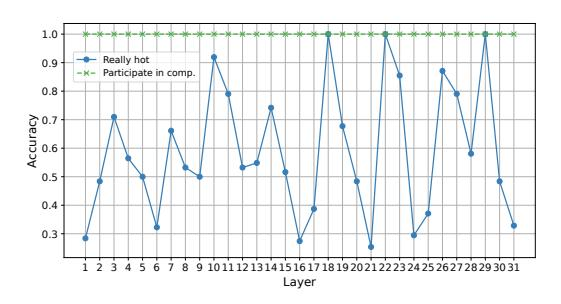

# 9.3 Throughput-Latency Trade-off

We plotted Figure 11 based on the throughput-related experimental results. It demonstrates that Klotski offers a better throughput-latency trade-off for completing the same workload. Under the same time budget constraint, Klotski can achieve more than three times the throughput of Flex-Gen (right plot, where latency equals 29) and outperforms Accelerate, FastGen, MoE-Infinity, and Fiddler.

**Figure 12.** GPU memory usage over the prefill. Each step represents one computation of a layer or an expert, i.e. a block in the computation graph as shown in Figure 7.

Furthermore, as observed in both Figure 10 and Figure 11, quantization has a minimal impact on maximum throughput. However, it enables a more optimal throughput-latency trade-off curve. This improvement is due to the reduced data required for transfer between heterogeneous memory after tensor quantization, resulting in shorter I/O times. Consequently, a smaller n can achieve full overlap between computation and I/O. This also prevents the dramatic increase in KV cache size as n grows.

### 9.4 Memory Usage

In Figure 12, we illustrate the GPU memory usage of Klotski during the prefill. The red line represents the minimum memory required for inference, while the orange line indicates the current GPU memory limitation. The blue line shows the memory usage after offloading all tensors, demonstrating that Klotski requires minimal GPU memory to perform MoE inference, reducing memory usage by over 94.1%. However, there is still a significant amount of expensive GPU memory left unused. Thus, we can further utilize these memory resources, as shown by the green line, achieving a memory reduction of 74.5% while maintaining a throughput of approximately 40 tokens/s for Mixtral-8×22B on a single H800. The changes during the decoding phase are essentially a repetition of the prefill phase, so for clarity, we only depict the prefill phase in the figure.

### 9.5 Ablation Study

We use that prefetching the entire MoE layer while computing the current layer in the single batch pipeline as a simple pipeline. Building upon this, we achieve our methodology in three steps, comparing the throughput improvements at each step, as shown in Table 3. Clearly, considering multi-batch computations provides the most significant enhancement, as it shares weights across multiple batches, significantly reducing inter-layer bubbles. At the same time, adjusting the computation order of experts leads to reducing intralayer bubbles, for two main reasons. First, Klotski transfers only hot experts and gate-activated experts, thus avoiding

**Table 3.** Ablation study of KLOTSKI. The data in the table are throughput (token/s).

| Model                       | Enviro       | <b>Environment 2</b> |               |
|-----------------------------|--------------|----------------------|---------------|
| 110401                      | Mixtral-8×7B | Mixtral-8×22B        | Mixtral-8×22B |
| Simple Pipeline             | 5.721        | 0.01                 | 1.149         |
| + Multi batches             | 18.24        | 0.97                 | 34.07         |
| + Only prefetch hot experts | 19.074       | 1.127                | 44.17         |
| Кьотsкі (+ adjust order)    | 22.414       | 1.325                | 52.85         |
| Кьотѕкі (q)                 | 22.604       | 1.366                | 53.125        |

unnecessary expert transfers. Second, this adjustment prioritises the computation of highly requested experts, thereby allowing more time for cold expert transfers, which takes advantage of the high computational demand of hot experts. Quantization does not significantly impact the maximum throughput, as its primary function is to reduce I/O overhead, enabling the throughput curve to plateau quickly and reducing the need for larger n values.

### 9.6 Prefetch Accuracy

To evaluate the effectiveness of the correlation-aware expert prefetcher, we calculated the accuracy of the prefetched hot experts at each layer, as shown in Figure 13. The green line shows the percentage of prefetched hot experts at each layer that were actually involved in the computations. This result remained consistently at 100%, demonstrating that Klotski does not transfer experts who are not involved in the computations, thus avoiding unnecessary I/O. In contrast, we also evaluated the average accuracy of prefetching experts for a single sequence, which was found to be 42.24%. This comparison shows that processing multiple batches simultaneously can effectively reduce I/O waste. In addition, the blue line represents the accuracy of the selected hot experts, which varies with the data, giving an average accuracy of 58.89%. This suggests that we can accurately predict hot experts in most cases. Furthermore, one of Klotski's advantages is that Klotski does not rely solely on the accuracy of expert prefetching to overlap I/O. Specifically, Klotski takes a more fine-grained approach to overlap computation and I/O between experts, ensuring that even if a prediction is incorrect, it won't have a big impact.

### 9.7 Impacts of *n* and Batch Size

We present detailed end-to-end throughput data, as shown in Figure 14, to simulate different scenarios and analyze the impacts of n and batch size on throughput. Due to the large number of GPU hours required to complete all  $n \times bs$  combinations using Mixtral-8×22B in Environment 1, we have not included it here.

From Figure 14, we observed that when n is small, the throughput is low because the I/O time is much longer than the computation time, causing high latency. At this stage,

**Figure 13.** Accuracy of prefetched experts per layer. The green line shows how many prefetched hot experts participated in the computation. The blue line indicates the accuracy that the prefetched hot experts are indeed the hot experts of the layer.

**Figure 14.** The impacts of *n* and batch size on throughput.

increasing n primarily achieves more overlap between computation and I/O. As n increases, larger batch sizes lead to a faster increase in throughput since each batch brings multiple sequences into the computations, further facilitating the overlap. When n reaches a sufficiently large value, the slope of the corresponding point on the curve gradually approaches zero, indicating that most of the inter- and intralayer bubbles have been eliminated. At this stage, increasing n mainly serves to share the weights among more batches to reduce the number of I/O operations further.

### 9.8 Bubble Reduction

As shown in Figure 15, we proportionally make a detailed inference pipeline of an MoE block, based on the data from the *profiler* tool. Figure 15(a) presents the inference pipeline of a single batch using methods designed for dense models. These methods load the entire MoE layer, resulting in significant inter-layer bubbles. In addition, the number of active experts often falls below eight, causing unnecessary I/O overhead for inactive experts. In contrast, as shown in Figure 15(b), Klotski eliminates inter-layer gaps between the attention and MoE layers. After gate computation, the hot expert computation starts immediately. However, due to the gap between computation and I/O, it remains challenging to

**Figure 15.** Compare the actual pipelines of different methods for performing inference in Environment 1 with Mixtral-8×7B. Simple overlap means prefetching the next layer when executing the current layer. Comp. means computation.

eliminate intra-expert bubbles, even at n=10. By orchestrating expert computations, Klotski overlaps the computation and the I/O between experts, reducing latency. For an identical workload (batch size = 64, number of batches = 10), Klotski completes inference in about 215 ms, compared to approximately 2367 ms using a simple overlap method.

By further increasing n, Klotski can achieve the elimination of intra-expert bubbles within the MoE layer, such as n=15 in § 9.2. However, the massively growing KV cache introduces additional load costs, resulting in new bubbles within multi-batch attention layer computations. We aim to address this in future work by developing a generalized and efficient sparse KV cache strategy for Klotski, which will further improve efficiency and achieve a bubble-free multi-batch inference pipeline.

## 10 Conclusion

We present Klotski, an inference engine designed for MoE models that can perform high-throughput inference in resource-constrained environments. Leveraging the proposed expertaware multi-batch pipeline paradigm, Klotski can significantly reduce the bubbles in the inference pipeline. Extensive experiments demonstrate that Klotski offers a superior throughput-latency trade-off. For instance, running Mixtral-8×22B inference on a single NVIDIA 3090 achieves a throughput of over 1.3 token/s. Across all experimental scenarios, Klotski's throughput can be up to 85.12× greater than that of the existing state-of-the-art.

