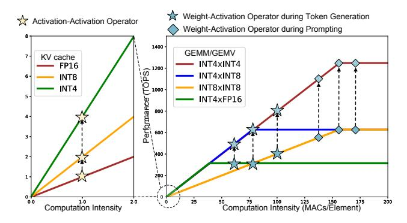
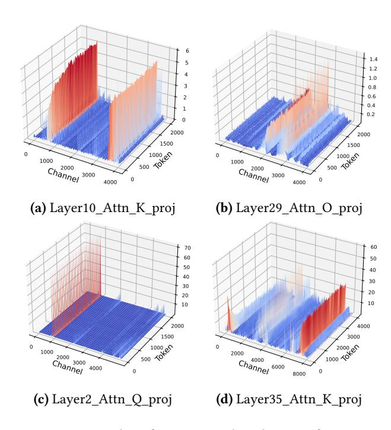

# 2 Background & Motivation

#### 2.1 LLM Inference

Figure 1 illustrates the inference procedure of LLMs, structured into two distinct phases: prefill and decode. In the prefill phase, the model receives an input sentence and processes multiple tokens simultaneously, allowing for parallel computation. The input tensor shape during this phase is [B, L, H], where B is the batch size, L is the prompt sequence length, and H represents the hidden dimension of the model. In the decode phase, by contrast, the model generates the output sequence in an auto-regressive manner, producing one token at a time. This sequential process adjusts the input tensor shape to [B, 1, H], as only a single token is processed at each step.

It is important to note that during token decode, the model needs to store intermediate Key and Value activations to avoid redundant computations. This storage is commonly referred to as the KV cache. During inference, the system must preserve not only all weight parameters but also the Key-Value pairs generated during the decode phase. While the storage space for weights remains constant, the size of the KV cache is directly proportional to the sequence length. Consequently, as sequence length increases, the KV cache gradually becomes the primary storage bottleneck, overtaking weight parameters. For instance, at a sequence length of 128K, the KV cache accounts for 72% of the total storage cost for LLaMA-7B [18].

## 2.2 LLM Quantization

Quantization is an effective method for reducing the inference cost of LLMs. Existing quantization methods for LLMs fall into two categories: weight-only and weight-activation quantization [60, 64].

**Weight-only Quantization.** Weights are more amenable to quantization compared to activations [4, 12, 28]. Consequently, a substantial body of research has concentrated on achieving low-precision weights. Given the high retraining

costs associated with LLMs, existing studies mainly focus on post-training quantization (PTQ). Methods such as GPTQ [12], QuIP [7], and QuIP# [53] achieve low-precision weights by minimizing layer-wise quantization error and optimizing parameters. Additionally, AWQ [28] and OWQ [24] consider the impact of activation outliers on weight quantization, resulting in improved performance for LLMs. OmniQuant [48] further introduces learned weight clipping parameters to achieve lossless W4A16 quantization. While weight-only quantization can reduce the storage costs for modern inference systems, it has limited ability to decrease computational costs and provides minimal performance improvement for processing long sequences. Therefore, our work primarily focuses on achieving low-precision activation quantization.

Weight-activation Quantization. Unlike weight-only quantization methods, weight-activation quantization techniques target both weights and activations, including the KV cache. As discussed in [10], the biggest challenge in quantizing activations is handling outliers, which can be orders of magnitude larger than typical values. To address this, SmoothQuant [56] introduces an equivalent transformation strategy that partially shifts the quantization difficulty from activations to weights, achieving a practical solution of W8A8. To further enhance the accuracy of quantized models, some works have explored fine-grained quantization strategies specifically tailored for activations. For example, KVQuant and WKVQuant [18, 60] focus on achieving finegrained quantization for the KV cache by adopting per-token or per-channel quantization strategies. Although these approaches can reduce memory usage, they are inefficient for computing. ZeroQuant [58] and Atom [65] apply per-channel quantization for activations, while RPTQ [59] proposes a reordering strategy to aggregate non-uniformly distributed channels into different activation parts. Moreover, recent works [4, 32] further employ group-wise quantization to improve the accuracy of quantized LLMs. However, these aggressive quantization strategies introduce significant dequantization overhead, which cannot be efficiently processed in modern GPUs [29].

Overall, existing weight-only and weight-activation quantization methods for LLMs focus heavily on quantization accuracy, often neglecting system-level efficiency, which results in suboptimal inference performance. Specifically, these methods cannot fully unleash the potential computation capability of tensor cores within modern GPUs due to a misalignment between the quantization granularity and the computational granularity of GPUs. In comparison, we propose a fine-grained quantization strategy that aligns with the computational granularity of GPUs. Additionally, we utilize mixed-precision techniques to further improve the compression ratio of the LLM, thereby enhancing both memory efficiency and computational performance.

**Figure 2.** Roofline model analysis for activation-activation and weight-activation operators. The activation-activation operator is highly memory-bound, while the weight-activation operator becomes compute-bound with large-batch parallelism.

#### 2.3 Motivation

Existing LLM serving systems [40, 46] typically utilize modern GPUs, which are equipped with high-bandwidth memory (HBM) and powerful processing units such as high-throughput tensor cores. For instance, the A100 80G offers 80GB of HBM with 2.0TB/s bandwidth and can deliver up to 312 TFLOPS of FP16 tensor core performance for GEMM operations. In addition, modern GPUs support lower-precision computations, achieving 624 TOPS with INT8 tensor cores and 1248 TOPS with INT4 tensor cores. Modern GPUs also include CUDA cores for handling complex computations such as data conversion and permutation.

As depicted in Figure 2, we employ the classic roofline model to evaluate the performance of LLM inference on GPUs. According to Figure 1, we assess the performance of two types of operators, activation-activation operators and weight-activation operators, under different precisions. The computation intensity of the activation-activation operator is fixed at 1.0, making it memory-bandwidth bound. Therefore, implementing low-bit quantization for the KV cache can significantly enhance the throughput of activation-activation operators. Conversely, the computation intensity of weightactivation operators varies with batch size and inference phases. Thus, under large-batch parallelism, adopting lowprecision activation quantization can further improve inference throughput. These observations motivate us to explore low-precision quantization for activations (including input activations and the KV cache) more thoroughly. Additionally, due to being bound by different characteristics, we will adopt different quantization strategies for input activation and KV cache, as detailed in Section 3.2.

**Figure 3.** Examples of activation distributions for various LLMs: (a) and (b) show LLaMA-7B activations, (c) presents OPT-13B activations, and (d) illustrates Qwen2-72B activations. Certain activation channels contain outliers, which can degrade accuracy when applying conventional quantization strategies.

