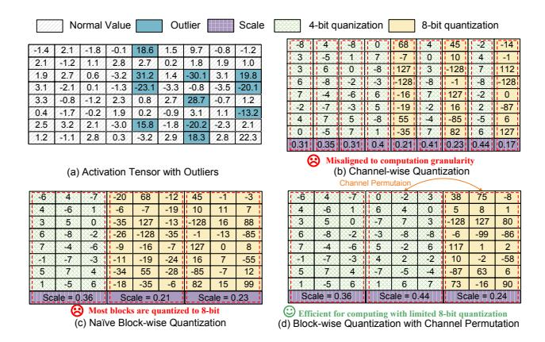

# 3.1 Analysis of Activation Distribution

Unlike small-scale neural networks [11, 31, 54], a notable feature of LLMs is the widespread occurrence of outliers. Once a model exceeds a certain scale (in practice, around 6 billion parameters), a small cluster of hidden state features (usually less than 1%) exhibits magnitudes significantly larger than the rest [10]. These emergent large-magnitude features are referred to as outliers, and they have magnitudes that can exceed typical hidden state values by tenfold or even a hundredfold. When using traditional min-max quantization strategies on activation tensors, these outliers can cause typical hidden state values to be quantized to zero, resulting in significant accuracy degradation. These outliers are so

crucial to the representational capacity of LLMs that their removal is not feasible [15].

Fortunately, we have conducted extensive experimental analysis on current typical LLMs, such as LLaMA, and found that these outliers typically distribute within specific feature dimensions. As illustrated in Figure 3, outliers appear only in certain activation channels across various LLMs. This insight suggests an intuitive approach: applying separate quantization for outliers and normal values, with high precision for outliers and lower precision for normal values.

#### 3.2 The FMPQ Algorithm

With the above observation, we can apply a fine-grained mixed-precision quantization algorithm that partitions the normal values and outliers into different parts and quantizes them with different precision. For example, we quantize normal values to 4-bit, while outliers to 8-bit. However, as demonstrated in Figure 4(b), previous channel-wise quantization algorithms [58, 65] cannot ensure the efficiency of the quantized model due to their misalignment with the granularity of the hardware computation.

In fact, the minimum computation granularity on modern GPUs is fixed. For instance, the FP16 tensor core on A100 has a minimum computation granularity of  $64 \times 64 \times 32$  ( $m \times n \times k$ ). This hardware constraint necessitates that the granularity of quantization is an integer multiple of the minimum computation granularity, to maximize the utilization of tensor core. Consequently, prior channel-wise or irregular cluster quantization strategies [58, 59], which fail to align well with hardware computation granularity, are inefficient. On the other hand, overly fine-grained quantization strategies (e.g., tile-wise quantization) introduce significant software scheduling overhead. Therefore, as illustrated in Figure 4(c), we adopt a block-wise mixed-precision quantization method, which partitions the activation tensor only along the channel dimension. Specifically, we divide the activation tensor into multiple sub-tensors with a channel size of k, referring to these sub-tensors as blocks. In practice, setting k to 128 ensures sufficient tensor core utilization without excessive accuracy loss in the quantized LLM.

Since outliers are distributed across multiple channels, any block that contains outliers will require 8-bit quantization. This results in a large number of blocks being quantized to 8-bit, which limits the benefits, as depicted in Figure 4(c). To address this issue, we employ a channel permutation strategy, which is commonly used in LLM pruning [44, 63, 65]. Unlike approaches that use channel permutation to achieve accurate N:M sparsity by distinct channel aggregation, we focus on identifying and clustering channels with outliers to minimize high-precision quantization. As shown in Figure 4(d), we utilize sampled activations from the calibration dataset [45] to locate outlier channels and apply permutation to group these channels into a single block. To further maintain computational equivalence, the corresponding positions

Figure 4. The algorithm design of FMPQ.

in the weight matrix also need to be permuted. In this way, only a small portion of blocks (less than 20%) need 8-bit quantization, while the majority of activations can be quantized to 4-bit, enabling W4A4 GEMM. Prior works [27, 59] have already optimized the channel permutation operator, and according to our evaluation, channel permutation accounts for only 0.7% of the overall runtime.

While the proposed channel permutation enhanced blockwise quantization works well for input activations, the KV cache requires a different quantization strategy. As analyzed in Figure 2, the activation-activation operator which KV cache works for is highly memory-bound. Therefore, KV cache is better suited for low-bit quantization without considering the quantized granularity. Given that RoPE and softmax possess strong outlier regularization properties, low-precision quantization of the K cache introduces minimal error. Furthermore, the V cache contains few outliers [18, 34, 65]. As a result, we can apply a full 4-bit quantization to the KV cache. Specifically, we use a channel-wise 4-bit quantization strategy for the KV cache. The experimental results in Section 6.2 demonstrate that this approach has a negligible impact on accuracy. By combining the quantization for input activation and KV cache, the FMPO algorithm provides a practical path for W4A4KV4 LLM serving.

