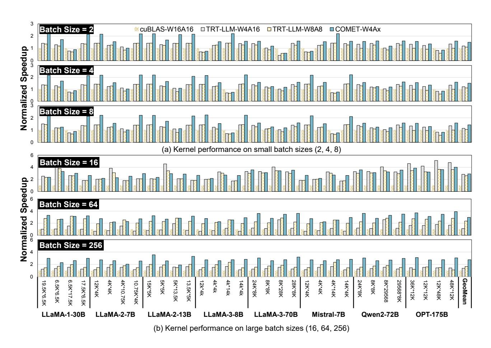
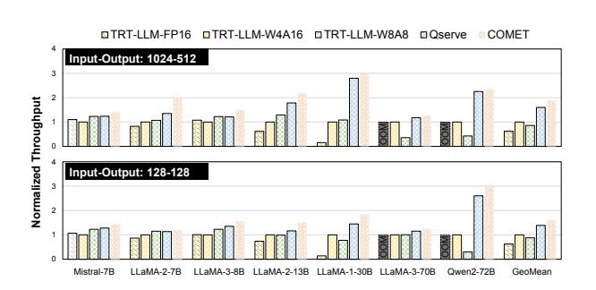
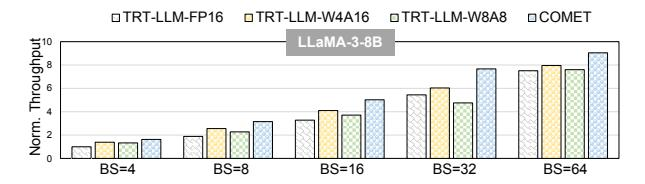
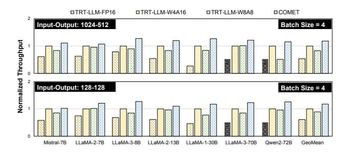
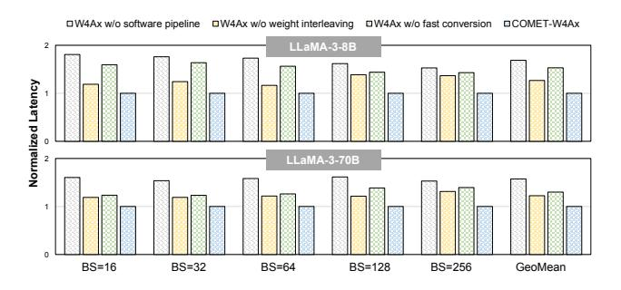
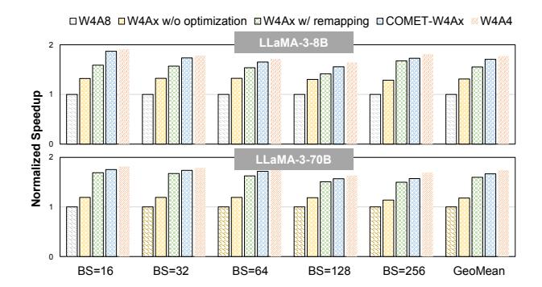
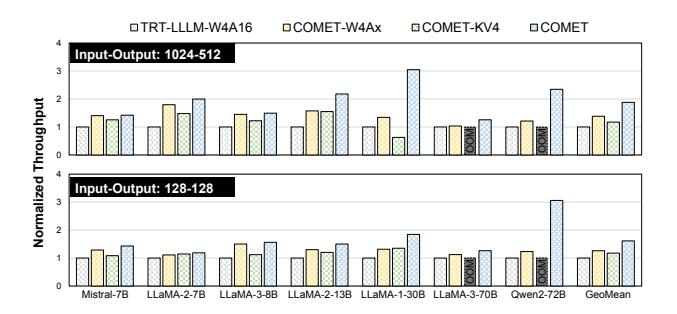

# 6 Evaluation

#### 6.1 Experimental Setup

**Algorithm.** The proposed quantization algorithm, FMPQ, is implemented using HuggingFace on top of PyTorch. We employ block-wise mixed-precision (INT4 and INT8) quantization for activations and channel-wise asymmetric INT4 group quantization for the KV cache. Additionally, we adopt the algorithm in [48] to achieve 4-bit weight quantization. We use the term "W4AxKV4" to denote the configurations we adopt. Note that most of the computations are conducted on W4A4KV4 cases.

**System.** We evaluate the performance of the COMET inference system at two different levels: kernel-level benchmarking and end-to-end inference performance. All performance evaluations are conducted on the NVIDIA A100-80GB-SXM4 platform with CUDA 12.1. Our primary focus is on the performance of linear layers within LLMs during the decode phase. GPU kernel performance is measured using NVIDIA Nsight Compute [37]. End-to-end inference throughput is measured using NVIDIA Nsight Systems [38]. We use TensorRT-LLM (TRT-LLM) v0.10.0 to perform inference

LLaMA-1 LLaMA-2 LLaMA-3 Mistral OPT Qwen2 Precision Method 13B 30B 65B 7B 13B 70B 8B 70B 7B 13B 72B FP16 - 5.09 4.10 3.56 5.12 4.57 3.12 6.14 2.86 5.25 10.13 4.94 W8A8 SmoothQuant 5.19 4.23 3.75 5.54 4.95 3.36 6.28 2.99 5.29 10.47 5.14 W4A16 GPTQ 5.40 4.48 3.83 5.83 5.13 3.58 7.02 3.44 5.39 10.31 5.09 AWQ 5.34 4.39 3.76 6.15 5.12 3.54 7.09 3.40 5.37 10.39 5.07 Omniquant 5.21 4.25 3.71 5.74 5.02 3.47 6.81 3.29 5.31 10.30 5.03 W4Ax FMPQ 5.29 4.27 3.78 5.71 5.10 3.48 6.88 3.36 5.35 10.34 5.05 W4A4 Omniquant 10.87 10.33 9.17 14.26 12.30 9.93 14.27 9.75 7.87 11.65 7.91 W4A8 KV4 QoQ 5.28 4.34 3.83 5.75 5.12 3.52 6.89 3.38 5.45 10.42 5.21 W4AxKV4 FMPQ 5.32 4.31 3.82 5.73 5.19 3.56 6.91 3.41 5.43 10.44 5.17

Table 1. Evaluation of WikiText2 perplexity for various quantized LLMs. Lower values indicate better performance.

Table 2. Zero-shot accuracy evaluation on five common sense tasks for LLaMA-3 family models.

|      |                |                | Zero-shot Accuracy ↑ |       |       |           |            |      |
|------|----------------|----------------|----------------------|-------|-------|-----------|------------|------|
| Size | #Configuration | Method         | PIQA                 | ARC-e | ARC-c | HellaSwag | Winogrande | Avg. |
| 8B   | FP16           | Full Precision | 79.9                 | 80.1  | 50.4  | 60.2      | 72.8       | 68.6 |
|      | W8A8           | SmoothQuant    | 79.5                 | 79.7  | 49.0  | 60.0      | 73.2       | 68.3 |
|      | W4A16          | Omniquant      | 78.4                 | 77.9  | 48.5  | 58.8      | 72.7       | 67.2 |
|      | W4A8 KV4       | QoQ            | 77.1                 | 77.2  | 47.8  | 57.6      | 72.0       | 66.3 |
|      | W4AxKV4        | FMPQ           | 77.5                 | 76.7  | 47.5  | 58.9      | 72.1       | 66.5 |
| 70B  | FP16           | Full Precision | 82.4                 | 86.9  | 60.3  | 66.4      | 80.6       | 75.3 |
|      | W8A8           | SmoothQuant    | 82.2                 | 86.9  | 60.2  | 66.3      | 80.7       | 75.3 |
|      | W4A16          | Omniquant      | 82.7                 | 86.3  | 59.0  | 65.7      | 80.9       | 74.9 |
|      | W4A8 KV4       | QoQ            | 81.4                 | 85.7  | 58.4  | 64.9      | 79.9       | 74.0 |
|      | W4AxKV4        | FMPQ           | 82.5                 | 85.2  | 58.3  | 65.0      | 79.6       | 74.1 |

evaluations under different configurations, including FP16, W4A16 and W8A8, as the baseline systems. Moreover, we compare COMET with Qserve [\[29\]](#page-14-5), a recent approach supporting W4A8KV4 LLM serving.

### 6.2 Algorithm Evaluation

Algorithm Benchmarks. We compare our proposed FMPQ algorithm with other baselines on the LLaMA-1 [\[50\]](#page-15-1), LLaMA-2 [\[51\]](#page-15-18), LLaMA-3 family models, as well as Mistral-7B [\[21\]](#page-14-29), OPT-13B [\[62\]](#page-15-3) and Qwen2-72B [\[2\]](#page-13-1). Following previous literature settings [\[4,](#page-13-0) [7,](#page-14-10) [12,](#page-14-3) [32,](#page-14-12) [48\]](#page-15-5), we evaluated FMPQ-quantized models on language modeling and downstream zero-shot tasks. Specifically, we evaluated the perplexity of quantized models on WikiText2 [\[35\]](#page-14-30), and evaluated the zero-shot accuracy on PIQA [\[5\]](#page-13-2), ARC [\[8\]](#page-14-31) (including ARC-e and ARC-c), HellaSwag [\[61\]](#page-15-19) and WinoGrande [\[47\]](#page-15-20) with lm\_eval [\[13\]](#page-14-32).

Algorithm Baselines. We compare FMPQ with widely used PTQ LLM quantization algorithms, including weightonly and weight-activation quantization methods. We use SmoothQuant [\[56\]](#page-15-7) as the basic weight-activation quantization method, and also compare with weight-only quantization algorithms including GPTQ [\[12\]](#page-14-3), AWQ [\[28\]](#page-14-4) and Omniquant [\[48\]](#page-15-5). Additionally, we assess the QoQ algorithm, as implemented in Qserve, using a group-wise W4A8 KV4 configuration, with a group size of 128 and a single FP16

scale factor per group. Furthermore, we aggressively extend Omniquant to a full W4A4 quantization, to evaluate the corresponding accuracy degradation.

Perplexity Evaluation. Table [1](#page-9-1) presents the evaluation results of Wikitext2 perplexity between FMPQ and other algorithm baselines. As one can notice, compared to W8A8 SmoothQuant and W4A16 Omniquant, FMPQ only introduces a slight perplexity increase (only 0.04 for LLaMA-1-30B and 0.07 for LLaMA-1-65B, respectively). When we further introduce KV cache quantization, the increased perplexity is as small as 0.05 on average, which is negligible. Moreover, unlike QoQ, which quantizes all activations to 8-bit, FMPQ selectively quantizes only about 16% of activations to 8-bit, allowing most GEMM tiles to be computed in W4A4 format. Specifically, for LLaMA-1-30B, only 8% of activations are quantized to 8-bit. These results indicate that FMPQ provides a practical solution for W4A4KV4 LLM serving. In comparison, when adopting a fully W4A4 Omniquant, the increased perplexity is unbearable (more than 5.21), hindering the practical deployment of quantized LLMs.

Zero-shot Accuracy. We further report the zero-shot accuracy of five common sense tasks in Table [2.](#page-9-2) Compared with the state-of-the-art W4A16 quantization method, the accuracy acquired by FMPQ is only decreased by 0.75%. For LLaMA-3-8B, our FMPQ strategy even outperforms Omniquant when evaluating HellaSwag, demonstrating its efficiency. Additionally, our fine-grained mixed-precision quantization strategy consistently outperforms QoQ's W4A8 KV4 quantization on most downstream tasks.

#### 6.3 Kernel Performance

We evaluate the COMET-W4Ax kernel across a range of GEMM workloads with batch sizes from small (2, 4, and 8) to large (16, 64, and 256), representing diverse use cases. We set the W4A4 ratio as 75% for the following kernel performance evaluations since it's the lower bound of the given kernel performance. Specifically, COMET often achieves a higher W4A4 kernel proportionality in practical model deployment. We compare against baselines including cuBLAS-W16A16 [1], TRT-LLM-W4A16, and TRT-LLM-W8A8 [40], with cuBLAS-W16A16 latency normalized to 1.

Small Batch Size Performance. Figure 9(a) presents the normalized performance of various GPU kernels with small batch sizes. The results show that COMET-W4Ax achieves average speedups of 1.48×, 1.25× and 1.37× over cuBLAS-W16A16, TRT-LLM-W4A16, and TRT-LLM-W8A8, respectively. Although TRT-LLM-W8A8 benefits from lower-precision computation, it only achieves a 1.09× speedup over cuBLAS-W16A16 due to a bottleneck in data loading rather than computation for small batch sizes. TRT-LLM-W4A16 outperforms W8A8 by effectively reducing weight data loading. In comparison, COMET-W4Ax demonstrates superior performance by addressing data loading challenges and enhancing computational efficiency.

**Large Batch Size Performance.** Figure 9(b) shows the normalized speedups of COMET-W4Ax compared to the baselines. As one can notice, COMET-W4Ax consistently delivers the best performance, especially in large-batch parallelism scenarios (e.g., batch size = 256). On average, COMET-W4Ax achieves speedups of  $2.88\times$ ,  $1.77\times$ , and  $1.33\times$  over cuBLAS-W16A16, TRT-LLM-W4A16, and TRT-LLM-W8A8, respectively. As batch sizes increase to 64 and 256, TRT-LLM-W4A16 shows limited performance gains (only 1.10× and 1.38×) due to being compute-bound for large-batch cases. In contrast, TRT-LLM-W8A8 sees notable speedup improvements with larger batch sizes. In contrast to these kernels, which exhibit varying performance, COMET-W4Ax achieves substantial and consistent gains across different batch sizes, with speedup factors of 2.91×, 2.97×, and 2.75× for batch sizes of 16, 64, and 256, respectively.

**Analysis on Varying Kernels.** As Figure 9 shows, the performance gains for different GEMM shapes are quite different. For example, the performance remains relatively stable in some cases (e.g.,  $13.5K \times 5K$ ), while it varies significantly in others (e.g.,  $5K \times 13.5K$ ). This is because, in cuBLAS, the optimal tile partition varies for different GEMM shapes [1]. However, to accommodate mixed-precision tile

partition, we fixed the tile partitioning strategy in the COMET-W4Ax kernel, which resulted in suboptimal performance gains in specific cases.

In summary, COMET-W4Ax achieves superior performance across both small and large batch sizes, highlighting the effectiveness and generality of our kernel design. Specifically, the performance gains for large batch sizes are promising and we recommend programmers to adopt the COMET kernel in large-scale LLM serving.

#### 6.4 End-to-End Evaluation

We explore the maximum achievable throughput of different inference systems, within the same memory constraints on a single A100-80G-SXM4. Specifically, we adopt two different settings, including an input/output sequence length of 1024/512 and an input/output sequence length of 128/128, to evaluate models including Mistral-7B, LLaMA family models and Qwen2-72B. Furthermore, we also compare the normalized throughput under the same batch sizes for LLaMA-3-8B.

**Throughput Evaluation.** Figure 10 presents the relative throughput performance of different inference systems. We set the TRT-LLM-W4A16 as the baseline. According to our evaluation, COMET achieves 2.02× and 1.63× higher throughput on average for two different input/output sequence length settings, respectively. With the help of lowprecision quantization on weight, activation and KV cache, we can easily support large-batch parallelism for large models such as LLaMA-3-70B and Qwen2-72B. Specifically, relative to the best-performing configurations (either W4A16 or W8A8), COMET demonstrates impressive performance improvement: it achieves  $1.18 \times - 1.93 \times$  higher throughput for 7B and 8B models, 1.74× higher throughput for LLaMA-2-13B, 2.81× higher throughput for LLaMA-1-30B and  $1.28 \times -3.27 \times$  higher throughput for 70B and 72B models. COMET performs better when processing tasks with longer output sequences (512 tokens), as the proposed 4-bit KV cache can effectively migrate the bottleneck of large batch execution. Moreover, COMET achieves an average 1.17× speedup over Qserve. This improvement is primarily due to the efficient use of the INT4 tensor cores in the A100, as well as the reduction in dequantization cost.

Comparisons across Batch Sizes. We present the speedup results across different batch sizes for LLaMA-3-8B in Figure 11. As the batch size increases, the execution throughput gradually improves. For example, when setting the batch size as 64 for TRT-LLM-FP16, the throughput is increased by 7.52× compared with the batch size of 4. Hence, supporting large-batch parallelism is essential for improving the end-to-end throughput on modern GPUs. Following the setting in COMET, we can achieve even larger batch sizes. Additionally, under the same batch sizes, COMET consistently outperforms the best configurations of TensorRT-LLM. According to our evaluation, COMET achieves a 1.37× speedup than SOTA TensorRT-LLM configurations. This is primarily

Figure 9. Kernel performance evaluation across different workloads and batch sizes.

**Figure 10.** Compared to the SOTA inference systems TRT-LLM and Qserve, COMET provides higher throughput across various LLMs, ranging from 7B to 72B.

due to our efficient utilization of INT4 tensor cores and fast dequantization.

Comparisons across Various LLMs. To demonstrate the generality of COMET on performance improvement, we further evaluate the end-to-end throughput across different LLMs at a batch size of 4, a typical configuration for small batches. As shown in Figure 12, COMET achieves an

**Figure 11.** Throughput comparison between COMET and baseline inference systems for LLaMA-3-8B across batch sizes. We use an input-output sequence length of 1024-512.

average 2.20× and 1.43× higher throughput than TRT-LLM-FP16 and TRT-LLM-W8A8, respectively. Due to the memory-bound nature of LLM inference with small batch sizes, TRT-LLM-W4A16 demonstrates a 1.16× performance improvement over TRT-LLM-W8A8. Nevertheless, when compared with the SOTA TRT-LLM-W4A16 configuration, COMET still offers a 1.18× throughput improvement without relying on increased batch parallelism. This improvement is due to COMET's effective use of high-efficiency low-precision

**Figure 12.** Normalized end-to-end throughput performance for various LLMs at a batch size of 4.

**Figure 13.** Ablation study on the proposed optimization strategies, including pipelining, weight interleaving and data conversion. The normalized kernel latency (lower is better) shows the effectiveness of our optimization techniques.

tensor cores (INT4 and INT8) and reduced dequantization overhead in mixed-precision quantization.

#### 6.5 Ablation Study

Kernel Optimization. To support mixed-precision computation, we have developed a novel W4Ax kernel and employed various strategies to optimize the proposed COMET-W4Ax kernel, as detailed in Section 4. To evaluate the effectiveness of these optimizations, we conducted an ablation study on the LLaMA-3 models across batch sizes ranging from 16 to 256. We assessed different kernel versions, including W4A8, a naïve W4Ax kernel without software pipeline (W4Ax w/o software pipeline), a W4Ax kernel without weight interleaving (W4Ax w/o weight interleaving), a kernel without fast INT4to8 conversion (W4Ax w/o fast conversion), a kernel without mapping optimization (W4Ax w/o optimization), a kernel implementing the tile remapping (W4Ax w/ remapping) strategy proposed in Section 4.4, and a fully optimized COMET-W4Ax kernel. Additionally, we included the best-performing W4A4 kernel implemented with CUTLASS as an Oracle kernel, to analyze the theoretical upper bound of kernel performance. Note that full W4A4 quantization leads to significant accuracy degradation [48], making it impractical for LLM serving systems.

Figure 13 profiles the impact of SIMT-enhanced pipeline, weight interleaving, and data conversion optimizations on

**Figure 14.** Performance improvement gained by different optimization strategies. A naïve implementation of W4Ax kernel can only achieve a limited performance improvement, while a highly optimized kernel can achieve a 1.69× speedup. COMET-W4Ax can achieve approximately 96% performance of the Oracle W4A4 kernel.

the designed W4Ax kernel performance. The results show that without the SIMT-enhanced software pipeline, weight interleaving, and fast conversion, COMET-W4Ax experiences performance degradations of 1.69×, 1.27×, and 1.53×, respectively. These optimizations collectively reduce the dequantization cost, making COMET-W4Ax significantly more efficient for mixed-precision GEMM computations.

Figure 14 illustrates the normalized performance differences between the COMET-W4Ax and the under-optimized W4Ax kernel. Compared to the W4A8 GEMM kernel, a naïve implementation of the W4Ax kernel achieves only 1.31× and 1.18× speedups. These potential gains stem from using INT4 tensor cores, which offer 2× higher throughput. However, due to the lack of load balancing across different SMs, the utilization of INT4 tensor cores falls short of expectations. By implementing tile and SM remapping, the speedup increases to 1.56× and 1.60×, respectively. By further eliminating the one-to-one binding between tiles and SMs, COMET-W4Ax achieves 1.71× and 1.67× speedup for GEMM computations of the LLaMA-3-8B and LLaMA-3-70B models, respectively. Additionally, COMET-W4Ax achieves 92.7% - 97.8% of the Oracle W4A4 kernel's performance, highlighting its broad applicability. The results also indicate that our fine-grained SM scheduling strategy effectively alleviates the imbalance of computing kernels between W4A4 and W4A8. It is worth noting that even an Oracle W4A4 kernel cannot achieve a 2× speedup over the W4A8 kernel, as GEMM computation performance on modern GPUs is constrained by factors such as GPU utilization and data flow, making theoretical peak performance unattainable in practice.

**End-to-end Performance.** We further analyze the impact of weight-activation and KV cache quantization on end-to-end throughput. In this analysis, COMET-W4Ax represents the application of weight-activation quantization only, while COMET-KV4 denotes KV cache quantization

**Figure 15.** Ablation study on end-to-end performance, evaluating the individual effects of weight-activation quantization and KV cache quantization.

only within the COMET system. As shown in Figure 15, COMET-W4Ax achieves an average 1.32× performance improvements over TRT-LLM-W4A16 on diverse LLMs. Compared to weight-only W4A16 quantization, COMET-W4Ax leverages the high-performance INT4 and INT8 tensor cores to significantly enhance inference performance. When only adopting 4-bit KV cache quantization, COMET-KV4 yields a more limited 1.17× improvement over baseline, as it reduces KV cache storage costs but does not reduce computing costs. Additionally, KV cache only quantization cannot reduce the storage cost for weight parameters, limiting its effectiveness in deploying large-scale models such as LLaMA-3-70B and Qwen2-72B. By combining weight-activation and KV cache quantization, COMET maximizes modern GPU processing capabilities by both leveraging high-performance low-precision tensor cores and reducing storage costs. These optimizations work together to deliver a substantial boost in end-to-end inference performance, allowing COMET to achieve an average 1.82× increase in throughput.

