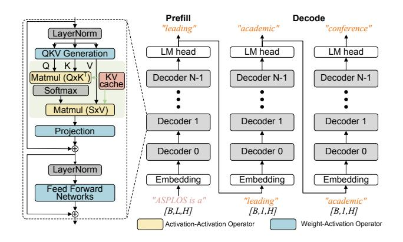

# Ying Wang\* Institute of Computing Technology, CAS Beijing, China wangying2009@ict.ac.cn

#### Abstract

Quantization is a widely-used compression technology to reduce the overhead of serving large language models (LLMs) on terminal devices and in cloud data centers. However, prevalent quantization methods, such as 8-bit weight-activation or 4-bit weight-only quantization, achieve limited performance improvements due to poor support for low-precision (e.g., 4-bit) activation. This work, for the first time, realizes practical W4A4KV4 serving for LLMs, fully utilizing the INT4 tensor cores on modern GPUs and reducing the memory bottleneck caused by the KV cache. Specifically, we propose a novel fine-grained mixed-precision quantization algorithm (FMPQ) that compresses most activations into 4bit with negligible accuracy loss. To support mixed-precision matrix multiplication for W4A4 and W4A8, we develop a highly optimized W4Ax kernel. Our approach introduces a novel mixed-precision data layout to facilitate access and fast dequantization for activation and weight tensors, utilizing the GPU's software pipeline to hide the overhead of data loading and conversion. Additionally, we propose fine-grained streaming multiprocessor (SM) scheduling to achieve load balance across different SMs. We integrate the optimized

 $^*$ Corresponding author.

This work is licensed under a Creative Commons Attribution 4.0 International License.

ASPLOS '25, March 30-April 3, 2025, Rotterdam, Netherlands © 2025 Copyright held by the owner/author(s). ACM ISBN 979-8-4007-1079-7/25/03. https://doi.org/10.1145/3676641.3716252

W4Ax kernel into our inference framework, COMET, and provide efficient management to support popular LLMs such as LLaMA-3-70B. Extensive evaluations demonstrate that, when running LLaMA family models on a single A100-80G-SMX4, COMET achieves a kernel-level speedup of 2.88× over cuBLAS and a 2.02× throughput improvement compared to TensorRT-LLM from an end-to-end framework perspective.

*CCS Concepts:* • Computer systems organization  $\rightarrow$  Parallel architectures; • Computing methodologies  $\rightarrow$  Machine learning.

**Keywords:** Large Language Models (LLM) Serving, LLM Quantization, Algorithm-System Co-design

#### **ACM Reference Format:**

Lian Liu, Long Cheng, Haimeng Ren, Zhaohui Xu, Yudong Pan, Mengdi Wang, Xiaowei Li, Yinhe Han, and Ying Wang. 2025. COMET: Towards Practical W4A4KV4 LLMs Serving . In *Proceedings of the 30th ACM International Conference on Architectural Support for Programming Languages and Operating Systems, Volume 2 (ASPLOS '25), March 30-April 3, 2025, Rotterdam, Netherlands*. ACM, New York, NY, USA, 16 pages. https://doi.org/10.1145/3676641.3716252

#### 1 Introduction

Large language models (LLMs) have demonstrated excellent performance across various benchmarks [6, 10, 41, 50, 55, 62]. However, as LLMs advance and models with hundreds of billions of parameters emerge, their substantial sizes present significant challenges for inference systems. Specifically, large models require extensive memory, while most LLM-based systems perform inference on a single GPU with limited

memory capacity. Moreover, LLM inference incurs high serving costs, often calculated per token, and processing long token sequences further increases these costs.

Model quantization is an efficient way to reduce the memory footprint and serving costs for LLM inference, with weight-only quantization being a typical method in recent years [12, 28]. However, the latest studies [29, 65] report that weight-only quantization achieves limited performance improvements on modern GPUs, particularly when processing large-batch and long token sequences. The main reasons are: (1) weight-only quantization requires low-bit parameters to be dequantized to align with high-precision activations before being processed by the GPU tensor cores, leading to a waste of computational resources. For example, existing W4A16 quantization methods [12, 28, 48] must restore the quantized 4-bit weights to 16-bit and process them together with activations in the FP16 tensor cores, which is inefficient for modern GPUs like A100 that are optimized for higherthroughput 4-bit operations; and (2) in applications involving large-batch processing and long token sequences [18, 60], the Key and Value activation caching (KV cache) becomes the major bottleneck rather than the weight parameters. Although methods like SmoothQuant [56] simultaneously quantize both activations and weights, they employ a conservative scaling strategy that restricts activations and weights to INT8 format, still facing the issues mentioned above.

To address the above issues, achieving lower-precision (e.g., 4-bit) activations without compromising accuracy is crucial. This would fully utilize low-bit tensor cores in modern GPUs, delivering higher throughput. Additionally, lowprecision quantization for the KV cache, which consumes significant memory in transformers, is needed. This would alleviate the memory bottleneck, enable larger inference batch sizes, and efficiently exploit the batch-level parallelism in advanced GPUs. These requirements, along with the concentrated distribution of outliers in activations [10, 49], motivate us to design a novel fine-grained mixed-precision quantization algorithm (FMPQ) for activations. Specifically, FMPQ quantizes most activations to 4-bit and others to 8-bit1. To ensure efficient computing, we partition the activation tensor into multiple sub-tensors, each sized to match the GPU's computational granularity. Additionally, we introduce a channel permutation strategy to cluster outliers within the same subtensor, thereby reducing the overall quantization precision.

Since FMPQ requires hardware capable of W4Ax matrix multiplication for the quantized LLM, but existing LLM serving systems [14, 40, 46] lack support for direct mixed-precision tensor operations and W4Ax computing, we further design a novel W4Ax kernel and integrated it into our inference framework, COMET. Generally, COMET optimizes

mixed-precision LLM computing on GPUs by incorporating data layout design and fast dequantization for mixed-precision weights and activations. It further uses the software pipeline to overlap the overhead of data loading and conversion. Additionally, given that the lower precision tensor cores in modern GPU provide higher throughput (INT4 tensor core has 2× higher throughput than INT8), COMET employs a fine-grained SM scheduling strategy to achieve load balance across different stream multiprocessors (SMs). By integrating the optimized W4Ax kernel and efficient memory management techniques [23], COMET provides practical and efficient W4A4KV4 LLM serving.

In a nutshell, the contributions of this work can be summarized as follows:

- We analyze the distribution of outlier values in LLM activations and introduce a novel FMPQ algorithm that enables 4-bit activations and KV cache without compromising accuracy. To achieve this, the activation tensor is divided and quantized at a granularity that matches the matrix multiplication units on modern GPUs, employing a tiling approach. With negligible accuracy loss, the proposed FMPQ algorithm processes more than 84% of GEMM computations using W4A4, while W4A8 is used for the remaining computations.
- We develop a novel highly-optimized W4Ax kernel to support the simultaneous computation of W4A4 and W4A8. The low-precision data points are packed into a high-precision format and directly processed in CUDA cores using an optimized pipeline, effectively hiding the expensive runtime numerical-format conversion overhead. Furthermore, we propose an efficient finegrained SM scheduling solution during LLM compilation stages. This solution remaps the mixed-precision tensor tiles, to achieve balanced mixed-precision computing across different SMs.
- We present COMET, the high-performance LLM inference framework, which integrates our proposed W4Ax kernel to enable mixed-precision GEMM processing and provides efficient memory management for LLM serving. Compared with state-of-the-art (SOTA) frameworks, COMET achieves practical W4A4KV4 LLM serving. Evaluated on a single A100-80G-SXM4 across various LLM models, COMET demonstrates a 1.48 × 2.91× latency reduction on kernel performance and 2.02× throughput improvement in end-to-end evaluation over SOTA baselines. Additionally, we provide an open-source W4Ax kernel² with a Python interface and a set of C++ APIs, enabling seamless integration into existing inference systems such as TensorRT-LLM [40] and DeepSpeed [46].

&lt;sup>1Throughout this paper, *mixed-precision* refers to a combination of W4A4 and W4A8 (i.e., **W4Ax**), rather than mixing 8-bit or 16-bit activations with lower-precision weights as seen in current works [28, 29].

&lt;sup>2Open-sourced at https://github.com/rhmaaa/COMET-LLM

**Figure 1.** The inference procedure of LLMs is divided into two phases: prefill and decode.

