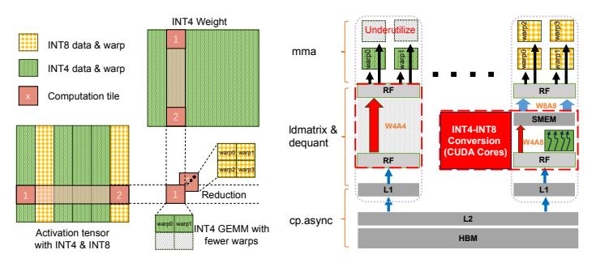
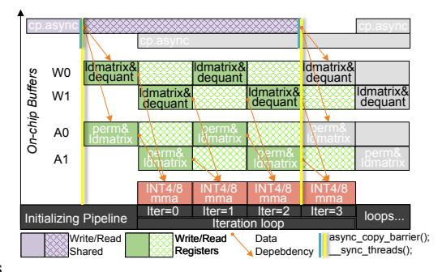

# 4 COMET-W4Ax: Kernel Design

The proposed FMPQ algorithm can significantly reduce the storage and computing costs in LLM inference. However, existing LLM serving systems [14, 40] lack support for direct mixed-precision tensor load-and-store and W4Ax computing. Thus, in this section, we design a highly optimized W4Ax kernel for COMET by tackling two main challenges: (1) the additional overhead of data management with mixed-precision encoding, and (2) load imbalance induced by varied W4A4 and W4A8 GEMM operations.

(a) Tile-based computing with (b) Instruction issued for different SMs mixed-precision. with different precision.

(c) SIMT-enhanced software pipeline.

**Figure 5.** The design overview of the COMET-W4Ax kernel. (a) illustrates the tile-based GEMM computing with mixed-precision encoding. (b) presents the computing procedure when issuing W4A4 and W4A8 GEMM instructions simultaneously. (c) shows the two-level overlapping within SIMT-based software pipeline

#### 4.1 Design Overview

GEMM computations on GPUs are performed at the tile granularity. Figure 5(a) illustrates the tile-based GEMM computing in COMET using mixed-precision values. With FMPQ as the algorithmic enabler, the activation tensor is divided into multiple blocks with different precision settings. For example, the green block is quantized to 4-bit, while the yellow block is 8-bit. A block usually contains multiple tiles, and each tile invokes one thread block (TB) to compute. Additionally, we utilize the reduction operator to accumulate the compute results of different tiles across multiple TBs.

Figure 5(b) shows the behavior of the COMET-W4Ax kernel when computing different precision tiles among different SMs at the same time. During the kernel execution, data must first be loaded from global memory into shared memory and then dispatched to each SM's tensor core for computation. As presented in Section 4.2, we use a software pipeline to concurrently handle data loading and GEMM computation. COMET-W4Ax primarily involves two types of GEMM computations during kernel execution: W4A4 and W4A8. The W4A4 computation can directly leverage the mma instructions, whereas the W4A8 GEMM requires additional data conversion. Specifically, we utilize CUDA cores to efficiently convert INT4 to INT8 data formats and store the converted results directly in shared memory to support W4A8 GEMM. We present the detailed optimization on data conversion in Section 4.3. Additionally, we notice that when issuing GEMM computation instructions for W4A4 and W4A8 to different SMs simultaneously, the computational resources of the tensor cores used for W4A4 are not fully utilized. Despite the INT4 tensor cores offering 2× higher throughput than INT8 tensor cores, the SMs executing W4A4 computations have to wait for other SMs to achieve synchronization, leading to significant idle times and low resource utilization. In Section 4.4, we address this issue using fine-grained SM scheduling.

