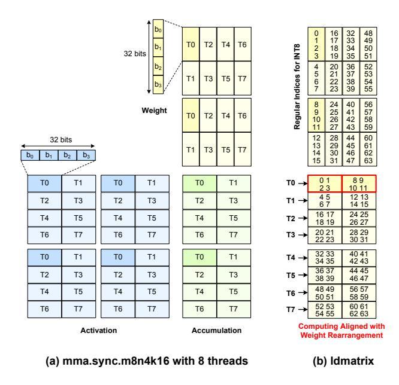
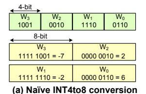
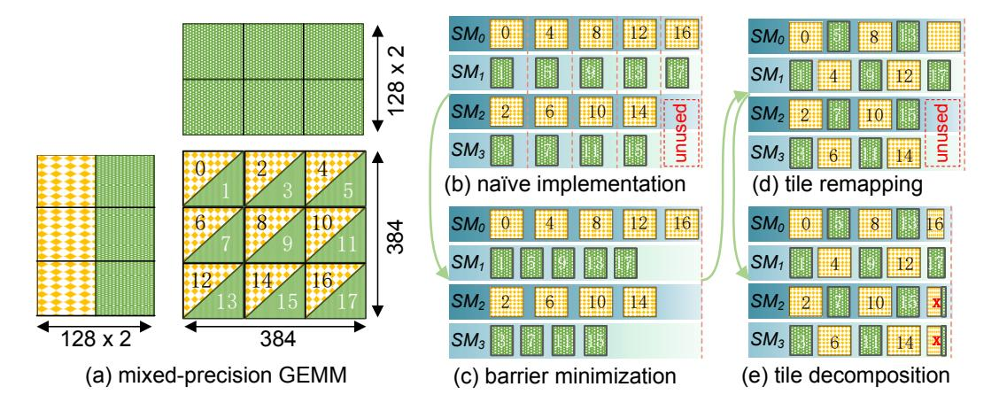

# 4.2 SIMT-enhanced Software Pipeline

Although load-compute pipelining is a common optimization to overlap data loading and computation on GPUs [19, 22], achieving an efficient pipeline for the W4Ax kernel is challenging. Unlike traditional pipelines that rely on tensor cores for data loading and GEMM operations, W4Ax requires additional steps such as dequantization and permutation, which must be handled by CUDA cores. With CUDA cores having much lower throughput than tensor cores (e.g., 78 TFLOPS vs. 1248 TOPS on the A100), these extra steps cause bottlenecks if not effectively overlapped. To address this, we propose a novel SIMT-enhanced software pipeline that mitigates the overhead of these data transformation operations. Our approach integrates multiple processing stages that seamlessly handle these additional transformations, enabling efficient overlap and minimizing performance degradation.

As demonstrated in Figure 5(c), COMET employs a twolevel overlapping strategy to pipeline the memory access and computation stages, enhancing GEMM computation efficiency. First, it hides off-chip memory loads within the data transformation and tensor core computation phases. Second, it employs double buffering within the GPU to conceal the overhead of tensor core computation and data transfer/transformation. Specifically, COMET uses two shared memory buffers to store different data tiles (storing  $A_0$  and  $W_0$  in buffer0, and  $A_1$  and  $W_1$  in buffer1). In iteration 0, the tensor core loads  $A_0$  and  $W_0$  from  $buffer_0$  and performs the corresponding GEMM computation. Depending on the data format loaded, the tensor core invokes different mma instructions (INT4 or INT8). Simultaneously, buffer1 loads the relevant data for  $A_1$  and  $W_1$  from global memory and decides whether permutation or dequantization adjustments are necessary. In iteration 1, the tensor core loads data from buffer1 while buffer0 prefetches data from global memory. In this way, data loading and computation are effectively overlapped across both CUDA and tensor cores.

**Figure 6.** Weight interleave for fast access of W4A8 GEMM. (a) Typical W8A8 GEMM computing kernel. (b) Optimizing the ldmatrix instruction when loading INT4 weight to INT8 GEMM kernel.

Given the complexity of the above pipeline, thread synchronizations and memory access barriers are crucial to ensure correct kernel execution. COMET specifically uses async\_copy\_barrier to guarantee that all necessary data is loaded into shared memory before the next iteration begins, while sync\_threads ensures full thread synchronization at the start of each iteration.

### 4.3 Mixed-precision Data Management

The COMET-W4Ax kernel involves GEMM computations of different precisions, including W4A4 and W4A8. However, the GPU tensor core only supports GEMM computations with data in the same format. Therefore, to optimize the efficiency of W4A8 computations, we need to implement efficient data layout and data conversion strategies.

Weight Interleaving for W4A8 GEMM. Before performing actual computations on the GPU, all operands must be loaded from shared memory into the corresponding registers for each tensor core (ldmatrix). Subsequently, a thread scheduler is used to load the required data into the tensor core for the corresponding GEMM computation (mma). For W4A8 GEMM, the tensor core performs computations using INT8 tensor cores to execute W8A8 computations. The tensor core relies on the mma.m16n8k32 instruction to perform INT8 GEMM computations, involving 32 threads. Given the complexity of the mma execution, Figure 6(a) shows a simplified example of mma.m8n4k16 GEMM computation which only uses 8 threads for INT8 GEMM. As it illustrates, each

| <del>4-bit</del> →          |                |                    |                |  |  |  |  |  |
|-----------------------------|----------------|--------------------|----------------|--|--|--|--|--|
| W 3              | W 1 | W 2     | W 0 |  |  |  |  |  |
| 1001                        | 1110           | 0010               | 0110           |  |  |  |  |  |
| € 8-                        | € 8-bit        |                    |                |  |  |  |  |  |
|                             | W 3 |                    | W 2 |  |  |  |  |  |
| 1001 0000                   | ) = -7 * 16    | 0010 0000 = 2 * 16 |                |  |  |  |  |  |
| V                           | V 1 | W 0     |                |  |  |  |  |  |
| 1110 0000                   | ) = -2 * 16    | 0110 0000 = 6 *16  |                |  |  |  |  |  |
| (b) Fast INT4to8 conversion |                |                    |                |  |  |  |  |  |

**Figure 7.** Fast data conversion from INT4 to INT8.

thread needs to load activation data four times and weight data two times, then conduct the multiply-accumulate (MAC) operations two times for a naïve W8A8 GEMM.

In existing GEMM optimization frameworks, as long as the format of the loaded data matches the computation data format, programmers can directly use the ldmatrix instruction to ensure the loaded data corresponds to the required computation data. However, directly transferring 4-bit weights stored in an 8-bit format to the tensor core can cause shared memory conflicts. These conflicts occur when multiple threads within the same streaming multiprocessor (SM) simultaneously attempt to access the same shared memory address. As shown in Figure 6(a), in a typical W8A8 GEMM kernel, thread T0 loads the first 32 bits, including four values  $b_0 \sim b_3$ , while thread T1 loads the next four values  $b_4 \sim b_7$ . However, as weights are encoded in INT4 format in the W4A8 GEMM case, thread T0 needs to load  $b_0 \sim b_7$ while T1 loads  $b_4 \sim b_{11}$ , resulting in overlap to the same set of values  $b_4 \sim b_7$ . This overlap introduces shared memory conflicts, making data loading both costly and inefficient.

To prevent shared memory conflicts, we rearrange the weight data layout. As shown in Figure 6(b), each thread now loads non-contiguous weights. Specifically, thread T0 uses addresses  $0 \sim 3$  and  $8 \sim 11$  instead of the contiguous range  $0 \sim 7$ . This interleaving strategy not only eliminates shared memory conflicts but also reduces the need for ldmatrix instructions, achieving the required data load with a single instruction instead of the two needed for the INT8 scenario.

Fast INT4to8 Conversion. Since tensor cores only support GEMM computations with data in the same format, it is necessary to convert INT4 data to INT8 before performing GEMM computation. Data format conversion can only be executed on CUDA cores. However, in modern GPUs, there is a significant performance gap between CUDA cores and tensor cores. For example, on the A100, the computational throughput of the INT8 tensor core is 32× higher than that of the CUDA core. Therefore, we must implement a fast INT4 to INT8 data format conversion, making it a stepping stone for performance enhancement rather than a bottleneck.

Suppose we pack four 4-bit weight values into a single 16-bit data unit and store them sequentially. Figure 7a illustrates a naïve strategy for converting INT4 to INT8. In this process, data position adjustments and sign extensions are required. For example, in the conversion of  $W_1$  and  $W_0$ , we first need

to shift the data position of  $W_1$  from bits 4-7 to 8-11, and then perform sign extension on both  $W_0$  and  $W_1$ . Unfortunately, the PTX ISA [39] does not support 4-bit shift operations or the corresponding sign extension operations, requiring us to rely on multiple instructions to complete the data conversion. Overall, each conversion can take up to 10 instructions to complete the necessary processing.

To mitigate the overhead of data position adjustments and sign extension, we propose two novel strategies for fast value conversion. First, we use a location switch to swap the storage positions of certain data. As shown in Figure 7b, we swap the positions of  $W_1$  and  $W_2$ , enabling a rapid conversion to the corresponding 8-bit data format addresses. Additionally, we employ zero extension instead of sign extension for data conversion. Unlike INT4 sign extension which relies on multiple instructions to achieve, zero extension, on the other hand, can be achieved directly with a single zero-padding instruction. During zero extension, each value is effectively multiplied by 16, so we only need to divide by 16 in the scaling parameter to ensure consistency in the computation results. In comparison to naïve conversion, the overhead with our proposed strategy for each value is reduced to just 2 instructions for each conversion. This significantly improves the efficiency of data conversion.

To illustrate compatibility with the A100, we focus primarily on optimizing fast INT4-to-INT8 conversion here. It should be noted that the design is also adaptable for efficient FP4-to-INT8 conversion on next-generation GPUs such as H100. In the FP4 format [30], the sign and mantissa bits remain in their original positions, while the exponent bits are converted using typical shift instructions. For example, an exponent bit pattern of '01' corresponds to  $2^{1-2} = 2^{-1}$ , which translates to a signed right shift on the INT8 data.

#### 4.4 Fine-Grained SM Scheduling

Given our implementation of fine-grained mixed-precision quantization, different blocks in the COMET system may require different precision mma instructions for computation. Figure 8(a) illustrates such a scenario on a hypothetical GPU with four streaming multiprocessor cores. Specifically, we set the block size k=128. Consider a GEMM operation of size  $256\times256\times384$ , which includes two activation blocks in INT4 and INT8 formats, we divide the computation into 18 tiles. The shape of each tile is  $128\times128\times128$ . During the GEMM computation process, every two consecutive tiles compute the W4A8 and W4A4 GEMM kernels respectively.

Although W4A4 GEMM computations achieve higher throughput, they encounter stalls due to inserted barriers. As demonstrated in Figure 8(b), in each iteration,  $SM_1$  and  $SM_3$ , which perform GEMM using the INT4 mma instruction, must wait for  $SM_0$  and  $SM_2$  to complete their INT8 mma computations to maintain synchronization. This requirement significantly reduces SM utilization. A straightforward solution to this under-utilization is to adopt the conventional

heterogeneous task scheduling strategy [25, 26] to distribute different computing tiles globally. However, within the W4Ax kernel, different computing tiles require frequent reductions to maintain correctness, limiting the effectiveness of this scheduling approach. To this end, we propose an error-free barrier minimization technique and develop an efficient tile remapping strategy for fine-grained SM scheduling without compromising synchronization. Additionally, as indicated by the red dotted box, the imbalance between the number of tiles and SMs leaves some SMs idle in the final iteration, further decreasing overall efficiency. To resolve this, we introduce an innovative tile decomposition strategy that promotes load balancing across SMs within a single tile.

Synchronization Barrier Minimization. It is unnecessary to insert synchronization barriers for every mma iteration. We notice that synchronization is only necessary after all iterations are completed, as illustrated in Figure 8(c). Frequent synchronization barriers introduce additional communication overhead between SMs. Therefore, to minimize interaction between SMs, we should reduce the insertion of synchronization barriers as much as possible while ensuring computational correctness. The only synchronization required between SMs is the one that before writing the accumulation data back to memory. However, the performance gains from minimizing synchronization barriers are limited. Specifically, as one can notice, the SMs executing INT4 mma ( $SM_1$  and  $SM_3$ ) always wait for  $SM_0$  and  $SM_2$  to complete their corresponding computations before synchronization. As a result, the utilization of  $SM_1$  and  $SM_3$  remains low compared to  $SM_0$  and  $SM_2$ .

Tile Remapping. Mapping all INT4 and INT8 mma computations to fixed SMs is unnecessary. To address this, we propose an effective tile remapping strategy that adjusts the mapping relationship between tiles and SMs to achieve effective load balancing across different SMs. As illustrated in Figure 8(d), we distribute the INT4 and INT8 mma computations as evenly as possible across all SMs. This ensures that each SM has a balanced computational load, reducing the overall kernel execution time. However, due to the mismatch between the number of divided tiles and the number of SMs, some SM resource wastage still occurs. Fine-grained tuning is required to further enhance the execution efficiency of mixed-precision GEMM.

Tile Decomposition. To achieve better alignment between tile division and SM resources, the most straightforward approach is to implement finer-grained tile division. However, this finer-grained blocking factor is less cache and scratchpad efficient, potentially negating any practical performance improvements. In this paper, we reexamine the binding relationship between tiles and SMs. The tile-to-SM binding is traditionally one-to-one, meaning that at any given time, a tile is mapped to a single SM. However, through effective scheduling, we can achieve a one-to-many

**Figure 8.** The proposed fine-grained SM scheduling. Instead of using a naïve implementation, we further adopt tile remapping and tile decomposition to greatly improve the tensor core utilization.

binding [42] between tiles and SMs. Specifically, we implement a task-stealing mechanism, where idle SMs can steal computational tasks from nearby busy SMs to balance the workload, as illustrated in Figure 8(e). For instance, when  $SM_0$  and  $SM_1$  are processing tile-16 and tile-17 respectively,  $SM_2$  and  $SM_3$  remain idle. During this period,  $SM_2$  and  $SM_3$  load data from shared memory and assist  $SM_0$  and  $SM_1$  with portions of their computations. This mechanism enhances the utilization of SMs and reduces the overall execution time.

