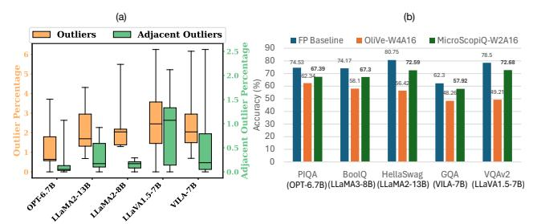

## MicroScopiQ: Accelerating Foundational Models through Outlier-Aware Microscaling Quantization

## [Akshat Ramachandran](https://orcid.org/0009-0000-4763-3321)

Georgia Institute of Technology Atlanta, USA akshat.r@gatech.edu

## [Souvik Kundu](https://orcid.org/0000-0002-3533-9405) Intel Labs

San Diego, USA souvikk.kundu@intel.com

## [Tushar Krishna](https://orcid.org/0000-0001-5738-6942)

Georgia Institute of Technology Atlanta, USA tushar@ece.gatech.edu

## Abstract

Quantization of foundational models (FMs) is significantly more challenging than traditional DNNs due to the emergence of large magnitude values called outliers. Existing outlier-aware algorithmarchitecture co-design techniques either use mixed-precision, retaining outliers at high precision but compromise hardware efficiency, or quantize inliers and outliers at the same precision, improving hardware efficiency at the cost of accuracy. To address this mutual exclusivity, we propose MicroScopiQ, a novel co-design technique that leverages pruning to complement outlier-aware quantization. MicroScopiQ retains outliers at higher precision while pruning a certain fraction of least important weights to distribute the additional outlier bits; ensuring high accuracy, aligned memory and hardware efficiency. We design a high-throughput, low overhead accelerator architecture composed of multi-precision INT processing elements and a network-on-chip called ReCoN that efficiently abstracts the complexity of supporting high-precision outliers. Additionally, unlike prior techniques, MicroScopiQ does not assume any locality of outlier weights, enabling applicability to a broad range of FMs. Extensive experiments across diverse quantization settings demonstrate that MicroScopiQ achieves state-of-the-art quantization accuracy, while delivering up to 3× faster inference and 2× lower energy consumption compared to existing alternatives. Code is available at: [MicroScopiQ-LLM-Quantization.git](https://github.com/georgia-tech-synergy-lab/MicroScopiQ-LLM-Quantization)

## CCS Concepts

• Computer systems organization → Systolic arrays; Neural networks; Data flow architectures; • Networks → NoC.

## Keywords

Foundational Models, Quantization, Pruning, Hardware Accelerator

#### ACM Reference Format:

Akshat Ramachandran, Souvik Kundu, and Tushar Krishna. 2025. Micro-ScopiQ: Accelerating Foundational Models through Outlier-Aware Microscaling Quantization. In Proceedings of the 52nd Annual International Symposium on Computer Architecture (ISCA '25), June 21–25, 2025, Tokyo, Japan. ACM, New York, NY, USA, [17](#page-16-0) pages. <https://doi.org/10.1145/3695053.3730989>


[This work is licensed under a Creative Commons Attribution 4.0 International License.](https://creativecommons.org/licenses/by/4.0) ISCA '25, Tokyo, Japan © 2025 Copyright held by the owner/author(s). ACM ISBN 979-8-4007-1261-6/25/06

<https://doi.org/10.1145/3695053.3730989>

<span id="page-0-0"></span>Table 1: MicroScopiQ vs. prior outlier-aware quantization techniques, categorized into two groups, A [\[68,](#page-15-0) [99\]](#page-16-1), B [\[29\]](#page-14-0).

|                     | Methods       |          |             |  |  |
|---------------------|---------------|----------|-------------|--|--|
| Categories          | Group A       | Group B  | MicroScopiQ |  |  |
| Accuracy            | High          | Low      | High        |  |  |
| Effective bit-width | High (18.17b) | Low (2b) | Low (2.36b) |  |  |
| Flexibility         | No            | No       | Yes         |  |  |
| Aligned memory      | Unaligned     | Aligned  | Aligned     |  |  |
| PE design           | Complex       | Complex  | Simple      |  |  |
| HW overhead         | High          | Moderate | Low         |  |  |

## 1 Introduction

Recent advancements in AI [\[9,](#page-14-1) [27,](#page-14-2) [50,](#page-15-1) [91\]](#page-16-2) have been propelled by a class of models called foundational models (FMs), which encompass large language models (LLMs) and vision-language models (VLMs). FMs leverage billion-scale parameters for improved learning [\[96,](#page-16-3) [101\]](#page-16-4) but impose substantial demands on memory, energy, and compute resources. Recent research has focused on various model compression techniques such as pruning [\[3,](#page-14-3) [24,](#page-14-4) [98\]](#page-16-5) and quantization [\[53,](#page-15-2) [77,](#page-15-3) [81\]](#page-15-4) to reduce memory and computational overhead, enabling efficient FM inference on resource-constrained devices.

Model pruning [\[24\]](#page-14-4) reduces memory footprint by removing ineffectual model parameters, such as individual weights (unstructured) or blocks of weights (structured), and storing sparse tensors in a compressed format [\[36\]](#page-14-5). However, pruning of FMs may be infeasible due to, significant accuracy drops even at low pruning ratios [\[46,](#page-15-5) [97\]](#page-16-6) and potential demand for compute and memory-intensive fine-tuning to regain accuracy. Model quantization, on the other hand, reduces the size of a target model by representing weights and/or activations at low precision [\[40,](#page-14-6) [45,](#page-15-6) [74,](#page-15-7) [77\]](#page-15-3). Recent works on quantization [\[17,](#page-14-7) [29,](#page-14-0) [76\]](#page-15-8) have identified that quantizing LLMs is considerably more challenging than quantizing traditional DNNs [\[51,](#page-15-9) [89\]](#page-16-7) due to the emergence of large magnitude features known as outliers [\[99\]](#page-16-1). These outliers significantly impact model accuracy and require specialized handling [\[29\]](#page-14-0) compared to inliers.

To address the issue of outliers in FMs, recent algorithm/ architecture co-design techniques [\[29,](#page-14-0) [53,](#page-15-2) [81\]](#page-15-4) have proposed different types of outlier-aware quantization. These techniques can be broadly categorized based on their outlier handling approach: A Maintaining outliers at higher precision compared to the inliers, or B Quantizing outliers at the same precision as inliers while using different data formats or scaling factors for outliers.

Techniques in group A, such as OWQ [\[48\]](#page-15-10), SpQR [\[18\]](#page-14-8), SDQ [\[37\]](#page-14-9) (algorithm) and GOBO [\[99\]](#page-16-1), OLAccel [\[68\]](#page-15-0)(architecture co-design) exhibit low accuracy degradation. This is because, they typically store outliers at high precision separated from lower precision inliers. However, these techniques result in, (a) low compression factor with high *effective bit-width* (EBW<sup>1</sup>) and (b) inefficient hardware and unaligned memory access.

On the other hand, techniques in group **(b)**, such as AWQ [53] (algorithm) and OliVe [29] (architecture co-design) quantize outliers at the same precision as inliers following different strategies. AWQ tries to identify a separate outlier-specific scale factor via channel-wise scaling. OliVe uses the "flint" data format [30] for inliers and "abfloat" [29] for outliers, both at 4-bit precision. These techniques mitigate the unaligned memory access while providing high compression. However, they suffer from significant accuracy degradation, particularly at ultra-low bit widths. This may be attributed to the reduced representational range available to outliers at ultra low-precision. Additionally, these methods [29] rely on a specific kind of locality of presence for outliers, that might not be true for all FMs, as we shall demonstrate in this work (§3.1).

Based on the shortcomings of existing solutions discussed above, we identify that assignment of higher bit-width for outliers is essential for good accuracy while for aligned memory and hardware efficiency a consistent bit-budget and data type per tensor element is desired. Here, by consistency we mean that on average each scalar within a tensor should be represented by a fixed bit-width of a particular data-type. However, these demands are conflicting. **Contributions.** To provide a unified solution, we investigate on a fundamental question:

**Question:** Can pruning be effectively leveraged to complement outlier-aware quantization in achieving high accuracy while maintaining hardware efficiency?

Towards achieving this, we present a novel co-design technique for the post-training quantization (PTQ) of FMs, namely **Micro-ScopiQ**. Our approach effectively leverages pruning with outlier aware quantization to achieve both memory alignment and improved accuracy. To effectively perform this for a layer, we quantize outliers at twice the precision of inliers and prune the least important weights based on the Hessian information. We then redistribute the additional bits of the outlier weights in these pruned locations. This ensures memory alignment while allowing outlier weights to have higher precision. Additionally, to reduce error we use the recently proposed MicroScaling (MX) FP data format [16, 78] to quantize outlier weights as opposed to MX-INT inlier quantization. While prior work such as SDQ [37] also combined pruning and quantization, it contrasts with our approach in its limited outlier flexibility, lower compression factor, and unaligned memory access.

To efficiently support outliers in a **different** format with **different** bits at **different** locations in hardware, we present an intelligent NoC architecture called, <u>Re</u>distribution and <u>Co</u>ordination <u>NoC</u> (ReCoN). It offers minimal overhead and high throughput outlier processing and reorganization. We then present an accelerator that leverages ReCoN with a simple, homogeneous INT-PE array. Additionally, we extend the accelerator to be generic enough to support multiple bit-precision (2/4-bit operations). As summarized in Table 1, MicroScopiQ blends the advantages of group **A** and **B** techniques while mitigating their specific drawbacks.

Our key contributions can be summarized as follows:

• We present MicroScopiQ, a PTQ framework to efficiently integrate pruning with outlier-aware quantization (§4).

<span id="page-1-1"></span>

Figure 1: Depiction of MX-FP data format with level-1 scale factor and level-2 microExponent  $(\mu X)$ , with  $k_1$  and  $k_2$  the group sizes over which these two factors are shared.

- To effectively deploy MicroScopiQ in a systolic array architecture we present a novel architecture supporting multi-precision, homogeneous PEs with a low-overhead NoC architecture (§5).
- To our best knowledge, MicroScopiQ is the first co-design technique, to push the limits of PTQ compression for **both** LLMs and VLMs with an EBW of ~2.36-bits for weights; achieving SoTA quantized model accuracy across different weight/weight-activation quantization settings. Moreover, it demonstrates up to 3× improvement in performance-per-unit-area (*TOPS/mm*<sup>2</sup>) and up to 35% energy reduction compared to existing architectures (§7).

## 2 Background

## 2.1 Model Quantization

A typical quantization [51, 74, 76] process involves two steps: establishing quantization parameters given the quantization data format  $(\tau)$  and bit-width (b), and mapping the high-precision tensor to the quantized representation. For a typical symmetric quantization [103] (zero-point is 0) of a tensor X, the *scale factor* (s) is given by,

<span id="page-1-2"></span>
$$s = \frac{max(X)}{max_{\tau}^{b}} \tag{1}$$

 $max_{\tau}^{b}$  is the maximum representable value of a data format [74]. For *b*-bit INT quantization,  $max_{INT}^{b} = 2^{b-1} - 1$ . After determining the quantization parameters, the quantized tensor is given by [74],

<span id="page-1-3"></span>
$$Q(X, s, b) = clip(\left\lfloor \frac{X}{s} \right\rfloor, min_{\tau}^{b}, max_{\tau}^{b})$$
 (2)

In model quantization, the quantization parameters can be shared at different granularity for different accuracy-overhead trade-offs. In increasing order of overheads, we have **per-tensor** quantization, wherein the scale factor is shared among all tensor elements. In **per-channel** quantization, the scale factor is shared per row/column of a tensor. Finally, in **group** quantization, the parameters are shared at a finer granularity between groups of k (64, 128 etc.) elements in a row or column. These groups are formed by dividing channels into multiple non-overlapping contiguous blocks. *In this paper, we adopt MX-INT and MX-FP quantization for inliers and outliers, respectively.* 

## 2.2 Microscaling Data Format

The MX data format proposed by prior works [16, 78], is standardized by the Open Compute Project [70] with support from Microsoft, Intel, NVIDIA and others. As shown in Figure 1, MX is a variant of block data representation (BDR) [16] that defines a format to represent a group of values collectively using shared scale factors. It leverages multi-level, power-of-two scaling, at fine- (level-1,  $k_1$ ) and ultra-fine (level-2,  $k_2$ ) granularity [15, 21]. The MX data format is characterized by four components: i) scale factors (level-1, 2), ii)

<span id="page-1-0"></span> $<sup>^{1}\</sup>mathrm{The}$  average number of bits used to represent each quantized parameter of a model.

<span id="page-2-2"></span>

Figure 2: (a) Layer-wise distribution of outliers and adjacent outliers as a percentage of total number of weights, (b) Quantization accuracy comparison between OliVe-W4A16 and MicroScopiQ-W2A16 on various benchmarks.

data type  $(\tau)$ , iii) bit-width (b) and iv) group sizes  $(k_1,k_2)$ . In this paper we denote an MX-FP format as MX-FP- $b_{k_1,k_2}$ . In this work, we adopt the version of the MX-FP data format proposed in [78], employing multi-level scaling. The level-1 scale factor for MX-FP is computed following Equation 1. Conversely, for level-2 scale factor, we *identify* that MX-FP leverages the sharing of exponent field of FP values [93] (referred as  $\mu X$  in Figure 1). We show in §4.2 that by taking advantage of this insight i.e., the concept of shared  $\mu X$ , we are able to represent FP-outliers in INT format, thereby, enabling the design of simple, homogeneous INT-based PEs. For inliers, we employ MX-INT- $b_{k_1}$  with a single level of scale factor following [70]. This is because, INT format does not possess an exponent field, thereby, a level-2 scale factor similar to MX-FP is not applicable. For simplified understanding, MX-INT- $b_{k_1}$  inlier quantization can be viewed as analogous to INT group quantization utilizing an E8M0 scale factor.

## 3 Motivation

#### <span id="page-2-0"></span>3.1 Limitations of existing techniques

In Table 1, we compare candidate proposals from group **3**: GOBO [99] and group **3**: OliVe [29] across various metrics. GOBO is able to achieve high accuracy by retaining outliers at full-precision. It stores outliers separately from low-precision inliers by using sparse representations with the associated outlier indices (see Figure 3(b)). By retaining outliers at full-precision, GOBO results in high EBW. Moreover, the compressed sparse storage and multiple precisions results in unaligned and random memory accesses [29], significantly impacting inference latency. Furthermore, GOBO's outlier handling is hardware inefficient, requiring complex PEs. Similarly, a recent work [37] proposed to decompose a vector of weights into two separate inlier and outlier vectors each quantized in different precisions with outliers at a higher precision.

OliVe [29] proposes a scheme to ensure aligned memory access by quantizing inliers and outliers at the same precision (low EBW), but using different data formats. To enable differentiation between the inlier and outlier formats, it prunes the value adjacent to the outlier for use as an identifier (see Figure 3(c)). However, OliVe results in significant accuracy degradation, especially at low precision (see Figure 2(b)), due to: 1) sacrificing a number encoding from inliers for exclusive use as an identifier, reducing the number of representable values in the quantized range, and 2) the rigid assumption of outlier locality—that outliers are never adjacent to each other and only inliers are almost always adjacent to outliers (see §3.2), leading to unintended outlier pruning. Furthermore, OliVe requires

a fairly complex PE design incurring significant encoding/decoding overheads to convert the different formats into a unified processing format (exponent-integer pair). In this paper, we show that despite quantizing outliers at higher-precision and in a different format, we ensure aligned memory access, simple PE design and minimal hardware overhead.

## <span id="page-2-3"></span>3.2 Adjacent Outliers Matter

Similar to prior works [29, 68], we leverage the  $3\sigma$  rule [71] to categorize weights as outliers. We visually demonstrate the distribution of outliers and adjacent outliers 2 as a percentage of the total number of weights in a layer across different FMs in Figure 2(a). As the orange box-plot shows, outliers depict a maximum percentage of ~5.1%. Outliers are prevalent in FMs, and preserving their values is crucial for maintaining quantized model accuracy. Importantly, from the green box-plots, we observe that modern FMs on average possess > 0.5% adjacent outliers per layer, with some FM layers showing peaks of > 2%. This is in stark contrast to the models evaluated by OliVe, such as BERT [19] and OPT [102] which have < 0.04% adjacent outliers (two orders of magnitude lower than FMs like LLaMA3 and LlaVa). This indicates that while pruning values adjacent to outliers could have been ideal for models like BERT [19], it is sub-optimal for most modern FMs as it removes crucial outlier values, leading to higher accuracy degradation. This is evident from Figure 2(b) where OliVe has significant accuracy degradation at 4-bit quantization due to its assumption on outlier locality. Unlike OliVe, MicroScopiQ does not naively prune adjacent values; instead it leverages the Hessian information [25] to identify the least important values to prune, ensuring outlier preservation. This directly translates to high quantized model accuracy and MicroScopiQ at 2-bit consistently outperforms OliVe across different FMs.

#### 3.3 Outlier Precision and Data Format

The ability of group **(A)** techniques like GOBO [99] to achieve high quantized model accuracy even at extreme quantization levels of inliers (< 4-bits) is due to retaining outliers at higher precision. This is particularly crucial at ultra-low bit width quantization because, if inliers and outliers are to be quantized to the same precision, there will be higher outlier quantization error due to the reduced representational range. We demonstrate this effect on the MicroScopiQ quantized FM accuracy in Table 7 wherein the quantized FM has poor performance when inliers and outliers are at 2-bits compared to outliers at 4-bits. Furthermore, evidence from recent work [94] demonstrates that FP-based formats for LLMs results in superior quantization performance compared to INTs. To validate this, we compare MX-INT v/s MX-FP inlier and outlier quantization in Table 7. Evidently using MX-FP instead of MX-INT for outliers results in better performance. This is due to the higher dynamic range of FPs, which is particularly beneficial at extreme quantization levels. In this work, we quantize outliers at a higher precision  $(2\times)$  compared to inliers, using MX-FP for outliers and MX-INT for inliers.

#### <span id="page-2-1"></span>4 MicroScopiQ Quantization Methodology

We present an overview of MicroScopiQ quantization in Figure 3(a) and detail it in Algorithm 1. MicroScopiQ supports various group

<span id="page-2-4"></span> $<sup>^2\</sup>mathrm{We}$  define adjacent outliers as two contiguous outliers along the dot-product dimension (see row 2 of the LLM weight matrix in the center of Figure 3).

<span id="page-3-1"></span>

Figure 3: (a) Overview of the proposed MicroScopiQ quantization framework depicting methodology of inlier and outlier quantization and redistribution of outlier bits for a sample LLM weight matrix. Comparison against prior quantization frameworks (b) GOBO, and (c) OliVe.

size granularities and any inlier and outlier ( $2 \times$  inliers) data precision. For simplicity, we explain with inlier and outlier precision of 2/4- and 4/8-bit and group sizes of 128 for inliers and 8 for outliers.

#### 4.1 Preliminaries

The MicroScopiQ quantization framework models the layer-wise post-training quantization of FMs by partitioning each layer into multiple rows and quantizing each row at a time. Concretely, for a given input calibration dataset  $\mathbb{X}$ , at layer l the objective is to find a quantized set of weights  $\mathbb{Q} \in \mathcal{R}^{d_{row} \times d_{col}}$  that minimizes the sum of squared errors over all rows of the layer compared to the full-precision weights  $\mathbb{W} \in \mathcal{R}^{d_{row} \times d_{col}}$ . This can be formulated as,

<span id="page-3-3"></span>
$$\mathbf{argmin}_{\mathbb{Q}} \sum_{i=1}^{d_{row}} ||\mathbb{W}_{i,:}\mathbb{X} - \mathbb{Q}_{i,:}\mathbb{X}||_{2}^{2}$$
 (3)

We evaluate the second order derivative of Equation 3, namely the Hessian [32, 47] through Taylor series expansion [32]. Note, the Hessian is the same for all rows due to its dependence only on input data and is given as,  $\mathbb{H} = 2\mathbb{X}\mathbb{X}^T$ . Its inverse is,  $\mathbb{H}^{-1} = (2\mathbb{X}\mathbb{X}^T + \lambda\mathbb{I})^{-1}$ . We leverage the Hessian information to identify weights with small "saliencies" for pruning (L17 in Algo. 1). The number of inliers to prune is determined by the number of outliers, as detailed later.

To improve quantization performance, we take inspiration from [25] and adjust the weights of unquantized rows to minimize the

#### Algorithm 1: MicroScopiQ Quantization Framework

```
\textbf{Input} : \mathbb{W} \in \mathcal{R}^{d_{row} \times d_{col}}, \text{ calibration data } \mathbb{X}, \mathbb{H}^{-1} = (2\mathbb{X}\mathbb{X}^T + \lambda \mathbb{I})^{-1}, \text{ row block}
                  (rB), macro-block (MaB) B_M, and micro-block (\muB) B_\mu
     \boxed{Output:}Quantized weight \mathbb{Q} \in \mathcal{R}^{d_{row} \times d_{col}}, perm (Permutation list)
     # Iterate over row blocks
     for i = 0, rB, 2rB, \cdots d_{col} - rB do
             for j = i, i + 1, \cdots
                                        , i + rB - 1 do
                     # Step 1.0: Divide each row into non-overlapping Macro-Blocks
                     for \mathbb{W}_{j,MaB} \in \mathbb{W}_{j,:} do
                             # Step 1.1: Separate inlier and outlier in each Macro-Block
                             \mathbb{W}^{in}, \mathbb{W}^{out} = \text{sep\_in\_out}(\mathbb{W}_{j,MaB})
                             # Step 1.2: Quantize Inliers to lower precision
  8
                             \mathbb{Q}^{in}, I_{sf} = \texttt{InlierQuantization}(\mathbb{W}^{in})
                            for \mathbb{W}_{j,\mu B} \in \mathbb{W}_{j,MaB} do

# Step 2.0: Count Number of Outliers in a Micro-Block
10
11
                                     n = \min(B_{\mu}/2, \text{NumOutliers}(\mathbb{W}_{\mu B}^{out}))
12
13
                                     # Step 2.1: Initialize Inlier Index List
                                     M \leftarrow \{\}
14
                                     # Step 2.2: Identify n least Important Inlier Position
15
                                     for n iterations do
16
                                            p = \operatorname{argmin}_{p \in \mathbb{W}_{\mu B}^{in}} w_p^2/[\mathbb{H}^{-1}]_{pp}
 17
 18
                                             # Step 2.3: Prune least important Inliers
                                             w_p \leftarrow 0
# Step 2.4: Update M with the location of w_t
 19
 20
                                            M \leftarrow M + \{p\}
21
22
                                     end
                                     # Step 2.5: Quantize Outliers to higher precision
23
                                     \mathbb{Q}^{out}, O_{sf} = \text{OutlierQuant}(\mathbb{W}_{\mu B}^{out}, I_{sf})
24
                                     # Step 3.0: Distribute LSB Outlier Bits to Sparse Inlier Indices
25
                                    \mathsf{perm} \leftarrow \mathsf{DistributeOutlierBits}(\mathbb{Q}^{out}, \mathit{M})
26
27
                            \mathbb{Q}_{j,MaB} = \mathbb{Q}^{in} + \mathbb{O}^{out}
28
29
                     # Step 3.1: Quantization Error
                     \mathbb{E}_{(j-i),:}=(\mathbb{W}_{j,:}-\mathbb{Q}_{j,:})/[\mathbb{H}^{-1}]_{jj}
31
32
                     # Step 3.2: Update weights in rB to compensate quantization error
33
                     W_{j:(i+rB),:} = W_{j:(i+rB),:} - \mathbb{E}_{(j-i),:} \cdot \mathbb{H}_{j:(i+rB),j}^{-1}
34
35
              # Step 3.3: Update remaining weights after a row block is quantized
              \mathbb{W}_{(i+rB):,:} = \mathbb{W}_{(i+rB):,:} - \mathbb{E} \cdot \mathbb{H}^{-1}_{(i+rB):,i:(i+rB)}
```

net error while quantizing a particular row of weights. The associated equation (L31 of Algo. 1) for weight update using the Hessian is derived by solving the Lagrangian of Equation 3. However, updating all remaining rows each time a row is quantized incurs significant compute-overhead, making this intractable for billion-scale FMs. Therefore, as pointed out in [25], we partition the rows into non-overlapping contiguous row-blocks (rB) of size 128 rows and localize the updates of unquantized rows within each rB. We only update the rows outside a rB (L36 in Algo. 1) once all the elements of the current block are quantized. This minimizes the number of individual updates by grouping updates together per rB and producing an order of magnitude speedup.

#### <span id="page-3-0"></span>4.2 Inlier and Outlier Weight Quantization

In **Step 1** (Figure 3(a), Algorithm 1), each row to be quantized is first divided into multiple non overlapping contiguous **macroblocks** (**MaBs**) of size  $B_M = 128$ . All inliers are quantized within a MaB and share the scale factor. Each MaB is then subdivided into multiple non-overlapping contiguous **micro-blocks** ( $\mu$ **Bs**) of size  $B_{\mu} = 8$  with sixteen  $\mu$ Bs forming a MaB. The outliers present in each  $\mu$ B shares same scale(s). As depicted in Figure 3(a), **Step 1**, the quantization process begins by first identifying inliers and outliers in each MaB by using the  $3\sigma$  rule. A shared 8-bit power-of-two scale factor ( $2^{I_{sf}}$ ), following Equation 1 is calculated for all inliers

in a MaB and the inliers are quantized to 2-bit or 4-bit, resulting in MX-INT- $(2/4)_{128}$  quantization. Interestingly, we observe that the inlier scale factor in each MaB is always a negative power of two for all FMs under consideration. We leverage this observation to reduce outlier magnitude, by multiplying all outlier values in a MaB with the inlier scale factor  $(2^{I_{sf}})$  (this can also be perceived as division by  $2^{-I_{sf}}$ , for conformity with Equation 2). This preprocessing helps make outlier quantization easier, by pre-reducing its dynamic range before the actual outlier quantization.

Unlike inliers, outliers are quantized per  $\mu$ B, to reduce quantization error due to shared scaling over a larger group size (see §7). After identifying outliers present in a  $\mu$ B, we compute a shared 8-bit MXScale that is calculated by concatenating the level-1 power-of-two scale factor ( $2^{O_{sf}^{l_1}}$ ) and level-2 microExponent ( $\mu$ X). The level-1 scale factor is calculated by following Equation 1 to obtain 7 or 5-bit MSBs of MXScale depending on size of  $\mu$ X being 1 or 3-bit of the LSBs-corresponds to exponent size of the FP format (depicted in Step 2 in Figure 3(a)). The outliers in a  $\mu$ B are scaled by  $(2^{O_{sf}^{l_1}})$ 

in **Step 2** in Figure 3(a)). The outliers in a  $\mu$ B are scaled by  $(2^{O_{sf}^{1}})$ , following Equation 2 and then quantized to either e1m2/e3m4 FP-format [78] for b=4 or 8-bit, respectively. Post quantization of outliers, the level-two scale factor or the  $\mu X$  is obtained by extracting the common exponent among all outliers in a  $\mu$ B. This process results in a MX-FP- $b_{8,8}$  outlier quantization. The final outlier scale factor is  $2^{O_{sf}}$  where,  $O_{sf}$  is expressed as  $O_{sf} = O_{sf}^{I_1} + \mu X - I_{sf}$ . The term  $I_{sf}$  in the final outlier scale factor accounts for multiplication by  $2^{I_{sf}}$  (or division by the inverse) during outlier pre-processing.

