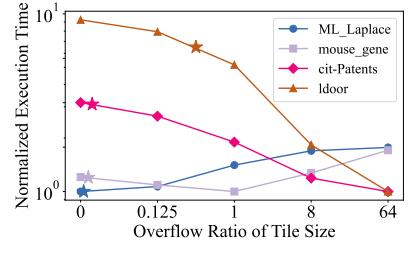
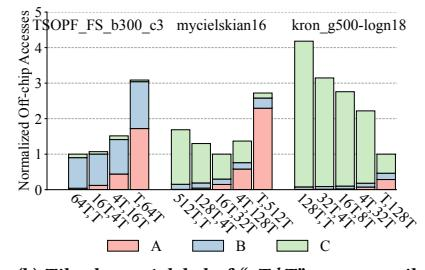
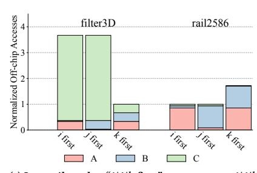

# 2.3 Tiling in Sparse Accelerators

To further improve data reuse, tiling becomes a promising technique for sparse accelerators. A tile is a logically continuous sub-space of the full iteration space (I, J, K), representing a subset of the overall computations. The tile shape is defined as its coordinate spread of each dimension, denoted as  $T_i, T_j, T_k$ . The tile size is the number of non-zero points in it. By restricting the tile size to be no larger than the on-chip buffer capacity, we can maximize data reuse within the tile before moving to the next tile. On the other hand, tiling also incurs repetitive accesses to other tensors and/or additional partial result merging cost, and complicates data access patterns. Notably, with most sparse formats, the fibers of a dimension would need to be segmented according to the tile shape, and these *fiber segments* further increase the metadata overheads.

Tiling for sparse tensors typically follows two categories: *coordinate* tiling and *position* tiling [25, 38]. Coordinate tiling divides data with the same coordinate spans along each dimension, which simplifies coordinate matching during the computation as two tiles either have exactly the same coordinate range or do not overlap along a certain dimension. However, the tiles may have different sizes due to the varying local sparsity, causing potential buffer underutilization or overflow. On the other hand, position tiling divides data into tiles with the same size based on the actual data amounts in the specific format, but the resultant unaligned coordinate ranges between tiles are quite challenging to manage.

State-of-the-art tiling techniques for sparse accelerators. Currently, most existing designs adopt coordinate tiling to simplify hardware control. At the same time, they also recognize the inefficiency of mismatched data size and buffer capacity, and introduce more dynamic and flexible tiling strategies [19, 25, 38]. For example, Tailors [38] adopted a speculative strategy to determine the tile size, by pre-sampling the data sparsity and allowing a small portion of tiles (e.g., 10%) to overbook the buffer capacity. On the other hand, DRT [25] and HARP [19] both used dynamic approaches, adjusting the tile size at runtime to fully utilize the buffer even with varying data sparsity characteristics.

Table 2 summarizes the details of these three designs from various perspectives. First, the tile size of Tailors is only statically determined with 10% overbooking, while both DRT and HARP dynamically decide the tile size to fully utilize the buffer capacity based on the current local data sparsity. To construct the tile with a concrete shape along each dimension, Tailors prioritizes expanding along the contracted dimension k in order to maximize the reuse for tensor C, followed by j and i. DRT employs an online greedy algorithm to select the tile shape. It iteratively grows each dimension in the order of *k*, *i*, *j*, until the buffer is fully occupied. Consequently, the tile shape in DRT resembles a cube with similar spans along all dimensions. To facilitate such flexible tiling across all dimensions under a compressed format, DRT needs to first preprocess the original tensor into micro-tiles (of  $32 \times 32$ ), as the smallest unit for tiling. HARP, in contrast, focuses on tiling along i only, which is specialized for its OP dataflow and aims to improve data reuse of tensor C. It segments dimension i into small pseudo-tiles, and dynamically merges them into super-tiles during execution, based on specific buffer usage statistics.

For the processing order between tiles, Tailors goes along dimension j first, while DRT follows ExTensor [12] to go along i first. HARP also goes along i first for inter-tile execution. Finally, these three designs are also equipped with separate dedicated buffers with different capacities for different tensors. DRT and HARP require the tensor tiles to be fully buffered in the corresponding buffers (buffering), while Tailors could additionally support streaming data in and out of a small space when the tiles overflow (streaming).

## 3 Motivation

Despite the above recent efforts making tiling more efficient on sparse accelerators [19, 25, 38], they are still limited in the abilities to fully adapt to various complicated sparse data distributions. In this section, we discuss several critical aspects of sparse tensor tiling that exhibit drastically different optimal decisions in various scenarios, motivating even more flexible approaches.

## 3.1 Tile Parameters

The most critical parameters in tiling are the tile size (number of non-zero points) and shape (coordinate spread along each dimension). Making a tile small enough to fit in the on-chip buffer improves data locality of the current tensor, but it also results in more tiles, requiring repetitive fetches of the other tensors irrelevant to the tiling dimension to multiply with each of these tiles. Figure 1a illustrates the performance impact of tile sizes with different sparse matrices from SuiteSparse [7] doing self-multiplication using the Gust dataflow. We use an on-chip buffer of 16 MB. The horizontal axis lists different tile sizes as the overflow ratios compared to the buffer capacity, e.g., "1" means the tile size is 2× larger than the tile size with no overflow. As shown in the figure, ML\_Laplace achieves the best performance at the tile size without overflow; mouse\_gene excels at a tile size of 2x; and 1door and cit-Patents prefer much larger tile sizes close to no tiling. These different behaviors are due to the diverse data patterns. For example, cit-Patents is quite sparse, with only 4 non-zeros per column on average, indicating limited data reuse opportunities. If applied a large tiling factor beyond 4, the repetitive access cost would outweigh the reuse benefit.

|              | Decision            | Tile size                  | Tile shape                               | Inter-tile order   | <b>Buffer allocation</b>                                                               |
|--------------|---------------------|----------------------------|------------------------------------------|--------------------|----------------------------------------------------------------------------------------|
| Tailors [38] | Static              | Fit 90% tiles              | $k \to j \to i$                          | <i>j</i> first     | Unspecified ratios among A, B, C                                                       |
| DRT [25]     | Dynamic             | Exact fit                  | Iteratively $k, i, j$                    | i first            | 5%, 45%, 50% for <i>A</i> , <i>B</i> , <i>C</i>                                        |
| HARP [19]    | Dynamic             | Exact fit                  | i                                        | i first            | 4.5%, 91%, 4.5% for A, B, C                                                            |
| HYTE (ours)  | Static + dynamic | May overflow if beneficial | Static flexible shaping + dynamic tuning | Flexibly scheduled | Flexibly partitioned among <i>A</i> , <i>B</i> , <i>C</i> + data/metadata coordination |

Table 2: Tiling scheme comparison between state-of-the-art designs and ours.

(a) Tile size. Shown as the overflow ratio compared to the buffer capacity. Stars are Tailors' choices.

(b) Tile shape. A label of "aT,bT" means to tile dimension k by a factor of a and tile j by b.

(c) Inter-tile order. "i/j/k first" means to put i/j/k at the innermost loop of the inter-tile level.

Figure 1: Impacts of various tiling configuration parameters when processing SpMSpM  $C = A \times B$  on different sparse matrices.

The star mark on each line shows the choice of Tailors [38] with 10% overbook tiles, which is suboptimal for most matrices shown.

Takeaway 1 (tile size): Using tile sizes that match the buffer capacity or follow a fixed overflow ratio is not always optimal, e.g., when repetitive accesses outweigh tiling reuse.

Furthermore, even with the same tile size, the concrete shape of the tile may also significantly affect performance. Figure 1b shows the off-chip memory access amounts with different tile shapes while the tile's coordinate size (product of the two dimensions) remains unchanged. In the almost-diagonal matrix TSOPF\_FS\_b300\_c3, the generated C is relatively small, and thus tiling k and fetching k repetitively would be the best. However in the power-law graph kron\_g500-logn18, k dominates the accesses, favoring only tiling k and fetching k repetitively. Finally, the structured mycielskian16 matrix resides in between, where the best performance is achieved by balancing the tile shape along both dimensions.

Takeaway 2 (tile shape): With the same tile size, the best coordinate spread in each dimension would depend on the specific tensor data patterns.

## 3.2 Control Schemes

Prior designs have used either purely static [38] or purely dynamic [19, 25] approaches to determine their tile sizes and shapes, each with certain drawbacks. Purely static approaches can only optimize for the average case with heuristic parameter choices. For example, the 10% overbooked tiles in Tailors [38] may not always lead to the best performance, as shown in Figure 1a. Purely dynamic tiling, on the other hand, would either require significant metadata overheads to make the data format suitable for tiling (e.g., microtiles [25]), or limit to simple tiling schemes that lose efficiency [19], as discussed in Section 3.1.

Takeaway 3 (static vs. dynamic): Purely static tiling is less optimal while purely dynamic tiling is too expensive. A combination of the two may be desired.

Another critical control scheme is the inter-tile execution order, which affects the reuse of the fetched tiles. Note that this inter-tile order differs from the intra-tile order. The latter is usually designated by the fixed dataflow implemented by a specific hardware chip (Table 1) for computations within a single tile, while the former is across different tiles. Again because of the diverse sizes and sparsity degrees, in different cases we would need to prioritize the reuse of one specific tensor over the others, thus requiring support of different inter-tile orders. In Figure 1c, both matrices use the Gust dataflow and are evenly tiled along each dimension. However, reusing *C* by putting the irrelevant *k* dimension at the innermost (i.e., *k* first) is more critical in the matrix filter 3D, but less beneficial for rail 12586.

Takeaway 4 (inter-tile order): The hardware should support configurable inter-tile orders that could adapt to different tensor data patterns.

