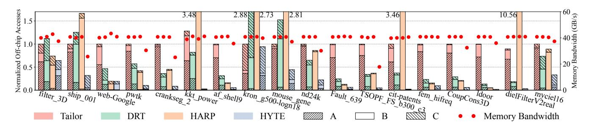

# 7 Methodology

We compare HYTE with three previous sparse accelerators that support tiling, namely Tailors [38], DRT [25], and HARP [19]. The characteristics of these four designs are summarized in Table 2. All the designs use the same default hardware configuration, with 32 MAC PEs running at 1 GHz, and a 4 MB global SRAM buffer realized in 32 banks. The off-chip DRAM uses four DDR4 channels with 68 GB/s in total. These configurations mostly follow the prior works [20, 33, 40]. We later assess performance with different PE counts and buffer capacities. We assume the PE array follows the Gust dataflow by default, but also study the performance under other dataflow schemes like IP and OP.

We implement a cycle-accurate simulator in C++ to measure the performance of the above designs when processing different matrix data. Our simulator accurately captures the accesses of individual non-zero matrix elements, in order to reflect the actual

Figure 6: Performance comparison among Tailors, DRT, HARP, HYTE (with and without offline time), and static optimal, for SpMSpM with Gust dataflow. The numbers above the bars are the absolute execution time of HYTE in milliseconds.

Figure 7: Memory access breakdown (bars, left y axis) and memory bandwidth (dots, right y axis) for Tailors, DRT, HARP, and HYTE, for SpMSpM with Gust dataflow.

Table 3: Area breakdown of HYTE.

| Component                | Area (mm 2 ) | Area % |
|--------------------------|-------------------------|--------|
| Global tiling controller | 0.08                    | 0.6%   |
| All tensor accessors     | 0.43                    | 3.1%   |
| Global SRAM buffer       | 10.1                    | 73.3%  |
| All PEs                  | 2.8                     | 20.3%  |
| Interconnects            | 0.37                    | 2.7%   |
| Total                    | 13.78                   | 100.0% |

influence of the input data pattern. This is more detailed than previous models [37]. In particular, various key components like the index intersector, index selector, and partial sum merger for the IP, Gust, and OP dataflow schemes are explicitly modeled. The real input sparse matrix is fed to them to determine which data elements are actually accessed and processed in the PEs, and thus affect the compute and memory timing results. The simulator is open-sourced at https://github.com/tsinghua-ideal/HYTE-sim.

In addition, we implement the RTL designs of the key components introduced by HYTE, including the global tiling controller and the tensor accessors. We synthesize them using Synopsys DC on the TSMC 28 nm technology. We use CACTI 7.0 [5] to model the SRAM buffers. The area numbers are listed in Table 3. We see that HYTE incurs minor area cost of 3.7%, where the chip area is dominated by the large SRAM buffer.

Our static scheduler, including the sampling process, runs on an Intel Xeon Gold 6248R processor at 3 GHz, compiled with g++ -03.

We select real-world sparse matrices from the SuiteSparse Matrix Collection [7] as our datasets. These matrices are diverse, with varying densities (from 0.0006% to 0.356%), non-zero sizes (from 1.5M to 25M), and sparsity patterns. Tiling is irrelevant for smaller matrices with our 4MB buffer. For better comparison, we include several matrices used in the baseline papers, e.g., filter3D, web-Google, pwtk, kkt\_power, kron\_g500-logn18, cit-Patents. We mainly evaluate the performance of SpMSpM with self-multiplication of square matrices, i.e.,  $S \times S$ , following prior studies. In addition, we also test several other irregular sparse kernels, including (1)  $F^T \times F$  with a tall-skinny sparse matrix F; (2)  $F \times D$  where D is a random dense matrix, i.e., SpMM; (3)  $F^T \times S$  as one iteration of multi-source breadth-first search (MS-BFS) in graph analytics [1, 6], where S is the graph and F represents the initial source nodes [25].

