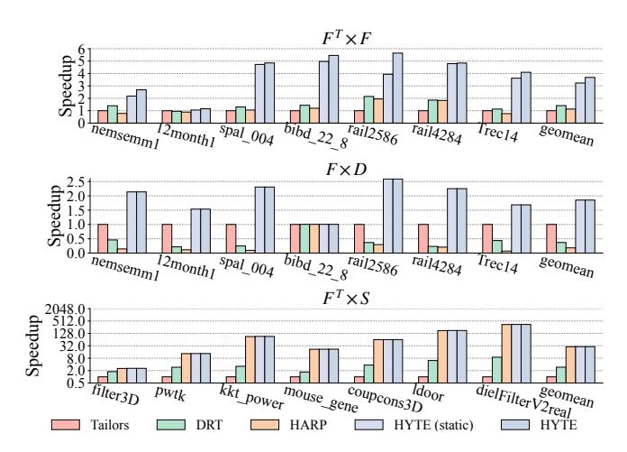
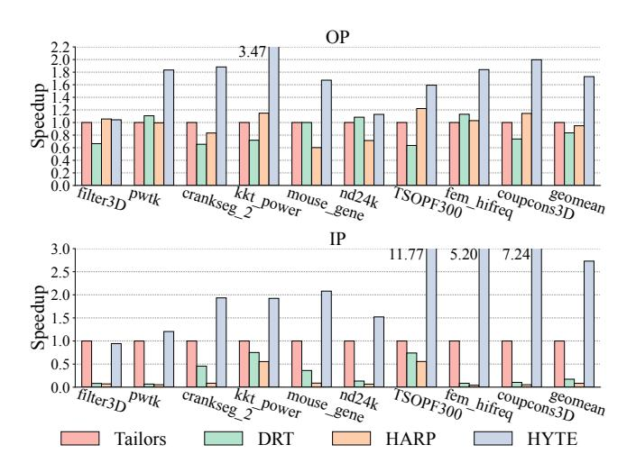
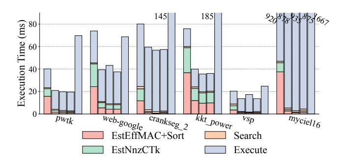

# 8 Evaluation

In this section, we first compare the overall performance and energy efficiency of HYTE against the baselines. Then we extend the evaluation to other sparse kernels and hardware dataflow schemes. Finally we specifically analyze the static scheduling cost in HYTE.

## 8.1 Overall Performance

Figure 6 compares the three baselines and HYTE. The hardware PE array uses the Gust dataflow, running SpMSpM of  $S \times S$ . We also statically determine the optimal tiling scheme for each matrix and denote it as Static-Opt. Specifically, we exhaustively search the design space of tile sizes, tile shapes, inter-tile orders, and buffer allocation, and choose the scheme with the best performance in our cycle-accurate simulator (not in the HYTE scheduler's cost model).

Figure 8: Performance improvements from each design choice in HYTE, for SpMSpM with Gust dataflow.

For HYTE, we include the static scheduling overheads (mainly the sampling and search time; more in Section 8.4) in its end-to-end performance, and also separately report only the online time.

Each of the three baselines shows some advantages on different matrices, but performs poorly on others. For instance, Tailors is the best on kron\_g500-logn18 but the worst on ldoor. On average, DRT outperforms the other two designs, as it dynamically decides tile sizes and also uses balanced tile shapes across all dimensions, helping it avoid extremely poor performance in each matrix.

HYTE achieves significant speedups, on average 3.3× over the best-performing baseline DRT, 4.5× over HARP, and 6.2× over Tailors, *including* the static scheduling cost. If only considering the online phase, the speedups are 3.9×, 5.2×, and 7.4×, respectively. Such significant improvements are because HYTE uses a static-dynamic hybrid method to explore a much larger design space and identify the best tiling scheme tailored to each matrix. Its performance is comparable to Static-Opt, and in some cases even slightly better, particularly on irregular matrices like mouse\_gene and myciel16. This is because dynamic tuning in HYTE uses different tile shapes on different regions of one matrix, while Static-Opt fixes the statically chosen tile shape.

Figure 7 further explains the performance gains of HYTE using the breakdown of memory accesses for each operand tensor in the four designs. The schedules of Tailors result in significant memory accesses for tensor A, while the schedules of HARP lead to higher accesses for B, both because of their rigid tile shape and inter-tile order choices. In contrast, HYTE is able to find optimized tiling schemes that balance among the three tensors and avoid making any one dominant, resulting in lower overall memory access volumes. Figure 7 also shows the memory bandwidth of each design. The three baselines are consistently memory-bound for all matrices. Due to the much reduced memory traffic explained above, HYTE only exhibits high bandwidth usage for very sparse matrices. With relatively dense data, e.g., nd24k, HYTE consumes less memory bandwidth and even becomes compute-bound. Note that lower bandwidth usage in HYTE does not mean lower performance; it is mainly due to reduced data access amounts.

To separate the contribution of each design choice, we start from DRT and incrementally add each technique in Figure 8. By using the best inter-tile order and buffer allocation ("+inter&alloc"), we can focus on reusing the most critical tensor depending on the sparse pattern, and get a 1.20× speedup. Further searching for the tile size and tile shape in the static scheduler ("+size" and "+shape") brings additional 1.63× and 1.72× speedups, respectively, being the major performance benefit sources and matching the observations in Figures 1a and 1b. The static tiling scheme is near-optimal for

Figure 9: Energy consumption of HYTE vs. DRT (dots, right y axis), and breakdown into offline scheduling, online on-chip components, and memory accesses (bars, left y axis).

most cases, exactly demonstrating the effectiveness of our offline scheduling approach. Nevertheless, for 9 out of our 18 evaluated matrices, like mouse\_gene and nd24k, dynamic tuning ("+dynamic") is necessary to fix the inaccurate static decision, offering up to 1.9× and on average 1.15× extra speedups.

**Energy.** Figure 9 shows that the energy consumption of HYTE is dominated by the off-chip memory accesses (76% on average). The offline static scheduling on the host CPU consumes only minor energy, similar to the performance results. Here we assume 20 pJ/bit [9, 15, 23] for the memory access, and 8.5 W per core [11, 18] for the host CPU, while the on-chip accelerator consumes 10.55 W. Thanks to memory access savings and execution time improvements, HYTE reduces energy by 81% compared to the baseline DRT.

**Scalability.** Figure 10 shows the speedups of HYTE over Tailors at different accelerator chip sizes. We scale the PE count together with the SRAM buffer capacity as well as the SRAM bank count in this experiment. HYTE achieves 27.4×, 11.8×, 7.4×, 5.2×, and 3.4× average speedups with 8, 16, 32, 64, and 128 PEs, respectively. Smaller buffer sizes with fewer PEs are more affected by the tiling choices. Thus HYTE achieves higher speedups. Nevertheless, even with up to 128 PEs, there is still a 3.4× speedup on average.

Figure 11 instead only changes the SRAM buffer capacity but keeps the same default PE count. HYTE achieves  $24.9\times$ ,  $7.4\times$ ,  $3.0\times$ , and  $1.5\times$  average speedups with 1 MB, 4 MB, 16 MB, and 64 MB buffers, respectively. The speedups are higher for smaller buffers, in which cases tiling decisions are more critical to performance. When using very large buffers, the whole matrix data may fit in the SRAM and do not need tiling at all. We point out that sparse accelerator designs rarely use very large buffers (e.g., > 32 MB), and usually under 10 MB [4, 10, 20, 22, 24, 26, 29, 32–34, 36, 40–42], as large SRAM offers marginal and diminishing returns. For example, the performance/area numbers in HYTE are  $0.25\times$  and  $0.06\times$  under

Figure 10: HYTE speedups over Tailors at various chip scales.

Figure 11: HYTE speedups over Tailors at various buffer sizes.

 $16\,\mathrm{MB}$  and  $64\,\mathrm{MB}$  buffers compared to  $4\,\mathrm{MB}$ , as the total area grows to  $3.5\times$  and  $11.9\times$  while the speedups are only  $1.13\times$  and  $1.36\times$ . Furthermore, the better tiling strategies in HYTE could make small buffers perform better. The performance ratio between  $1\,\mathrm{MB}$  and  $64\,\mathrm{MB}$  in HYTE is  $1.8\times$ , in contrast to  $31.1\times$  in Tailors.

## 8.2 Results of Different Kernels

In Figure 12 we evaluate other sparse kernels besides square matrix self-multiplication, still under the Gust dataflow. For  $F^T \times F$ , Tailors and HARP both perform poorly because they tile along the wrong dimensions of j and i, respectively, while DRT is slightly better as it uniformly tiles all dimensions. Through static exploration, HYTE finds the correct k dimension, which is the largest one in this kernel, to tile. Overall, HYTE with static scheduling only is  $3.23\times$  faster than Tailors, and dynamic tuning increases it to  $3.68\times$ .

In the SpMM kernel  $F \times D$ , both B and C are dense now. Thus the cost of tiling i and j to redundantly access B and C will be very high, and tiling k is the best. Tailors makes the right choice of dimension this time. HYTE is able to outperform Tailors because the default overflowed tile size of Tailors is sub-optimal. Overflow here means sacrificing the hit rate of the dense matrix B to improve the locality of the sparse matrix A, which is not worthwhile. On average, HYTE is  $1.85 \times$  better than Tailors for this kernel. Since the second matrix is dense and thus evenly distributed, dynamic tuning does not help.

Finally, the MS-BFS kernel  $F^T \times S$  involves a highly sparse matrix A, so only a few B rows are accessed. Not tiling B at all would be the best choice, which HARP satisfies. HYTE also finds this optimal schedule using its static scheduler and performs the same.

Figure 12: Performance comparison among Tailors, DRT, HARP, and HYTE (static-only and full), for different sparse kernels  $F^T \times F$ ,  $F \times D$ , and  $F^T \times S$  with Gust dataflow. The x axis shows matrix F in the first two kernels, and matrix S in the last kernel.

Figure 13: Performance comparison among Tailors, DRT, HARP, and HYTE, for SpMSpM with OP and IP dataflows.

## 8.3 Results of Different Intra-Tile Dataflows

We further evaluate how HYTE performs on other hardware dataflows in Figure 13. With OP, HYTE achieves an average 1.7× speedup compared to the best baseline. OP is less sensitive to tiling shape choices. This is because with matrix self-multiplication, A and B are the same matrix, and thus the cost of redundantly accessing them is similar. For IP, the overall access pattern is similar to Gust, but with significantly more accesses to matrix B. This makes it more sensitive to very large tile size overflow. HYTE benefits from the tile shape exploration and the dynamic tuning support, and obtains a  $2.7\times$  speedup on average.

Figure 14: Offline and online execution time of HYTE. The bars in each group represent the sampling fractions sp =  $0.1, 0.01, 0.001, 1/\sqrt{N}$ , and the baseline DRT.

