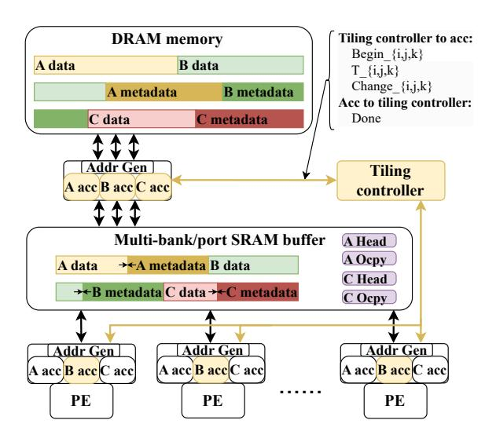

# 5.2 Search Space Pruning

As in Figure 2, the search space consists of three categories of parameters: tile shapes, inter-tile orders, and allocated buffer capacities. Below we analyze the candidate choices for each category and prune the unnecessary ones.

First, for the tile shapes, we only consider power-of-two sizes along each dimension, resulting in  $\log^3 N$  choices where  $N \sim I$ , J, K. Furthermore, we notice that it is not beneficial to tile the outermost loop of the intra-tile dataflow, e.g., i in Gust and IP, or k in OP (Table 1). This is because data are already sequentially processed along this dimension and tiling it will not affect the access and

computation flow. We hence reduce the space to  $\log^2 N$ . We can do further pruning if a tile shape is smaller than another feasible (i.e., fitting in the buffer size) shape along all dimensions, as it would surely underutilize the buffer capacity.

Second, we note that only the choice of the innermost loop in the inter-tile order affects the inter-tile data reuse characteristics. Recall that given an inter-tile order such as  $i \triangleright j \triangleright k$ , the tensor irrelevant to the innermost k dimension, i.e., C, is reused. Exchanging the order of the outer two loops does not change this result. In summary, we only need to consider 3 instead of all 6 inter-tile orders.

Third, for buffer allocation, we consider both inter-tile reuse and intra-tile reuse. First, the fixed intra-tile dataflow could exhibit a poor access pattern on one tensor (e.g., C for OP in Table 1) that needs to be buffered. We choose to always satisfy this requirement of the hardware dataflow to ensure its efficiency. Second, as described above, the inter-tile order designates one tensor that could enjoy inter-tile reuse and would request buffer space to keep its tile. Consequently, we consider two choices, either only using the buffer for intra-tile reuse, or dividing the buffer space between inter-tile and intra-tile reuse. The first choice adds 1 more case to the 3 inter-tile orders, making it 4 in total. Unbuffered tensors use the streaming mode with minimum space.

In summary, the total search space is no larger than  $4 \times \log^2 N$ , which is just a few hundred different schemes and can be explored in a short time in practice as further shown in Section 8.4.

#### 5.3 Cost Model

For each candidate scheme from Section 5.2, we use a relatively straightforward cost model to evaluate its performance, similar to previous work [13, 16, 28, 39]. The total time is modeled as the total number of tiles (as  $I/T_i \times J/T_j \times K/T_k$ ) multiplied by the per-tile execution time, which is max{PE time, DRAM time, SRAM time}. Here PE time = effMAC/throughput, and DRAM/SRAM time is the total access amounts of all tensors (e.g., nnzCTk for C) divided by the corresponding bandwidth.

It is worth noting that the total DRAM/SRAM access amounts are sometimes non-trivial to calculate. For SRAM, the accesses are affected by both the intra-tile dataflow and the tiling scheme. We assume the tensors are already in the desired sparse formats of the hardware dataflow. First we consider the case without tiling. For example, for OP, the access amounts of matrices A, B, and C are nnzA, nnzB, and effMAC, respectively; and for Gust, they become nnzA, effMAC, and nnzC. Repetitive accesses may be needed, e.g., IP accesses B for I times. Then, if tiling is applied to the irrelevant dimension of a tensor, its SRAM accesses are amplified by the number of tiles, e.g., nnzA  $\times$   $J/T_j$  and nnzB  $\times$   $I/T_i$ . However C needs special treatment because it is generated and accumulated on the fly; the access amount is estimated as nnzCTk in Section 5.1.

The DRAM access amounts need to further consider the buffer allocation and access mode of each tensor. In the streaming mode, the DRAM traffic is equal to the SRAM traffic. In the buffering mode, if the tile size is smaller than the allocated buffer space, the traffic is reduced by the reuse times. Otherwise, the hit rate is the ratio between the two.

Besides the data, we also need to consider the metadata access cost. With the flexible tiling schemes supported in HYTE, we need

(a) mouse\_gene

(b) dielFilterV2real

Figure 3: Non-zero distributions of two example matrices that prefer no tiling and extensive tiling, respectively.

to maintain a non-negligible amount of metadata (Section 6.2), e.g., to specify the actual storage positions of the fiber segments in the current tile, which are irregular and differ significantly from the regularly tiled coordinates. When a tile is highly sparse, the metadata overhead can be substantial compared to the data access cost, e.g., reading/writing the begin position of a fiber segment vs. only a few non-zeros in this segment. To account for their accesses, for each tile we calculate how many individual fiber segments it has, e.g., a CSR-format A tile of  $T_i \times T_k$  has  $T_i$  fiber segments. This determines the size of metadata. Their access counts follow those of the corresponding data.

#### 5.4 Case Studies

We illustrate how the HYTE scheduler works on two example matrices: mouse\_gene and dielFilterV2real, whose non-zero distributions are shown in Figure 3. The mouse\_gene matrix has dimensions  $45101 \times 45101$  with 14,506,196 non-zeros, while dielFilterV2real has dimensions  $1157456 \times 1157456$  with 24,848,204 non-zeros.

By sampling sp =  $1/\sqrt{N}$  = 0.005 of mouse\_gene and tracking the top sk =  $\sqrt{N}$  = 212 hash values, we estimate effMAC, nnzCTk $_K$ , nnzCTk $_{K/128}$  as 7,442,882,727, 262,241,518, and 2,084,207,396, respectively, while the actual values are 7,971,580,000, 237,833,954, and 2,065,359,984. For dielFilterV2real, sampling with sp = 0.0009 and sk = 1075 yields the estimated values of 449,092,928, 95,012,185, and 125,005,246, compared to the actual 435,260,000, 105,679,996, and 121,610,583. The errors are only about 5% to 10%.

Notably, with mouse\_gene, nnzC is 18× larger than the non-zero size of the input matrix, and nnzCTk $_{K/128}$  is another 8× larger than nnzC. In contrast, in dielFilterV2real, nnzC is only 4× the input, and nnzCTk $_{K/128}$  approximates nnzC.

After the tiling space exploration, the HYTE scheduler decides not to tile dimension k for mouse\_gene. This is due to its relatively dense distribution and the high nnzC value, which would result in significant redundant accesses to C after tiling (i.e., nnzCTk $_{K/128}$  vs. nnzCTk $_{K}$ ). Conversely, the sparsity and low nnzCTk values of dielFilterV2real favor extensive tiling of k.

Our scheduler is general and can easily discover more patterns. Matrices with similar characteristics to mouse\_gene — such as kron\_g500-logn18, ship\_001, and human\_gene — show similar variance and power-law distribution. Large and structured matrices — like ldoor and fem\_hifreq — perform comparably to dielFilterV2real. Additional patterns are presented in Section 8.1.

Figure 4: Hardware architecture of HYTE. The tiling controller and the accessors at each buffer level are newly added.

#### **6 Hardware Architecture**

This section describes the hardware architecture of HYTE and how it supports flexible tiling. We particularly focus on the management of the metadata of tiling schemes in both the off-chip memory (for inter-tile execution) and the on-chip buffer (for intra-tile execution). We also support dynamic tuning in HYTE to compensate for the estimation errors in the static scheduler.

## 6.1 Overview

Figure 4 illustrates the overall hardware architecture of HYTE. Without loss of generality, we assume a multi-PE accelerator with one level of SRAM buffer and the off-chip DRAM memory, similar to most prior designs [20, 25, 38, 40]. Here in the figure we omit any dedicated units to support a specific intra-tile dataflow, such as index intersectors for IP and partial sum mergers for Gust and OP, since they do not affect our tiling designs at the global buffer level. But we consider their performance impact in the evaluation.

HYTE mainly introduces two new hardware components which are highlighted in Figure 4: the *tiling controller* that controls the overall tiling scheme, and the *accessor* of each tensor (e.g., "A/B/C acc") that is in charge of fetching the tiled fiber segments into the buffer and managing the corresponding metadata. Note that these modifications are only to the logic for buffer control and data access, without altering the PE datapaths.

The high-level workflow is as follows. The global tiling controller first loads the initial tiling scheme statically determined by the offline scheduler. The inter-tile order and the tile shapes are used by the tiling controller to determine which tiles to process next after each inter-tile iteration (Section 6.2). This information is sent to the accessors, who fetch the corresponding tiles of the multiple tensors into the buffer, and manage the buffer space according to the buffer allocation in the offline scheduled scheme (Section 6.3).

Our accessor design is extended from Buffets [30], with the main difference as changing the control and access granularity from a single element to a fiber segment with specified begin/end coordinates. A specific design challenge is to effectively *manage the metadata*, so that with an arbitrary inter-tile order, we can derive the *positions* (i.e., the actual storage locations) of the fiber segments given their begin/end *coordinates* from the tiling controller. Note that previous tiling designs have overlooked this issue, either only supporting tiling along fixed dimensions with simple metadata [19, 38], or relying on expensive preprocessing [25]. Section 6.2 describes how we maintain the necessary metadata in the memory across tiles, while Section 6.3 discusses how the metadata within a tile are managed in coordination with the tensor data.

Finally, HYTE supports *dynamic tuning* of tile shapes at runtime in hardware (Section 6.4), in order to correct the estimation errors of the static scheduler and to better adapt to the local sparse patterns. A few hardware counters are added to the accessor to collect the runtime statistics, and the tiling controller uses such information to dynamically adjust the tile shape using a simple model.

