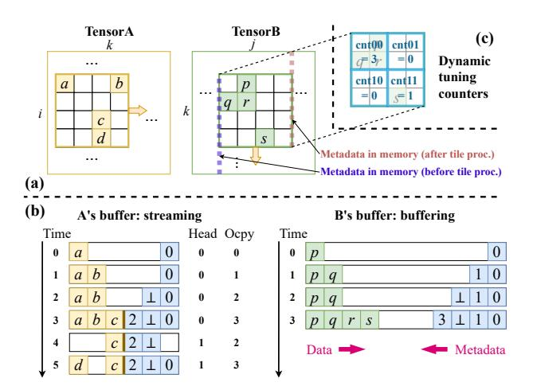

# 6.3 Intra-Tile Management

With the specified coordinate ranges and the begin positions, the accessor fetches the fiber segments of the tensor into its statically allocated buffer space. We support two modes for each tensor [38],

Figure 5: Example hardware behaviors with  $i \triangleright j \triangleright k$  inter-tile order and Gust dataflow. (a) Current tiles' sparse patterns, and metadata in the memory. (b) Streaming and buffering modes, and coordination of data and metadata in the buffer. (c) Counters for dynamic tuning of tile shapes.

buffering if the tile should be buffered for reuse, or *streaming* otherwise. Figure 5(b) shows the two modes. In this example, we buffer tensor B's tiles while streaming A. We manage the data and metadata in coordination, each growing from one end of the buffer space towards the middle until met. When filling in the data of a fiber segment, the accessor also records its begin location in the buffer as the metadata. For example, in A's buffer, at time 0 and 1 the first fiber segment (a,b) is in, with a metadata 0 denoting its location. The second segment is empty. The third segment c starts at location 2. Similarly for b, e.g., the last segment b is at location 3. The difference between two adjacent metadata entries is the (non-zero) size of the corresponding fiber segment.

For the streaming mode, we follow the Buffets-like circular buffer design [30], with a head and an occupancy register denoting the head of the circular metadata buffer and its size. In Figure 5(b), at time 3 the A buffer is full. Then we evict one fiber segment (i.e., a and b) as well as its metadata at time 4. Now the head moves by 1 and the occupancy reduces by 1, and we have available space to read in the last segment d at time 5.

In the buffering mode, if the tile data exceed the allocated buffer space, e.g., due to a locally dense region, we do not evict previous data since they are expected to be reused. The future data of this tile will just bypass the buffer. This is a result of inaccurate static estimation that misses local sparse pattern variations. We use dynamic tuning in Section 6.4 to alleviate it.

## 6.4 Dynamic Tuning

Due to variations in the distribution of non-zeros across different tiles, the tile that should be buffered may sometimes overflow or underutilize the statically allocated buffer space. We may need to decrease or increase the tile size in these cases, respectively. HYTE applies dynamic tuning for this purpose. The accessor collects a

few runtime statistics and transfers them to the tiling controller, which adjusts the tile shapes based on certain simple rules.

Specifically, when an accessor fetches a tile, e.g., a B tile of shape  $T_k \times T_j$  in Figure 5(c), we use four counters, cnt00, cnt01, cnt10, cnt11, to count the numbers of non-zero elements in the four quadrants of the tile. This gives us a more accurate view of the local non-zero distribution of the accessed tile. We then use these counter values to estimate the buffer hit rates for nine potentially adjusted tile shapes, in which each of the two dimensions can increase by 2×, decrease by 2×, or keep the same spread. That is, the new tile shape  $T_k \times T_j \times T_j \times T_j \times T_j \times T_j \times T_j \times T_j \times T_j \times T_j \times T_j \times T_j \times T_j \times T_j \times T_j \times T_j \times T_j \times T_j \times T_j \times T_j \times T_j \times T_j \times T_j \times T_j \times T_j \times T_j \times T_j \times T_j \times T_j \times T_j \times T_j \times T_j \times T_j \times T_j \times T_j \times T_j \times T_j \times T_j \times T_j \times T_j \times T_j \times T_j \times T_j \times T_j \times T_j \times T_j \times T_j \times T_j \times T_j \times T_j \times T_j \times T_j \times T_j \times T_j \times T_j \times T_j \times T_j \times T_j \times T_j \times T_j \times T_j \times T_j \times T_j \times T_j \times T_j \times T_j \times T_j \times T_j \times T_j \times T_j \times T_j \times T_j \times T_j \times T_j \times T_j \times T_j \times T_j \times T_j \times T_j \times T_j \times T_j \times T_j \times T_j \times T_j \times T_j \times T_j \times T_j \times T_j \times T_j \times T_j \times T_j \times T_j \times T_j \times T_j \times T_j \times T_j \times T_j \times T_j \times T_j \times T_j \times T_j \times T_j \times T_j \times T_j \times T_j \times T_j \times T_j \times T_j \times T_j \times T_j \times T_j \times T_j \times T_j \times T_j \times T_j \times T_j \times T_j \times T_j \times T_j \times T_j \times T_j \times T_j \times T_j \times T_j \times T_j \times T_j \times T_j \times T_j \times T_j \times T_j \times T_j \times T_j \times T_j \times T_j \times T_j \times T_j \times T_j \times T_j \times T_j \times T_j \times T_j \times T_j \times T_j \times T_j \times T_j \times T_j \times T_j \times T_j \times T_j \times T_j \times T_j \times T_j \times T_j \times T_j \times T_j \times T_j \times T_j \times T_j \times T_j \times T_j \times T_j \times T_j \times T_j \times T_j \times T_j \times T_j \times T_j \times T_j \times T_j \times T_j \times T_j \times T_j \times T_j \times T_j \times T_j \times T_j \times T_j \times T_j \times T_j \times T_j \times T_j \times T_j \times T_j \times T_j \times T_j \times T_j \times T_j \times T_j \times T_j \times T_j \times T_j \times T_j \times T_j \times T_j \times T_j \times T_j \times T_j \times T_j \times T_j \times T_j \times T_j \times T_j \times T_j \times T_j \times T_j \times T_j \times T_j \times T_j \times T_j \times T_j \times T_j \times T_j \times T_j \times T_j \times T_j \times T_j \times T_j \times T_j \times T_j \times T_j \times T_j \times T_j \times T_j \times T_j \times T_j \times T_j \times T_j \times T_j \times T_j \times T_j \times T_j \times T_j \times T_j \times T_j \times T_j \times T_j \times T_j \times T_j \times T_j \times T_j \times T_j \times T_j \times T_j \times T_j \times T_j \times T_j \times T_j \times T_j \times T_$ 

$$\frac{T_{k'} \times T_{j'} \times \min(\mathbb{E}[\text{nnz}_{\text{tile}}], \text{bufsize})}{\text{nnz}_{\text{total}}}$$

where nnztotal is the total tensor size, and nnztile is the number of non-zeros in the adjusted tile, estimated through the counters. For example, the adjusted tile  $T_k' \times T_j' = \frac{T_k}{2} \times 2T_j$  would have nnztile =  $\frac{1}{2} \times (\min(2 \times \text{cnt00} + 2 \times \text{cnt01}, \text{bufsize}) + \min(2 \times \text{cnt10} + 2 \times \text{cnt11}, \text{bufsize}))$ . If the buffer size is larger than the tile size, the hit rate is 100%; otherwise it is the ratio between the two.

Using the dynamic counters is more accurate than the static uniform estimation. Suppose we have a small buffer that can hold only one element. In Figure 5 if we use a tile shape of  $2 \times 2$  for B, each tile contains one element on average, and thus we would assume 100% hits in the static scheduler. However, the actual hit rate is  $\frac{1}{4} \times (\min(3, 1) + \min(0, 1) + \min(0, 1) + \min(1, 1)) = 50\%$ .

We empirically decide that if the best hit rate among the nine shapes is more than 5% better than the existing shape, we will adjust the tile shape. However, this adjustment may not be immediately applied. If the current inter-tile iteration direction is different from the dimension to be adjusted, changing the tile shape would result in misaligned tiles compared to previous ones. Therefore, the adjustment is delayed until the next inter-tile iteration that requires modification of that specific dimension. For example, in Figure 5(a) we are iterating along k in B. Changing  $T_k$  does not affect the intertile iteration, but shrinking or extending  $T_j$  would make the end coordinates of j misaligned, complicating the processing when we start a new j iteration.

