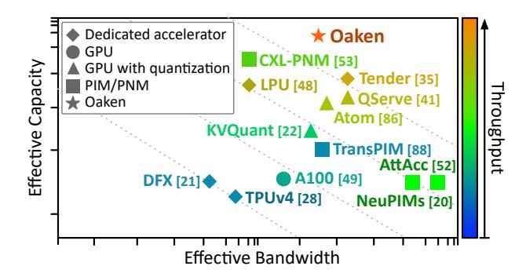
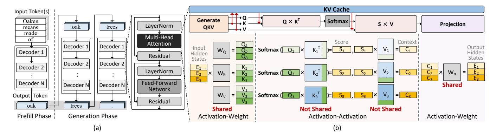

## Oaken: Fast and Efficient LLM Serving with Online-Offline Hybrid KV Cache Quantization

[Minsu Kim](https://orcid.org/0009-0003-8751-0352)∗ KAIST Daejeon, Republic of Korea mskim@casys.kaist.ac.kr

[Soongyu Choi](https://orcid.org/0009-0005-6453-9755) KAIST Daejeon, Republic of Korea soongyu1291@kaist.ac.kr

[Seongmin Hong](https://orcid.org/0009-0005-7940-8221)∗ HyperAccel Seoul, Republic of Korea sm.hong@hyperaccel.ai

[Hunjong Lee](https://orcid.org/0009-0006-4460-9530) HyperAccel Seoul, Republic of Korea hj.lee@hyperaccel.ai

[RyeoWook Ko](https://orcid.org/0009-0006-3829-7761) KAIST Daejeon, Republic of Korea ryeowookko@kaist.ac.kr

[Junsoo Kim](https://orcid.org/0000-0001-6680-2602) HyperAccel Seoul, Republic of Korea js.kim@hyperaccel.ai

[Joo-Young Kim](https://orcid.org/0000-0003-1099-1496) HyperAccel Seoul, Republic of Korea jy.kim@hyperaccel.ai

Abstract

Modern Large Language Model (LLM) serving system batches multiple requests to achieve high throughput, while batching attention operations is challenging, rendering memory bandwidth a critical bottleneck. Today, to mitigate this issue, the community relies on high-end GPUs with multiple high-bandwidth memory (HBM) channels. Unfortunately, HBM's high bandwidth often comes at the expense of limited memory capacity, necessitating systems to scale, which reduces core utilization and increases costs. Moreover, recent advancements enabling longer contexts for LLMs have substantially increased the key-value (KV) cache size, further intensifying the pressures on memory capacity. To lower the pressure, the literature has explored KV cache quantization techniques, which commonly use low bitwidth (e.g., INT4) for most values, selectively using higher bitwidth (e.g., FP16) for outlier values. While this approach helps achieve high accuracy and low bitwidth simultaneously, it comes with the limitation that the cost for online outlier detection is excessively high, negating the advantages of quantization.

Inspired by these insights, we propose Oaken, an acceleration solution that achieves high accuracy and high performance simultaneously through co-designing algorithm and hardware. To effectively find a sweet spot in the accuracy-performance trade-off space of KV cache quantization, Oaken employs an online-offline hybrid approach, setting outlier thresholds offline, which are then used to determine the quantization scale online. To translate the proposed algorithmic technique into tangible performance gains, Oaken also comes with custom quantization/dequantization engines and memory management units that can be integrated with any LLM accelerators. We built an Oaken accelerator on top of

∗Co-first authors who contributed equally to this work.

<https://doi.org/10.1145/3695053.3731019>

[This work is licensed under a Creative Commons Attribution 4.0 International License.](https://creativecommons.org/licenses/by/4.0) ISCA '25, Tokyo, Japan © 2025 Copyright held by the owner/author(s). ACM ISBN 979-8-4007-1261-6/25/06

[Jongse Park](https://orcid.org/0000-0002-6629-449X) KAIST Daejeon, Republic of Korea jspark@casys.kaist.ac.kr

an LLM accelerator, LPU, and conducted a comprehensive evaluation. Our experiments show that for a batch size of 256, Oaken achieves up to 1.58× throughput improvement over NVIDIA A100 GPU, incurring a minimal accuracy loss of only 0.54% on average, compared to state-of-the-art KV cache quantization techniques.

## CCS Concepts

• Computer systems organization → Neural networks; Multicore architectures; • Computing methodologies → Neural networks.

## Keywords

Accelerator; Large Language Models (LLM); Serving; Batched Inference; Quantization; Key-Value (KV) Cache

#### ACM Reference Format:

Minsu Kim, Seongmin Hong, RyeoWook Ko, Soongyu Choi, Hunjong Lee, Junsoo Kim, Joo-Young Kim, and Jongse Park. 2025. Oaken: Fast and Efficient LLM Serving with Online-Offline Hybrid KV Cache Quantization. In Proceedings of the 52nd Annual International Symposium on Computer Architecture (ISCA '25), June 21–25, 2025, Tokyo, Japan. ACM, New York, NY, USA, [16](#page-15-0) pages.<https://doi.org/10.1145/3695053.3731019>

## 1 Introduction

The recent advent of large language models (LLMs) has significantly impacted the computing industry. Almost every sector of the modern economy is exploring the adoption of LLMs, with many already actively using them for various applications. Most real-world applications rely on hyperscaler-provided LLM serving systems because on-premise LLM deployment requires prohibitive costs.

As LLM inferencing is for multi-tenant environments, the serving systems batch multiple requests to parallelize the inference computation [\[12,](#page-13-0) [14,](#page-13-1) [32,](#page-13-2) [36,](#page-14-0) [50,](#page-14-1) [64,](#page-14-2) [77\]](#page-15-1). While batching promises a significant throughput boost for operations where operand matrices can be shared across requests on GPUs and other AI accelerators, attention layers in transformer-based LLMs consist of un-batchable operations with request-specific, un-shareable operands, lowering

Figure 1: Existing solutions for LLM inference serving systems plotted on the bandwidth-capacity trade-off space. The "effective bandwidth" and "effective capacity" represent the scale of data that can be transmitted to/from and stored on memory, respectively. We also delineate their corresponding throughput (i.e., tokens/sec) using the colors presented on a 1D heatmap on the right side.

hardware utilization. As the *un*-batchable operations cannot exploit on-chip data reuse, they produce enormous memory read, causing *memory bandwidth* to become the key system bottleneck.

Additionally, request batching in LLM inference has another resource implication. LLMs generate key-value activation and cache them in memory for computation reuse, often called *KV cache*. As this KV cache is not shared across different user requests, the large batch size is directly translated into a large KV cache size, requiring massive *memory capacity*. Furthermore, as KV cache size scales linearly with the sequence length, the recent trend of supporting very long sequences (e.g., 2 million tokens [76]) places even greater pressure on memory capacity.

Consequently, LLM serving systems require both high bandwidth and high capacity to enable fast inferencing. This resource demand aligns with the immense user demand for LLM services, making it challenging for service providers to build cost-effective LLM serving systems. Existing solutions often choose to trade-off one resource for the other, as visualized in Figure 1. Below, we classify the existing solutions into the following three categories:

- (1) Prioritizing bandwidth over capacity: Currently, using HBM-equipped GPUs is the de-facto standard solution for LLM inference processing [28, 45, 49]. While this approach achieves massive bandwidth, it often compromises capacity, forcing systems to scale out, which not only reduces core utilization but also increases the cost of building the system.
- (2) Leveraging PIM and/or PNM: Even with HBMs, LLM inferencing systems still face bandwidth bottlenecks. To address this challenge, recent works have explored the near-data processing (NDP) paradigm, leveraging PIM [20, 52, 59] and/or PNM [53]. While these approaches mitigate the bandwidth bottleneck, their inherent nature requires further reductions in memory capacity, limiting their viability as a fundamental solution.
- (3) Exploring LLM quantization strategies: One fundamental strategy for jointly addressing the conflicting objectives is to minimize the memory footprint required for LLM inferencing. To achieve this goal, a large body of prior work [10, 17, 22,

30, 31, 33, 40, 41, 43, 75, 78, 79, 86] have recently developed LLM-targeted quantization techniques. While these techniques successfully achieve significant reductions in bitwidth, they often prioritize minimizing bitwidth over effectively translating these reductions into practical inferencing speedups.

Alone, none of the solutions is sufficient for building fast and efficient LLM serving systems, which motivates us to develop an acceleration solution, namely Oaken. By jointly leveraging algorithmic and hardware techniques, Oaken achieves otherwise unattainable levels of *effective* bandwidth and capacity, resulting in substantially higher throughput than alternatives, as shown in Figure 1. Oaken comprises (1) **Algorithmic technique:** an online-offline hybrid KV cache quantization technique, and (2) **Hardware technique:** the hardware incarnations of the proposed algorithms, including quantization/dequantization engines and memory management units that can be integrated with any existing LLM accelerators. Oaken makes the following contributions:

- (1) Online-offline hybrid KV cache quantization: Many of the recently-proposed KV cache quantization techniques commonly use low bitwidth (e.g., INT4) for most values, while selectively using higher bitwidth (e.g., FP16) for outlier values [15, 19, 22, 33, 80, 86]. While this approach achieves high accuracy and low bitwidth, the prohibitively high cost of online threshold calculation or mixed-precision computation renders it nearly impractical for real-world use cases. Thus, there is a critical need for a cost-effective solution to identify thresholds that distinguish outliers from inliers, enabling the translation of KV cache quantization into tangible speedups. To achieve this goal, Oaken employs an online-offline hybrid approach, where data-agnostic outlier thresholds are determined at offline and subsequently applied to set the quantization scale at online. Furthermore, Oaken introduces a quantization loss mitigation technique that shifts values toward a smaller range, converting outliers into inliers prior to quantization. Finally, Oaken stores the quantized values by using dense tensors for inliers and fusing sparse outliers into the dense tensors.
- (2) Quantization-aware hardware modules for LLM accelerators: We devise custom quantization/dequantization engines and memory management units, which are aware of the proposed quantization algorithm. These hardware modules can be integrated with any existing LLM accelerators such as GPUs, NPUs, and LLM-customized ones [21, 23, 53, 82]. We place these modules in the DMA unit that is commonly present in modern LLM accelerators. In designing the memory management unit (MMU), the challenge is to achieve the maximal bandwidth, which is close to the physical limit, while effectively laying out the dense and sparse matrices in memory. We design the MMU with two management tables for dense and sparse data, respectively, to handle virtual-to-physical address mappings and manage the single address space at page granularity. This design maximizes memory bandwidth utilization while avoiding fragmentation and burst order issues.

To evaluate the effectiveness of Oaken, we use eight different LLMs that include OPT [84], Llama2 [66], Mistral [25], and Mixtral [26], with varying sizes. We use Wikitext, PIQA, Winogrande, and Hellaswag datasets, which are widely used in prior

Figure 2: (a) Structure of LLM inference and decoder layer during the prefill and generation phases. (b) Operations in the multi-head attention layer, including activation-weight and activation-activation operations, during the generation phase of batched inference for three requests.

works [11, 22, 31, 33, 37, 41, 73, 86, 87]. We synthesize the SystemVerilog RTL code of our accelerator in TSMC 28nm technology using Synopsys Design Compiler, which offers the area information of each component in the accelerator. Our experimental results report that compared to NVIDIA A100 using state-of-the-art KV cache quantization techniques, Oaken offers up to 1.58× throughput speedup, owing to the bitwidth reduction that reaches up to 70.0%. We achieve this speedup by only introducing a modest 0.87% accuracy degradation, which demonstrates the algorithmic robustness of our KV cache quantization technique. Furthermore, Oaken modules incur only 8.21% area overhead, which is negligible given the significant performance benefits they enable. These advantages demonstrate that Oaken achieves the dual objectives of bandwidth and capacity, representing an important step toward building fast and cost-effective LLM inference serving systems.

#### 2 Background

#### 2.1 A Primer on LLM Inference

As illustrated in Figure 2(a), inference of large language model is mainly divided into two phases: the prefill phase and the generation phase [4, 8, 25, 66, 84]. The prefill phase takes input tokens and passes them through decoder layers to generate a single output token. In the generation phase, the token generated in the previous iteration is used to produce the next token. This process is autoregressive, with each iteration generating one token.

LLMs typically consist of multiple decoder layers, with multihead attention being one of the key operations. As visualized in Figure 2(b), the multi-head attention begins with generating the query, key, and value activations. The key and value are buffered in the on-chip memory for subsequent operations and are also stored as *KV cache* in the off-chip memory for future iterations. The query is then multiplied with the transposed key, which is directly fetched from the on-chip memory during the prefill phase, while it is loaded from the off-chip KV cache during the generation phase. Similarly, subsequent computation using the value requires access to either on-chip memory or the KV cache in the same manner as the key.

