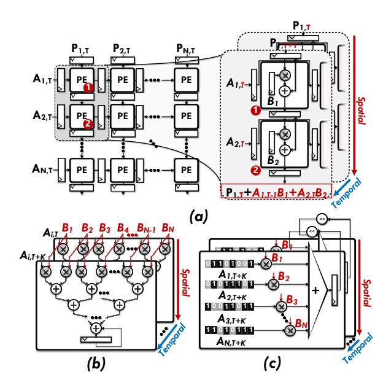
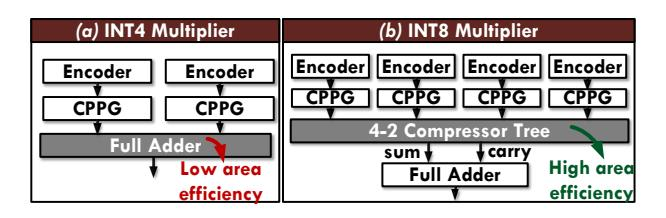

## MHE-TPE: Multi-Operand High-Radix Encoder for Mixed-Precision Fixed-Point Tensor Processing Engines

[Qizhe Wu](https://orcid.org/0000-0002-4977-5363) USTC Hefei, China wqz1998@mail.ustc.edu.cn

[Zhichen Zeng](https://orcid.org/0009-0005-0023-2367) University of Washington Seattle, USA zczeng@uw.edu

> [Linfeng Tao](https://orcid.org/0000-0002-7001-8893) USTC Hefei, China tlf@mail.ustc.edu.cn

[Letian Zhao](https://orcid.org/0000-0003-0352-8946) USTC Hefei, China zhaolt@mail.ustc.edu.cn

[Jinyi Zhou](https://orcid.org/0009-0007-0685-1817) USTC Hefei, China zjy2017@mail.ustc.edu.cn

[Huawen Liang](https://orcid.org/0000-0003-3196-2942) USTC Hefei, China lhw233@mail.ustc.edu.cn

[Xin Zhang](https://orcid.org/0009-0006-1450-2740) Zbit Semiconductor Shanghai, China zhangxin19961129@163.com

[Wei Yuan](https://orcid.org/0000-0001-9357-5716) USTC Hefei, China yuanwei501240@mail.ustc.edu.cn

> [Xi Jin](https://orcid.org/0009-0005-1109-1328)∗ USTC Hefei, China jinxi@ustc.edu.cn

[Zhanhe Hu](https://orcid.org/0009-0001-5352-3126) USTC Hefei, China zhanhe\_hu@mail.ustc.edu.cn

[Jiuru Zhu](https://orcid.org/0000-0002-7130-1949) USTC Hefei, China zjr\_030720@mail.ustc.edu.cn

[Zekang Cheng](https://orcid.org/0009-0001-9047-1783) USTC Hefei, China chengzk@mail.ustc.edu.cn

[Xiaotian Wang](https://orcid.org/0000-0002-4024-4013) Raytron Technology Suzhou, China wxtdsg@mail.ustc.edu.cn

## Abstract

Fixed-point general matrix multiplication (GEMM) is pivotal in AI-accelerated computing for data centers and edge devices in GPU and NPU tensor processing engines (TPEs). This work exposes two critical limitations in typical spatial mixed-precision TPEs: ❶ Redundant partial products (PPs) reduction in PE multipliers across temporal and spatial domains in MAC arrays. ❷ Compute density imbalance: when the operand bit-width is reduced by one-half, the throughput of GEMM only doubles, which is half of the theoretical 4× improvement. To address these challenges. First, we design a multi-operand high-radix encoder based on vector inner products, which reduces PPs for vector reduction by half through decoding. Second, we establish a three-stage computational paradigm for TPE's microarchitecture, comprising bit-slice encoding, PPs generation, and PPs reduction, which enables bit-width reconfiguration in unified hardware. Our approach decomposes the mixed-precision mapping process in TPEs into two components: temporal mapping of multi-precision multiplicands and spatial mapping of multipliers,

∗Corresponding author.

[This work is licensed under a Creative Commons Attribution 4.0 International License.](https://creativecommons.org/licenses/by/4.0) MICRO '25, Seoul, Republic of Korea © 2025 Copyright held by the owner/author(s). ACM ISBN 979-8-4007-1573-0/25/10 <https://doi.org/10.1145/3725843.3756101>

achieving balanced computational density. Implementation results based on the UMC 22nm process demonstrate that this architecture outperforms other solutions in critical metrics, including the mixed-precision support range (INT2 ∼ INT32 combinations), area efficiency, and energy efficiency.

## CCS Concepts

• Hardware → Arithmetic and datapath circuits.

## Keywords

High-Radix Encoder, Fixed-Point Tensor Processing Engine, Mixed-Precision Computing

#### ACM Reference Format:

Qizhe Wu, Jinyi Zhou, Zhanhe Hu, Zhichen Zeng, Huawen Liang, Jiuru Zhu, Linfeng Tao, Xin Zhang, Zekang Cheng, Letian Zhao, Wei Yuan, Xiaotian Wang, and Xi Jin. 2025. MHE-TPE: Multi-Operand High-Radix Encoder for Mixed-Precision Fixed-Point Tensor Processing Engines. In 58th IEEE/ACM International Symposium on Microarchitecture (MICRO '25), October 18–22, 2025, Seoul, Republic of Korea. ACM, New York, NY, USA, [15](#page-14-0) pages. [https:](https://doi.org/10.1145/3725843.3756101) [//doi.org/10.1145/3725843.3756101](https://doi.org/10.1145/3725843.3756101)

## 1 Introduction

In the field of edge computing AI deployment, fixed-point model inference has become the dominant paradigm in the technological ecosystem [\[13,](#page-13-0) [31,](#page-14-1) [32,](#page-14-2) [51,](#page-14-3) [52\]](#page-14-4). This work identifies systematic computational redundancy in current spatial GEMM architectures

Figure 1: (a) OS systolic array,  $A_{i,T}$  and  $B_{i,T}$  denote the multiplicand and multiplier input to the  $i^{th}$ -row and  $i^{th}$ -column PE at cycle T. (b) MBE truth table, where  $a_i$  represents the i-th binary bit of multiplicand A, and B is the multiplier. (c) Analysis of redundant computations in the PE microarchitecture of the spatial accelerator from temporal and spatial dimensions.

[1, 3, 12, 18, 19, 26, 30, 33, 45] under the data-reuse-oriented design paradigm, manifesting as redundant PPs reduction across both temporal and spatial dimensions within and between processing elements (PEs). We adopt the output stationary (OS) systolic array (shown in Fig. 1(a))[53] as a case study for empirical analysis.

In the design of modern multipliers, the modified Booth encoder (MBE)[35, 42] is typically employed to reduce the number of PPs by half in multiplication [11, 21], and the encoding table is shown in Fig. 1(b). At the temporal dimension within a single PE **microarchitecture**: In Fig. 1(c) during cycle T,  $PE_1$  receives  $A_{1,T}$ (value 105) and generates 4 PPs coefficients {2, -1, -2, 1} with bitweight (bw) factors  $(2^6, 2^4, 2^2, 2^0)$  through MBE. These are summed via compressor tree [46] and full adder to obtain  $105 \times B_{1,T}$ . In cycle T + 1,  $A_{1,T+1}$  (value 93) produces coefficients  $\{1, 2, -1, 1\}$  through MBE conversion, ultimately yielding  $93 \times B_{1,T+1}$ . The accumulator temporally sums these multiplication results across two clock cycles  $(105 \times B_{1,T} + 93 \times B_{1,T+1})$ . Notably, inherent redundancy emerges in the bw coefficient reductions. As shown in Eq. 1 PE1, the bw of 26 and 22 terms show redundancy through inverse-signed identical reductions  $(2B_{1,T}+B_{1,T+1})$ , despite completely independent bit-slice distributions in  $A_{1,T}$  and  $A_{1,T+1}$ .

$$PE_{1} \begin{cases} 2^{6} : 2B_{1,T} + B_{1,T+1} \\ 2^{4} : -B_{1,T} + 2B_{1,T+1} \\ 2^{2} : -(2B_{1,T} + B_{1,T+1}) & \dots PE_{N} \end{cases} \begin{cases} 2^{6} : -(2B_{1,T} + B_{1,T+1}) \\ 2^{4} : 2B_{1,T} + B_{1,T+1} \\ 2^{2} : -B_{1,T} + 2B_{1,T+1} \\ 2^{0} : -(B_{1,T} + B_{1,T+1}) \end{cases}$$
(1)

At spatial dimension: This redundant reduction exhibits significant prevalence among column PEs. In Fig. 1(c), within cycles T + N and T + N + 1, the  $PE_1 \sim PE_N$  processes systolic-transmitted  $B_{1,T}$  and  $B_{1,T+1}$ , and all PE generating 4 PPs groups showing high similarity with the reduction patterns in the  $PE_1$  show in Eq. 1, as indicated by identically colored dashed regions in Fig. 1(c).

Crucially, this redundancy at the temporal and spatial dimensions persists systematically across all PE columns, independent of multiplicand A variations, arising from dual mechanisms:

- **1 Temporal causation within PEs:** (1) Discrete mapping in MBE allows equivalent coefficient generation from different bit-slice combinations (e.g.,  $\{0, B, -B\}$  in Fig. 1(b) correspond to two different bit-slice sets). (2) Symmetric MBE coefficient set  $\{-2B, -B, 0, B, 2B\}$  constrains linear combination space, enabling identical computations from different encoding combinations (e.g.,  $2B_{1,T} + B_{1,T+1}$  vs.  $-(2B_{1,T} + B_{1,T+1})$  in  $PE_1$ ).
- **②** Spatial causation across PEs: Systolic propagation of  $B_{1,T}$  and  $B_{1,T+1}$  through all column PEs enforces fixed linear combinations from coefficient set  $\{-2B, -B, 0, B, 2B\}$  under different bw factors. This process, decoupled from A's bit distribution, inherently causes cross-PE redundant reductions.

Figure 2: (a) Weight stationary (WS) systolic array (where  $P_{i,T}$  denotes the partial sum input to the i-th column PE at cycle T). (b) Multiplier-adder tree. (c) Bit-serial architecture.

Figure 3: (a) IBM 7-nm NPU fixed-point PE engine [23]. (b) Samsung 4-nm fixed-point PE engine in mobile SoC [36].

Table 1: Area of fixed-point multipliers across precision levels. 4-RT (8): An 8-bit input reduction tree with 4 inport.

| Component   | A               | rea (μm | 2 ) | MOPS/μm 2 |      |       |  |  |
|-------------|-----------------|---------|----------------|----------------------|------|-------|--|--|
| Component   | Logic DFF Total |         | Total          | INT4                 | INT8 | INT16 |  |  |
| INT 4 MUL   | 23.32           | 23.52   | 46.84          | 21.25                | /    | /     |  |  |
| 4×INT 4 MUL | 93.28           | 94.08   | 247.63         | 16.15                | 4.03 | <1.01 |  |  |
| 4-RT(8)     | 36.75           | 23.52   | 247.03         | 10.13                | 4.03 | <1.01 |  |  |
| INT8 MUL    | 94.86           | 47.04   | 141.9          | /                    | 7.04 | /     |  |  |
| 4×INT8 MUL  | 379.44          | 188.16  | 693.43         | ,                    | 5.76 | 1.44  |  |  |
| 4-RT(16)    | 78.79           | 47.04   | 073.43         | ′                    | 3.76 | 1.44  |  |  |
| INT16 MUL   | 394.54          | 94.57   | 489.11         | /                    | /    | 2.04  |  |  |

Extended analysis reveals this as a fundamental limitation in typical spatial architectures: WS systolic arrays in Fig. 2(a) execute fixed linear combinations like  $P_{1,T}+(A_{1,T-1}B_1+A_{2,T}B_2)$  due to operand stationarity. Multiplier-adder tree in Fig. 2(b) and bit-serial architectures in Fig. 2(c) inherit redundant PPs generation from broadcast/stationary operand mechanisms. The root cause lies in isolated computation inherent to traditional spatial architectures; hardware designs constrained by scalar dataflow paradigms (broadcast, systolic, stationary) fail to implement cross-PE collaboration mechanisms. Under GEMM's high data-reuse scenarios, this leads to tensor-level redundant PPs reduction with corresponding hardware area/energy efficiency losses.

From the perspective of multi-precision computing, existing architectures face dual challenges. First, dynamic reconfiguration inefficiency persists in low-precision multiplier implementations. To support multi-precision (INT4/8/16/32) GEMM, current designs employ low-bit-width multiplier combinations like IBM's NPU in Fig. 3(a), but incur significant hardware overhead. As Table 1 test component on UMC 22 nm under 1GHz constraint shows, INT8 multiplication using four INT4 multipliers with a reduction tree achieves only 57% computational density versus dedicated INT8 multipliers, while INT16 implementations suffer >50% area efficiency loss. Samsung's hybrid design in Fig. 3(b) partially addresses INT8 efficiency through mixed-width multipliers (one INT8 × INT8, two INT8 × INT4, one INT4 × INT4), yet requires full activation of 4 multipliers for INT4 operations and three multipliers with reduction trees for INT8 operations, resulting in suboptimal hardware utilization and energy efficiency. Second, imbalanced compute density scaling undermines mixed-precision throughput matching. Theoretically, INT4×INT4 should deliver 4× density over INT8×INT8 under equivalent area, yet real-world implementations show sublinear scaling: NVIDIA A100 [2] achieves only 2× (INT4: 1248 TOPS

vs INT8: 624 TOPS). This computational density degradation fundamentally constrains mixed-precision acceleration potential.

The main contributions of this paper are reflected as follows:

- (1) In computational principles level, this work proposes a cross-PE dual-operand encoding algorithm suitable for GEMM spatial accelerators. This enables PEs to share vector partial product lookup tables, thereby halving the PPs reduction computation within GEMM.
- (2) In mixed-precision TPE architecture level, we propose a tensor computing framework structured as bit-sliced encoding → vector partial product generation → cross-dimensional reduction. By merging the bit-sliced reduction dimension inherent in the multiplier microarchitecture with the spatial reduction dimension of vector inner products, this unified compute engine achieves operand precision scaling from INT2 to INT32.
- (3) In TPE array scheduling level, we decompose mixed-precision GEMM operand mapping into temporal and spatial domains. And we achieve a balanced compute density scaling for variable-precision inputs. Specifically, halving the bit-width of both input operands yields a 4-fold throughput increase, whereas halving the bit-width of only one operand results in a 2-fold throughput increase.

Table 2: The notation used in the subsequent sections.

| NOTATION                             | DESCRIPTION                                                                |
|--------------------------------------|----------------------------------------------------------------------------|
| $\overline{A_{M\times K}}$           | Matrix A of dimension $M \times K$ .                                       |
| $\overline{A_{m,k}}$                 | The $m$ -th row and $k$ -th column element of                              |
|                                      | $A_{M \times K}$ .                                                         |
| $\overline{L_A}$                     | Bit-width of each element in matrix $A$ .                                  |
| $\overline{(a_i)_{m,k}}$             | The <i>i</i> -th bit of $A_{m,k}$ , where $a_i \in \{0, 1\}, a_{-1} = 0$ . |
| $\overline{A_{m,k}\langle i\rangle}$ | The <i>i</i> -th 3-bit group: $(a_{2i+1}, a_{2i}, a_{2i-1})_{m,k}$ .       |
| $\overline{A_{m,k}[h:l]}$            | Bit slice from $l$ -th bit to $h$ -bit of $A_{m,k}$ .                      |
| $\mathcal{M}(\cdot)$                 | MBE calculation rule for 3-bit input.                                      |

#### 2 Motivation

## 2.1 Computational Redundancy in GEMM for Spatial Architectures

Given a GEMM:  $C_{M\times N}=A_{M\times K}\cdot B_{K\times N}$ , when the  $A_{M\times K}$  adopts the MBE multiplication principle, the computation can be decomposed as:

$$C_{m,n} = \sum_{k=0}^{K-1} \sum_{i=0}^{I-1} \mathcal{M}(A_{m,k}\langle i \rangle) B_{k,n} \cdot 2^{2i}, \quad I = \lceil \frac{L_A}{2} \rceil.$$
 (2)

where I indicates the parallel reduction dimension within the multiplier. The MBE encoding function  $\mathcal{M}(\cdot)$  strictly satisfies  $\mathcal{M}(\cdot) \in \{-2, -1, 0, 1, 2\}$  in its codomain. Subsequently, we merge the even and odd terms along the reduction dimension K and restructure Eq. 2 through summation order exchange:

$$C_{m,n} = \sum_{k=0}^{K/2-1} \sum_{i=0}^{I-1} \left( \mathcal{M}(A_{m,2k} \langle i \rangle) B_{2k,n} + \mathcal{M}(A_{m,2k+1} \langle i \rangle) B_{2k+1,n} \right) \cdot 2^{2i}.$$
(3)

Figure 4: (a) INT4 multiplier. (b) INT8 multiplier.

In Eq. 3, we can analyze the conditions under which redundant partial products occur: since  $B_{k,n}$  is independent of dimension M and solely determined by K, when calculating the n-th column of the output matrix  $C_{m,n}$ , it is possible for different rows or bitslice groups to compute identical or linearly related expressions. Specifically, as illustrated in Eq. 1, even though the multiplicand slices vary across cycles or PEs, the encoded partial products may still reduce to the same value due to the constrained output range of the MBE function  $\mathcal{M}(\cdot)$  and the symmetric structure of the coefficient set  $\{-2, -1, 0, 1, 2\}$ . This observation substantiates Eq. 4, which formally states that for certain pairs (m, i) and (p, j), their vector partial products may satisfy a linear relationship:

$$\alpha \left( \mathcal{M}(A_{m,2k} \langle i \rangle) B_{2k,n} + \mathcal{M}(A_{m,2k+1} \langle i \rangle) B_{2k+1,n} \right) = \beta \left( \mathcal{M}(A_{p,2k} \langle j \rangle) B_{2k,n} + \mathcal{M}(A_{p,2k+1} \langle j \rangle) B_{2k+1,n} \right), \alpha, \beta \in \mathbb{Z} \cap [-2,2].$$

$$(4)$$

This equivalence is likely to occur under two scenarios: within the same row across different bit-slice indices  $((m = p) \land (i \neq j))$ , or across different rows for all bit-slice indices  $((m \neq p) \land (\forall j))$ .

This induces redundant computation of partial products in Eq. 3, establishing the theoretical foundation for subsequent hardware optimization of partial product compression. Therefore, for matrix elements residing in consecutive pairs of columns across all rows, redundant partial product accumulation will inevitably occur under different bit-weight slices if their encoded values satisfy the linear relationship in Eq. 4.

