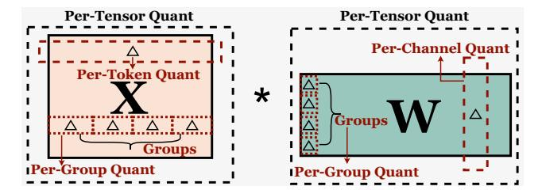

# 2 Background

In this section, we introduce quantization granularity in Section 2.1 and data type in Section 2.2. These two key techniques serve as the foundation for the design of our proposed framework.

### 2.1 Quantization Granularity for LLM

Quantization [45, 54, 61] maps high-precision values into discrete levels, with symmetric integer quantization [29] offering better hardware support and efficiency [77]. Specifically, the symmetric integer quantization process can be expressed as:

$$\Delta = \frac{max(|\mathbf{X}_f|)}{2^{b-1}-1}; \quad \mathbf{X}_q = \left\lfloor \frac{\mathbf{X}_f}{\Delta} \right\rfloor; \quad \hat{\mathbf{X}} = \mathbf{X}_q \cdot \Delta \tag{1}$$

where b is the bit width,  $\Delta$  is the scale factor,  $\mathbf{X}_f$  is the original floating-point tensor,  $\lfloor \cdot \rfloor$  is the rounding function,  $\mathbf{X}_q$  is the quantized integer value, and  $\hat{\mathbf{X}}$  is the floating-point tensor obtained after dequantization. As shown in Figure 4, quantization has different granularity levels, which significantly impact the accuracy of quantized LLMs [7]. Per-tensor quantization assigns a single scale factor to the entire matrix, while per-token and per-channel quantization improve flexibility by assigning separate scale factors to individual tokens and channels, respectively. A more widely adopted technique is group-wise quantization [13], where the input tensor is divided into fixed-size groups (e.g., 128 or 64 elements per group), each sharing a common scale factor. To further reduce quantization error, cluster-wise quantization [78] refines this strategy by subdividing each group into smaller clusters (e.g., 4 or 8 elements per cluster), allowing for finer-grained representation within each

Figure 4: Definition of per-tensor, per-token, per-channel, per-group quantization [77].  $\Delta$  is the scale factor introduced by different quantization granularity levels.

group. Although both group-wise and cluster-wise quantization improve model accuracy through increased granularity, the larger number of scale factors introduces additional memory overhead, which can become a bottleneck in low-bit settings.

Building on this insight, recent studies [7, 14, 19, 24, 26, 65, 78] on LLM quantization have increasingly focused on the impact of quantization granularity on model performance, showing that reducing granularity can often yield better results than simply increasing bit-width [14]. Nevertheless, most existing methods still adopt coarse-grained grouping, primarily due to the reduced memory overhead for scale factors. However, this design choice limits the ability to fully exploit the accuracy benefits of finer-grained quantization. As a result, effectively balancing quantization granularity and memory overhead has emerged as a key challenge in improving the overall performance of quantized LLMs.

