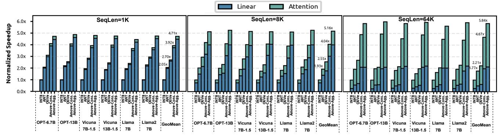
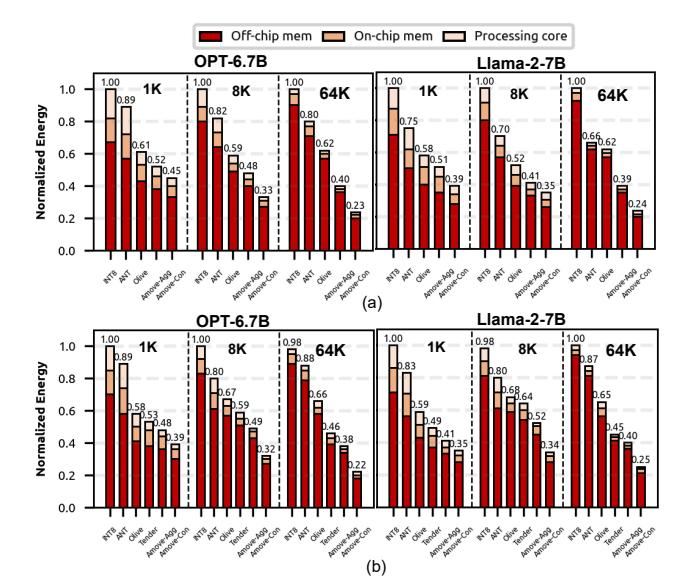

# 6.2 Accuracy Results

PPL Evaluation on Generative Tasks. Perplexity (PPL) [4] is a standard metric for generative language models, where lower values indicate better next-token prediction and thus higher generative quality. We compare the impact of different methods on generative tasks under both low-bit weight-only and weight-activation quantization, as shown in Table 4. For weight-activation quantization, Amove supports full 4-bit quantization for both linear and attention layers, while ANT, OliVe, and Tender only quantize linear layers. Benefiting from fine-grained quantization, Amove-Aggressive and Amove-Conservative achieve lower PPL. For low-bit weight-only quantization, the Amove quantization framework still delivers strong performance. Notably, when weights are reduced to 2 bits, baseline methods exhibit substantial degradation, whereas Amove-Conservative maintains usable accuracy, highlighting its robustness in ultra-low-bit settings.

Figure 10: Speedup on GPU tensor core architecture.

Figure 11: Speedup of different hardware accelerators.

Accuracy Evaluation on Discriminative Tasks. Table 5 shows the performance of quantized models on discriminative tasks. In the weight-activation quantization and low-bit weight-only quantization, Amove achieves higher accuracy. Amove-Conservative exhibits an average of less than 2% accuracy degradation under 4-bit weight-activation quantization and 3-bit weight-only quantization. Under 2-bit weight-only quantization, some accuracy degradation is observed, but it remains smaller than that of other methods.

Accuracy Evaluation on Zero-Shot Tasks. Table 6 presents the zero-shot performance on the MMLU benchmark under 4-bit weight-activation quantization. Amove-Conservative achieves average accuracy of 53.93% on Vicuna-1.5-13B and 38.67% on Llama2-7B, maintaining performance within 3% of FP16. Amove-Aggressive also delivers strong results, reaching 51.77% and 36.26% respectively, outperforming all baselines.

#### 6.3 GPU and Accelerator Performance

**GPU Performance and Energy.** Figure 10 presents the speedup comparisons of Amove and other quantization methods on GPU tensor core, showing that Amove achieves the best overall performance. On average, Amove-Conservative achieves 4.21×, 2.19×, and 1.69× speedups over INT8, ANT, and OliVe, respectively, while Amove-Aggressive achieves even higher speedups of 5.23×, 2.72×, and 2.13×. Moreover, the performance gains of Amove become more pronounced with increasing input sequence lengths, attributed to the growing dominance of attention computation in the overall runtime for longer inputs. Unlike other methods that quantize

Figure 12: (a) Energy consumption breakdown of GPU tensor core architecture. (b) Energy consumption breakdown of different hardware accelerators.

only linear layers, Amove quantizes both linear and attention layers, resulting in significantly higher acceleration under long-context scenarios. Figure 12(a) presents the normalized energy breakdown across different GPU tensor core architectures, decomposed into off-chip memory access, on-chip buffer access, and computation.

Figure 13: Normalized area and power of Amove and baseline INT4 thread group and PE.

Table 7: Area comparison of Amove and baseline INT4 tensor core and INT4 systolic array at 500 MHz.

| Architecture             | Setup            | Area (mm 2 ) |       |       |               |  |  |  |
|--------------------------|------------------|-------------------------|-------|-------|---------------|--|--|--|
| Arcintecture             | Setup            | Buffer                  | Core  | Total | Over Baseline |  |  |  |
| Int4 Tensor Core         | 64 thread groups |                         | 0.269 | 2.585 | -             |  |  |  |
| <b>Amove Tensor Core</b> | 64 thread groups | 256KB, 2.316            | 0.311 | 2.627 | 1.62%         |  |  |  |
| Int4 Systolic Array      | 32 × 32 PEs      | 230KB, 2.316            | 0.163 | 2.479 | -             |  |  |  |
| Amove Systolic Array     | 32 × 32 PEs      |                         | 0.191 | 2.507 | 1.13 %        |  |  |  |

On average, Amove-Conservative reduces energy consumption by  $2.33\times$ ,  $1.71\times$ , and  $1.33\times$  compared to INT8, ANT, and OliVe, respectively. Amove-Aggressive achieves energy reduction up to  $3.03\times$ ,  $2.22\times$ , and  $1.70\times$ . Among the three components, off-chip memory access dominates total energy consumption, and it grows with sequence length due to more frequent DRAM accesses.

**Accelerator Performance and Energy.** Figure 11 compares the performance of Amove against various quantization approaches on the accelerator. Amove consistently achieves the best overall performance across all baselines. On average, Amove–Conservative delivers speedups of  $6.01\times$ ,  $4.51\times$ ,  $3.14\times$ , and  $2.27\times$  over INT8, ANT, OliVe, and Tender, respectively, while Amove–Aggressive achieves greater speedups of  $6.95\times$ ,  $5.22\times$ ,  $3.63\times$ , and  $2.67\times$ . In terms of energy efficiency, Amove–Conservative reduces energy consumption by  $2.27\times$ ,  $1.91\times$ ,  $1.45\times$ , and  $1.18\times$  compared to the same baselines. Amove–Aggressive achieves energy reductions of  $3.23\times$ ,  $2.71\times$ ,  $2.07\times$ , and  $1.68\times$  over INT8, ANT, OliVe, and Tender, respectively.

Area and Power. As shown in Table 7, both the baseline INT4 tensor core and the Amove tensor core are configured with 64 thread groups, while both the baseline and Amove INT4 systolic array adopt a 32×32 PE configuration. To enable fine-grained quantization, the Amove tensor core introduces only a 1.62% area overhead, and the Amove systolic array incurs merely a 1.13% overhead. In addition, as shown in Figure 13, we compare the area and power overhead of Amove's thread groups and PEs under different precision settings, using the INT8 configuration as the baseline. Compared to INT4 thread groups, Amove incurs an 11.7% increase in area and a 12.9% increase in power. For the PE, Amove exhibits a 16.2% increase in area and a 17.1% increase in power relative to the INT4 configuration.

