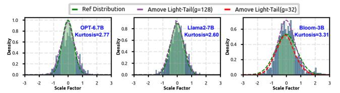

# 6.4 Sensitivity Analysis

Scale Factor Analysis on Different Models. Figure 14 shows the distribution of weight scale factors when different models are quantized to 4 bits. We compute the kurtosis [1, 41] for each model, where a kurtosis value below 3 indicates a tendency toward a light-tailed distribution [15]. For models such as Llama2-7B and OPT-6.7B, the distributions are more light-tailed, allowing the Amove data type to achieve accurate approximation by sharing a residual and base scale across 128 values. In contrast, Bloom-3B exhibits a kurtosis

Figure 14: Amove weight scale factor fitting error across multiple LLMs under different residual group sizes, based on the light-tailed distribution assumption.

Figure 15: Layer-wise scale factor fitting error of Amove on Wikitext2 in OPT-6.7B, resulting from the light-tailed distribution assumption under different residual group sizes.

greater than 3 due to the presence of more outliers [77]. However, we observe that as the residual group size decreases, our residual approximation mechanism remains effective in modeling distributions that deviate from the ideal light-tailed assumption. This demonstrates that Amove is robust to variations across model families and quantization scenarios, maintaining approximation quality under both favorable and less favorable statistical conditions.

Scale Factor Analysis on Different Layers. Figure 15 presents the layer-wise fitting error of the residual approximation mechanism on the OPT-6.7B model using the Wikitext2 dataset under different residual group sizes. It can be observed that the errors in the early and late layers are slightly higher than those in the middle layers, primarily due to the larger numerical fluctuations in the early and late layers of the model. However, as the residual group size decreases, the overall fitting error gradually reduces. This demonstrates that by flexibly adjusting the residual group granularity, the fitting error can be effectively controlled across different layers, enabling more precise quantization approximation. Moreover, the results suggest that Amove can adapt to heterogeneous layer characteristics, ensuring consistent approximation quality and preserving accuracy across the full depth of the model.

#### 6.5 Integration with Amove

Since Amove introduces a novel vectorized data type tailored for quantization granularity, it can be integrated into existing advanced quantization algorithms. Moreover, it can interoperate with existing advanced scalar formats, leading to enhanced accuracy in quantized LLMs. We validate the compatibility and effectiveness of Amove by integrating it into three representative quantization algorithms—GPTQ [20], AWQ [47], and OmniQuant [67]—and the emerging scalar data type M-ANT [26]. To facilitate integration, Amove is designed as a modular data representation layer that can be seamlessly inserted into existing quantization pipelines without altering their core logic. For example, in GPTQ, AWQ, and Omni-Quant, the scalar-based weight representation is replaced with the

Table 8: Comparison of Wikitext2 and C4 perplexity results for various software quantization methods and their Amove-integrated counterparts under the same bit-width.

| Model(PPL         | Model(PPL) |       | OPT-1.3B |       | OPT-6.7B |      | Llama-7B |       | a3-8B | - Mean ∧ PPI. |
|-------------------|------------|-------|----------|-------|----------|------|----------|-------|-------|---------------|
| Method            | Avg. Bits  | Wiki  | C4       | Wiki  | C4       | Wiki | C4       | Wiki  | C4    | · Mean AFFL   |
| FP16              | 16         | 14.62 | 14.72    | 10.86 | 11.74    | 5.68 | 7.08     | 6.14  | 8.88  | 0             |
| GPTQ(g=64)        | 3.25       | 18.96 | 15.89    | 11.29 | 12.19    | 6.43 | 8.04     | 7.72  | 12.82 | 1.70          |
| AWQ(g=64)         | 3.25       | 16.79 | 17.30    | 11.54 | 12.94    | 6.55 | 8.25     | 8.73  | 12.80 | 1.90          |
| Omniquant(g=64)   | 3.25       | 15.99 | 16.56    | 11.48 | 12.65    | 6.30 | 7.83     | 10.17 | 13.17 | 1.80          |
| GPTQ + Amove      | 3.25       | 18.32 | 15.81    | 11.20 | 12.17    | 6.31 | 7.94     | 7.63  | 12.33 | 1.50          |
| AWQ + Amove       | 3.25       | 16.53 | 16.75    | 11.36 | 12.69    | 6.57 | 7.92     | 8.61  | 12.04 | 1.59          |
| Omniquant + Amove | 3.25       | 15.89 | 16.34    | 11.44 | 12.56    | 6.16 | 7.77     | 8.64  | 11.62 | 1.34          |

Table 9: Wikitext2 and C4 perplexity comparison between M-ANT and Amove-integrated counterparts at equal bit widths.

| Model(PPL)    |           | OPT   | OPT-6.7B |       | OPT-13B |      | a-7B | - Mean △ PPL |  |
|---------------|-----------|-------|----------|-------|---------|------|------|--------------|--|
| Method        | Avg. Bits | Wiki  | C4       | Wiki  | C4      | Wiki | C4   | Mean AFFL    |  |
| FP16          | 16        | 10.86 | 11.74    | 10.13 | 11.20   | 5.68 | 7.08 | 0            |  |
| M-ANT(g=64)   | 4.25      | 11.29 | 12.33    | 10.62 | 12.01   | 6.09 | 7.63 | 0.55         |  |
| M-ANT + Amove | 4.25      | 11.14 | 12.26    | 10.45 | 11.90   | 6.06 | 7.52 | 0.44         |  |

Amove vectorized format, accompanied by corresponding adjustments to packing and unpacking procedures. The entire integration is implemented in PyTorch using vectorized operations, avoiding the need for custom CUDA kernels or hardware-specific modifications. This software-only approach ensures broad compatibility with mainstream toolchains and facilitates reproducibility across different quantization frameworks. Moreover, it lowers the barrier for adoption, as developers can directly integrate Amove into existing codebases with minimal changes, while still benefiting from improved accuracy and efficiency.

Orthogonal to Quantization Algorithms. The original versions of GPTQ, AWQ, and OmniQuant support both symmetric and asymmetric quantization modes [7]. For a fair comparison, we configure all three methods to use symmetric quantization, where weights are quantized to 3 bits and activations are kept in FP16 precision. When applying group-wise quantization, all methods adopt a consistent group size of 64 and use FP16 to represent the scale factors, resulting in an average bit-width of 3.25 bits. The integration requires only replacing their scalar weight format with the Amove representation, keeping the overall memory footprint unchanged. Table 8 reports the results after integration. The experiments show that incorporating Amove consistently improves the accuracy of the quantized models under the same average bit-width, achieving approximately a 25% reduction in perplexity on average.

Orthogonal to Quantization Scalar Data Type. M-ANT introduces a scalar data type for LLM quantization. For a fair comparison, we standardize all experimental settings. Since M-ANT primarily targets weight—activation quantization, we apply Amove in the same setting, quantizing both weights and activations to 4 bits. This alignment allows us to directly assess the impact of data type design while controlling for memory overhead. As shown in Table 9, Amove integrates seamlessly with M-ANT and reduces perplexity by over 20% under the same memory overhead.

### 7 Related Work

**LLM Quanzation Algorithms.** Numerous studies [20, 27, 36, 39, 47, 61, 77, 82] have proposed various quantization algorithms aimed at compressing LLMs to extremely low bit-widths for improved inference performance. Among them, methods such as GPTQ [20],

AWQ [47], and FineQ [78] primarily focus on weight compression, while approaches like SmoothQuant [77] and DuQuant [46] support quantization of both weights and activations. In addition, vector quantization techniques [45, 53] have also been explored to better capture correlations across dimensions and further enhance compression efficiency. However, these approaches often rely on complex techniques, which may limit the hardware efficiency. In contrast, Amove serves as an orthogonal optimization framework that emphasizes lightweight design and strong hardware compatibility. It not only integrates seamlessly with existing quantization algorithms but also enhances their effectiveness, thereby improving both inference accuracy and efficiency in practical deployment.

Quantization Data Type and Architecture Co-Design. Several data type and architecture co-design efforts have been proposed to better exploit the performance benefits of quantization. ANT [23] adaptively selects different data types for quantizing weights. OliVe [22] introduces Outlier and Victim Pair encoding to reduce quantization error. Figna [31] leverages hierarchical numeric formats for adaptive precision. Spark [49] introduces interval-based data types for reducing quantization error. M-ANT [26] proposes a mathematically adaptive numeric type that accommodates groupwise quantization. BitMoD [7] introduces fine-grained data type adaptation by using different numerical types to quantize groups of weights (e.g., 128 elements). Anda [19] employs an adaptive data format with group-shared exponent bits and dynamic mantissa bit allocation. Collectively, these works demonstrate a trend toward designing specialized data types that tightly couple algorithmic representation with hardware pathways, highlighting the importance of data type innovation for pushing quantization further. However, most of these designs are tailored for either low-bit weight-only or weight-activation quantization. In contrast, Amove is orthogonal to these designs and can be integrated with them to support both low-bit weight-only and weight-activation quantization modes.

#### 8 Conclusion

We present Amove, a data type and architecture co-design framework for efficient low-bit quantization of LLMs. We introduce a residual approximation mechanism to reduce the memory overhead of fine-grained quantization, enabling accurate low-bit weight-only and weight-activation quantization in a unified design. A fine-grained grouped vectorized data type is proposed to preserve salient points and outliers. Amove enables fully low-bit matrix multiplication and high-performance inference, achieving up to 2.13× speedup and 1.70× energy reduction on GPUs, and up to 2.67× speedup and 1.68× energy reduction on accelerators across multiple LLMs.

## Acknowledgments

We appreciate the valuable feedback and constructive suggestions provided by the anonymous reviewers of MICRO 2025. This work was supported in part by the National Key R&D Program of China under Grant No. 2023YFB4503100; in part by the National Natural Science Foundation of China under Grants 62272026 and 62104014; in part by the Fundamental Research Funds for the Central Universities, China under Grant No. YWF-23-Q-1015; in part by State Key Laboratory of Complex & Critical Software Environment under Grant No. CCSE-2024ZX-10.

