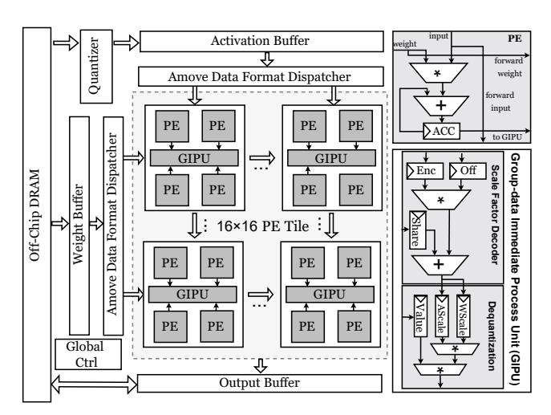

# <span id="page-2-1"></span>2.2 Data Type for Quantization

Flexible data types play a key role in bridging the gap between quantization algorithms and hardware efficiency [7, 24, 26, 31, 41, 49, 76]. Properly designed data types align with the precision and dynamic range requirements of quantization while leveraging hardware's computational and memory characteristics [51, 52]. Existing quantization data types [7, 22, 23, 26, 41, 65] can be broadly categorized into scalar and vector types. Scalar data types, such as ANT [23], M-ANT [26], and BitMoD [7], effectively capture diverse data distributions observed at the tensor or channel level. A representative vector data type is the MX data format [65]. Specifically, MX packs k data values into a block that shares a single exponent, normalizing each element in the block using this shared scale. Each element is then represented using either a floating-point number (e.g., MX-FP4) or an integer (e.g., MX-INT8) [14]. Moreover, vectorized data types naturally align with group-wise quantization and remain compatible with scalar formats. Therefore, the novel data type proposed in this work adopts a vectorized design to support both low-bit weight-only and weight-activation quantization modes.

#### 3 Motivation

In this section, through the analysis of fine-grained quantization and an extensive exploration of existing implementations, we have three key observations that motivate the design of the Amove framework.

Observation I: Fine-grained quantization improves accuracy but introduces substantial memory overhead. Fine-grained quantization localizes the impact of outliers and salient points to smaller regions, thereby improving the performance of quantized

<span id="page-3-0"></span>

Figure 5: (a) Kurtosis [41] at different quantization granularity levels on Wikitext2 [55] under weight-activation quantization(W4A4) (b) Dequantization error at different quantization granularity levels on Wikitext2 under low-bits weight-only quantization(W3A16). (c) Light-tailed distribution of scale factors under fine-grained group-wise quantization.

LLMs [26]. For weight–activation quantization, fine-grained group-wise quantization enables outlier smoothing into the scale factors. As these scale factors are applied during dequantization by multiplying with the quantized integers, they expand the dynamic range of the recovered values effectively, thereby providing a better representation of outliers, especially massive outliers. As illustrated in Figure 5(a), the decreasing kurtosis [41, 44] with smaller group sizes reflects successful outlier suppression. In low-bit weight-only quantization, fine-grained quantization schemes mitigate the effects of irregularly distributed salient points and outliers by improving local precision. This leads to reduced reconstruction error, as shown in Figure 5(b), where we measure the quantization loss using the L1 norm between original and dequantized weights:

$$loss = \sum_{i} |\mathbf{W}_{i} - \left\lfloor \frac{\mathbf{W}_{i}}{\Delta} \right\rfloor \cdot \Delta | \tag{2}$$

where  $\mathbf{W}_i$  denotes the original FP16 weights,  $\Delta$  is the scale factor,  $\lfloor \cdot \rceil$  is the rounding function. While effective in preserving accuracy, fine-grained quantization requires storing a large number of pergroup scale factors, resulting in substantial memory overhead.

Motivation I: Residual approximation mechanism leveraging light-tailed scale factor distributions. Under fine-grained group-wise quantization, we observe that the distribution of scale factors exhibits light-tailed characteristics [32], as illustrated in Figure 5(c), which is derived from the weight scale factors of the Llama2-7B model. Moreover, we further observe that this lighttailed characteristic holds across most LLMs, reinforcing its validity as a general assumption. For the few models that do not strictly exhibit this property, we can effectively approximate the less ideal light-tailed distributions by adjusting the grouping granularity of the shared base scale factor and its residuals, thereby maintaining low quantization error. A detailed error analysis is provided in Section 6.4. Notably, a similar trend is observed in VS-Quant [13], where the use of per-vector scale factors results in a concentrated distribution, reducing the need for excessive bit-widths to represent rare extreme values. In the light-tailed distribution, most values cluster around the mean, and extreme values are relatively rare, indicating limited variation within coarse-grained groups. This motivates the residual approximation mechanism: instead of storing a separate scale factor for each fine-grained cluster, we introduce a shared parameter as the base scale factor to represent the central

<span id="page-3-1"></span>Table 1: Comparison of Amove with other quantization data types.

| Quantization Data |            | Quantization         | Precision | Model    | Quantization Mode |     |  |  |
|-------------------|------------|----------------------|-----------|----------|-------------------|-----|--|--|
| Framework         | Type       | Granularity          | Bitwidth  | Accuracy | Low-bit W-only.   | W-A |  |  |
| GOBO [80]         | Scalar     | Token/Channel        | 16        | High     | X                 | /   |  |  |
| Mokey [81]        | Scalar     | Token/Channel        | 4 & 8     | Medium   | X                 | /   |  |  |
| ANT [23]          | Scalar     | Token/Channel        | 4 & 8     | Medium   | X                 | /   |  |  |
| OliVe [22]        | Scalar     | Token/Channel        | 4 & 8     | High     | ×                 | /   |  |  |
| M-ANT [26]        | Scalar     | Group-wise(g=64)     | 4 & 8     | High     | X                 | /   |  |  |
| BitMoD [7]        | Scalar     | Group-wise(g=128)    | 3/4 & 16  | High     | /                 | X   |  |  |
| Anda [19]         | Scalar     | Group-wise(g=32)     | 4 & 16    | High     | /                 | X   |  |  |
| MX [65]           | Vectorized | Group-wise(g=32)     | 4 & 4     | Low      | /                 | ✓   |  |  |
| Amove(Ours)       | Vectorized | Group-wise(g=4/8/16) | 4 & 4     | High     | /                 | /   |  |  |

\*Low-bit W-only represents low-bit weight-only quantization and W-A represents weight-activation quantization.

tendency of the group. Each cluster's specific scale factor can then be approximated by a small residual offset from the base scale factor. Owing to the light-tailed nature of the scale factor distribution, the residuals are generally small. This allows them to be compactly encoded with a few bits, reducing memory overhead while preserving fine-grained scale factor modeling, as detailed in Section 4.1.

Observation II: Existing quantization data types struggle to efficiently handle the distinct feature points arising in lowbit weight-only and weight-activation quantization modes. An effective data type plays a critical role in bridging quantization algorithms with efficient hardware execution while supporting both weight-only and weight-activation quantization modes. However, as shown in Table 1, recent scalar data types typically focus on one specific quantization mode. For example, mixed-precision data types such as ANT [23] and OliVe [22] primarily target outlier handling in activations, with limited support for preserving salient weights. In contrast, BitMoD [7] and Anda [19] focus on weight quantization, lacking mechanisms to protect the widespread outliers in activations. While the MX [65] data format supports both quantization modes via shared scale factor and exponent representations, it incurs notable accuracy degradation.

Motivation II: A unified data type that flexibly supports both weight-only and weight-activation quantization modes. To bridge this gap, we propose a novel vectorized data type based on a residual approximation mechanism. By decoupling shared scale representation from localized variations, the proposed format offers the flexibility needed to support both weight-only and weight-activation quantization modes. In addition, it efficiently captures local scale variations with minimal metadata and effectively

<span id="page-4-2"></span>

Figure 6: (a) Illustration of the proposed residual approximation mechanism, which models the distribution of cluster-wise scale factors using a shared group-wise base scale, a set of residuals, and compact per-cluster encodings. (b) Overview of the proposed fine-grained grouped vectorized data type. (c) A working example of the Amove quantization framework.

mitigates the influence of salient points and outliers. A detailed discussion is provided in Section 4.3.

Observation III: Mixed-precision quantization introduces hardware inefficiencies. By quantizing both weights and activations to low bit widths, the memory footprint and bandwidth requirements are significantly reduced, enabling more efficient execution of compute-intensive operations. To mitigate the accuracy degradation caused by low-bit activation quantization, the state-of-the-art architectures such as ANT [23], OliVe [22], and M-ANT [26] adopt mixed-precision computation (e.g., 4-bit weights and 8-bit activations), as shown in Table 1. However, this 4/8-bit mixed computation scheme introduces additional hardware complexity and limits the reusability and throughput of compute units.

Motivation III: Uniform low-bit quantization via data type and architecture co-design. To overcome the inefficiencies introduced by mixed-precision execution, Amove adopts a co-design of data type and hardware architecture, enabling both weights and activations in attention and linear layers to be uniformly quantized to 4 bits with negligible accuracy degradation. This design supports low-bit matrix multiplication, significantly reducing hardware complexity and enhancing energy efficiency. The effectiveness of this design is validated in both GPU tensor core and accelerator architectures, demonstrating broad applicability and substantial performance benefits. We detail these architectural advantages in Section 5.1 and Section 5.2.

#### 4 Amove Quantization Framework

In this section, we introduce the Amove quantization framework. Section 4.1 introduces the residual approximation mechanism designed to achieve a balance between model accuracy and memory overhead. Section 4.3 describes the proposed fine-grained grouped vectorized data type designed for LLM quantization. Section 4.2

elaborates on the applicability of Amove data type to both low-bit weight-only and weight-activation quantization modes.

## <span id="page-4-0"></span>4.1 Residual Approximation Mechanism

**Overview.** The residual approximation mechanism offers a novel approach to mitigate the memory overhead associated with finegrained group-wise quantization. This design is rooted in the observation that, under fine-grained group-wise quantization, the distribution of scale factors tends to be light-tailed. This statistical characteristic creates an ideal condition for residual-based modeling: when most values lie near the mean, the difference between the actual value and a shared reference (i.e., the base scale) is small and compressible. Hence, rather than storing every scale factor explicitly, we encode only their deviations from a base value using low-bit representations, significantly reducing memory overhead. Figure 6(a) visually depicts the workflow of this mechanism, which is central to the Amove quantization framework. First, a coarsegrained group is divided into multiple fine-grained clusters, each assigned its own scale factor. In particular, the largest among them is selected as the base scale factor, which typically also serves as the scale factor for the entire coarse-grained group. Residuals are then computed based on deviations from this base scale. Finally, a lightweight encoding scheme is employed to work together with the shared residual and the base scale factor to reconstruct the scale factor for each cluster. The flexibility of the mechanism, driven by configurable parameters such as group size, cluster size, and encoding bit-width, allows it to adapt to different quantization granularity levels, achieving a delicate trade-off between improving model accuracy and reducing the memory overhead.

## <span id="page-4-1"></span>4.2 Data Type Adaptation

**Residual Approximation Algorithm.** In the Amove quantization framework, the shared residual plays a critical role in determining

#### Algorithm 1: Residual Approximation Algorithm

```
Input: A coarse-grained group matrix G; Encoding bit-width E;
              Quantization bit-width b; Cluster size C
    Output: Residual R
1 // Step 1: Partition into Clusters
2 Divide G into K clusters \{C_1, C_2, \dots, C_K\}, K = |G|/C;
3 // Step 2: Compute Cluster-wise Scales
4 for i \leftarrow 1 to C do
         // Let X_f^{(i)} denote the data within cluster C_i
         Compute scale factor for cluster C_i as:
           \Delta_i = \frac{\max(|X_f^{(i)}|)}{2^{b-1}-1};
8 // Step 3: Select Base Scale
9 Set base scale \Delta_{base} = \max\{\Delta_1, \ldots, \Delta_C\};
10 // Step 4: Compute Residual
11 if G is activation data then
          Compute residual as:
12
             R = \frac{1}{C \cdot E} \sum_{i=1}^{C} |\Delta_i - \Delta_{\text{base}}|;
13
14
   else
         // G is weight data
15
             R = \frac{1}{C \cdot E} \sum_{i=1}^{C} |\Delta_i - \Delta_{\text{base}}|;
16
             e_i = \left[\frac{\Delta_i - \Delta_{\text{base}}}{R}\right], \text{ where } e_i \in \left[-2^{E-1} - 1, 0\right];
17
         Define search range R \in [M, N] with search step Q;
18
          Construct candidate set:
             \mathcal{R} = \{ R \mid R = M + k \cdot Q, \ k \in \mathbb{Z}, \ M \le R \le N \};
20
21
          Compute optimal residual:
             R = \arg\min_{R \in \mathcal{R}} \sum_{i=1}^{C} (\Delta_i - (\Delta_{\text{base}} - e_i \cdot R))^2;
22
```

Table 2: Comparison of scale factor memory overhead.

23 return R:

<span id="page-5-3"></span>

| Method             | Scale/Residual<br>Bit-Width | Encoding<br>Bit-Width | Group<br>Size | Cluster<br>Size | Scale Factor<br>Avg. Bits |
|--------------------|-----------------------------|-----------------------|---------------|-----------------|---------------------------|
| Group-Wise         | S = 16(FP16)                | -                     | 4             | -               | 16/4 = 4                  |
| MX Format          | S = 8(FP8)                  | -                     | 4             | -               | 8/4 = 2                   |
| Amove-Aggressive   | S = 8(FP8), R = 8(FP8)      | 2                     | 128           | 16              | (8+8)/128+2/16=0.25       |
| Amove-Conservative | S = 8(FP8), R = 8(FP8)      | 2                     | 32            | 4               | (8+8)/32 + 2/4 = 1        |

the offset between cluster scale factors and the base scale factor. To minimize the loss between them, we propose a residual approximation algorithm, as detailed in Algorithm 1. Once fine-grained grouping is performed and the corresponding scale factors are computed, the base scale is selected to serve as a reference for residual calculation. The residual computation strategy differs for activations and weights due to their distinct properties. Weights are static and available before deployment, enabling offline quantization. A localized search within predefined bounds is used to minimize quantization error based on mean squared error (MSE) [10]. In contrast, activations are input-dependent, so we support both offline calibration and online quantization. The offline mode applies the same optimization as for weights, while the online mode addresses potential distribution shifts between calibration and inference. Specifically, activation residuals are computed as the average deviation between cluster-wise and base scale factors, significantly reducing online overhead.

## <span id="page-5-0"></span>4.3 Fine-Grained Grouped Vectorized Data Type

Overview. Built upon the residual approximation mechanism, the proposed Amove data type can be viewed as an extension of the MX data format, offering enhanced support for fine-grained quantization. In contrast to the MX data format, which uses only a shared scale for a group, the proposed format additionally introduces shared residuals and encodings. Figure 6(b) shows its overall structure, which comprises a shared base scale, a shared residual, a set of encodings, and a group of elements. Within this format, the residual and the base scale factor are shared across the entire group, while each cluster is associated with a distinct encoding. Moreover, this data type provides high flexibility and extensibility, as each group can adopt any scalar data type, such as INT4, FP4, or emerging data types like M-ANT [26], which can further improve the accuracy of quantized LLMs across different data types, as further discussed in Section 6.5.

**Quantization Process.** The fine-grained grouped vectorized data type introduces negligible computational overhead, making the quantization process relatively simple and performed according to the following equation:

<span id="page-5-2"></span>
$$S_{c_i} = S_{shared} - R \cdot E_{c_i}; \quad X_q^{c_i} = \left\lfloor \frac{X_{c_i}}{S_{c_i}} \right\rfloor; \quad \hat{X}_{c_i} = X_q^{c_i} \cdot S_{c_i} \quad (3)$$

where  $S_{c_i}$  denotes the scale factor of the i-th cluster, and  $S_{shared}$  is the shared base scale factor, also used as the group quantization scale and computed via Equation 1. R is the residual from the approximation algorithm and  $E_{c_i}$  is the encoding for cluster i.  $X_q^{c_i}$  and  $X_{c_i}$  denote the quantized and original FP16 values of the i-th cluster, respectively;  $\lfloor \cdot \rfloor$  is the rounding function, and  $\hat{X}_{c_i}$  is the dequantized result. The compute flow of the proposed data type aligns with the MX format  $\lfloor 65 \rfloor$ .

Enabling Low-bit Weight-only and Weight-activation Quantization. In weight-activation quantization, both weights and activations are converted into the fine-grained grouped vectorized data type, whereas in low-bit weight-only quantization, only the weights are processed in this format. Specifically, quantization is applied to weights along the channel dimension and activations across the token dimension. We consider two configurations.

- Amove-Aggressive employs FP8 (E4M3) to represent both the shared base scale factor and residual. For linear layers, it uses a group size of 128 and cluster size of 16 with 2-bit encoding, resulting in an average memory overhead of 0.25 bits per value. For attention layers, a smaller group size of 32 and a cluster size of 4 are used; with the same encoding, the overhead increases to 1 bit per value.
- Amove-Conservative uses FP8 (E4M3) for both the shared base scale factor and residual, with 32 values per group and 4 values per cluster for both weights and activations. This configuration is applied to both linear and attention layers. With 2-bit encoding per cluster, it incurs an average memory overhead of 1 bit per value.

The two configurations of the proposed data type adopt different strategies for linear and attention layers, as existing studies [3, 26, 28] have shown that attention layers pose greater challenges for quantization compared to linear layers. The  $QK^{\mathsf{T}}$  operation often produces intermediate results with large dynamic ranges and

<span id="page-6-1"></span>

Figure 7: Illustration of GPU tensor core architecture extended to support the Amove quantization framework.

more outliers, while attention outputs involve multiple weighted aggregations where quantization errors can accumulate and amplify. Thus, more precise encoding is needed for attention layers.

Working Example. Figure 6(c) presents a working example of the Amove quantization framework with a group size of 16 and a cluster size of 4. The process consists of four steps in total. First, the shared scale factor is computed using Equation 1. Then, the shared residual is derived based on the residual approximation algorithm. Next, each cluster's encoding is subsequently calculated using Equation 3, forming the fine-grained grouped vectorized data type. Finally, the scale factor for each cluster is recovered and used in the dequantization process to obtain the output matrix.

**Memory Alignment Design.** Both Amove-Aggressive and Amove-Conservative maintain byte-aligned memory access. For example, when both weights and activations are quantized to 3 bits and stored separately, each group in Amove-Conservative consists of 32 elements. The scale factors are represented using an 8-bit base scale and an 8-bit residual, and the quantized weights occupy  $32 \times 3 = 96$  bits. The group is further divided into 4 clusters, each assigned a 2-bit encoding, totaling  $(32/4) \times 2 = 16$  bits. As a result, the total memory overhead per group is 8 + 8 + 96 + 16 = 128 bits. The same configuration applies to activations. This demonstrates that the proposed format supports byte-aligned memory access regardless of the quantization bit-width.

**Scale Factor Memory Overhead Analysis.** Assuming a group size of K and using FP16 for the scale factor, the average additional memory overhead is 16/K bits per value. The MX data format employs FP8 for the scale factor, reducing the overhead to 8/K bits per value. For the proposed fine-grained grouped vectorized data type, assuming a group size of K, a cluster size of C, bit-widths of R and S for the shared residual and base scale factor respectively, and B bits for the encoding of each cluster, the average additional memory overhead is given by (R+S)/K+B/C. As shown in Table 2, when the group size is set to 4, Amove–Conservative reduces the scale factor memory overhead by  $4\times$  and  $2\times$  compared to group-wise quantization and MX formats, respectively, while Amove–Aggressive achieves reductions of  $16\times$  and  $8\times$ , respectively.

<span id="page-6-2"></span>

Figure 8: Illustration of systolic array architecture extended to support the Amove quantization framework.

#### 5 Amove Architecture

In this section, we provide a detailed description of how Amove can be efficiently integrated into GPU tensor core and accelerator architectures with only minimal hardware modifications.

#### <span id="page-6-0"></span>5.1 GPU Tensor Core

Microarchitecture Overview. With the growing adoption of group-wise quantization schemes, NVIDIA's Blackwell [71] architecture GPUs have incorporated native support for the MX data format [56]. However, the current design offers limited flexibility in supporting fine-grained quantization and scale factor handling. In this work, we present an architectural enhancement of the tensor core to enable precise 4-bit weight–activation quantization while achieving high computational efficiency through a set of hardware optimizations. As shown in Figure 7, we adopt the NVIDIA Ampere tensor core architecture (e.g., A100) [59, 64, 84] as our baseline and illustrate the modified architecture integrated with the Amove framework.

**Execution Pipeline with Residual-Based Scale Factor De**coding. The proposed Amove tensor core architecture employs a structured five-stage pipeline optimized for low-bit matrix computation, integrating the scale factor decoder directly into the execution path. (1) Preload: Input data encoded in the Amove data format undergoes structured unpacking and is loaded into the register file. This stage decomposes the compact representation into base scale, residual offset, encoding index, and quantized values, organizing them for parallel access by subsequent compute and decoding units. (2) **Dispatch:** The quantized data is selectively routed to specialized hardware modules according to the structure of the Amove data type. The base scale, residual, and encodings are sent to scale factor decoders, while the quantized integer elements are dispatched to the DP units to perform matrix multiplications. (3) Computation: Matrix multiplications are executed within the DP units, where each thread group performs parallel multiply-accumulate (MAC) operations on quantized values. Simultaneously, the scale factor decoders reconstruct per-cluster scale factors. (4) Dequantization: The outputs of the matrix computation are combined with the decoded scale factors to produce the final outputs. (5) **Write-back:** The final computed outputs are transferred to off-chip memory.

## <span id="page-7-0"></span>5.2 Systolic Array

**Microarchitecture Overview.** Figure 8 illustrates the enhanced systolic array architecture [8, 33, 34] adopted in Amove, which extends conventional designs to support Amove data types. To enable this, both the weight and activation buffers are redesigned to store the proposed data format and provide sufficient access bandwidth to the compute units. The dispatcher orchestrates the data movement by routing different components of the Amove data type to the appropriate computational paths. Specifically, the shared base scales, residuals, and encodings are distributed to dedicated Group-data Immediate Processing Units (GIPU), while the quantized integer elements are sent to the PEs for matrix multiplication. The computing unit consists of a  $16 \times 16$  systolic array of tiles, where each tile contains four PEs arranged in an output-stationary dataflow [68].

GIPU Design. Each PE tile integrates a GIPU composed of a scale factor decoder and a dequantization unit, which operate following the residual approximation mechanism. Notably, each GIPU is shared across four PEs and supports vectorized dequantization at a group size of 4, which corresponds to the quantization granularity adopted in the Amove data format. The scale factor decoder avoids a LUT-based approach, resulting in lower area overhead. To minimize pipeline stalls, the GIPU operates in a decoupled manner from the main compute datapath, enabling concurrent dequantization and matrix multiplication. Once dequantized, the results are accumulated using FP16 precision to preserve numerical stability.

## 5.3 Overlapped Decoding and Computation

To mitigate the latency overhead associated with scale factor decoding in fine-grained quantization, the Amove tensor core and systolic array adopt a parallel decoding strategy that overlaps scale factor recovery with matrix multiplication. Specifically, during the computation stage, 4-bit quantized values are processed for MAC operations, while dedicated decoders simultaneously decode the scale factors from compact representations of base scales, residuals, and encoding bits. This design hides decoding latency within the compute phase, avoiding pipeline stalls. The regularity of the Amove data type and predictable operand access patterns further enable efficient streaming of scale factors in sync with MAC execution.

## 5.4 Tightly Coupled Per-Group Dequantization

We introduce a tightly coupled per-group dequantization unit into the tensor core and the systolic array, eliminating the impact of conventional global dequantization stages [48]. In traditional groupwise or channel-wise quantization schemes, partial sums must be decoded into floating-point format and transferred to subsequent processing modules after each MAC operation, thereby disrupting dataflow continuity. In contrast, our design enables local scale factor decoding within each PE tile or thread group, followed by immediate dequantization of MAC outputs that are directly converted to floating-point representation for subsequent accumulation. This tightly coupled pathway removes pipeline stages and buffers required by conventional dequantization approaches, achieving

**Table 3: Customized Smma Instruction Format** 

<span id="page-7-1"></span>

| Field        | Description                                                                                   |
|--------------|-----------------------------------------------------------------------------------------------|
| Instruction  | $Smma.\{M\}\{N\}\{K\}.\{A_{dtype}\}\{W_{dtype}\}\{Sf_{dtype}\}\{Acc_{dtype}\}\{O_{dtype}\}\}$ |
| M, N, K      | Matrix dimensions                                                                             |
| $A_{dtype}$  | Activation matrix data type                                                                   |
| $W_{dtype}$  | Weight matrix data type                                                                       |
| $Sf_{dtype}$ | Scale factor data type                                                                        |
| Accdtype     | Accumulation data type                                                                        |
| $O_{dtype}$  | Output matrix data type                                                                       |

higher-throughput data paths while maintaining computational precision. Furthermore, the local dequantization unit is suitable for fused operations (e.g., LayerNorm and activation functions) [7], enabling necessary numerical transformations without writing back full-precision intermediate results.

## 5.5 Lightweight Architectural Extension

The Amove tensor core and systolic array adopt a minimal set of lightweight hardware extensions. In particular, a dedicated scale factor decoder and dequantization unit are integrated into the architecture to support the custom data format, while preserving the original 4-bit multipliers in the datapath. To maintain numerical fidelity during accumulation, only the accumulation registers are upgraded to FP16, providing enhanced dynamic range and precision after dequantization. This design avoids large-scale restructuring of the compute pipeline and ensures maximal reuse of existing computation units, achieving compatibility with fine-grained quantization at negligible area overhead, as detailed in Section 6.3.

## 5.6 Instruction and Programming Model

To enable programming with Amove, we introduce a customized Smma instruction set as an architectural extension to the standard MMA interface on GPUs [12, 69].

 $\mathbf{Smma.}\{M\}\{N\}\{K\}.\{A_{dtype}\}\{W_{dtype}\}\{Sf_{dtype}\}\{Acc_{dtype}\}\{O_{dtype}\}$ Table 3 summarizes the meaning of each instruction field. *M*, *N*, and K specify the matrix dimensions.  $A_{dtype}$  denotes the data type of the activation matrix, while  $W_{dtupe}$  represents the weight format.  $Sf_{dtype}$  indicates the format of the scale factors.  $Acc_{dtype}$ and  $O_{dtype}$  refer to the data types for accumulation and output, respectively. The computation follows the form  $O_{\text{dtype}}[M, N] =$  $\mathcal{D}(A_{\text{dtype}}[M, K] \times W_{\text{dtype}}[K, N], Sf_{\text{dtype}}) + Acc_{\text{dtype}}[M, N], \text{ where}$  $\mathcal{D}(\cdot)$  denotes the residual-based dequantization function. For the compiler, the introduction of the Amove data type and Smma instruction requires awareness of the underlying data layout and instruction semantics. The compiler is responsible for managing quantized operands and scale factors in the Amove format, and for exposing appropriate APIs to the upper layers. The scale factor type  $Sf_{dtype}$  encodes both precision and format, enabling fine-grained control and quantization-aware optimizations during code generation. For the programmer, these complexities are abstracted away. Model definitions remain unchanged, and matrix operations are issued through high-level APIs that are automatically lowered to Smma instructions with data transformations.

<span id="page-8-0"></span>

Figure 9: Evaluation of end-to-end simulator accuracy.

