# H2-LLM: Hardware-Dataflow Co-Exploration for Heterogeneous Hybrid-Bonding-based Low-Batch LLM Inference

Yihan Yin

School of EECS

Peking university

Beijing, China

## Cong Li

School of Integrated Circuits Peking University Beijing, China leesou@pku.edu.cn

## Jingchen Zhu

School of Computer Science Peking University Beijing, China zjc990112@pku.edu.cn

## Qiang Wu

Houmo AI Beijing, China qiang.wu@houmo.ai

## yyhsess2021@stu.pku.edu.cn Zhutianya Gao

Shanghai Jiao Tong University Shanghai, China zechariah0825@sjtu.edu.cn

#### Xin Si

SouthEast University Nanjing, China xinsi@seu.edu.cn

## Xintong Wu

School of EECS
Peking University
Beijing, China
vincent\_xt@stu.pku.edu.cn

#### Dimin Niu

Alibaba Group Inc. Sunnyvale, USA dimin.niu@alibaba-inc.com

#### Yuan Xie

HKUST Hong Kong, China yuanxie@ust.hk

## Chen Zhang\*

Shanghai Jiao Tong University Shanghai, China chenzhang.sjtu@sjtu.edu.cn

## Guangyu Sun\*

School of Integrated Circuits
Peking University
Beijing, China
Beijing Advanced Innovation Center
for Integrated Circuits
Beijing, China
gsun@pku.edu.cn

#### **Abstract**

Low-batch large language model (LLM) inference has been extensively applied to edge-side generative tasks, such as personal chat helper, virtual assistant, reception bot, private edge server, etc. To efficiently handle both prefill and decoding stages in LLM inference, near-memory processing (NMP) enabled heterogeneous computation paradigm has been proposed. However, existing NMP designs typically embed processing engines into DRAM dies, resulting in limited computation capacity, which in turn restricts their ability to accelerate edge-side low-batch LLM inference.

To tackle this problem, we propose H2-LLM, a <u>Hy</u>brid-bondingbased <u>H</u>eterogeneous accelerator for edge-side low-batch <u>LLM</u> inference. To balance the trade-off between computation capacity and bandwidth intrinsic to hybrid-bonding technology, we propose

 $^*$ Co-corresponding authors.

Permission to make digital or hard copies of all or part of this work for personal or classroom use is granted without fee provided that copies are not made or distributed for profit or commercial advantage and that copies bear this notice and the full citation on the first page. Copyrights for components of this work owned by others than the author(s) must be honored. Abstracting with credit is permitted. To copy otherwise, or republish, to post on servers or to redistribute to lists, requires prior specific permission and/or a fee. Request permissions from permissions@acm.org.

ISCA '25, Tokyo, Japan

© 2025 Copyright held by the owner/author(s). Publication rights licensed to ACM. ACM ISBN 979-8-4007-1261-6/25/06

https://doi.org/10.1145/3695053.3731008

 $\rm H^2\text{-}LLM$ 's architecture and extract its architecture design space. We further propose a data-centric dataflow abstraction to fully exploit the heterogeneous architecture's acceleration opportunities in low-batch LLM inference. Based on the whole design space, we propose a design space exploration (DSE) framework to automatically find out the optimal design. Compared with existing in-die NMP-based heterogeneous accelerators,  $\rm H^2\text{-}LLM$  achieves 2.72× geomean speedup and 1.48× geomean better energy efficiency.  $\rm H^2\text{-}LLM$ 's data-centric dataflow exploration framework is open-sourced at https://github.com/leesou/H2-LLM-ISCA-2025.

#### **CCS Concepts**

• Computer systems organization  $\rightarrow$  Heterogeneous (hybrid) systems.

#### **Keywords**

Large Language Model, Hybrid Bonding, Near-Memory Processing

#### **ACM Reference Format:**

Cong Li, Yihan Yin, Xintong Wu, Jingchen Zhu, Zhutianya Gao, Dimin Niu, Qiang Wu, Xin Si, Yuan Xie, Chen Zhang, and Guangyu Sun. 2025. H²-LLM: Hardware-Dataflow Co-Exploration for Heterogeneous Hybrid-Bonding-based Low-Batch LLM Inference. In *Proceedings of the 52nd Annual International Symposium on Computer Architecture (ISCA '25), June 21–25, 2025, Tokyo, Japan.* ACM, New York, NY, USA, 17 pages. https://doi.org/10.1145/3695053.3731008

#### 1 Introduction

Generative large language models (LLMs) (e.g., GPT family [6, 58, 65], LLaMA family [14, 71, 72], etc.) have demonstrated outstanding ability in a wide range of applications such as chatbot [19, 57], code completion [9, 17, 54], and many other generative tasks [11, 66, 86, 86]. Apart from being deployed as a cloud service for millions of users [3, 17, 19, 57], LLMs are gradually sinking to edge-side platforms to meet user's requirements for function availability, personalization, and data privacy [15, 23, 29, 30, 42, 49, 53, 63, 75], as exemplified in Fig. 1. Different from the large-batch characteristic in cloud-level applications [24, 60], these edge-side LLM services feature a low-batch property (one to a few tens) due to their personalized nature and require low-latency processing to maintain a smooth user experience.

Performing efficient LLM inference requires the hardware to effectively handle its two stages: prefill and decoding. In the prefill stage, the LLM processes the input token sequence (i.e., the prompt) in a single step, leveraging high computational parallelism among hundreds to thousands of tokens. In contrast, the decoding stage processes one token of each request per iteration, behaving memory-intensive nature due to the low data reuse. To meet such disparate demands, Near-Memory Processing (NMP) based heterogeneous architectures have been widely proposed [24, 37, 39, 41, 47, 60, 85]. These architectures combine conventional centralized processors (e.g., GPUs) with processing engines embedded in memory channels to accelerate both computation-intensive and memory-intensive operators. In this way, they have achieved notable performance improvements in cloud-level LLM inference scenarios.

However, existing NMP designs typically place NMP processing engines into DRAM dies (defined as "in-die NMP" in this paper) [37, 39, 41, 43, 44], providing extremely low computation capacity due to DRAM technology's scarce logic resources [13]. This prevents them from fully accelerating low-batch LLM inference: First, the speedup brought by in-die NMP diminishes as the batch size increases. At the same time, the limited batch size fails to alleviate the memory-bound issue to the centralized processor in the decoding stage. Consequently, both the centralized processor and the NMP processing engines can be sub-optimal in low-batch inference. Second, with the increased arithmetic intensity introduced by multi-head attention's variants [1, 67], in-die NMP falls short of sustaining its superior performance to attention operators. Although a recent work [85] has attempted to enhance the NMP computation capacity, the high power consumption of its underlying HBM memory makes it unsuitable for edge-side scenarios.

The recent emerging hybrid bonding (HB) technology [7, 16, 33, 55, 79, 84] seems to be a promising alternative to existing methods. It not only offers considerable bandwidth with lower power consumption than HBM [16, 55], but also enables NMP computation capacity enhancement by customizing processing engines on the incorporated logic die. However, there are still several challenges in designing a hybrid-bonding-based heterogeneous accelerator for low-batch LLM inference. For architecture design, hybrid bonding's high bandwidth comes at the cost of controllers occupying a significant portion of the logic die's area, resulting in a trade-off between computation capacity and bandwidth. As to dataflow design, fixed operator mappings [24, 37, 39, 60] cannot fully utilize

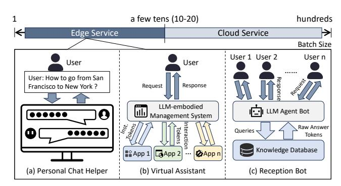

Figure 1: Edge-Side LLM Services.

the acceleration opportunities of the heterogeneous architecture in low-batch LLM inference, while the prefill-unaware nature in existing dataflow exploration [47] may hurt the end-to-end performance, despite its capability in decoding stage acceleration.

To tackle these challenges, we propose H²-LLM, a hybrid-bonding-based heterogeneous accelerator for edge-side low-batch LLM inference. H²-LLM is the first work aiming to comprehensively explore the computation-bandwidth trade-off intrinsic to hybrid bonding for LLM inference. To this end, we propose H²-LLM's heterogeneous hybrid bonding architecture and extract its architecture design space. To fully utilize the acceleration potential of H²-LLM's architecture, we propose a *data-centric* dataflow abstraction and extract the dataflow design space. Based on the design space, H²-LLM's DSE framework can automatically find out the optimal design. To summarize, we have made the following contributions:

- We analyze the deficiencies of in-die NMP architectures and pose the chances and challenges of hybrid bonding for lowbatch LLM inference on edge.
- We propose H2-LLM's heterogeneous hybrid bonding architecture and extract its architecture design space to explore the computation-bandwidth trade-off inherent in hybrid bonding.
- We propose H2-LLM's data-centric dataflow abstraction to fully exploit the capability of H2-LLM's heterogeneous architecture.
- We summarize several takeaways for future heterogeneous hybrid bonding architecture design by conducting case studies in H²-LLM's design space.

Extensive experiments demonstrate that  $\mathrm{H}^2$ -LLM outperforms existing in-die NMP-based heterogeneous accelerators by 2.72× (geomean) speed up and 1.48× (geomean) better energy efficiency.

#### 2 Background

#### 2.1 Transformer-based LLMs

As illustrated in Fig. 2-(a), mainstream LLMs are built on top of transformer decoder layers [73]. The token embedding at the beginning converts input tokens to embeddings which decoder layers can process, while the language model (LM) head at the end translates output embeddings to new tokens. A conventional transformer layer contains a multi-head attention (MHA) block and a feed-forward network (FFN) block, both of which are accompanied by normalization and residual layers. In the MHA block, the input embeddings are first projected to query, key, and value vectors by three fully-connected (FC) layers (Q, K, V). Then, these vectors are

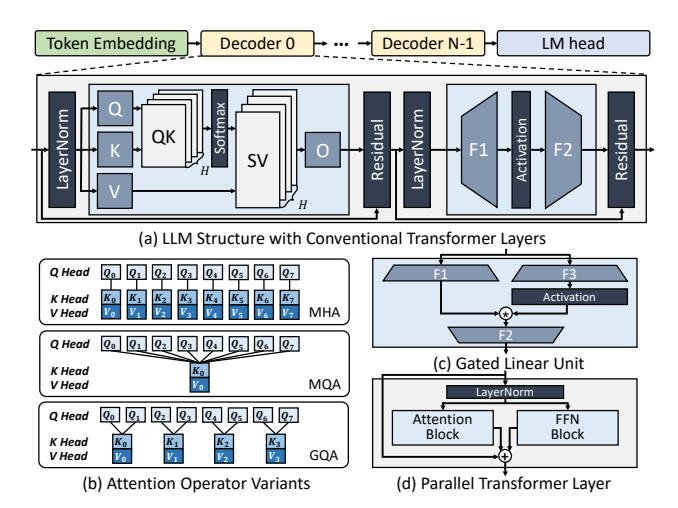

Figure 2: LLM Architecture and Transformer Variants.

split into *H* heads. In each head, every query vector is multiplied with the key vectors before its position (QK). After being processed by the softmax function, the attention scores are applied to corresponding value vectors (SV). The outputs are then concatenated and projected by the output projection FC layer (O). The FFN block followed by the MHA block contains a bottom FC layer (F1) and a top FC layer (F2). The output of F1 needs to be processed by an activation function (e.g., GeLU [22]) before being sent to F2.

Apart from the conventional transformer layer introduced above, there are several variants adjusting the layer structure: Multi-query attention (MQA) [2, 11, 18, 67] and group-query attention (GQA) [1, 4, 14, 72] are proposed to alleviate the memory-intensive issue in MHA [24, 60]. As depicted in Fig. 2-(b), MQA groups all key heads to one key-value head pair, while GQA generalizes MQA to keep more than one key-value head pair (four in this example). In addition to the computation pattern of attention operator, transformer layer's operator organization can also be adjusted. As shown in Fig. 2-(c), gated linear units (GLUs) [11, 14, 68, 72] introduce one more bottom FC (F3) to the FFN block. In the parallel transformer layer [11, 34, 74] illustrated in Fig. 2-(d), the attention block and the FFN block share the same input and can be processed concurrently.

#### 2.2 LLM Inference on Edge

Recently, LLMs are anticipated to be deployed on edge-side platforms such as smart home equipment, household servers, and intelligent cockpit, etc., owing to their powerful capabilities in managing and executing a wide range of complex tasks. As exemplified in Fig. 1, the personal chat helper offers instant replies to user's questions [42]. The virtual assistants in smart home equipment or intelligent cockpits [29, 30, 53] receives the user's instructions and interacts with multiple application interfaces or firmwares. The reception bot [23, 63, 75] in hospitality environments obtains the customers' queries and provide adequate guidance. Besides, due to the data privacy issue, LLMs can also be deployed on the private edge server for the internal cooperation in creative teams [76, 77, 82].

LLM inference on edge exhibits two major characteristics: First, due to the personalized nature and the demand for low-latency interaction, edge-side LLM services typically handles a small number of requests at a time. For instance, the personalized chatbot (e.g.,

**Table 1: Workload Analysis for Representative Use Cases** 

| Use Case              | Dataset            | Avg. Prompt Len. | Avg. Decoding Len. |  |
|-----------------------|--------------------|------------------|--------------------|--|
| Code Completion       | HumanEval (HE) [9] | 157              | 67                 |  |
| Chatbot               | ShareGPT (SG) [70] | 783              | 209                |  |
| Context Understanding | LongBench (LB) [5] | 1886             | 97                 |  |
| Question Answering    | LooGLE (LG) [48]   | 1971             | 17                 |  |

Jetson's text generation webui [42]) communicates with single user. The LLM-embodied management system interacts with several interfaces (e.g., 6 in AIOS [53]). The reception bot or private edge server can provide LLM service to a few tens of users.

Second, personalized LLM inference applications exhibit varied workload distributions (i.e., prompt and decoding length) across different use cases. To demonstrate such diversity, we analyse four typical LLM applications using corresponding open-source datasets: code completion (HumanEval [9]), chatbot (ShareGPT [70]), context understanding (LongBench [5]), question answering (LooGLE [48]). The context length is configured as 2048 considering edge-side platform's confined resource provision. As listed in Table 1, for code completion and chatbot applications, the prompt and decoding length presents comparable orders of magnitude, thus behaving "decoding heavy" nature according to previous profiling results [26, 60]. On the other hand, the prompt length in context understanding and question answering is one or two magnitudes longer than the decoding length, leading to a higher share of prefill latency ("prefill heavy") [26, 60]. Therefore, it is crucial to efficiently handle both prefill and decoding stages to enhance user experience.

## 2.3 Heterogeneous NMP Accelerators for LLMs

Near-Memory Processing has been a promising solution to accelerate memory-intensive applications [12, 20, 31, 36, 45, 46, 50, 80, 81, 83, 91, 92]. To efficiently handle both prefill and decoding stages, NMP-enabled heterogeneous accelerators have been proposed by both the industry [37, 39, 41] and the academia [24, 47, 60]. In these proposals, apart from the conventional centralized processor (e.g., GPU, TPU, etc.), processing engines (PEs) are also placed into memory channels. By driving these intra-channel PEs to execute concurrently, they can utilize DRAM's bank-level parallelism, thus providing abundant bandwidth for memory-intensive operators in LLM inference. For example, Samsung equips NMP-enabled HBM cubes with AMD's MI100 GPU [39]. By offloading all FC layers to NMP PEs, it can accelerate single-batch GPT-J 6B inference against GPU-only architectures. SK-Hynix offloads MHA operators to NMPenabled GDDR6 memory system and leave FC operators to GPUs, which can outperform GPU-only systems [37]. AttAcc and NeuPIMs [24, 60] adopts dedicated NMP-enabled HBM cubes to accelerate MHA operators in large-batch cloud inference. SpecPIM [47] explores the execution mapping between the centralized accelerator and the NMP PEs for different LLMs used in speculative inference. Apart from proposals targeting for cloud-level LLM inference, Samsung and SK-Hynix also propose concept NMP products based on LPDDR5 [39] and LPDDR5X [37] for on-device LLM inference.

#### 3 Motivation

## 3.1 Limitations of Existing In-Die NMP Designs

Existing NMP-enabled heterogeneous LLM accelerators typically place NMP PEs together with the DRAM arrays in the same memory

Table 2: Commodity In-die NMP Proposals for LLMs

| Product                | NMP Bandwidth            | NMP Computation Capacity | NMP CompBW. Ratio |  |
|------------------------|--------------------------|--------------------------|-------------------|--|
| HBM-PIM [39, 43]       | 1-1.229 TB/s per cube    | 1.2 TFLOPS per cube      | ~1 FLOP/Byte      |  |
| HBM-PIM [39, 43]       | ( 4× external bandwidth) | (9.6 GFLOPS per PE)      |                   |  |
| GDDR6-AiM [37, 41, 44] | 512 GB/s per channel     | 512 GFLOPS per channel   | 1 FLOP/Byte       |  |
|                        | (16× external bandwidth) | (32 GFLOPS per PE)       | I FLOF/Byte       |  |
| LPDDR5-PIM [39]        | 102.4 GB/s per channel   | 102.4 GFLOPS per channel | 1 FLOP/Byte       |  |
| LIDDK3-LIM [39]        | (8× external bandwidth)  | (6.4 GFLOPS per PE)      | 1 FLOF/Byte       |  |
| LPDDR5X-AiM [37]       | 153.6 GB/s per channel   | 307.2 GOPS per channel   | 2 OP/Byte         |  |
| LI DDIGA-AIM [5/]      | (8× external bandwidth)  | (19.2 GOPS per PE)       | 2 OF/Byte         |  |

die (named as in-die NMP in this paper). As summarized in Table 2, although existing commodity designs can achieve 4-16× higher bandwidth than the external memory interface, their computationbandwidth ratio is only 1-2. Such a low computation capacity prevents them from fully accelerating low-batch LLM inference: On the one hand, although in-die NMP architectures can bring substantial speedup to single-batch FC operators, their low computation capacity severely constrains the inference performance with the batch size increasing. Considering low-batch FC operators in the decoding stage are still memory-bound to the centralized processor, existing heterogeneous in-die NMP designs can only provide low effective computation capacity to these operators. On the other hand, although MHA operators can achieve substantial speedup on in-die NMP architectures [24, 37, 60], the arithmetic intensity of attention operators also increases with the adoption of GQA and MQA, thus facing similar issue to low-batch FC operators.

To elucidate such limitation, we adopt operators in LLaMA3 8B [14] to conduct roofline analysis on 8 Samsung LPDDR5-PIM [39] channels. For FC operators, we adjust the batch size (BS) from 1 to 16. For attention operators, the key-value (KV) head number is varied from 1 to 32 (LLaMA3 8B's query head number). As illustrated in Fig. 3, although in-die NMP can achieve speedup when BS < 8 or KV head number > 4, the advantage gradually shrinks due to its limited computation capacity. When BS  $\geq$  8 or KV head number  $\leq$  4, in-die NMP fails to provide performance improvement, even though the centralized processor is still memory-bound. This leads to the system's low resource utilization. Therefore, it is necessary to enhance NMP PE's computation capacity to better alleviate the memory-bound issue in low-batch LLM inference.

#### 3.2 Hybrid Bonding to the Rescue?

The low computation capacity of in-die NMP stems from the DRAM technology they employ: First, compared with CMOS in the same technology node, DRAM technology's transistor is 3× slower, and its logic density is 10× lower [13]. Besides, DRAM chips typically equip fewer metal layers [13, 84], leading to lower routing density than logic dies. Second, the area budget available to in-die NMP PEs is highly limited to avoid excessive density loss (e.g., 25% area suggested by SK Hynix's AiM [21, 44]), making it difficult to populate more PEs. Duplex [85] tries to alleviate this issue by placing PEs to HBM's logic (buffer) dies and leveraging HBM's TSV pitch size reduction to provide sufficient bandwidth. However, HBM's high power consumption makes this HBM-coupled design unfeasible to edge accelerators. Alternative measures are still required.

Recently, hybrid-bonding (HB) has emerged as a next-generation integration technology [7, 16, 33, 55, 79, 84]. As illustrated in Fig. 4-(a), it vertically stacks the DRAM die on top of the logic die and connect them via Cu-Cu direct fusion bonding. In this way, HB can deliver substantial bandwidth owing to its high I/O parallelism

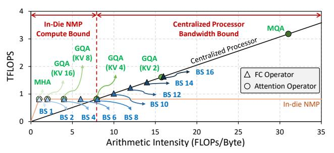

Figure 3: In-die NMP Roofline Analysis.

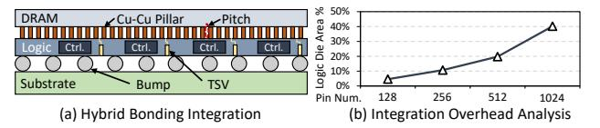

Figure 4: Hybrid Bonding Overview.

(110,000/mm² with 3um pitch) [16, 55, 84]. Besides, the low parasitic capacitance of HB boosts its power efficiency, making it feasible to edge-side accelerator design compared with 2.5D integration technology (e.g., HBM) [16, 33]. Moreover, compared with in-die NMP, PEs can be customized on the logic die, thus enabling the enhancement of computation capacity. We can adopt less advanced logic technology to meet the cost and yield requirements of edge-side accelerators. Previous works have applied hybrid-bonding-based NMP (HB-NMP) architecture in AI applications such as neural recommendation [55], vision model inference [84], etc.

Despite the promising characteristics exhibited in HB technology, its integration overhead poses challenge to designing an accelerator suitable for edge-side low batch LLM inference. HB technology requires numerous memory controllers to drive its large number of I/O pins, which encroach upon the available area for computation logic [55]. As depicted in Fig. 4-(b), according to our in-house implementation using 40nm technology, the controller occupies approximately 40% of the logic die area to manage 1024 HB I/O pins for a single DRAM bank. While reducing the I/O pin number could leave more area to computation logic, the resulting decrease in bandwidth would limit the computation utilization, hindering the performance improvement. Therefore, balancing the computation-bandwidth trade-off intrinsic to HB technology is vital to fully unveil its acceleration potential, which is still lack of discussion.

#### 3.3 Limitations of Existing Dataflow Designs

Apart from the challenge in HB-NMP architecture design, existing dataflow designs for NMP-enabled heterogeneous LLM accelerators still remain limitations when it comes to edge-side low-batch LLM inference. As summarized in Table 3, most of existing proposals map a fixed subset of operators to NMP PEs [24, 37, 39, 60]. Fixed operator mapping can work well in large-batch cloud inference, where the arithmetic intensity of different operators exhibits considerable variation. However, they cannot fully utilize NMP's acceleration capability in low-batch inference and fails to exploit the parallelism provided by variants such as parallel transformers. SpecPIM [47] conducts mapping exploration on NMP-enabled heterogeneous accelerators in its single-model mapping. However,

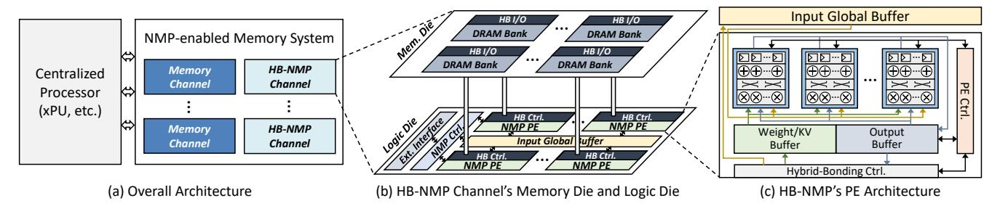

Figure 5: H2-LLM's Architecture Overview.

Table 3: Comparison of Different Dataflow Designs

| Name                       | Mapping Decision                                                    | Operator Fission |
|----------------------------|---------------------------------------------------------------------|------------------|
| GPU + HBM-PIM [39]         |                                                                     |                  |
| GPU + GDDR6-AiM [37]       |                                                                     |                  |
| NeuPIMs [24]               | NeuPIMs [24] Fixed (Attention only)                                 |                  |
| AttAcc [60]                | Fixed (Attention + Fixed Fission)                                   | Fixed (FFN only) |
| SpecPIM [47]               | Compute-centric Exploration (Prefill-unaware)                       | No               |
| H 2 -LLM (ours) | H 2 -LLM (ours) Data-centric Exploration (Prefill-aware) |                  |

its compute-centric mapping abstraction constrains operator placement to either normal channels or NMP channels by first assigning the computation engine (i.e., centralized processor or NMP PEs). Since the two types of channels may co-exist due to the system integration or resource utilization issue [32, 39, 47], this mapping strategy restricts the channel number allocated to each operator, thereby reducing the max external bandwidth available to the centralized processor. Given that the computation-bandwidth ratio of edge-side processors can achieve 500-1000 [56], such a reduction in bandwidth may shift compute-bound prefill operators to memory-bound, hurting the prefill performance. Considering the prefill stage can take up non-negligible overhead after the decoding stage is fully accelerated, especially in prefill-heavy scenarios, it is necessary to design a prefill-aware mapping exploration scheme.

There are two methods for this problem: (1) Duplicate weights for both prefill and decoding stages like prefill-decoding disaggregation [27, 28, 61, 64, 90]. Although this solution works well for cloud-level LLM serving, which usually adopts multiple model replicas to meet the service-level objects of millions of users. Edge-side accelerators equipped with limited resources can hardly afford the huge memory footprint incurred by weight duplication. (2) Operator fission, which splits one operator to both normal and NMP channels without duplicating the weights [60]. However, there still lacks a solution to co-explore the operator mapping and operator fission to achieve the optimal end-to-end performance.

To tackle these challenges, we propose H2-LLM, a heterogeneous accelerator based on HB-NMP for edge-side low-batch LLM inference. In the following sections, we will introduce H2-LLM's architecture design, dataflow abstraction, and the DSE framework.

#### 4 H2-LLM's Architecture

## 4.1 Architecture Overview

As depicted in Fig. 5-(a), H2-LLM's architecture comprises a centralized processor and a NMP-enabled memory system. The centralized processor is a xPU-like (GPU, TPU, etc.) high-performance accelerator responsible for computation-intensive operators. It also schedules the entire inference procedure according to the dataflow described in Sec. 5. The NMP-enabled memory system contains

multiple memory channels, which can be either normal DRAM channels with single memory die or hybrid-bonding-based NMP (HB-NMP) channels with the memory die stacked on a logic die.

The memory die in each HB-NMP channel is shown in the upper part of Fig. 5-(b). The DRAM banks in the memory die can be accessed under two modes: (1) Normal mode. When HB-NMP channel does not conduct computation, each DRAM bank can be accessed by the centralized processor through the external interface. (2) NMP mode. When HB-NMP channel is conducting near-memory computation, all DRAM banks can be accessed concurrently by NMP PEs through their distinct HB controllers. Only one mode is activated at a time to avoid DRAM bank's row buffer interference. For each normal channel, its DRAM banks do not contain HB interfaces and only serve centralized processor's memory accesses through the external memory interface like HB-NMP channel's normal mode.

Fig. 5-(b)'s bottom part depicts HB-NMP channel's logic die architecture. The NMP controller receives commands from the centralized processor via the external interface and drives NMP PEs to conduct computation or memory access. Each NMP PE is paired with one DRAM bank, which can be accessed via PE's HB controller. In this way, NMP PEs can execute in parallel to provide abundant NMP bandwidth. A input global buffer is shared among all PEs to avoid duplicating the input tensor to each DRAM bank. Since the dedicated execution flow (discussed later) does not involve inter-PE communication, we exclude NoC from NMP PEs to reserve more area for computation logic.

HB-NMP's PE design is illustrated in Fig. 5-(c). Each PE contains multiple floating-point units (FPUs) to conduct MAC operations for low-batch GEMM operators in the decoding stage. The weight and output buffers are distributed across each PE, allowing them to compute distinct output tiles. According to the instruction from the NMP controller, the PE controller drives the FPUs for computation or the HB controller for memory access.

#### 4.2 NMP Operator Execution Flow

Similar to previous works [43, 47, 60], H2-LLM adopts offloading-based execution model, which contains three steps: (1) The centralized processor prepares inputs and scatter them to HB-NMP channels. (2) After input preparation, PEs conduct computation concurrently. (3) After all PEs finishing computation, the centralized processor reads and merges their (partial) results and prepares for the next operator. Under this execution model, the operator execution flow in HB-NMP channels is as follows:

**Inter-Channel Operator Partition:** Given the LLM operator and the HB-NMP channels, we need to first split the workload

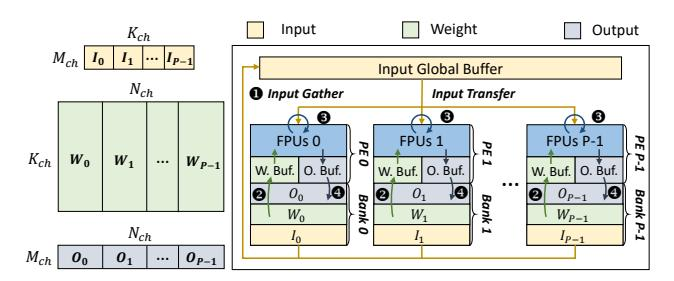

Figure 6: H2-LLM's Intra-Channel Execution Flow.

among these channels. For GEMM operators, assume the shape of input and weight tensors are (M,K) and (K,N), respectively. Considering the weight tensors take up huge memory footprints, we do not split M to avoid their duplication. Splitting K and N brings the trade-off between collecting & merging partial-results and duplicating inputs. Although the total computation amount is almost the same under different tiling strategies, such a trade-off leads to different data transfer sizes in Step (1) and (3), thus affecting the operator's end-to-end performance. We adopt an analytical model to find out the optimal tiling factors. Assume the element size, channel number, the effective memory load/store bandwidth, and the tiling factors of dim K and N are s, C,  $B_I$ ,  $B_S$ ,  $T_K$ ,  $T_N$ , respectively. The total transfer overhead can be estimated as:  $\frac{(s\times M\times \frac{K}{T_K})\times C}{B_S\times C} + \frac{(s\times M\times \frac{N}{T_N})\times C}{B_I\times C} = \frac{s\times M\times K}{T_N\times B_I} + \frac{s\times M\times N}{T_N\times B_I}$ . Therefore, we can solve the following optimization problem to find out the optimal tiling factors:

$$\min_{T_K, T_N} s \times M \times \left(\frac{K}{T_K \times B_s} + \frac{N}{T_N \times B_l}\right), \text{ s.t. } T_K \times T_N = C \qquad (1)$$

Considering  $B_l, B_s$  can be regarded as constants given the tensor transfer pattern, this problem has an analytical solution  $T_K = \sqrt{C \times \frac{K \times B_l}{N \times B_s}}$ . Therefore, given the NMP channel number, we can get the optimal tiling factors statically for each operator.

If there are multiple batched GEMMs in this operator (i.e., attention operator), these GEMMs are split into sub-batches and scattered evenly across HB-NMP channels. By decreasing the number of HB-NMP channel assigned to each GEMM, we can reduce the data volume of duplicated inputs and output partial sums, reducing the data transfer overhead. Tiling factors can be solved similar to Eq. 1. Intra-Channel Execution: After workload scattering, all HB-NMP channels conduct computation in parallel. As illustrated in Fig. 6, if one HB-NMP channel is allocated to single GEMM operator with the shape of  $(M_{ch}, K_{ch}) \times (K_{ch}, N_{ch})$ , the input tensor is evenly scattered across DRAM banks. The weight tensor and output tensor are evenly split along the output feature dim  $N_{ch}$  to each bank. Accordingly, each PE produces distinct results  $O_i$  by consuming  $W_i$ without interference. To simplify the buffer management and avoid DRAM bank's row buffer conflict when transferring different tensors, we adopt output-stationary execution flow with the following procedure: The input tile is first loaded to the global buffer from DRAM banks through the HB I/O (1). Next, each PE loads weight tiles and drives the FPUs to perform MAC operation (2-3). Once each PE's output tile has been fully accumulated by repeating **0-3**, it is written back to the local DRAM bank (4). Subsequently, the HB-NMP channel returns to **1** and compute new output tiles. In

this way, each tensor is accessed consecutively, thus avoiding row buffer interference among the access of different tensors. For each HB-NMP channel, given the workload shape and each PE's architecture parameters (computation capacity, bandwidth, buffer size, etc.), the optimal tile sizes can be found out statically via existing performance models [40, 51, 59]. As to batched GEMM operators, different GEMMs and their corresponding KV cache/output tensors are first allocated to separate PEs. Each GEMM follows the same execution flow as discussed above. The input global buffer sends data to each PE on demand according to the GEMM allocation.

#### 4.3 H2-LLM's Command Interface

To drive the execution flow described above, we introduce four types of commands to control HB-NMP channels:

**Mode Change:** To avoid the row buffer interference issue, this command is inserted at the beginning and the end of HB-NMP PE's execution, serving as a memory barrier to isolate centralized processor's normal memory accesses and other NMP commands. For Mode Change command at the beginning of execution, it also carries the tile size information, which will be used by the NMP controller to generate offsets of each SRAM buffer.

Near-Memory Computation: This command is used to drive HB-NMP PEs to conduct computation. Since all PEs have identical execution process, we can issue one command to control all PEs in one HB-NMP channel. Besides, similar to previous work [24], this command controls HB-NMP channels in a coarse-grained manner. Each command corresponds to one weight tile's computation, carrying the initial offsets of each buffer's tensor tile. The NMP controller is responsible for unpacking it into fine-grained instructions to control PEs conducting computation.

FPUs in each HB-NMP PE only conduct MAC operation for the following reasons: First, softmax and normalization operators need to collect outputs before computation, leading to low parallelism and bandwidth requirements [60]. Second, similar to previous work [47], element-wise operators can be efficiently fused with NMP operator's result merging stage (i.e., Step (3) in H²-LLM's execution model). Therefore, we leave non-GEMM operators to the centralized processor and reserve more area to GEMM operators. **Input Global Buffer Data Movement:** This command is responsible for transferring input tiles from DRAM banks to the input global buffer. By providing the data volume and initial addresses, the NMP controller generates a series of DRAM commands to drive HB I/Os to conduct data movement.

**Local Buffer Data Movement:** This command is responsible for the data transfer between each PE's weight/output buffer and local DRAM bank. Similar to Near-Memory Computation command, this command is a coarse-grained all-bank command. By coordinating the issue order of fine-grained instructions from the NMP controller, PE computation and weight buffer loading can be overlapped.

## 4.4 H2-LLM's Architecture Design Space

H2-LLM's architecture design space contains three dimensions: **HB-NMP Resource Distribution:** Considering previous proposals may place both NMP and normal channels to exploit the parallelism in the operator graph [47] or to fully utilize all computation

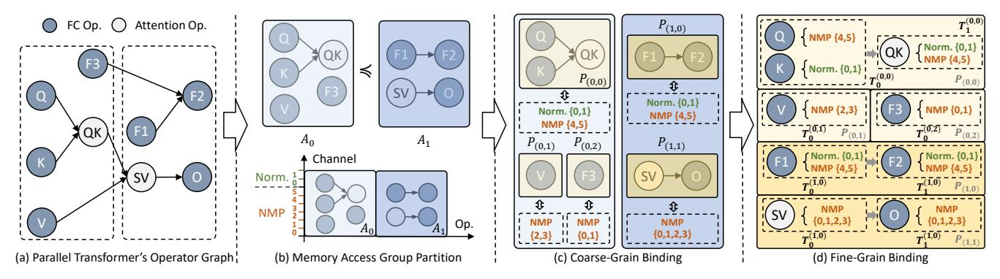

Figure 7: Operator-Channel Binding in H2-LLM's Data-Centric Dataflow Abstraction.

resources [32], we introduce HB-NMP channel number into the design space. By adjusting this parameter, we can explore the optimal NMP resource distribution.

**PE Architecture:** To explore the trade-off between bandwidth and computation capacity as discussed in Sec. 3.2, we first introduce HB I/O bandwidth to the design space. For computation capacity, we adjust each PE's total MAC number and operation frequency. When the computation capacity requirement can be satisfied by multiple frequencies, we can choose the low-frequency design to reduce the energy consumption.

**SRAM Buffer Size:** Considering the tensor volume varies among operators/models/scenarios (e.g., batch size, context length), the buffer size requirement changes accordingly. Therefore, we introduce input global/weight/output buffer sizes to the design space.

## 5 H2-LLM's Data-Centric Dataflow Abstraction

 $\rm H^2\text{-}LLM$ 's  $\it data-centric$  dataflow abstraction consists of two stages:  $\it operator-channel$   $\it binding$  and  $\it operator$   $\it execution$   $\it mapping$ . In this section, we will first elaborate on the details of these stages. Then, based on the whole dataflow abstraction, we will introduce  $\rm H^2\text{-}LLM$ 's end-to-end execution flow and summarize the dataflow design space. Note that this  $\it data-centric$  dataflow abstraction is not constrained to  $\rm H^2\text{-}LLM$ 's architecture design. It can be generalized to all NMP-based heterogeneous LLM accelerators.

#### 5.1 Operator-Channel Binding

The main limitation of the *compute-centric* dataflow abstraction [47] is that the operator placement is constrained by computation engine allocation (i.e., centralized processor or NMP PEs). Although it can choose the optimal engine and explore operator-graph-level parallelism, the decreased external memory bandwidth may cause centralized processor operators' performance degradation, thus hurting the end-to-end performance. Besides, constraining the operator placement to only one type of channel (i.e., normal or NMP) prevents it from exploring the capability of operator fission on heterogeneous NMP accelerators [60].

To tackle these problems, instead of directly assigning the computation engine, our *data-centric* dataflow abstraction first binds memory channels to each operator. The *operator-channel binding* procedure is composed of three steps:

**Step 1: Memory Access Group Partition:** For each transformer layer, the first step is to split its operator graph into several *Memory* 

Access Groups (MAGs) so that we can explore the inter-operator parallelism. Assume the transformer layer's operator set is V. The MAG partition procedure can be represented as:

$$A_0 \le A_1 \le ... \le A_{M-1}$$
, where  $A_0 \cup A_1 \cup ... \cup A_{M-1} = V$ , and  $A_i \cap A_{i'} = \emptyset \ (\forall i \ne i')$  (2)

In Eq. (2), each  $A_i$  ( $0 \le i \le M-1$ ) represents a MAG. The notation  $A_i \le A_j$  means that all operators in  $A_i$  do not depend on operators in  $A_j$ . Besides, each operator in V is exactly assigned to one MAG. In each MAG, operators sharing the same input tensor are randomly combined together to explore different operator fission strategies. Each MAG takes up all normal & NMP channels, which will be transposed to more detailed channel allocation in subsequent steps. **Step 2: Coarse-grain binding:** Considering each MAG may still have independent operator subsets (e.g.,  $\{F1, F2\}$  and  $\{SV, O\}$  in  $A_1$  of Fig. 7), the next step of *operator-channel binding* is to assign separate memory channels to these subsets, so that we can preserve the parallel execution capability inherent in each MAG.

Formally, for each  $MAGA_i$ , we extract its weakly connected components:  $A_i = \{P_{(i,0)},...,P_{(i,N-1)}\}$ . Each weakly connected component  $P_{(i,j)}$  is named as  $Memory\ Partition\ Group\ (MPG)$ , meaning that it will be assigned to a separate subset of memory channels. The memory channel set is represented as  $C = \{PC_0,...PC_{P-1},NC\}$ , where each  $PC_p$  represents one NMP channel, while NC is the collection of all normal channels. We abstract all normal channels into one "virtual channel" considering all workloads assigned to normal channels are executed by the centralized processor. Given these representations, the coarse-grain binding in each MAG can be described as the following Group-Channel  $Mapping\ (GCMap)$ :

$$GCMap_{A_i}: \{P_{(i,0)}, ..., P_{(i,N-1)}\} \to \mathcal{P}(C) - \emptyset$$
 (3)

In Eq. (3),  $\mathcal{P}(C)$  indicates the power set of C. A valid GCMap should satisfy the following constraints: (1) Channel exclusive constraint: For any two MPGs, their channel sets should have no intersection:

$$GCMap_{A_{i}}(P_{(i,j)}) \cap GCMap_{A_{i}}(P_{(i,j')}) = \emptyset, (\forall j \neq j')$$
 (4)

(2) Channel utilization constraint: All channels should be occupied by the *MPGs* in each *MAG*:

$$\bigcup_{i=0}^{N-1} GCMap_{A_i}(P_{(i,j)}) = C$$

$$\tag{5}$$

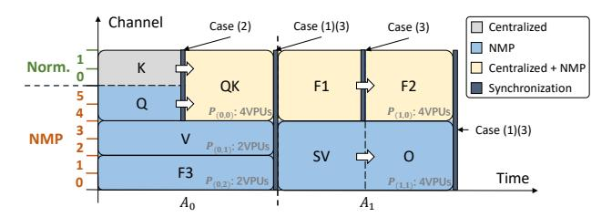

Figure 8: H2-LLM's Layer Execution Flow in Decoding Stage.

**Step 3: Fine-grain binding:** The last step of *operator-channel binding* is to determine detailed channel allocation. Considering operators exhibit sequential dependency in each  $MPGP_{(i,j)}$ , we first stratify it into operator tiers accordingly:  $P_{(i,j)} = \{T_0^{(i,j)}, ..., T_{X-1}^{(i,j)}\}$ . Each operator tier  $T_k^{(i,j)}$  occupies all channels assigned to this MPG (i.e.,  $GCMap_{A_i}(P_{(i,j)})$ ) and its operators are mutually independent. Therefore, the channel binding of operators in  $T_k^{(i,j)}$  can be described by the following Operator-Channel Mapping (OCMap):

$$OCMap_{T_k^{(i,j)}}: T_k^{(i,j)} \to \mathcal{P}(GCMap_{A_i}(P_{(i,j)})) - \emptyset$$
 (6)

 $\mathcal{P}(GCMap_{A_i}(P_{(i,j)}))$  denotes the power set of  $P_{(i,j)}$ 's channel set. Similar to GCMap, a valid OCMap also follows the channel exclusive constraint and channel utilization constraint as discussed above. **Binding Example:** In Fig. 7, we adopt parallel transformer [11]'s operator graph to exemplify the whole operator-channel binding procedure. Assume the accelerator contains 6 NMP channels and 2 normal channels. The parallel transformer layer is first split into two  $MAGs(A_0, A_1)$  as depicted in Fig. 7-(b), with no operator combined together. Both of them take up all 8 channels. Then,  $A_0$  and  $A_1$  are partitioned into three and two MPGs according to the dependency. Each MPG is assigned to a separate channel subset. During finegrain binding, MPGs  $P_{(0,0)}$ ,  $P_{(1,0)}$ ,  $P_{(1,1)}$  are stratified into two tiers according to the operator dependency. For operator tiers with single operator, all channels are bound to the sole operator. Otherwise, channels are further partitioned. For  $T_0^{(0,0)}$  in this example, Q is assigned to all NMP channels, while K takes up all normal channels.

#### 5.2 Operator Execution Mapping

Given the *operator-channel binding*, we then need to decide the computation engine responsible for each operator. Operators in the prefill stage are assigned to the centralized processor considering each prompt has hundreds to thousands of tokens. For the decoding stage, if the operator is assigned exclusively to either normal or NMP channels, it is executed by the centralized processor or NMP PEs accordingly. Otherwise, if the operator is bound to both normal and NMP channels, operator fission will be applied: For GEMM operator with the shape of  $(M,K)\times(K,N)$ , we split the output feature dim N between the centralized processor and NMP PEs. For attention operators, different GEMMs are assigned to each of these two computation engines. In this way, there is no interference between the centralized processor and NMP PEs after fission.

#### 5.3 Transformer Layer Execution Flow

Based on the *data-centric* dataflow abstraction discussed above, the execution flow of each transformer layer is as follows:

During the prefill stage, operators are executed sequentially on the centralized processor, which is similar to conducting inference on conventional centralized-processor-only architectures. During the decoding stage, all *MAGs* are executed sequentially according to the sorting order in the *operator-channel binding*. All *MPGs* in each *MAG* are executed in parallel. To ensure such concurrency, *MPGs* in each *MAG* are assigned with distinct vector processing units (VPUs) of the centralized processor according to their max partial sum volume. Operator tiers in each *MPG* are executed sequentially according to the data dependency, while operators in each tier are executed concurrently on separate computation engines.

Given the execution order, synchronization is conducted during the decoding stage at four cases: (1) In each *MAG*, synchronize among all *MPGs*' last operators before the next *MAG*'s execution. (2) In each *MPG*, synchronize among all operators in each tier before executing the next tier. (3) For operators conducting fission, synchronize between the centralized processor part and the NMP part. (4) In each *MAG*, when VPU number is not enough for distinct assignment, synchronize among operator tiers of all *MPGs*, with the synchronization point determined by roofline-model-based latency estimation. The controller in the centralized processor manages synchronization according to operators' execution flow and the deterministic timings of centralized processor and NMP PEs' operations (memory access, buffer access, computation, etc.).

Fig. 8 illustrates decoding stage's execution flow of the example in Fig. 7 in logical timestamp. We assume there are eight VPUs. The two MAGs are executed according to the sorting order of  $A_0 \leq A_1$ . In each  $A_i$ , its MPGs are executed concurrently (represented in identical logical duration) and their last operators ((QK, V, F3) and (F2, O)) need to be synchronized (case (1)). The two tiers in  $P_{(0,0)}$ ,  $P_{(1,0)}$ , and  $P_{(1,1)}$  are executed sequentially according to the dependency. In  $P_{(0,0)}$ , the two operators in its first tier (Q and K) executes concurrently and requires synchronization (case (2)). For operators conducting fission (QK, F1, F2), synchronization is conducted to wait for full result computation (case (3)). Synchronization of QK and F2 is combined with case (1) in the figure. Since all MPGs are assigned with distinct VPUs as shown in the figure, the execution flow does not involve synchronization case (4).

## 5.4 H2-LLM's Dataflow Design Space

In the design space of H²-LLM's data-centric dataflow abstraction, we first explore the MAG partition  $A_0 \leq A_1 \leq ... \leq A_{M-1}$ . Since MPG partition is determined given each MAG's operator graph, the next explorable dimension is each MAG's Group-Channel Mapping  $GCMap_{A_i}$ . After given all MPGs, the operator tiers can also be inferred. Therefore, the third component in the design space is each operator tier's Operator-Channel Mapping  $OCMap_{T_k^{(i,j)}}$ . Finally, for operators allocated to both normal and NMP channels, we explore the partition ratio between the two computation engines.

#### 6 H2-LLM's DSE Framework

#### 6.1 Framework Overview

Fig. 9 provides an overview of H²-LLM's DSE framework. It takes three inputs: (1) Workload information, which contains the LLM's model definition along with scenario-specific information (e.g., expected batch size, prompt length, decoding length, etc.). (2) Architecture parameters, which contains a list of candidate architectures described by the parameters within H²-LLM's architecture design

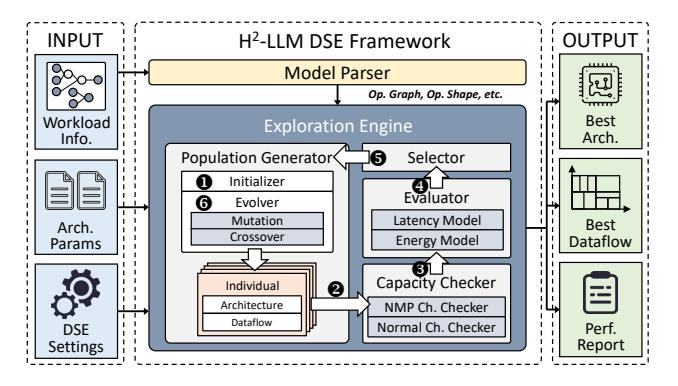

Figure 9: Overview of H2-LLM's DSE Framework.

space as outlined in Sec. 4.4. If there is only one architecture candidate, the DSE framework can be used to identify the optimal dataflow for the specified architecture. (3) DSE settings, such as iteration rounds, optimization goal, etc.

After receiving these inputs, the DSE framework first adopts the model parser to extract transformer layer's operator graph and each operator's tensor shape. Then, these information together with the architecture parameters and DSE settings are sent to the exploration engine, which will search for the optimal architecture-dataflow codesign under the given scenario. After finishing DSE, the optimal design and its performance estimation will be reported. In the next sub-section, we will detail the workflow of the exploration engine.

### 6.2 Exploration Engine's Workflow

The exploration engine adopts genetic algorithm [25] to figure out the optimal design. In the beginning, the population generator initializes the first iteration's population by randomly sampling individuals from the design space (**①**). For each individual, the architecture design is first sampled, followed by the random selection of dataflow abstraction. Then, this population is sent to the capacity checker (2). It will examine all channels' capacity occupancy status in each individual according to the operator-channel binding. If there are channels meeting overflow issue, the individual will be marked as illegal and discarded. After checking, all legal individuals will be forwarded to the evaluator (3), which adopts a simulator (introduced in the next section) to evaluate the latency and energy consumption of each design. The evaluated individuals are then transferred to the selector (**4**), which feeds the top-K individuals back to the population generator (**6**). The selection criteria is to minimize latency by default, which can be adjusted in DSE settings. Then, the population generator evolves new populations through genetic operators on the top-K individuals (6) and launches a new iteration. After repeating **2-6** for several iterations, the exploration engine terminates and reports the optimal design.

In the population generator, we develop the following genetic operators for population evolution:

**OP1 (Re-sample):** Randomly re-sample a new architecture along with a new dataflow from the co-design space.

**OP2** (Mutate): Keep the selected top-K individual's architecture design, and re-sample a new dataflow design.

**OP3** (Mutate): Keep the selected top-K individual's architecture design and *MAG* partition. Re-sample *GCMaps*, *OCMaps*, and operator partition ratios.

**Table 4: Model Configurations Used for Evaluation** 

| Model  | Param. | ram. Layer (Hidden, Intermediate) |               | (Q head, KV head) |  |
|--------|--------|-----------------------------------|---------------|-------------------|--|
| OPT    | 6.7B   | 32                                | (4096, 16384) | (32, 32)          |  |
| LLaMA3 | 8B     | 32                                | (4096, 14336) | (32, 8)           |  |
| PaLM   | 8B     | 32                                | (4096, 16384) | (16, 1)           |  |

**OP4 (Mutate):** Keep the selected top-K individual's architecture design, *MAG* partition, and *GCMaps*. Re-sample *OCMaps* together with operator partition ratios.

**OP5** (Crossover): Randomly select the architecture from two designs sampled from the top-K individuals. Then, randomly choose non-conflict *MAGs* alternately from the two designs. If there are remained operators, randomly generate new *MAGs* for them. Finally, randomly sample *GCMaps*, *OCMaps*, and operator partition ratios according to the selected architecture and new *MAGs*.

The workflow discussed above provides a basic process to explore the optimal design for one input workload. When there are multiple input workloads, we can sample all workloads' dataflow in each individual during DSE Step-① and Step-③ in Fig. 9 and use all workloads' weighted average performance to evaluate each individual during Step-④ and Step-⑤ to balance the DSE across these workloads, similar to previous work's practice [8].

## 6.3 Model Complication Flow

Given the architecture and the dataflow, the model is compiled through the following steps: (1) Generate each operator's execution flow. For centralized processor operators, the execution flow can be generated automatically by existing xPU compilers [10, 87, 88]. For NMP operators, we first adopt Eq. 1 to decide workload scattering. Then, we adopt NMP operator templates to find optimal buffer tile sizes using performance models for tiled accelerators [40, 51, 59]. Currently these templates are manually designed according to the execution flow in Sec. 4.2. How to automatically generate operator templates will be our future work. For operators conducting operator fission, the two parts follow separate execution flow generation process accordingly. The element-wise operators are fused with their preceding GEMM operators following previous work's practice [47] during execution flow generation. (2) After getting each operator's execution flow, we then arrange each transformer layer's execution flow and insert synchronization primitives as discussed in Sec. 5.3. All transformer layers follow the same execution flow since they have identical operator graph. (3) Finally, the end-to-end execution flow is sent to the controller in the centralized processor to schedule H2-LLM hardware for inference.

#### 7 Evaluation

## 7.1 Evaluation Methodology

**Benchmarks:** As listed in Table 4, we choose OPT 6.7B [86], LLaM-A3 8B [14], PaLM 8B [11] for evaluation, which have different transformer architectures and adopt MHA/GQA/MQA, respectively. All models are under FP16 data type. To evaluate the performance under different scenarios in edge-side low-batch LLM inference, we configure the batch size as 1/4/16 and set the token number as the average number of the four datasets (HumanEval (HE), ShareGPT (SG), LongBench (LB), LooGLE (LG)) listed in Table 1.

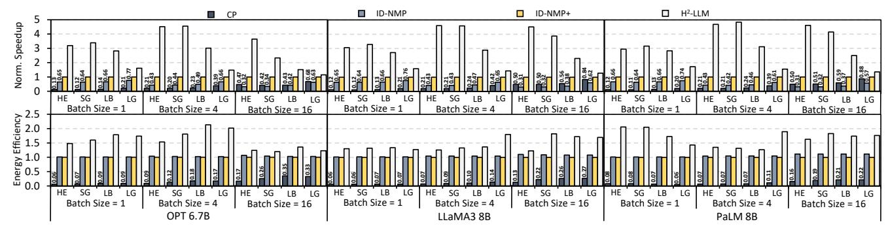

Figure 10: Performance Comparison against Baselines.

Table 5: H2-LLM's Architecture DSE Parameters

| Hierarchy        | Parameter              | Range                                |
|------------------|------------------------|--------------------------------------|
| NMP Distribution | NMP Channel Number     | {2, 4, <u>6</u> , 8} NMP Channels    |
|                  | FPU Number per PE      | {1, 2, 4, <u>8</u> } FPUs            |
| NMP PE           | PE Frequency           | {0.4, <u>0.6</u> , 0.8, 1} GHz       |
|                  | HB I/O Bandwidth       | {6.4, 12.8, <u>25.6</u> , 51.2} GB/s |
|                  | Input Global Buffer    | {4, 8, 16, <u>32</u> , 64, 128} KB   |
| NMP SRAM Buffer  | Weight Buffer (per PE) | {4, 8, 16, <u>32</u> , 64, 128} KB   |
|                  | Output Buffer (per PE) | {0.25, 0.5, 1, 2, 4, 8} KB           |

Table 6: Max FPU Num./PE under Different HB Bandwidths

| HB I/O Bandwidth          | 6.4 GB/s     | 12.8 GB/s            | 25.6 GB/s    | 51.2 GB/s    |
|---------------------------|--------------|----------------------|--------------|--------------|
| 0.4/0.6/0.8/1GHz max num. | (8, 8, 8, 8) | (8, 8, <b>8</b> , 4) | (8, 8, 4, 4) | (8, 4, 4, 2) |

**System Configuration:** We configure  $\mathrm{H}^2$ -LLM's centralized processor as a TPU-like processor [35], which contains 8 128×128 systolic arrays together with 8 SIMD-128 vector processing units running at 1GHz. The on-chip SRAM buffer is configured as 128MB. The memory system contains 8 channels, each with 16 256MB DRAM banks. The external memory interface is configured as LPDDR5-6400. The design space of  $\mathrm{H}^2$ -LLM's HB-NMP architecture is listed in Table 5. We equip each FPU with 16 MACs and change the FPU number to adjust each PE's MAC number in the design space.

To explore the trade-off in HB design, we implement FPUs with Chisel and synthesize them with 40nm technology. The areas of FPUs under 0.4/0.6/0.8/1.0GHz are 0.31/0.44/0.59 /0.77mm². SRAM buffer's density is 2.72mm²/MB according to tsmc SRAM compiler. Each NMP PE's area is 6.76mm². HB-related area numbers are obtained from our real-chip tape-out [55]. Each HB I/O pin's data rate is 0.4Gbps. With 128/256/512/1024 pins, the bandwidth per HB I/O ranges from from 6.4GB/s to 51.2GB/s, resulting in the HB controller occupying 4.6%/10.7%/19.7%/40.2% of each PE's area. The maximum numbers of FPUs per PE for each frequency, under different HB bandwidths, are listed in Table 6.

Baselines: We compare H²-LLM with three existing designs: (1) Centralized processor only (CP). We double the centralized processor's computation capacity considering NMP introduces extra computation resources. (2) In-die NMP-based heterogeneous architecture (ID-NMP), which adopts Samsung's LPDDR5-NMP proposal [39]: Each PE is placed near one bank, featuring 6.4GB/s NMP bandwidth and one FPU with 16 MACs @ 200MHz. Each channel's NMP computation capacity and bandwidth are 102.4GFLOPS and 102.4GB/s. (3) In-die NMP-based heterogeneous architecture with enhanced computation capacity (ID-NMP+). ID-NMP+ adopts AiM's PE design [41] (i.e., one FPU per PE with 16 MACs @ 1GHz), providing the max computation capacity among existing commodity in-die NMP proposals [37, 39, 41]. All channels in ID-NMP(+)

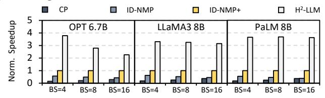

Figure 11: Performance Comparison under Mixed Scenarios.

are NMP channels considering their low computation capacity. The other configurations are identical to H2-LLM for fair comparison. **Simulation:** We extend Ramulator2 [52] to simulate NMP PE's computation. We adopt Tileflow's performance model [89] to evaluate centralized processor operators' performance and inject the results into the simulator for end-to-end evaluation. Tileflow supports the evaluation of attention operator fusion, which can fully exploit centralized processor's performance. For energy evaluation, the centralized processor's MAC energy is 0.682pJ/MAC, which is synthesized with 10nm technology. For HB-NMP under 0.4/0.6/0.8/1.0GHz, the MAC energy is 0.974/1.075/1.148/1.365pJ/MAC. In-die NMP's MAC energy is 1.172/1.849pJ/MAC under 200MHz/1GHz according to [43, 69, 78]. SRAM access energy is 0.027pJ/bit according to the SRAM compiler. Memory access energy of LPDDR5 interface and HB I/O is 7.0pJ/bit [62] and 0.88pJ/bit [55].

#### 7.2 Comparison with Baselines

We first compare the baselines' performance with a fixed  $\mathrm{H}^2$ -LLM design to demonstrate  $\mathrm{H}^2$ -LLM's capability under different scenarios. The selected architecture parameters are underlined in Table 5. We adopt the *data-centric* dataflow for ID-NMP, ID-NMP+, and  $\mathrm{H}^2$ -LLM. During exploration, we iterate the genetic algorithm for 100 rounds and sample 5k individuals per iteration. We select the Top-50 individuals during each evolution.

The comparison results are summarized in Fig. 10. All results are normalized to ID-NMP+. For end-to-end latency, we can find that CP only achieves 27% (geomean) performance of ID-NMP+ due to its limited external bandwidth. The performance gap becomes larger when the batch size shrinks (i.e., with more severe memory-intensive issue). For ID-NMP, although it can outperform CP by 3.03× (geomean) under the batch size of 1/4, it only achieves CP's 71% (geomean) performance when the batch size comes to 16 due to its low computation capacity. Enhancing in-die NMP PE's computation capacity can achieve better performance. However, the speedup of ID-NMP+ is only 1.76× (geomean) compared with the better-performing results between CP and ID-NMP, constrained by DRAM technology's scarce resource provision. Compared with

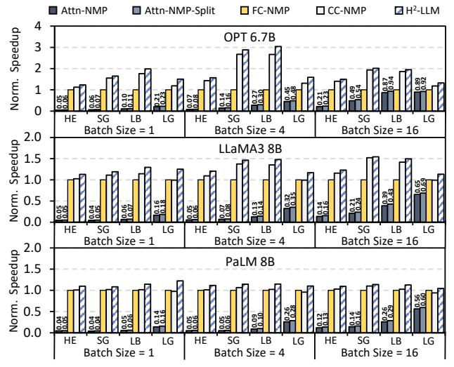

Figure 12: Comparison Against Existing Dataflow Designs.

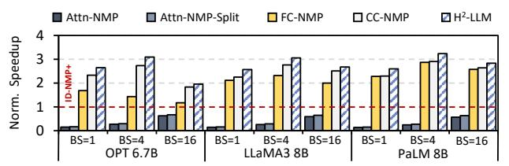

Figure 13: Dataflow Designs on H2-LLM v.s. ID-NMP+.

ID-NMP+, H2-LLM can achieve 3.81× (geomean) speedup under decoding-heavy HE/SG, 1.94× (geomean) speedup under prefill-heavy LB/LG, and 2.71× (geomean) speedup across all test cases.

We also compare the decoding energy efficiency against these baselines. In Fig. 10, we can find that CP reports poor energy efficiency due to the high memory access energy of LPDDR5 interface. ID-NMP's decoding energy efficiency is slightly better than ID-NMP+ because of the lower MAC energy. H²-LLM can achieve  $1.48/1.54 \times (\text{geomean})$  better energy efficiency compared with ID-NMP/ID-NMP+ owing to the on-chip SRAM buffer reuse.

We further conduct experiments when requests have different lengths by mixing the four scenarios evenly. As shown in Fig. 11, CP and ID-NMP only achieves 24% and 49% of ID-NMP+'s perfromance (geomean), while  $\rm H^2$ -LLM outperforms ID-NMP+ by 3.24× (geomean).  $\rm H^2$ -LLM still performs well under mixed scenarios.

## 7.3 Performance Analysis

Comparison with Existing Dataflow Designs: To analyse the performance improvement brought by the *data-centric* dataflow abstraction, we compare it against four existing dataflow designs: (1) Offload all attention operators to NMP [24] (Attn-NMP). (2) Offload all attention operators to NMP, and split FCs in the FFN block between NMP and centralized processor [60] (Attn-NMP-Split). (3) Offload all FC operators to NMP [39] (FC-NMP). (4) Computation-centric dataflow abstraction, which constrains each operator to either NMP or normal channels [47] (CC-NMP). We adopt the same fixed H²-LLM architecture as Sec.7.2 for all dataflow designs. The DSE budgets are also identical to Sec.7.2 for dataflow exploration.

The end-to-end latency comparison results are demonstrated in Fig. 12. All results are normalized to FC-NMP. We can find

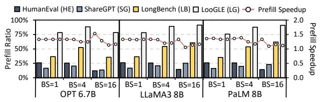

Figure 14: Prefill Latency Ratio and Prefill Speedup.

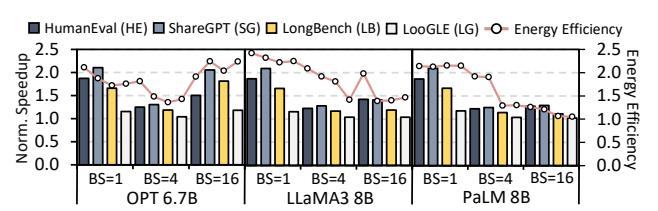

Figure 15: Performance Analysis for Architecture DSE.

that Attn-NMP only achieves 14% (geomean) of FC-NMP's performance because it cannot utilize HB-NMP's acceleration potential for low-batch FC operators. Although operator fission can improve Attn-NMP's performance by 1.11× (geomean), fixed fission strategy still cannot fully utilize HB-NMP. FC-NMP can attain comparable performance to CC-NMP/H2-LLM on PaLM 8B and single-batch OPT 6.7B/LLaMA3 8B. However, under MHA/GOA models with larger batch size, the memory-intensive attention operators executed on the centralized processor incur substantial overhead, hurting FC-NMP's performance. CC-NMP reports 1.24× (geomean) speedup against FC-NMP by exploiting the acceleration opportunity provided by memory-intensive decoding operators, but its prefillunaware nature mitigates the performance improvement. It behaves 5% (geomean) poorer than FC-NMP on PaLM 8B under the prefillheavy LooGLE dataset. By fully exploring operator mapping and operator fission, H2-LLM's data-centric dataflow abstraction can achieve 1.37×/1.11× speedup compared with FC-NMP/CC-NMP.

In Fig. 13, we compare all dataflow designs' speedup (geomean across four scenarios) against ID-NMP+. Attn-NMP(-Split) only achieves 28% (31%) of ID-NMP+'s performance (geomean). Although FC/CC-NMP outperforms ID-NMP+ by  $1.98\times/2.45\times$  (geomean), H²-LLM can further achieve better performance (2.71× geomean speedup). Therefore, dataflow exploration is vital for fully unleashing hybrid bonding's acceleration capability against in-die NMP.

To further demonstrate *data-centric* dataflow abstraction's performance improvement compared with CC-NMP, we analyse the proportion of prefill latency in H2-LLM's end-to-end latency and its prefill speedup against CC-NMP. As Fig. 14 shows, after decoding is fully accelerated, prefill takes up 12%-26%/36%-90% end-to-end latency under decoding-heavy/prefill-heavy cases. By improving the prefill latency by 1.27× (geomean), our *data-centric* dataflow abstraction can provide better execution strategy and end-to-end performance compared with prefill-unaware CC-NMP.

Architecture Exploration Analysis: To demonstrate H2-LLM's performance upper bound under different scenarios, we compare the performance of the fixed H2-LLM design used in Sec. 7.2 against the optimal performance after fully exploring the whole design space in each test case. During full exploration, we enlarge the population size to 50k and keep other DSE parameters unchanged.

As illustrated in Fig. 15, we can find that compared with the fixed design, H2-LLM can further gain 1.38× (geomean) speedup

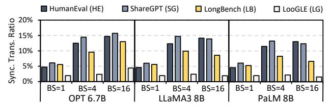

Figure 16: Synchronization and Data Transfer Overhead.

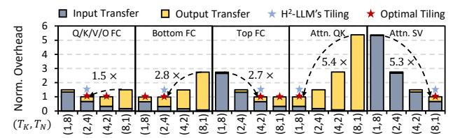

Figure 17: Comparison among Different Tiling Factors.

and 1.74× (geomean) decoding energy efficiency after full architecture DSE. Under small batch size (i.e., batch size = 1), the designs with higher HB I/O bandwidth can outperform the fixed design since all operators are memory-intensive. Under medium batch size (i.e., batch size = 4), the fixed design can reach near-optimal performance with a moderate computation-bandwidth ratio. Under large batch size (i.e., batch size = 16), for OPT 6.7B, the designs with higher computation capacity can outperform the fixed design due to the increased computation capacity requirement. For LLaMA3 8B and PaLM 8B, the performance gap shrinks owing to the operator parallelism exploration brought by the *data-centric* dataflow abstraction. In Sec. 7.4, we will further analyse the effect of different dimensions in H2-LLM's architecture design space.

Tiling Overhead analysis: In Fig. 16, we analyse H2-LLM's synchronization and pre-/post-processing (data transfer) overhead, which accounts for 1.6%-15.7% across benchmarks. The overhead is dominated by data movement in pre-/post-processing since synchronization bubble is effectively eliminated by dataflow exploration. To analyse tiling factor exploration's effect on overhead mitigation, we compare different tiling factors on 8 NMP channels for OPT's operators in Fig. 17 (context length 2048, batch size 4), where the overheads are normalized to each operator's minimal ones. The worst tiling factors can incur 1.5×-5.4× higher overhead than the optimal factors. By adopting the selection process in Sec. 4.2, H2-LLM can adopt tiling factors with minimal overhead.

## 7.4 DSE Analysis

In this sub-section, we explore on different dimensions in H²-LLM's architecture design space and summarize several architectural implications for future architecture design. Since all models demonstrate similar trends to discrete architecture parameters, we showcase the analysis on LLaMA3 8B without loss of generality. We adopt end-to-end performance for analysis because operator performance is an intermediate result, which cannot accurately reveal these trends. The DSE budget of each architecture design is identical to Sec. 7.2. Computation-Bandwidth Trade-off: We first analyse the effect of computation-bandwidth trade-off to decoding performance. During exploration, we fix NMP channel number to 4 and choose the FPU configs providing max computation capacity under each HB I/O bandwidth, which are marked as bold in Table 6. The input global/weight/output buffer sizes are fixed to 32KB/32KB/4KB.

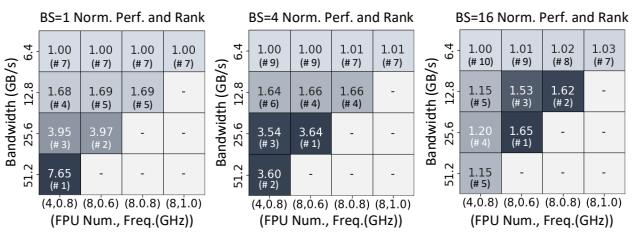

Figure 18: Computation Bandwidth Trade-off Analysis. → Batch Size = 16 Batch Size = 1 Batch Size = 4 Performance 1.1 1.1 2.0 1.10 1.05 1.5 € 1.0 1 00 1.0 <u>2</u>0.9 16 32 64 128 0.250.5 1 8 16 32 64 128 Weight Buffer Size (KB) Input Buffer Size (KB)

Figure 19: Performance Analysis of Buffer Size Exploration.

In Fig. 18, we compare all legal designs' average decoding performance on four scenarios and list their rankings. The decoding performance is in proportion to HB I/O bandwidth under singlebatch inference. When batch size is 4, although we can gain better performance by enlarging the HB I/O bandwidth from 6.4GB/s to 25.6GB/s, the performance cannot attain further improvement from 25.6GB/s to 51.2GB/s. This is because the high controller area cost constrains the computation capacity. When batch size is 16, the design with moderate computation-bandwidth ratio can achieve the optimal performance. The limitation imposed by low computation capacity becomes more pronounced under 51.2GB/s HB I/O. Besides, although we can equip the highest computation capacity under 6.4 GB/s HB I/O, we can hardly get performance improvement due to the limited bandwidth. Balancing computation and bandwidth is vital for steady performance across scenarios (e.g., (8FPUs@0.6GHz, 25.6GB/s) in Fig.18, with the highest average ranking).

**Takeaway 1**: With the increase of batch size (operator arithmetic intensity), the HB-NMP architecture should be designed with a suitable emphasis on computational resources.

**Takeaway 2**: Balancing computation-capacity ratio is necessary to prevent resource over-provision, thereby avoiding a stagnation in performance improvement.

**SRAM Buffer Size:** Then, we analyse how HB-NMP's buffer sizes affect the decoding performance. By default, the H2-LLM device equips 4 NMP channels. Each PE contains 8 FPUs running at 0.6GHz, along with 25.6GB/s HB I/O bandwidth. The buffer size design space is identical to Table 5. The sizes of input global/weight/output buffer are fixed to 32KB/32KB/4KB when they are unexplored.

For each buffer size, we evaluate the average decoding performance on the four datasets under different batch sizes. As shown in Fig. 19, increasing the input global/output buffer size can gain  $1.05\text{-}1.18\times/1.09\text{-}2.26\times$  speedup under different batch sizes. With the batch size increasing, the benefits of increasing the input global/output buffer size become more pronounced. This is because the data volume of input/output tensors is in proportion to the batch size. Enlarging the buffer size can avoid transferring larger tiles repeatedly, thus improving the performance. On the other hand, increasing the weight buffer size can bring up to  $1.15\times/1.12\times$  speedup under the

**Table 7: Resource Distribution Exploration Setup** 

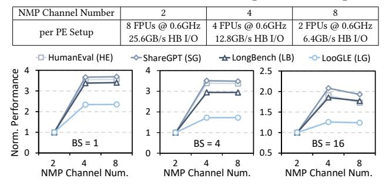

Figure 20: Performance Analysis of Resource Distribution.

batch size of 1/4 but cannot bring better performance when batch size is 16. This is because weight reuse increases along with the enlargement of batch size, bringing better overlap between computation and memory access. When batch size is small, enlarging the weight buffer size can improve bandwidth utilization, thus reducing the non-overlapped weight transfer overhead. Therefore, allocating large enough buffer sizes is necessary to improve the performance (e.g., 32/32/4KB in Fig. 19, minimal sizes saturating the speedup).

**Takeaway 3**: Increasing HB-NMP's buffer size appropriately is beneficial to the performance.

**Takeaway 4**: With the increase of batch size, the decoding performance becomes more sensitive to input/output buffer size, while its sensitivity to the weight buffer size diminishes.

NMP Resource Distribution: We analyse how NMP channel number affects the performance given the resource budget. As listed in Table 7, we fix the total computation & bandwidth budgets and distribute them to 2/4/8 NMP channels. The input global/weight/output buffer sizes are fixed to 32KB/32KB/4KB, which are adequately large to eliminate their influence on performance.

Since the NMP channel number affects operator placement, thereby impacting both prefill and decoding performance, We compare the four datasets' end-to-end performance under different batch sizes. From the results shown in Fig. 20, we can find that increasing NMP channel number from 2 to 4 can effectively enhance the performance because the increased NMP memory capacity allows us to assign more NMP operators and better utilize HB-NMP's capability. However, further increasing the channel number can hardly bring speedup, and even hurts the performance under the batch size of 16. The reasons are two-fold: First, each channel's processing capability shrinks when we equip more channels, hindering further performance improvement. Second, configuring all channels as NMP channels prevents the adoption of operator fission.

**Takeaway 5**: Distributing NMP resources across more channels enables the assignment of more NMP operators, which is beneficial to the performance.

**Takeaway 6**: Adequate NMP channel allocation is necessary to avoid wimpy per-channel processing capability under the given resource budget and better utilize operator fission.

**Centralized Processor Exploration:** Finally, we explore the relation between centralized processor's computation capability and

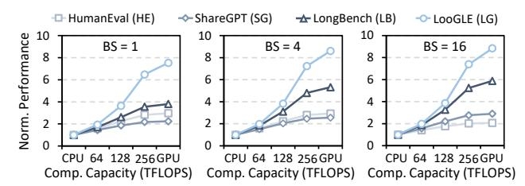

Figure 21: Performance Analysis of Centralized Processor.

performance by adjusting the systolic array size. Since the components of CPUs/GPUs can also be abstracted as tensor processors together with control logic, we adopt systolic array size with equivalent computation capability to represent their setups (32TFLOPS of Intel Sapphire Rapids CPU with AMX extension [38], 312TFLOPS of A100 GPU). As shown in Fig. 21, increasing the computation capacity can improve the performance, especially in prefill-heavy scenarios. This is because prefill can be effectively accelerated by more powerful centralized processor, although decoding gains little speedup. Therefore, equipping a powerful enough centralized processor is necessary to accelerate end-to-end inference.

#### 8 Conclusion

This paper proposes H²-LLM, the first hybrid-bonding-based heterogeneous accelerator for edge-side low-batch LLM inference. H²-LLM comprehensively considers hybrid bonding technology's computation-bandwidth trade-off in the architecture design space and adopts the *data-centric* dataflow abstraction to fully utilize the heterogeneous architecture for low-batch LLM inference. Based on the co-design space, H²-LLM's DSE framework can find out the optimal design for different scenarios. Compared with existing in-die NMP-based heterogeneous accelerators, H²-LLM achieves 2.72× geomean speedup and 1.48× geomean better energy efficiency.

## Acknowledgments

We appreciate the valuable feedback and constructive comments from all reviewers. This work is supported by Beijing Natural Science Foundation L243001, National Natural Science Foundation of China (Grant No. 62032001), and 111 Project (B18001).

## A Artifact Appendix

#### A.1 Abstract

This artifact contains the source code of H2-LLM's data-centric dataflow exploration framework, including the implementation of an onnx-based model parser and the genetic-algorithm-based exploration engine. In addition, this artifact provides config files, scripts, and README instructions to reproduce the key experimental results reported in the paper.

## A.2 Artifact check-list (meta-information)

- Algorithm: Data-centric dataflow exploration algorithm for NMPbased heterogeneous LLM accelerators.
- Program: Python3 and C++ (for some dependencies).
- **Compilation:** Python  $\geq 3.10$  and cmake  $\geq 3.12$ .
- Run-time environment: Ubuntu 20.04.6 LTS (GNU/Linux 5.11.0-43-generic x86\_64) with Python ≥ 3.10.
- Hardware: No specific hardware is required. However, it is recommended to conduct experiments on a CPU server with more than 50 cores for evaluation efficiency.

- Metrics: Normalized speedup .
- Output: Resulting figures of key experiments.
- Experiments: Scripts are included in the ae folder. Detailed instructions are provided in ae/README.md.
- How much disk space required (approximately)?: About 3GB.
- How much time is needed to prepare workflow (approximately)?: About 30 minutes (depending on the time consumption of installing Python packages).
- How much time is needed to complete experiments (approximately)?: About 9 hours.
- Publicly available?: Yes. Github link: [https://github.com/leesou/](https://github.com/leesou/H2-LLM-ISCA-2025) [H2-LLM-ISCA-2025.](https://github.com/leesou/H2-LLM-ISCA-2025)
- Code licenses (if publicly available)?: Apache-2.0 License.
- Workflow automation framework used?: No.
- Archived (provide DOI)?: Yes. DOI link: [https://doi.org/10.5281/](https://doi.org/10.5281/zenodo.15078697) [zenodo.15078697.](https://doi.org/10.5281/zenodo.15078697)

## A.3 Description

A.3.1 How to access. The code is publicly available at [https://](https://github.com/leesou/H2-LLM-ISCA-2025) [github.com/leesou/H2-LLM-ISCA-2025](https://github.com/leesou/H2-LLM-ISCA-2025) and is archived on [https:](https://doi.org/10.5281/zenodo.15078697) [//doi.org/10.5281/zenodo.15078697.](https://doi.org/10.5281/zenodo.15078697) We recommend obtaining the artifact from Github and using the submodule mechanism to install third-party dependencies.

A.3.2 Hardware dependencies. No specific hardware is required. However, we recommend conducting experiments on a CPU server with more than 50 cores for evaluation efficiency.

A.3.3 Software dependencies. The scripts need to run on Linux systems with Python ≥ 3.10 and cmake ≥ 3.12. Please refer to README.md for Python package installation instructions.

## A.4 Installation

Installation instructions are provided in the artifact. Please check the README.md in the project folder for more details.

## A.5 Experiment workflow

Experiment scripts are provided in the ae folder. Please check ae/README.md for more details.

## A.6 Evaluation and expected results

After finishing execution following the instructions in ae/README .md, all plotted results are saved in ae/plots folder, which correspond to the results in Figure [10](#page-9-2) (upper-half speedup comparison), [12,](#page-10-0) [13,](#page-10-1) [14,](#page-10-2) and [15](#page-10-3) (bar-graph speedup comparison). Since we cannot directly provide the simulator due to the data privacy issue, we adopt a rough performance model to estimate NMP/NPU operators' latency, and skip the evaluation of energy-related results during the AE process. However, the DSE framework itself supports the evaluation of both latency and energy by integrating simulators according to our preserved interface. The results can be slightly different from that in the paper, but they can still prove H2 -LLM's superiority against all baselines. We also provide reference plots in ae/plots\_ref folder. Please check ae/README.md for more information on result validation.

## A.7 Methodology

Submission, reviewing and badging methodology:

- [https://www.acm.org/publications/policies/artifact-review-an](https://www.acm.org/publications/policies/artifact-review-and-badging-current)d[badging-current](https://www.acm.org/publications/policies/artifact-review-and-badging-current)
- <https://cTuning.org/ae>

## References

- [1] Joshua Ainslie, James Lee-Thorp, Michiel de Jong, Yury Zemlyanskiy, Federico Lebrón, and Sumit Sanghai. 2023. Gqa: Training generalized multi-query transformer models from multi-head checkpoints. arXiv preprint arXiv:2305.13245 (2023).
- [2] Ebtesam Almazrouei, Hamza Alobeidli, Abdulaziz Alshamsi, Alessandro Cappelli, Ruxandra Cojocaru, Mérouane Debbah, Étienne Goffinet, Daniel Hesslow, Julien Launay, Quentin Malartic, Daniele Mazzotta, Badreddine Noune, Baptiste Pannier, and Guilherme Penedo. 2023. The Falcon Series of Open Language Models. arXiv[:2311.16867](https://arxiv.org/abs/2311.16867) [cs.CL] <https://arxiv.org/abs/2311.16867>
- [3] Amazon. [n. d.]. Bedrock. [https://aws.amazon.com/bedrock/.](https://aws.amazon.com/bedrock/)
- [4] Jinze Bai, Shuai Bai, Yunfei Chu, Zeyu Cui, Kai Dang, Xiaodong Deng, Yang Fan, Wenbin Ge, Yu Han, Fei Huang, Binyuan Hui, Luo Ji, Mei Li, Junyang Lin, Runji Lin, Dayiheng Liu, Gao Liu, Chengqiang Lu, Keming Lu, Jianxin Ma, Rui Men, Xingzhang Ren, Xuancheng Ren, Chuanqi Tan, Sinan Tan, Jianhong Tu, Peng Wang, Shijie Wang, Wei Wang, Shengguang Wu, Benfeng Xu, Jin Xu, An Yang, Hao Yang, Jian Yang, Shusheng Yang, Yang Yao, Bowen Yu, Hongyi Yuan, Zheng Yuan, Jianwei Zhang, Xingxuan Zhang, Yichang Zhang, Zhenru Zhang, Chang Zhou, Jingren Zhou, Xiaohuan Zhou, and Tianhang Zhu. 2023. Qwen Technical Report. arXiv[:2309.16609](https://arxiv.org/abs/2309.16609) [cs.CL] <https://arxiv.org/abs/2309.16609>
- [5] Yushi Bai, Xin Lv, Jiajie Zhang, Hongchang Lyu, Jiankai Tang, Zhidian Huang, Zhengxiao Du, Xiao Liu, Aohan Zeng, Lei Hou, Yuxiao Dong, Jie Tang, and Juanzi Li. 2023. Longbench: A bilingual, multitask benchmark for long context understanding. arXiv preprint arXiv:2308.14508 (2023).
- [6] Tom B. Brown, Benjamin Mann, Nick Ryder, Melanie Subbiah, Jared Kaplan, Prafulla Dhariwal, Arvind Neelakantan, Pranav Shyam, Girish Sastry, Amanda Askell, Sandhini Agarwal, Ariel Herbert-Voss, Gretchen Krueger, Tom Henighan, Rewon Child, Aditya Ramesh, Daniel M. Ziegler, Jeffrey Wu, Clemens Winter, Christopher Hesse, Mark Chen, Eric Sigler, Mateusz Litwin, Scott Gray, Benjamin Chess, Jack Clark, Christopher Berner, Sam McCandlish, Alec Radford, Ilya Sutskever, and Dario Amodei. 2020. Language models are few-shot learners. Advances in neural information processing systems 33 (2020), 1877–1901.
- [7] Thomas Burd, Wilson Li, James Pistole, Srividhya Venkataraman, Michael Mc-Cabe, Timothy Johnson, James Vinh, Thomas Yiu, Mark Wasio, Hon-Hin Wong, Daryl Lieu, Jonathan White, Benjamin Munger, Joshua Lindner, Javin Olson, Steven Bakke, Jeshuah Sniderman, Carson Henrion, Russell Schreiber, Eric Busta, Brett Johnson, Tim Jackson, Aron Miller, Ryan Miller, Matthew Pickett, Aaron Horiuchi, Josef Dvorak, Sabeesh Balagangadharan, Sajeesh Ammikkallingal, and Pankaj Kumar. 2022. Zen3: The AMD 2 nd-Generation 7nm x86-64 Microprocessor Core. In 2022 IEEE International Solid-State Circuits Conference (ISSCC), Vol. 65. IEEE, 1–3.
- [8] Jingwei Cai, Zuotong Wu, Sen Peng, Yuchen Wei, Zhanhong Tan, Guiming Shi, Mingyu Gao, and Kaisheng Ma. 2024. Gemini: Mapping and Architecture Coexploration for Large-scale DNN Chiplet Accelerators. In 2024 IEEE International Symposium on High-Performance Computer Architecture (HPCA). IEEE, 156–171.
- [9] Mark Chen, Jerry Tworek, Heewoo Jun, Qiming Yuan, Henrique Ponde de Oliveira Pinto, Jared Kaplan, Harri Edwards, Yuri Burda, Nicholas Joseph, Greg Brockman, Alex Ray, Raul Puri, Gretchen Krueger, Michael Petrov, Heidy Khlaaf, Girish Sastry, Pamela Mishkin, Brooke Chan, Scott Gray, Nick Ryder, Mikhail Pavlov, Alethea Power, Lukasz Kaiser, Mohammad Bavarian, Clemens Winter, Philippe Tillet, Felipe Petroski Such, Dave Cummings, Matthias Plappert, Fotios Chantzis, Elizabeth Barnes, Ariel Herbert-Voss, William Hebgen Guss, Alex Nichol, Alex Paino, Nikolas Tezak, Jie Tang, Igor Babuschkin, Suchir Balaji, Shantanu Jain, William Saunders, Christopher Hesse, Andrew N. Carr, Jan Leike, Josh Achiam, Vedant Misra, Evan Morikawa, Alec Radford, Matthew Knight, Miles Brundage, Mira Murati, Katie Mayer, Peter Welinder, Bob McGrew, Dario Amodei, Sam McCandlish, Ilya Sutskever, and Wojciech Zaremba. 2021. Evaluating large language models trained on code. arXiv preprint arXiv:2107.03374 (2021).
- [10] Tianqi Chen, Lianmin Zheng, Eddie Yan, Ziheng Jiang, Thierry Moreau, Luis Ceze, Carlos Guestrin, and Arvind Krishnamurthy. 2018. Learning to optimize tensor programs. Advances in Neural Information Processing Systems 31 (2018).
- [11] Aakanksha Chowdhery, Sharan Narang, Jacob Devlin, Maarten Bosma, Gaurav Mishra, Adam Roberts, Paul Barham, Hyung Won Chung, Charles Sutton, Sebastian Gehrmann, Parker Schuh, Kensen Shi, Sasha Tsvyashchenko, Joshua Maynez, Abhishek Rao, Parker Barnes, Yi Tay, Noam Shazeer, Vinodkumar Prabhakaran, Emily Reif, Nan Du, Ben Hutchinson, Reiner Pope, James Bradbury, Jacob Austin, Michael Isard, Guy Gur-Ari, Pengcheng Yin, Toju Duke, Anselm Levskaya, Sanjay Ghemawat, Sunipa Dev, Henryk Michalewski, Xavier Garcia, Vedant Misra, Kevin Robinson, Liam Fedus, Denny Zhou, Daphne Ippolito, David Luan, Hyeontaek Lim, Barret Zoph, Alexander Spiridonov, Ryan Sepassi, David Dohan, Shivani Agrawal, Mark Omernick, Andrew M. Dai, Thanumalayan Sankaranarayana Pillai, Marie Pellat, Aitor Lewkowycz, Erica Moreira, Rewon Child, Oleksandr Polozov, Katherine Lee, Zongwei Zhou, Xuezhi Wang, Brennan Saeta, Mark Diaz,

- Orhan Firat, Michele Catasta, Jason Wei, Kathy Meier-Hellstern, Douglas Eck, Jeff Dean, Slav Petrov, and Noah Fiedel. 2022. PaLM: Scaling Language Modeling with Pathways. arXiv preprint arXiv:2204.02311 (2022).
- [12] Guohao Dai, Tianhao Huang, Yuze Chi, Jishen Zhao, Guangyu Sun, Yongpan Liu, Yu Wang, Yuan Xie, and Huazhong Yang. 2018. Graphh: A processing-inmemory architecture for large-scale graph processing. IEEE Transactions on Computer-Aided Design of Integrated Circuits and Systems 38, 4 (2018), 640–653.
- [13] Fabrice Devaux. 2019. The true processing in memory accelerator. In 2019 IEEE Hot Chips 31 Symposium (HCS). IEEE Computer Society, 1–24.
- [14] Abhimanyu Dubey, Abhinav Jauhri, Abhinav Pandey, Abhishek Kadian, Ahmad Al-Dahle, Aiesha Letman, Akhil Mathur, Alan Schelten, Amy Yang, Angela Fan, Anirudh Goyal, Anthony Hartshorn, Aobo Yang, Archi Mitra, Archie Sravankumar, Artem Korenev, Arthur Hinsvark, Arun Rao, Aston Zhang, Aurelien Rodriguez, Austen Gregerson, Ava Spataru, Baptiste Roziere, Bethany Biron, Binh Tang, Bobbie Chern, Charlotte Caucheteux, Chaya Nayak, Chloe Bi, Chris Marra, Chris McConnell, Christian Keller, Christophe Touret, Chunyang Wu, Corinne Wong, Cristian Canton Ferrer, Cyrus Nikolaidis, Damien Allonsius, Daniel Song, Danielle Pintz, Danny Livshits, David Esiobu, Dhruv Choudhary, Dhruv Mahajan, Diego Garcia-Olano, Diego Perino, Dieuwke Hupkes, Egor Lakomkin, Ehab Al-Badawy, Elina Lobanova, Emily Dinan, Eric Michael Smith, Filip Radenovic, Frank Zhang, Gabriel Synnaeve, Gabrielle Lee, Georgia Lewis Anderson, Graeme Nail, Gregoire Mialon, Guan Pang, Guillem Cucurell, Hailey Nguyen, Hannah Korevaar, Hu Xu, Hugo Touvron, Iliyan Zarov, Imanol Arrieta Ibarra, Isabel Kloumann, Ishan Misra, Ivan Evtimov, Jade Copet, Jaewon Lee, Jan Geffert, Jana Vranes, Jason Park, Jay Mahadeokar, Jeet Shah, Jelmer van der Linde, Jennifer Billock, Jenny Hong, Jenya Lee, Jeremy Fu, Jianfeng Chi, Jianyu Huang, Jiawen Liu, Jie Wang, Jiecao Yu, Joanna Bitton, Joe Spisak, Jongsoo Park, Joseph Rocca, Joshua Johnstun, Joshua Saxe, Junteng Jia, Kalyan Vasuden Alwala, Kartikeya Upasani, Kate Plawiak, Ke Li, Kenneth Heafield, Kevin Stone, Khalid El-Arini, Krithika Iyer, Kshitiz Malik, Kuenley Chiu, Kunal Bhalla, Lauren Rantala-Yeary, Laurens van der Maaten, Lawrence Chen, Liang Tan, Liz Jenkins, Louis Martin, Lovish Madaan, Lubo Malo, Lukas Blecher, Lukas Landzaat, Luke de Oliveira, Madeline Muzzi, Mahesh Pasupuleti, Mannat Singh, Manohar Paluri, Marcin Kardas, Mathew Oldham, Mathieu Rita, Maya Pavlova, Melanie Kambadur, Mike Lewis, Min Si, Mitesh Kumar Singh, Mona Hassan, Naman Goyal, Narjes Torabi, Nikolay Bashlykov, Nikolay Bogoychev, Niladri Chatterji, Olivier Duchenne, Onur Çelebi, Patrick Alrassy, Pengchuan Zhang, Pengwei Li, Petar Vasic, Peter Weng, Prajjwal Bhargava, Pratik Dubal, Praveen Krishnan, Punit Singh Koura, Puxin Xu, Qing He, Qingxiao Dong, Ragavan Srinivasan, Raj Ganapathy, Ramon Calderer, Ricardo Silveira Cabral, Robert Stojnic, Roberta Raileanu, Rohit Girdhar, Rohit Patel, Romain Sauvestre, Ronnie Polidoro, Roshan Sumbaly, Ross Taylor, Ruan Silva, Rui Hou, Rui Wang, Saghar Hosseini, Sahana Chennabasappa, Sanjay Singh, Sean Bell, Seohyun Sonia Kim, Sergey Edunov, Shaoliang Nie, Sharan Narang, Sharath Raparthy, Sheng Shen, Shengye Wan, Shruti Bhosale, Shun Zhang, Simon Vandenhende, Soumya Batra, Spencer Whitman, Sten Sootla, Stephane Collot, Suchin Gururangan, Sydney Borodinsky, Tamar Herman, Tara Fowler, Tarek Sheasha, Thomas Georgiou, Thomas Scialom, Tobias Speckbacher, Todor Mihaylov, Tong Xiao, Ujjwal Karn, Vedanuj Goswami, Vibhor Gupta, Vignesh Ramanathan, Viktor Kerkez, Vincent Gonguet, Virginie Do, Vish Vogeti, Vladan Petrovic, Weiwei Chu, Wenhan Xiong, Wenyin Fu, Whitney Meers, Xavier Martinet, Xiaodong Wang, Xiaoqing Ellen Tan, Xinfeng Xie, Xuchao Jia, Xuewei Wang, Yaelle Goldschlag, Yashesh Gaur, Yasmine Babaei, Yi Wen, Yiwen Song, Yuchen Zhang, Yue Li, Yuning Mao, Zacharie Delpierre Coudert, Zheng Yan, Zhengxing Chen, Zoe Papakipos, Aaditya Singh, Aaron Grattafiori, Abha Jain, Adam Kelsey, Adam Shajnfeld, Adithya Gangidi, Adolfo Victoria, Ahuva Goldstand, Ajay Menon, Ajay Sharma, Alex Boesenberg, Alex Vaughan, Alexei Baevski, Allie Feinstein, Amanda Kallet, Amit Sangani, Anam Yunus, Andrei Lupu, Andres Alvarado, Andrew Caples, Andrew Gu, Andrew Ho, Andrew Poulton, Andrew Ryan, Ankit Ramchandani, Annie Franco, Aparajita Saraf, Arkabandhu Chowdhury, Ashley Gabriel, Ashwin Bharambe, Assaf Eisenman, Azadeh Yazdan, Beau James, Ben Maurer, Benjamin Leonhardi, Bernie Huang, Beth Loyd, Beto De Paola, Bhargavi Paranjape, Bing Liu, Bo Wu, Boyu Ni, Braden Hancock, Bram Wasti, Brandon Spence, Brani Stojkovic, Brian Gamido, Britt Montalvo, Carl Parker, Carly Burton, Catalina Mejia, Changhan Wang, Changkyu Kim, Chao Zhou, Chester Hu, Ching-Hsiang Chu, Chris Cai, Chris Tindal, Christoph Feichtenhofer, Damon Civin, Dana Beaty, Daniel Kreymer, Daniel Li, Danny Wyatt, David Adkins, David Xu, Davide Testuggine, Delia David, Devi Parikh, Diana Liskovich, Didem Foss, Dingkang Wang, Duc Le, Dustin Holland, Edward Dowling, Eissa Jamil, Elaine Montgomery, Eleonora Presani, Emily Hahn, Emily Wood, Erik Brinkman, Esteban Arcaute, Evan Dunbar, Evan Smothers, Fei Sun, Felix Kreuk, Feng Tian, Firat Ozgenel, Francesco Caggioni, Francisco Guzmán, Frank Kanayet, Frank Seide, Gabriela Medina Florez, Gabriella Schwarz, Gada Badeer, Georgia Swee, Gil Halpern, Govind Thattai, Grant Herman, Grigory Sizov, Guangyi, Zhang, Guna Lakshminarayanan, Hamid Shojanazeri, Han Zou, Hannah Wang, Hanwen Zha, Haroun Habeeb, Harrison Rudolph, Helen Suk, Henry Aspegren, Hunter Goldman, Ibrahim Damlaj, Igor Molybog, Igor Tufanov, Irina-Elena Veliche, Itai Gat, Jake Weissman, James Geboski, James Kohli, Japhet Asher, Jean-Baptiste Gaya, Jeff Marcus, Jeff Tang, Jennifer Chan, Jenny Zhen, Jeremy Reizenstein,

Jeremy Teboul, Jessica Zhong, Jian Jin, Jingyi Yang, Joe Cummings, Jon Carvill, Jon Shepard, Jonathan McPhie, Jonathan Torres, Josh Ginsburg, Junjie Wang, Kai Wu, Kam Hou U, Karan Saxena, Karthik Prasad, Kartikay Khandelwal, Katayoun Zand, Kathy Matosich, Kaushik Veeraraghavan, Kelly Michelena, Keqian Li, Kun Huang, Kunal Chawla, Kushal Lakhotia, Kyle Huang, Lailin Chen, Lakshya Garg, Lavender A, Leandro Silva, Lee Bell, Lei Zhang, Liangpeng Guo, Licheng Yu, Liron Moshkovich, Luca Wehrstedt, Madian Khabsa, Manav Avalani, Manish Bhatt, Maria Tsimpoukelli, Martynas Mankus, Matan Hasson, Matthew Lennie, Matthias Reso, Maxim Groshev, Maxim Naumov, Maya Lathi, Meghan Keneally, Michael L. Seltzer, Michal Valko, Michelle Restrepo, Mihir Patel, Mik Vyatskov, Mikayel Samvelyan, Mike Clark, Mike Macey, Mike Wang, Miquel Jubert Hermoso, Mo Metanat, Mohammad Rastegari, Munish Bansal, Nandhini Santhanam, Natascha Parks, Natasha White, Navyata Bawa, Nayan Singhal, Nick Egebo, Nicolas Usunier, Nikolay Pavlovich Laptev, Ning Dong, Ning Zhang, Norman Cheng, Oleg Chernoguz, Olivia Hart, Omkar Salpekar, Ozlem Kalinli, Parkin Kent, Parth Parekh, Paul Saab, Pavan Balaji, Pedro Rittner, Philip Bontrager, Pierre Roux, Piotr Dollar, Polina Zvyagina, Prashant Ratanchandani, Pritish Yuvraj, Qian Liang, Rachad Alao, Rachel Rodriguez, Rafi Ayub, Raghotham Murthy, Raghu Nayani, Rahul Mitra, Raymond Li, Rebekkah Hogan, Robin Battey, Rocky Wang, Rohan Maheswari, Russ Howes, Ruty Rinott, Sai Jayesh Bondu, Samyak Datta, Sara Chugh, Sara Hunt, Sargun Dhillon, Sasha Sidorov, Satadru Pan, Saurabh Verma, Seiji Yamamoto, Sharadh Ramaswamy, Shaun Lindsay, Shaun Lindsay, Sheng Feng, Shenghao Lin, Shengxin Cindy Zha, Shiva Shankar, Shuqiang Zhang, Shuqiang Zhang, Sinong Wang, Sneha Agarwal, Soji Sajuyigbe, Soumith Chintala, Stephanie Max, Stephen Chen, Steve Kehoe, Steve Satterfield, Sudarshan Govindaprasad, Sumit Gupta, Sungmin Cho, Sunny Virk, Suraj Subramanian, Sy Choudhury, Sydney Goldman, Tal Remez, Tamar Glaser, Tamara Best, Thilo Kohler, Thomas Robinson, Tianhe Li, Tianjun Zhang, Tim Matthews, Timothy Chou, Tzook Shaked, Varun Vontimitta, Victoria Ajayi, Victoria Montanez, Vijai Mohan, Vinay Satish Kumar, Vishal Mangla, Vítor Albiero, Vlad Ionescu, Vlad Poenaru, Vlad Tiberiu Mihailescu, Vladimir Ivanov, Wei Li, Wenchen Wang, Wenwen Jiang, Wes Bouaziz, Will Constable, Xiaocheng Tang, Xiaofang Wang, Xiaojian Wu, Xiaolan Wang, Xide Xia, Xilun Wu, Xinbo Gao, Yanjun Chen, Ye Hu, Ye Jia, Ye Qi, Yenda Li, Yilin Zhang, Ying Zhang, Yossi Adi, Youngjin Nam, Yu, Wang, Yuchen Hao, Yundi Qian, Yuzi He, Zach Rait, Zachary DeVito, Zef Rosnbrick, Zhaoduo Wen, Zhenyu Yang, and Zhiwei Zhao. 2024. The llama 3 herd of models. arXiv preprint arXiv:2407.21783 (2024).

- [15] Zane Durante, Qiuyuan Huang, Naoki Wake, Ran Gong, Jae Sung Park, Bidipta Sarkar, Rohan Taori, Yusuke Noda, Demetri Terzopoulos, Yejin Choi, Katsushi Ikeuchi, Hoi Vo, Li Fei-Fei, and Jianfeng Gao. 2024. Agent ai: Surveying the horizons of multimodal interaction. arXiv preprint arXiv:2401.03568 (2024).
- [16] Bai Fujun, Jiang Xiping, Wang Song, Yu Bing, Tan Jie, Zuo Fengguo, Wang Chunjuan, Wang Fan, Long Xiaodong, Yu Guoqing, Fu Ni, Li Qiannan, Li Hua, Wang Kexin, Duan Huifu, Bai Liang, Jia Xuerong, Li Jin, Li Mei, Wang Zhengwen, Hu Sheng, Zhou Jun, Zhan Qiong, Sun Peng, Yang Daohong, Cheichan Kau, David Yang, Ching-Sung Ho, Sun Hongbin, Lv Hangbing, Liu Ming, Kang Yi, and Ren Qiwei. 2020. A stacked embedded DRAM array for LPDDR4/4X using hybrid bonding 3D integration with 34GB/s/1Gb 0.88 pJ/b logic-to-memory interface. In 2020 IEEE International Electron Devices Meeting (IEDM). IEEE, 6–6.
- [17] Github. 2025. Copilot. [https://github.com/features/copilot.](https://github.com/features/copilot)
- [18] Team GLM, Aohan Zeng, Bin Xu, Bowen Wang, Chenhui Zhang, Da Yin, Diego Rojas, Guanyu Feng, Hanlin Zhao, Hanyu Lai, Hao Yu, Hongning Wang, Jiadai Sun, Jiajie Zhang, Jiale Cheng, Jiayi Gui, Jie Tang, Jing Zhang, Juanzi Li, Lei Zhao, Lindong Wu, Lucen Zhong, Mingdao Liu, Minlie Huang, Peng Zhang, Qinkai Zheng, Rui Lu, Shuaiqi Duan, Shudan Zhang, Shulin Cao, Shuxun Yang, Weng Lam Tam, Wenyi Zhao, Xiao Liu, Xiao Xia, Xiaohan Zhang, Xiaotao Gu, Xin Lv, Xinghan Liu, Xinyi Liu, Xinyue Yang, Xixuan Song, Xunkai Zhang, Yifan An, Yifan Xu, Yilin Niu, Yuantao Yang, Yueyan Li, Yushi Bai, Yuxiao Dong, Zehan Qi, Zhaoyu Wang, Zhen Yang, Zhengxiao Du, Zhenyu Hou, and Zihan Wang. 2024. ChatGLM: A Family of Large Language Models from GLM-130B to GLM-4 All Tools. arXiv[:2406.12793](https://arxiv.org/abs/2406.12793)
- [19] Google. 2023. Bard. [https://bard.google.com/.](https://bard.google.com/)
- [20] Peng Gu, Xinfeng Xie, Yufei Ding, Guoyang Chen, Weifeng Zhang, Dimin Niu, and Yuan Xie. 2020. iPIM: Programmable in-memory image processing accelerator using near-bank architecture. In 2020 ACM/IEEE 47th Annual International Symposium on Computer Architecture (ISCA). IEEE, 804–817.
- [21] Mingxuan He, Choungki Song, Ilkon Kim, Chunseok Jeong, Seho Kim, Il Park, Mithuna Thottethodi, and TN Vijaykumar. 2020. Newton: A DRAM-maker's accelerator-in-memory (AiM) architecture for machine learning. In 2020 53rd Annual IEEE/ACM International Symposium on Microarchitecture (MICRO). IEEE, 372–385.
- [22] Dan Hendrycks and Kevin Gimpel. 2016. Gaussian error linear units (gelus). arXiv preprint arXiv:1606.08415 (2016).
- [23] Laura Birka Hensel, Nutchanon Yongsatianchot, Parisa Torshizi, Elena Minucci, and Stacy Marsella. 2023. Large language models in textual analysis for gesture selection. In Proceedings of the 25th International Conference on Multimodal Interaction. 378–387.

- [24] Guseul Heo, Sangyeop Lee, Jaehong Cho, Hyunmin Choi, Sanghyeon Lee, Hyungkyu Ham, Gwangsun Kim, Divya Mahajan, and Jongse Park. 2024. Neupims: Npu-pim heterogeneous acceleration for batched llm inferencing. In Proceedings of the 29th ACM International Conference on Architectural Support for Programming Languages and Operating Systems, Volume 3. 722–737.
- [25] JH Holland. 1992. Genetic Algorithms. Scientific American (1992).
- [26] Seongmin Hong, Seungjae Moon, Junsoo Kim, Sungjae Lee, Minsub Kim, Dongsoo Lee, and Joo-Young Kim. 2022. Dfx: A low-latency multi-fpga appliance for accelerating transformer-based text generation. In 2022 55th IEEE/ACM International Symposium on Microarchitecture (MICRO). IEEE, 616–630.
- [27] Cunchen Hu, Heyang Huang, Junhao Hu, Jiang Xu, Xusheng Chen, Tao Xie, Chenxi Wang, Sa Wang, Yungang Bao, Ninghui Sun, and Yizhou Shan. 2024. Memserve: Context caching for disaggregated llm serving with elastic memory pool. arXiv preprint arXiv:2406.17565 (2024).
- [28] Cunchen Hu, Heyang Huang, Liangliang Xu, Xusheng Chen, Jiang Xu, Shuang Chen, Hao Feng, Chenxi Wang, Sa Wang, Yungang Bao, Ninghui Sun, and Yizhou Shan. 2024. Inference without interference: Disaggregate llm inference for mixed downstream workloads. arXiv preprint arXiv:2401.11181 (2024).
- [29] Wenlong Huang, Pieter Abbeel, Deepak Pathak, and Igor Mordatch. 2022. Language models as zero-shot planners: Extracting actionable knowledge for embodied agents. In International conference on machine learning. PMLR, 9118–9147.
- [30] Wenlong Huang, Fei Xia, Ted Xiao, Harris Chan, Jacky Liang, Pete Florence, Andy Zeng, Jonathan Tompson, Igor Mordatch, Yevgen Chebotar, Pierre Sermanet, Tomas Jackson, Noah Brown, Linda Luu, Sergey Levine, Karol Hausman, and Brian Ichter. 2022. Inner monologue: Embodied reasoning through planning with language models. arXiv preprint arXiv:2207.05608 (2022).
- [31] Wenqin Huangfu, Xueqi Li, Shuangchen Li, Xing Hu, Peng Gu, and Yuan Xie. 2019. Medal: Scalable dimm based near data processing accelerator for dna seeding algorithm. In Proceedings of the 52nd Annual IEEE/ACM International Symposium on Microarchitecture. 587–599.
- [32] Mohamed Ibrahim, Shaizeen Aga, Ada Li, Suchita Pati, and Mahzabeen Islam. 2024. JIT-Q: Just-in-time Quantization with Processing-In-Memory for Efficient ML Training. Proceedings of Machine Learning and Systems 6 (2024), 46–59.
- [33] Xiping Jiang, Fengguo Zuo, Song Wang, Xiaofeng Zhou, Yubing Wang, Qi Liu, Qiwei Ren, and Ming Liu. 2022. A 1596-GB/s 48-Gb stacked embedded DRAM 384-core SoC with hybrid bonding integration. IEEE Solid-State Circuits Letters 5 (2022), 110–113.
- [34] Ziheng Jiang, Haibin Lin, Yinmin Zhong, Qi Huang, Yangrui Chen, Zhi Zhang, Yanghua Peng, Xiang Li, Cong Xie, Shibiao Nong, Yulu Jia, Sun He, Hongmin Chen, Zhihao Bai, Qi Hou, Shipeng Yan, Ding Zhou, Yiyao Sheng, Zhuo Jiang, Haohan Xu, Haoran Wei, Zhang Zhang, Pengfei Nie, Leqi Zou, Sida Zhao, Liang Xiang, Zherui Liu, Zhe Li, Xiaoying Jia, Jianxi Ye, Xin Jin, and Xin Liu. 2024. {MegaScale}: Scaling large language model training to more than 10,000 {GPUs}. In 21st USENIX Symposium on Networked Systems Design and Implementation (NSDI 24). 745–760.
- [35] Norman P. Jouppi, Doe Hyun Yoon, Matthew Ashcraft, Mark Gottscho, Thomas B. Jablin, George Kurian, James Laudon, Sheng Li, Peter C. Ma, Xiaoyu Ma, Thomas Norrie, Nishant Patil, Sushma Prasad, Cliff Young, Zongwei Zhou, and David A. Patterson. 2021. Ten lessons from three generations shaped google's tpuv4i: Industrial product. In 2021 ACM/IEEE 48th Annual International Symposium on Computer Architecture (ISCA). IEEE, 1–14.
- [36] Liu Ke, Udit Gupta, Benjamin Youngjae Cho, David Brooks, Vikas Chandra, Utku Diril, Amin Firoozshahian, Kim Hazelwood, Bill Jia, Hsien-Hsin S Lee, et al. 2020. Recnmp: Accelerating personalized recommendation with near-memory processing. In 2020 ACM/IEEE 47th Annual International Symposium on Computer Architecture (ISCA). IEEE, 790–803.
- [37] Guhyun Kim, Jinkwon Kim, Nahsung Kim, Woojae Shin, Jongsoon Won, Hyunha Joo, Haerang Choi, Byeongju An, Gyeongcheol Shin, Dayeon Yun, Jeongbin Kim, Changhyun Kim, Ilkon Kim, Jaehan Park, Yosub Song, Byeongsu Yang, Hyeongdeok Lee, Seungyeong Park, Wonjun Lee, Seonghun Kim, Yonghoon Park, Yousub Jung, Gi-Ho Park, and Euicheol Lim. 2024. SK Hynix AI-Specific Computing Memory Solution: From AiM Device to Heterogeneous AiMX-xPU System for Comprehensive LLM Inference. In 2024 IEEE Hot Chips 36 Symposium (HCS). IEEE Computer Society, 1–26.
- [38] Hyungyo Kim, Gaohan Ye, Nachuan Wang, Amir Yazdanbakhsh, and Nam Sung Kim. 2024. Exploiting Intel® Advanced Matrix Extensions (AMX) for Large Language Model Inference. IEEE Computer Architecture Letters (2024).
- [39] Jin Hyun Kim, Yuhwan Ro, Jinin So, Sukhan Lee, Shinhaeng Kang, YeonGon Cho, Hyeonsu Kim, Byeongho Kim, Kyungsoo Kim, Sangsoo Park, Jin-Seong Kim, Sanghoon Cha, Won-Jo Lee, Jin Jung, Jonggeon Lee, Jieun Lee, Joon-Ho Song, Seungwon Lee, Jeonghyeon Cho, Jaehoon Yu, and Kyomin Sohn. 2023. Samsung pim/pnm for transfmer based ai: Energy efficiency on pim/pnm cluster. In 2023 IEEE Hot Chips 35 Symposium (HCS). IEEE Computer Society, 1–31.
- [40] Hyoukjun Kwon, Prasanth Chatarasi, Vivek Sarkar, Tushar Krishna, Michael Pellauer, and Angshuman Parashar. 2020. Maestro: A data-centric approach to understand reuse, performance, and hardware cost of dnn mappings. IEEE micro 40, 3 (2020), 20–29.

- [41] Yongkee Kwon, Guhyun Kim, Nahsung Kim, Woojae Shin, Jongsoon Won, Hyunha Joo, Haerang Choi, Byeongju An, Gyeongcheol Shin, Dayeon Yun, Jeongbin Kim, Changhyun Kim, Ilkon Kim, Jaehan Park, Chanwook Park, Yosub Song, Byeongsu Yang, Hyeongdeok Lee, Seungyeong Park, Wonjun Lee, Seongju Lee, Kyuyoung Kim, Daehan Kwon, Chunseok Jeong, John Kim, Euicheol Lim, and Junhyun Chun. 2023. Memory-Centric Computing with SK Hynix's Domain-Specific Memory. In 2023 IEEE Hot Chips 35 Symposium (HCS). IEEE Computer Society, 1–26.
- [42] Jeston AI Lab. 2025. Text Generation Webui. [https://www.jetson-ai-lab.com/](https://www.jetson-ai-lab.com/tutorial_text-generation.html) [tutorial\\_text-generation.html.](https://www.jetson-ai-lab.com/tutorial_text-generation.html)
- [43] Suk Han Lee, Shinhaeng Kang, Jaehoon Lee, Hyeonsu Kim, Eojin Lee, Seungwoo Seo, Hosang Yoon, Seungwon Lee, Kyounghwan Lim, Hyunsung Shin, Jinhyun Kim, Seongil O, Anand Iyer, David Wang, Kyomin Sohn, and Nam Sung Kim. 2021. Hardware architecture and software stack for PIM based on commercial DRAM technology: Industrial product. In 2021 ACM/IEEE 48th Annual International Symposium on Computer Architecture (ISCA). IEEE, 43–56.
- [44] Seong Ju Lee, Kyu-Young Kim, Sanghoon Oh, Joonhong Park, Gimoon Hong, Dong Yoon Ka, Kyu-Dong Hwang, Jeongje Park, Kyeong Pil Kang, Jungyeon Kim, Junyeol Jeon, Nahsung Kim, Yongkee Kwon, Kornijcuk Vladimir, Woojae Shin, Jongsoon Won, Minkyu Lee, Hyunha Joo, Haerang Choi, Jaewook Lee, Donguc Ko, Younggun Jun, Keewon Cho, Ilwoong Kim, Choungki Song, Chunseok Jeong, Dae-Han Kwon, Jieun Jang, Il Park, Junhyun Chun, and Joohwan Cho. 2022. A 1ynm 1.25 V 8Gb, 16Gb/s/pin GDDR6-based accelerator-in-memory supporting 1TFLOPS MAC operation and various activation functions for deep-learning applications. In 2022 IEEE International Solid-State Circuits Conference (ISSCC), Vol. 65. IEEE, 1–3.
- [45] Cong Li, Zhe Zhou, Xingchen Li, Guangyu Sun, and Dimin Niu. 2023. NMExplorer: An efficient exploration framework for dimm-based near-memory tensor reduction. In 2023 60th ACM/IEEE Design Automation Conference (DAC). IEEE, 1–6.
- [46] Cong Li, Zhe Zhou, Yang Wang, Fan Yang, Ting Cao, Mao Yang, Yun Liang, and Guangyu Sun. 2024. PIM-DL: Expanding the Applicability of Commodity DRAM-PIMs for Deep Learning via Algorithm-System Co-Optimization. In Proceedings of the 29th ACM International Conference on Architectural Support for Programming Languages and Operating Systems, Volume 2. 879–896.
- [47] Cong Li, Zhe Zhou, Size Zheng, Jiaxi Zhang, Yun Liang, and Guangyu Sun. 2024. SpecPIM: Accelerating Speculative Inference on PIM-Enabled System via Architecture-Dataflow Co-Exploration. In Proceedings of the 29th ACM International Conference on Architectural Support for Programming Languages and Operating Systems, Volume 3. 950–965.
- [48] Jiaqi Li, Mengmeng Wang, Zilong Zheng, and Muhan Zhang. 2023. LooGLE: Can Long-Context Language Models Understand Long Contexts? arXiv preprint arXiv:2311.04939 (2023).
- [49] Yuanchun Li, Hao Wen, Weijun Wang, Xiangyu Li, Yizhen Yuan, Guohong Liu, Jiacheng Liu, Wenxing Xu, Xiang Wang, Yi Sun, Rui Kong, Yile Wang, Hanfei Geng, Jian Luan, Xuefeng Jin, Zilong Ye, Guanjing Xiong, Fan Zhang, Xiang Li, Mengwei Xu, Zhijun Li, Peng Li, Yang Liu, Ya-Qin Zhang, and Yunxin Liu. 2024. Personal llm agents: Insights and survey about the capability, efficiency and security. arXiv preprint arXiv:2401.05459 (2024).
- [50] Liu Liu, Jilan Lin, Zheng Qu, Yufei Ding, and Yuan Xie. 2021. ENMC: Extreme Near-Memory Classification via Approximate Screening. In MICRO-54: 54th Annual IEEE/ACM International Symposium on Microarchitecture. 1309–1322.
- [51] Liqiang Lu, Naiqing Guan, Yuyue Wang, Liancheng Jia, Zizhang Luo, Jieming Yin, Jason Cong, and Yun Liang. 2021. Tenet: A framework for modeling tensor dataflow based on relation-centric notation. In 2021 ACM/IEEE 48th Annual International Symposium on Computer Architecture (ISCA). IEEE, 720–733.
- [52] Haocong Luo, Yahya Can Tu, F Nisa Bostancı, Ataberk Olgun, A Giray Ya, and Onur Mutlu. 2023. Ramulator 2.0: A Modern, Modular, and Extensible DRAM Simulator. IEEE Computer Architecture Letters (2023).
- [53] Kai Mei, Zelong Li, Shuyuan Xu, Ruosong Ye, Yingqiang Ge, and Yongfeng Zhang. 2024. AIOS: LLM agent operating system. arXiv e-prints, pp. arXiv–2403 (2024).
- [54] Erik Nijkamp, Bo Pang, Hiroaki Hayashi, Lifu Tu, Huan Wang, Yingbo Zhou, Silvio Savarese, and Caiming Xiong. 2022. Codegen: An open large language model for code with multi-turn program synthesis. arXiv preprint arXiv:2203.13474 (2022).
- [55] Dimin Niu, Shuangchen Li, Yuhao Wang, Wei Han, Zhe Zhang, Yijin Guan, Tianchan Guan, Fei Sun, Fei Xue, Lide Duan, Yuanwei Fang, Hongzhong Zheng, Xiping Jiang, Song Wang, Fengguo Zuo, Yubing Wang, Bing Yu, Qiwei Ren, and Yuan Xie. 2022. 184QPS/W 64Mb/mm 2 3D logic-to-DRAM hybrid bonding with process-near-memory engine for recommendation system. In 2022 IEEE International Solid-State Circuits Conference (ISSCC), Vol. 65. IEEE, 1–3.
- [56] NVIDIA. 2025. Jetson Modules. [https://developer.nvidia.com/embedded/jetson](https://developer.nvidia.com/embedded/jetson-modules)[modules.](https://developer.nvidia.com/embedded/jetson-modules)
- [57] OpenAI. 2022. Chatgpt. [https://openai.com/blog/chatgpt.](https://openai.com/blog/chatgpt)
- [58] OpenAI. 2023. GPT-4 Technical Report. arXiv[:2303.08774](https://arxiv.org/abs/2303.08774) [cs.CL]
- [59] Angshuman Parashar, Priyanka Raina, Yakun Sophia Shao, Yu-Hsin Chen, Victor A Ying, Anurag Mukkara, Rangharajan Venkatesan, Brucek Khailany, Stephen W Keckler, and Joel Emer. 2019. Timeloop: A systematic approach to

- dnn accelerator evaluation. In 2019 IEEE international symposium on performance analysis of systems and software (ISPASS). IEEE, 304–315.
- [60] Jaehyun Park, Jaewan Choi, Kwanhee Kyung, Michael Jaemin Kim, Yongsuk Kwon, Nam Sung Kim, and Jung Ho Ahn. 2024. AttAcc! Unleashing the Power of PIM for Batched Transformer-based Generative Model Inference. In Proceedings of the 29th ACM International Conference on Architectural Support for Programming Languages and Operating Systems, Volume 2. 103–119.
- [61] Pratyush Patel, Esha Choukse, Chaojie Zhang, Aashaka Shah, Íñigo Goiri, Saeed Maleki, and Ricardo Bianchini. 2024. Splitwise: Efficient generative llm inference using phase splitting. In 2024 ACM/IEEE 51st Annual International Symposium on Computer Architecture (ISCA). IEEE, 118–132.
- [62] J. Thomas Pawlowski. 2019. Prospects for Memory.
- [63] Baolin Peng, Michel Galley, Pengcheng He, Hao Cheng, Yujia Xie, Yu Hu, Qiuyuan Huang, Lars Liden, Zhou Yu, Weizhu Chen, and Jianfeng Gao. 2023. Check your facts and try again: Improving large language models with external knowledge and automated feedback. arXiv preprint arXiv:2302.12813 (2023).
- [64] Ruoyu Qin, Zheming Li, Weiran He, Mingxing Zhang, Yongwei Wu, Weimin Zheng, and Xinran Xu. 2024. Mooncake: Kimi's KVCache-centric Architecture for LLM Serving. arXiv e-prints (2024), arXiv–2407.
- [65] Alec Radford, Jeffrey Wu, Rewon Child, David Luan, Dario Amodei, and Ilya Sutskever. 2019. Language models are unsupervised multitask learners. OpenAI blog 1, 8 (2019), 9.
- [66] Teven Le Scao, Angela Fan, Christopher Akiki, Ellie Pavlick, Suzana Ilić, Daniel Hesslow, Roman Castagné, Alexandra Sasha Luccioni, François Yvon, and Matthias Gallé. 2022. Bloom: A 176b-parameter open-access multilingual language model. arXiv preprint arXiv:2211.05100 (2022).
- [67] Noam Shazeer. 2019. Fast transformer decoding: One write-head is all you need, 2019. URL https://arxiv. org/abs (2019), 23.
- [68] Noam Shazeer. 2020. Glu variants improve transformer. arXiv preprint arXiv:2002.05202 (2020).
- [69] Hyunsung Shin, Dongyoung Kim, Eunhyeok Park, Sungho Park, Yongsik Park, and Sungjoo Yoo. 2018. McDRAM: Low latency and energy-efficient matrix computations in DRAM. IEEE Transactions on Computer-Aided Design of Integrated Circuits and Systems 37, 11 (2018), 2613–2622.
- [70] Sharegpt teams. 2023. ShareGPT Vicuna unfiltered. [https://huggingface.co/](https://huggingface.co/datasets/anon8231489123/ShareGPT_Vicuna_unfiltered) [datasets/anon8231489123/ShareGPT\\_Vicuna\\_unfiltered.](https://huggingface.co/datasets/anon8231489123/ShareGPT_Vicuna_unfiltered)
- [71] Hugo Touvron, Thibaut Lavril, Gautier Izacard, Xavier Martinet, Marie-Anne Lachaux, Timothée Lacroix, Baptiste Rozière, Naman Goyal, Eric Hambro, Faisal Azhar, Aurelien Rodriguez, Armand Joulin, Edouard Grave, and Guillaume Lample. 2023. Llama: Open and efficient foundation language models. arXiv preprint arXiv:2302.13971 (2023).
- [72] Hugo Touvron, Louis Martin, Kevin Stone, Peter Albert, Amjad Almahairi, Yasmine Babaei, Nikolay Bashlykov, Soumya Batra, Prajjwal Bhargava, Shruti Bhosale, Dan Bikel, Lukas Blecher, Cristian Canton Ferrer, Moya Chen, Guillem Cucurull, David Esiobu, Jude Fernandes, Jeremy Fu, Wenyin Fu, Brian Fuller, Cynthia Gao, Vedanuj Goswami, Naman Goyal, Anthony Hartshorn, Saghar Hosseini, Rui Hou, Hakan Inan, Marcin Kardas, Viktor Kerkez, Madian Khabsa, Isabel Kloumann, Artem Korenev, Punit Singh Koura, Marie-Anne Lachaux, Thibaut Lavril, Jenya Lee, Diana Liskovich, Yinghai Lu, Yuning Mao, Xavier Martinet, Todor Mihaylov, Pushkar Mishra, Igor Molybog, Yixin Nie, Andrew Poulton, Jeremy Reizenstein, Rashi Rungta, Kalyan Saladi, Alan Schelten, Ruan Silva, Eric Michael Smith, Ranjan Subramanian, Xiaoqing Ellen Tan, Binh Tang, Ross Taylor, Adina Williams, Jian Xiang Kuan, Puxin Xu, Zheng Yan, Iliyan Zarov, Yuchen Zhang, Angela Fan, Melanie Kambadur, Sharan Narang, Aurelien Rodriguez, Robert Stojnic, Sergey Edunov, and Thomas Scialom. 2023. Llama 2: Open foundation and fine-tuned chat models. arXiv preprint arXiv:2307.09288 (2023).
- [73] Ashish Vaswani, Noam Shazeer, Niki Parmar, Jakob Uszkoreit, Llion Jones, Aidan N. Gomez, Lukasz Kaiser, and Illia Polosukhin. 2017. Attention is all you need. Advances in Neural Information Processing Systems (2017).
- [74] Ben Wang. 2021. Mesh-Transformer-JAX: Model-Parallel Implementation of Transformer Language Model with JAX. [https://github.com/kingoflolz/mesh](https://github.com/kingoflolz/mesh-transformer-jax)[transformer-jax.](https://github.com/kingoflolz/mesh-transformer-jax)
- [75] Dingmin Wang, Qiuyuan Huang, Matthew Jackson, and Jianfeng Gao. 2024. Retrieve What You Need: A Mutual Learning Framework for Open-domain Question Answering. Transactions of the Association for Computational Linguistics 12 (2024), 247–263.
- [76] Yuxin Wang, Yuhan Chen, Zeyu Li, Zhenheng Tang, Rui Guo, Xin Wang, Qiang Wang, Amelie Chi Zhou, and Xiaowen Chu. 2024. Towards Efficient and Reliable LLM Serving: A Real-World Workload Study. arXiv preprint arXiv:2401.17644 (2024).
- [77] Yiming Wang, Yu Lin, Xiaodong Zeng, and Guannan Zhang. 2023. Privatelora for efficient privacy preserving llm. arXiv preprint arXiv:2311.14030 (2023).
- [78] Yannan Nellie Wu, Joel S Emer, and Vivienne Sze. 2019. Accelergy: An architecture-level energy estimation methodology for accelerator designs. In 2019 IEEE/ACM International Conference on Computer-Aided Design (ICCAD).

- [79] John Wuu, Rahul Agarwal, Michael Ciraula, Carl Dietz, Brett Johnson, Dave Johnson, Russell Schreiber, Raja Swaminathan, Will Walker, and Samuel Naffziger. 2022. 3D V-Cache: the Implementation of a Hybrid-Bonded 64MB Stacked Cache for a 7nm x86-64 CPU. In 2022 IEEE International Solid-State Circuits Conference (ISSCC), Vol. 65. IEEE, 428–429.
- [80] Tongxin Xie, Zhenhua Zhu, Bing Li, Yukai He, Cong Li, Guangyu Sun, Huazhong Yang, Yuan Xie, and Yu Wang. 2025. UniNDP: A Unified Compilation and Simulation Tool for Near DRAM Processing Architectures. In 2025 IEEE International Symposium on High Performance Computer Architecture (HPCA). IEEE, 624–640.
- [81] Xinfeng Xie, Zheng Liang, Peng Gu, Abanti Basak, Lei Deng, Ling Liang, Xing Hu, and Yuan Xie. 2021. SpaceA: Sparse Matrix Vector Multiplication on Processingin-Memory Accelerator. In IEEE International Symposium on High-Performance Computer Architecture, HPCA 2021, Seoul, South Korea, February 27 - March 3, 2021. IEEE, 570–583. <https://doi.org/10.1109/HPCA51647.2021.00055>
- [82] Haoyan Yang, Zhitao Li, Yong Zhang, Jianzong Wang, Ning Cheng, Ming Li, and Jing Xiao. 2024. PFID: Privacy First Inference Delegation Framework for LLMs. arXiv preprint arXiv:2406.12238 (2024).
- [83] Shouyi Yin, Shibin Tang, Xinhan Lin, Peng Ouyang, Fengbin Tu, Leibo Liu, Jishen Zhao, Cong Xu, Shuangchen Li, Yuan Xie, and Shaojun Wei. 2019. Parana: A Parallel Neural Architecture Considering Thermal Problem of 3D Stacked Memory. IEEE Trans. Parallel Distributed Syst. 30, 1 (2019), 146–160. [https:](https://doi.org/10.1109/TPDS.2018.2858230) [//doi.org/10.1109/TPDS.2018.2858230](https://doi.org/10.1109/TPDS.2018.2858230)
- [84] Zhiheng Yue, Huizheng Wang, Jiahao Fang, Jinyi Deng, Guangyang Lu, Fengbin Tu, Ruiqi Guo, Yuxuan Li, Yubin Qin, Yang Wang, Chao Li, Huiming Han, Shaojun Wei, Yang Hu, and Shouyi Yin. 2024. Exploiting Similarity Opportunities of Emerging Vision AI Models on Hybrid Bonding Architecture. In 2024 ACM/IEEE 51st Annual International Symposium on Computer Architecture (ISCA). IEEE, 396–409.
- [85] Sungmin Yun, Kwanhee Kyung, Juhwan Cho, Jaewan Choi, Jongmin Kim, Byeongho Kim, Sukhan Lee, Kyomin Sohn, and Jung Ho Ahn. 2024. Duplex: A Device for Large Language Models with Mixture of Experts, Grouped Query Attention, and Continuous Batching. arXiv preprint arXiv:2409.01141 (2024).
- [86] Susan Zhang, Stephen Roller, Naman Goyal, Mikel Artetxe, Moya Chen, Shuohui Chen, Christopher Dewan, Mona Diab, Xian Li, Xi Victoria Lin, Todor Mihaylov, Myle Ott, Sam Shleifer, Kurt Shuster, Daniel Simig, Punit Singh Koura, Anjali Sridhar, Tianlu Wang, and Luke Zettlemoyer. 2022. Opt: Open pre-trained transformer language models. arXiv preprint arXiv:2205.01068 (2022).
- [87] Lianmin Zheng, Chengfan Jia, Minmin Sun, Zhao Wu, Cody Hao Yu, Ameer Haj-Ali, Yida Wang, Jun Yang, Danyang Zhuo, Koushik Sen, Joseph E. Gonzalez, and Ion Stoica. 2020. Ansor: Generating {High-Performance} tensor programs for deep learning. In 14th USENIX symposium on operating systems design and implementation (OSDI 20). 863–879.
- [88] Size Zheng, Renze Chen, Anjiang Wei, Yicheng Jin, Qin Han, Liqiang Lu, Bingyang Wu, Xiuhong Li, Shengen Yan, and Yun Liang. 2022. AMOS: enabling automatic mapping for tensor computations on spatial accelerators with hardware abstraction. In Proceedings of the 49th Annual International Symposium on Computer Architecture. 874–887.
- [89] Size Zheng, Siyuan Chen, Siyuan Gao, Liancheng Jia, Guangyu Sun, Runsheng Wang, and Yun Liang. 2023. Tileflow: A framework for modeling fusion dataflow via tree-based analysis. In Proceedings of the 56th Annual IEEE/ACM International Symposium on Microarchitecture. 1271–1288.
- [90] Yinmin Zhong, Shengyu Liu, Junda Chen, Jianbo Hu, Yibo Zhu, Xuanzhe Liu, Xin Jin, and Hao Zhang. 2024. Distserve: Disaggregating prefill and decoding for goodput-optimized large language model serving. arXiv preprint arXiv:2401.09670 (2024).
- [91] Zhe Zhou, Cong Li, Xuechao Wei, Xiaoyang Wang, and Guangyu Sun. 2022. GNNear: Accelerating full-batch training of graph neural networks with nearmemory processing. In Proceedings of the International Conference on Parallel Architectures and Compilation Techniques. 54–68.
- [92] Zhe Zhou, Cong Li, Fan Yang, and Guangyu Sun. 2023. Dimm-link: Enabling efficient inter-dimm communication for near-memory processing. In 2023 IEEE International Symposium on High-Performance Computer Architecture (HPCA). IEEE, 302–316.