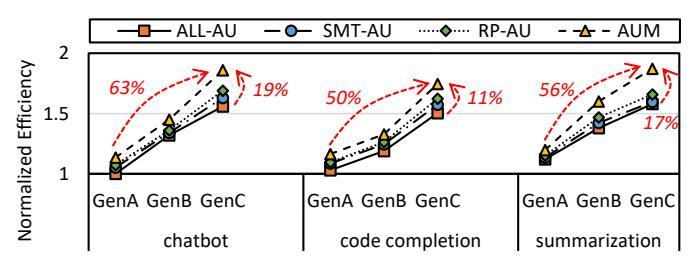
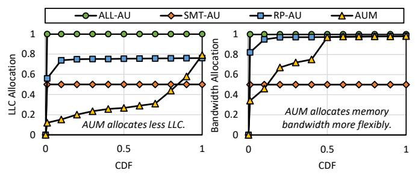

# B. Improving CPU Efficiency

We first evaluate AUM in improving CPU efficiency, which is the primary design goal. We compare the performanceper-watt efficiency of the CPU platform when sharing AUaccelerated LLM serving with background co-running applications. As shown in Figure 14, AUM achieves the best efficiency on the CPU platform, resulting from precisely harvesting AU underutilized resources for shared applications. On average, AUM improves 8.8%, 6.7%, and 4.7% efficiency compared with AU-exclusive and AUV-oblivious sharing baselines. More specifically, we have two observations. Firstly, sharing AU needs to select co-running applications carefully. Sharing with memory-intensive applications like OLAP has marginal efficiency improvements under diverse scenarios even with precise allocation. Secondly, CPU achieves better efficiency under the code completion scenario with loose SLO requirements via AUV-aware management.

Fig. 15: Comparison of efficiency on three variable hardware platforms when sharing with SPECjbb. All the results are normalized to ALL-AU on GenA platform.

Fig. 16: Comparison of performance of AU and three types of shared applications, averaged of three scenarios. The performance results of AU and shared applications are normalized to ALL-AU and RP-AU, respectively.

Further, we investigate the efficiency on hardware platforms with evolving AU. We choose to share with SPECjbb since it presents complex execution and moderate sharing revenues. As shown in Figure 15, newer CPU platforms show better efficiency under various scenarios due to more powerful AU and memory devices, increasing 1.55x on average for exclusive AU usages. The shared AU usages with AUM have higher rates of efficiency increase (63%, 50%, and 56%) compared to AU-exclusive schemes. On the latest GenC platform, AUM increases efficiency by 19%, 11%, and 17% over AU-exclusive baselines. The higher increase rates over GenA result from more resources for tuning and harvesting.

Fig. 17: Comparison of AU application SLO guarantee when sharing with SPECjbb. Left shows the high-AU prefill phase and right shows the low-AU decode phase. AUM shows better performance guarantee than SOTA sharing baselines.

To understand the detailed performance decomposition of AUM on AU and shared applications, we investigate the decomposed performance as shown in Figure 16. The AU-exclusive scheme achieves the best LLM serving performance but zero sharing performance. The AUV-oblivious sharing schemes cause varying slowdowns. As for variants of AUM, AU-UP only optimizes manipulation of AU applications rather than sharing; AU-FI splits the processor to mostly improve sharing performance; and AU-RB enhances traditional resource partitioning for both co-runners.

#### C. Guaranteeing AU Performance

We next evaluate AUM in guaranteeing AU performance SLOs under different scenarios. CPU efficiency improvements must guarantee the primary AU applications. As shown in Figure 17, AU-Man achieves better SLO guarantee compared with AUV-oblivious sharing methods. We have two observations. Firstly, AU-enabled CPU should be used as prompt machines under specific scenarios [67]. For cc with strict TTFT SLOs, even using AU exclusively for prefill cannot meet the SLO due to a lack of computing units. For sm with loose TTFT SLO, AUM achieves 93.6% SLO guarantee ratio, which is 11% better than AUV-oblivious schemes. Secondly, AUM achieves better SLO guarantees for low-AU decode performance. For the loose cc scenario, sharing CPU merely causes SLO violations. For the strict cb and sm scenarios, harvesting critical memory bandwidth causes SLO violations, but AUM achieves similar TPOT SLO performance with AU-exclusive schemes, which is 7% better than AUV-oblivious sharing methods.

## D. Detailed Analysis of AUM

More specifically, we investigate AUM resource management decisions of two examples, LLC and memory bandwidth, as shown in Figure 18. Different from static AUV-oblivious sharing allocation that gives more resources to AU applications, AUM considers AUV and adopts more flexible resource allocation based on runtime information. It harvests more LLC resources from AU to shared applications, and harvests the high-affinity memory bandwidth adaptively. Better utilization of hardware resources contributes to improved CPU efficiency.

To evaluate the parameter sensitivity of AUM on efficiency improvements, we change the value of  $\alpha/\beta$  to mimic the

Fig. 18: Resource allocation Cumulative Distribution Function (CDF) under SPECjbb and chatbot scenario. AUM manages resources more flexibly for shared applications.

emerging situation where token prices are cheaper and cheaper. Under the default 1.8/0.2 setting, the efficiency with AUM outperforms 7.6% over the *SMT-AU* baseline when sharing *Compute* with cc. For a lower 0.9/0.1 setting, AUM exceeds 9.1% over *SMT-AU* since it allocates more resources to sharing applications with little sacrifice of AU applications for overall efficiency based on the weighted calculation.

The runtime overheads of AUM are critical for realistic deployment. The Background AU Profiler works offline, and it takes around 450 AU-enabled executions to converge and construct the AUV Model, including 3 division ×3 sharing  $\times 5$  configurations  $\times 10$  repetitions. Moreover, the overhead of a single profiling could optimize thousands of processor cores with the same model, thus amortizing the offline resource overheads. The Runtime AU Controller decides resource allocation with one CPU core in less than 1 ms to lookup table, which is negligible compared with 100 ms-scale token SLO. Meanwhile, AUM consumes around 15 MB to store AUV and runtime information, which is also negligible for 256 GB memory capacity. More specifically, for benchmarks with rapidly fluctuating resources like SPECibb, the runtime controller adapts to the resource collisions and decides the most efficient configurations for every iteration. The limitation of AUM is reliance on runtime controlling rather than online learning to continuously complement the AUV model.

#### E. Total Cost of Ownership Analysis

Cost-effectiveness has become the top factors that drive next-generation system architecture. We briefly discuss the impact of AUM on the total cost of ownership (TCO), including the capital expenditure (CapEx) for hardware acquisition and the operating expenses (OpEx) for hardware execution. For CapEx, according to 1.3x perf-per-dollar of GPU in Figure 5 and 15% improvements with AUM in Figure 14, CPU with AUM achieves 88% performance-per-CapEx compared with GPU solutions. For OpEx, the maintenance and cooling costs are lower for CPU servers but there are more complex factors affecting the TCO [7], such as machine utilization and amortization. But our conclusion is that if we could unleash the full AU efficiency via AUM, the AU-enabled CPU could cede the limited GPUs to critical scenarios or even become a competitive alternative in the GPU-dominant AI era.

#### VIII. DISCUSSION

This section discusses four limitations of AUM and potential optimization directions.

Large-scale cluster scalability: Currently, AUM focuses on machine-level scheduling with better arrangement of all processor cores. However, the extracted AUV are easy to be exploited in scale-out clusters. For sharding workloads across multiple servers, we can analyze the AUV of every processor and adopt load balancing [\[48\]](#page-13-22) to maximize their efficiency separately. The proposed methodology of profilecontrol is applicable to all AU-enabled benchmarks besides LLM serving. It is promising and underway to integrate AUM into cluster-level scheduling for better cluster efficiency.

Adaptability to AU operators: In this paper, AUM focuses on the xFasterTransformer implementation of AU operators based on Intel oneDNN [\[29\]](#page-12-26). Current software developers are exploring AU deeply to support unstructured sparsity [\[1\]](#page-12-27) and memory tiling [\[41\]](#page-13-10). The different implementations and optimizations of AU operators further increase AUV. However, AUM could be manually optimized to high-performance AUenabled operators and adapt itself with the runtime controller.

Hardware topology adaptability: In this paper, AUM focuses on analyzing and sharing AMX-enabled CPU cores for better efficiency while it can be further enhanced under different hardware topologies. For different hardware sharing topologies, AUM can handle the trade-off between singlethreading and multi-threading cores under different scenarios based on adaptive processor efficiency calculation. For emerging AU topologies such as sharing SME among physical cores [\[4\]](#page-12-28), the current assumption that AU is not shared for hyperthreads, as stated in Section [V-A,](#page-5-1) falls short and AUM needs to refine its profiler with a new dimension of contentions on a single AU. For hybrid topologies where CPU AU interacts with dedicated accelerators like GPU and NPU, there are other concurrent works focusing on offloading orchestration and communication optimization, like LIA [\[36\]](#page-13-6) and ktransformer [\[9\]](#page-12-29). Therefore, hybrid topologies are beyond AUM in this paper and are our future works.

Challenges of **AUM** on other ISAs: The integration of AU into modern CPUs is a universal trend for different vendors besides Intel AVX/AMX [\[25\]](#page-12-9), such as ARM SVE/SME [\[5\]](#page-12-8), [\[76\]](#page-14-20) and RISC-V V/M-extension [\[2\]](#page-12-3), [\[71\]](#page-13-30). We focus on Intel in this paper due to its mature software support of its accelerator units [\[33\]](#page-12-12), [\[41\]](#page-13-10). AUM recognizes the unique AUV, and the three-dimensional designs are independent of underlying hardware component implementations, which can be easily applied to more heterogeneous ISA architectures.

