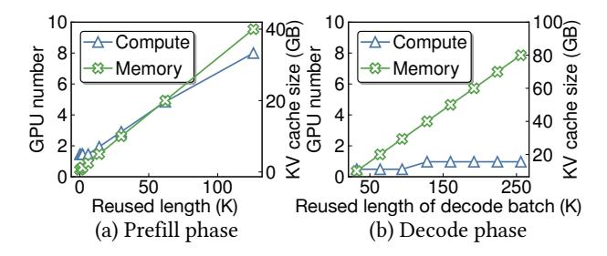
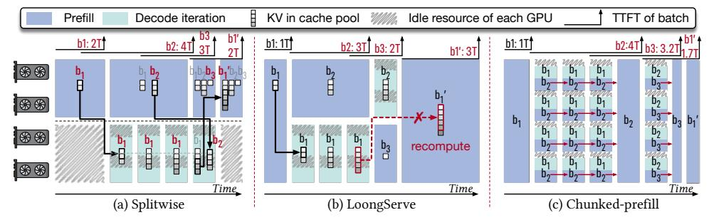
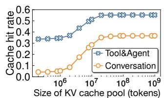
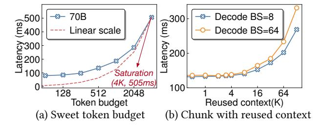
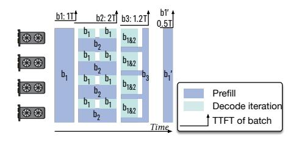
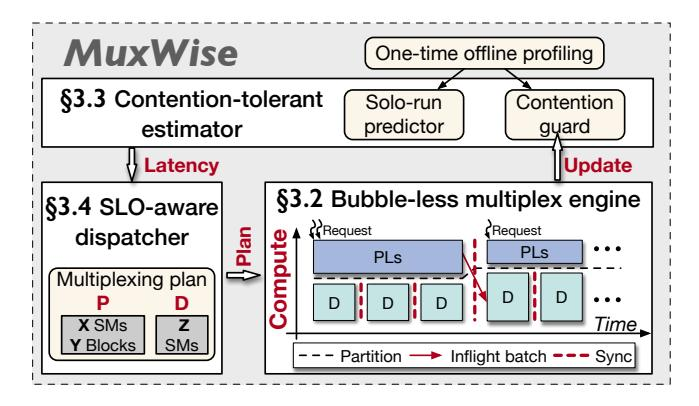

# 2 Background & Motivation

#### 2.1 LLM Services

Architecture of LLMs. Most LLMs [5, 15, 37, 38] are built upon the transformer architecture [39], with model-specific modifications. Figure 2 illustrates a typical transformer layer, which is replicated multiple times to form an LLM model. Each transformer layer contains an attention layer and a feed-forward network (FFN) layer.

Attention computation requires access to all keys and values from processed tokens and also generates the keys and values of new tokens. To avoid redundant computation, LLM serving systems store this data in a KV cache. In the prefill phase, the KV cache is populated from the requests in previous turns. In each decode iteration, the KV cache is derived from earlier prefill and decode iterations.

Diverse workload patterns. Table 1 illustrates the diverse patterns of five typical LLM tasks. The first three are single-turn requests: ShareGPT [4] is a chatbot task, LooGLE [25] is a long-context understanding task, and OpenThoughts [17] is a reasoning task. LooGLE has a long input length due to long documents. Reasoning often requires long thought processes, so OpenThoughts tends to have a longer output length than others. Requests in OpenThoughts share the same system prompt, which is a constant input context (i.e., reused length in the table). Conversion and Tool&agent [34] are two real-world multi-turn tasks. The output tokens from earlier requests become the input context for later requests

**Figure 3.** Required compute and memory for processing different phases under SLO constraints with varied reused context lengths. For prefill (a), the batch size is fixed at 1, the new context length is set to 2K, and TTFT is set to 400ms. For decode (b), the batch size is fixed at 32, and TBT is set to 100ms. These settings are commonly seen in online serving.

in the same session. We use these workloads to conduct experiments that both motivate and evaluate our design.

#### 2.2 Characterization under SLO constraint

Many prior works [32, 44, 53] have investigated the relationship between resource requirements and SLO attainment concerning input length and batch size. Their experiments show that the prefill phase is compute-intensive, with compute demand growing linearly with input length, while the decode phase is memory-intensive. However, they mainly focus on the simple single-turn case, which does not consider the effect of reused input length.

Under these circumstances, we further study how the reused length impacts the compute and memory demands of prefill and decode. In our experiment, the reused length spans the range shown in Table 1, and LlaMA-70B [15] is deployed with tensor parallelism [51] on a server with 8 A100 GPUs. All GPUs are configured with the same partial compute resource, defined by the SM number. For each reused length, we determine the best-fit GPU partition ratio (denoted as  $GPU_{ratio}$ ) to satisfy the SLO target. Figure 3 reports the total compute demand of LlaMA-70B under different reused lengths, computed as  $GPU_{num} = GPU_{ratio} \times 8$ .

As shown in Figure 3-(a), prefill phase requires increasingly more compute resources to meet SLO targets as the reused length grows. In contrast, the compute demand of the decode phase shows less sensitivity. Thus, it is also critical to allocate more compute to the prefill phase as the reused length increases. Further, the distinct compute requirements of two phases necessitate a runtime compute resource partition for SLO attainment and high utilization.

Figure 3-(b) shows that the KV cache required by both the prefill and decode easily reaches tens or even hundreds of gigabytes. This is common in multi-turn LLM services, which produce ultra-long reused contexts. It is preferable to keep the KV cache in the same memory space (aggregated serving) for efficient reuse across phases and requests.

Figure 4. Processing four LLM request batches on 4 GPUs using (a) Splitwise, (b) LoongServe (c) chunked-prefill. All methods satisfy the TBT SLO (T per decode iteration). Specifically,  $b_1$  arrives at 0T,  $b_2$  at 1T,  $b_3$  at 3T, and  $b'_1$  at 5T.  $b'_1$  denotes a subsequent request batch that reuses the KV cache of  $b_1$ . Inefficient TTFTs are marked in red for each method. KV cache management is shown only for the two disaggregated methods, as they require migration or recomputation. In (a) and (b), solid black arrows represent migration, while dashed red arrows with cross markers denote recomputation. In (a), the KV cache column with a red  $b_i$ indicates the active batch. In (c), the red arrow denotes KV cache reads from earlier chunks. tails are shown in Table 1.

Figure 5. Cache hit rates under varying capacities of the KV cache pool. The eviction policy is Least Recently Used. For serving a 70B LLM, achieving the optimal hit rate requires 3.3 TB of memory. Workload trace de-

In a nutshell, we make two observations: 1) Appropriate and dynamic compute partition is essential for meeting the distinct SLO targets of different phases under diverse workloads. 2) Reusing the KV cache across phases and requests is critical for reducing redundant computation and improving goodput.

## **Deficiencies of Existing Works**

2.3.1 Disaggregated Serving. Disaggregating approaches partition GPUs across phases to meet the SLO targets in LLM serving and can be further divided into static and dynamic disaggregation methods. Figure 4-(a) illustrates the static approach (Splitwise [32]), while Figure 4-(b) shows the dynamic approach (LoongServe [44]).

Static disaggregation. As shown in Figure 4-(a), there is a prefill instance and a decode instance with Splitwise [32]. Each instance occupies two GPUs statically and has its own KV cache pool. The GPU number is static after the instance is initialized. In this case, Splitwise suffers from two problems.

First, Splitwise does not adapt to serving dynamics. For example, when batch b1 arrives, only two GPUs process the prefill while the other two GPUs for decoding remain idle. In online serving, such idle periods are common as request loads fluctuate. Second, the coupled management of compute and memory introduces further inefficiencies. For instance, if the decode phase of b1 in Figure 4-(a) requires two GPUs to store the KV cache, the system must also allocate two GPUs for computation. Since compute and memory requirements are misaligned, as shown in Figure 3-(b), the GPUs' compute resources may be underutilized.

In addition, each instance must maintain its own model weights and KV cache pool. As a result, the KV cache pool in Figure 4-(a) is at most half the size of that with four GPUs under non-disaggregated execution. Furthermore, experimental results in Figure 5 show that this reduced capacity

**Figure 6.** (a) Sweet spot of the token budget in chunk-prefill. The decode uses a fixed batch size of 32, with each request having a reused context length of 1K tokens. (b) Latencies with varied reused context of the fused prefill chunk in chunk-prefill. The token budget is fixed at 512, and the reused context length of decode phase is the same as in (a).

sharply lowers the KV cache hit rate in multi-turn workloads, ultimately degrading the system's goodput.

Dynamic disaggregation. LoongServe [44] supports dynamic GPU partitioning across the two phases. Specifically, it scales GPU resources based on the sequence length and execution phase. As shown in Figure 4-(b), when batch b1 arrives, the scheduler assigns four GPUs to prefill. After prefill, it scales down to two GPUs for the decode iterations.

However, LoongServe still causes idleness due to coupled management, and worse, it trades KV cache reuse for adaptiveness needed in serving dynamics. To avoid duplication, it immediately releases the KV cache on original GPUs. Thus, KV caches are reused only from prefill to decode within a single request and cannot be reused across multi-turn requests. In Figure 4-(b), when b1' needs to reuse the KV cache generated by b1, LoongServe recomputes the entire KV cache.

Figure 7. An ideal solution: prefill-decode multiplexing.

**2.3.2 Chunked-prefill.** Chunked-prefill [1] adopts intra-GPU compute fusion. As shown in Figure 4-(c), it splits prefill into chunks and fuses each chunk with a decode iteration. To guarantee decode SLOs, chunked-prefill caps the token budget, which is the sum of new tokens from the prefill chunk and the decode batch. While chunked-prefill has known drawbacks such as quadratic memory overhead [53], we find another drawback. Specifically, chunking introduces a dilemma between SLO attainment and utilization.

Figure 6-(a) presents TBT in Chunked-prefill of varying token budget. In this experiment, the decode iteration for fusion has a static batch size of 32 and a reused context length of 1K tokens, and Llama3-70B is deployed on a server with 8 A100 GPUs. As shown, the latency does not increase linearly with the token budget until it reaches 4K. This indicates that saturating the GPUs requires a prefill chunk with input length of (4K-32). However, the corresponding latency is 505ms, far above the typical TBT SLO target (< 100ms).

Figure 6-(b) presents TBT in Chunked-prefill with varying reused context lengths of the prefill. In this experiment, the token budget is fixed at 512, and the reused context length of decode iteration is 1K. As shown, TBT increases noticeably after the reused context exceeds 4K. This reused context length is common in long-context understanding and multiturn workloads, as shown in Table 1. In such cases, Chunked-prefill easily leads to SLO violations.

#### 2.4 New Paradigm & Challenges

As shown in Figure 7, we propose an intra-GPU prefill-decode (PD) multiplexing paradigm to overcome the above limitations. Specifically, prefill and decode dynamically share the compute resources (SMs) within each GPU. By reserving sufficient SMs to satisfy decode SLOs and assigning the remaining SMs to prefill, high-goodput LLM serving is achieved. PD multiplexing overcomes the limitations of prior methods, benefiting from the following abilities.

First, multiplexing enables dynamic and adaptive compute management. As shown, compute resources can be flexibly allocated between the two phases to maximize system goodput while guaranteeing SLOs. Second, multiplexing decouples compute from memory management. Although the two phases partition compute resources, they share the memory space on each GPU, enabling efficient KV cache reuse. Third, multiplexing allows prefill and decode to run independently

Figure 8. Architecture overview of MuxWise.

without stalling one another, avoiding the dilemma between SLO attainment and system goodput.

However, integrating intra-GPU multiplexing into existing LLM serving systems is non-trivial. There are two challenges to realizing this paradigm. **C-1: GPU bubbles from naive integration.** Current systems have frequent prefill–decode interactions due to the inflight batching mechanism. One phase can easily block the other, creating GPU bubbles. **C-2: Unmanaged contention in spatial multiplexing.** Existing techniques [10, 12, 13] partition only SMs while leaving memory bandwidth unmanaged. As a result, memory bandwidth contention can lead to SLO violations.

