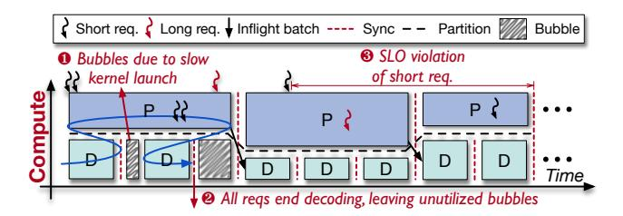

# 3.1 Architecture Overview

Based on the PD multiplexing paradigm, we propose MuxWise, an LLM serving framework that achieves high goodput on diverse workloads. Figure 8 shows the overview of MuxWise that comprises (1) a bubble-less multiplex engine, (2) a contention-tolerant estimator, and (3) an SLO-aware dispatcher.

To enable PD multiplexing with bubble-less coordination, the engine partitions prefill into layer-wise execution, aligning its latency with decode execution. Notably, layer-wise execution incurs negligible overhead and avoids the inefficiencies of chunk-prefill. In addition, it provides an extra benefit: preempting ultra-long prefills to prevent the SLO violations caused by them.

To avoid SLO violations caused by unpredictable contention, the estimator provides worst-case latency estimates by combining a solo-run latency predictor with a contention guard. Both components are built from one-time offline profiling for each LLM on a given hardware. They consider five key factors: reused length, input length, output length, decoding batch size, and partition configuration. LLM-specific factors are extracted from workload traces to guide profiling.

As requests arrive, the SLO-aware dispatcher leverages the engine and estimator to schedule prefill layers and decode iterations dynamically for high goodput. Specifically, the

**Figure 9.** Bubbles and SLO violation of naive intra-process multiplexing. → represents the kernel launch order.

dispatcher reserves best-fit SMs to satisfy decode SLOs based on the worst-case estimation, and assigns the remaining SMs to prefill. Meantime, during online serving, it further refines the contention guard using runtime execution data.

