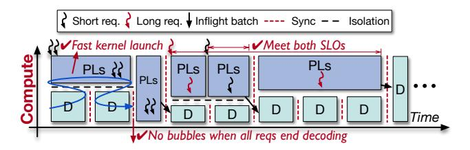
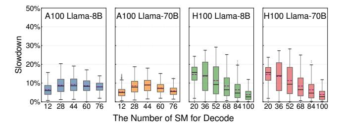
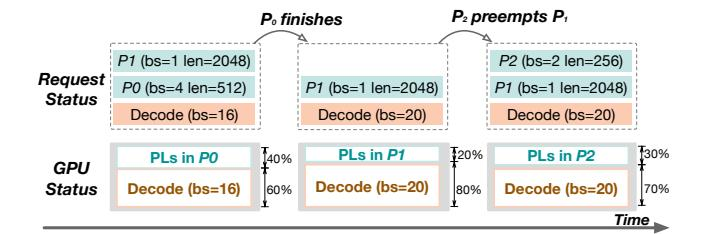

# 3.2 Bubble-less Multiplex Engine

**3.2.1 Spatial Multiplexing Technique.** According to the analysis in §2.4, MuxWise imposes two requirements for PD multiplexing. First, the compute resources must be dynamically partitioned between the two phases with low overhead. Second, the memory space must be shared across the phases to enable efficient KV cache reuse. To meet these requirements, we examine existing approaches for spatially partitioning GPU compute across tasks.

We categorize these approaches into two types: inter- and intra-process partitioning. Inter-process approaches, such as CUDA MIG [12] and CUDA MPS [13], cannot provide flexible compute resource adjustment, let alone the introduced cross-process communication between prefill and decode. In contrast, the intra-process approach GreenContext [10] enables low-overhead resource adjustment by binding CUDA streams to specific SMs, with reconfiguration costing only a stream synchronization (on the order of microseconds). Furthermore, because both phases reside in the same process under GreenContext, they can directly share the same memory space for maintaining a single KV cache pool.

**3.2.2 Inefficiencies from Naive Integration.** With intraprocess compute partitioning, a naive way to support PD multiplexing is to launch the ongoing decode iteration before the prefill phase of new request. This ordering is motivated by launch latency difference: launching a decode iteration takes less than 0.5 ms, whereas launching a prefill phase takes tens of milliseconds.

Ideally, the launch latency of either a prefill phase or decode iteration can be reduced to a single CUDA graph launch (~0.5ms). However, CUDA graph requires offline construction with static configuration and incurs memory overhead. In prefill phase, both batch size and input length vary, whereas decode iteration varies only in batch size. Thus, single-graph optimization is feasible only for decode phase with several selected batch sizes [40], while applying it to prefill phase

**Figure 10.** Bubble-less coordination using layer-wise scheduling for the prefill phase and graph-level scheduling for the decode phase. PLs is the short for prefill layers.

would require capturing much more graphs, incurring unacceptable memory overhead.

Prefill phase can be optimized through piecewise CUDA graph [40], which splits the prefill phase into multiple layerwise CUDA graphs. It still incurs ~10 ms launch overhead for Llama-70B on 8 A100 GPUs. Fortunately, prefill phases consists of long-duration kernels, which are typically longer than the launch time. It does not suffer noticeable performance degradation from launch overhead in most cases.

To this end, when both a prefill phase and a decode iteration are pending, MuxWise prioritizes launching the decode iteration; otherwise, the SMs allocated for the decode phase would remain idle for tens of milliseconds. However, this naive approach still introduces two types of GPU bubbles and can also lead to SLO violations.

Firstly, when the prefill launch time exceeds the execution time of a decode iteration, next decode iteration cannot launch in time, and GPU bubbles occur. As shown on the left of Figure 9, a bubble appears between two decode iterations because the serving system must return newly generated tokens after each iteration.

Secondly, bubbles can arise from unpredictable termination of decode. As depicted in the middle of Figure 9, all requests in a decode batch may finish token generation while a concurrent prefill phase has already been launched. Due to the non-preemptive nature of GPU execution, the launched prefill cannot be interrupted to reclaim compute resources.

Thirdly, SLO violations may occur due to workload skew among requests, as illustrated in the upper-right of Figure 9. Context lengths can vary significantly, with short conversations coexisting alongside long-text summarizations. In such cases, a short request may suffer long queuing delays while waiting for the prefill of an ultra-long request. If the short request has limited SLO slack, it is likely to miss its deadline.

**3.2.3 Bubble-less Coordination.** The above inefficiencies stem from the large latency discrepancy between the prefill and decode phases. This is because prefill phases typically take longer to launch and execute, and the execution time of both phases is highly variable at runtime. To address this, we propose layer-wise execution for prefill and query-based synchronization.

**Figure 11.** Slowdowns in decode due to contention with different multiplexing configurations of prefill and decode across models and GPUs.

Layer-wise execution for prefill. As shown in Figure 10, MuxWise splits the prefill phase into layers (PLs). Based on this new granularity, MuxWise eliminates GPU bubbles and prevents SLO violations. For the first type of bubble, MuxWise can launch enough PBs to occupy compute resources for prefill, and return in time before the decode phase finishes computation. For the second type, MuxWise switches the execution of later prefill layers into a new Green-Context, just after the decode phase terminates. For SLO violations caused by long requests, layer-wise execution enables preemption, allowing short requests to be prioritized, thereby meeting the SLO targets of both. Importantly, layer-wise execution incurs negligible overhead, since LLMs are inherently structured as multiple transformer layers.

Query-based synchronization. In addition to the above bubbles, inflight batching can also introduce GPU bubbles. Specifically, when the last prefill layer completes, it must block the next decode iteration to merge requests into the decode batch. This blocking creates small bubbles, since prefill and decode rarely finish simultaneously. To address this, MuxWise employs query-based synchronization that periodically polls CUDA events. MuxWise continues launching decode batches and prefill layers asynchronously, and when an event is observed complete, the corresponding prefill request is immediately merged into the current decode batch.

#### 3.3 Contention-tolerant Estimator

When the prefill and decode phases are spatially multiplexed, contention can arise, particularly from unmanaged resources such as memory bandwidth. We begin by analyzing contention between the two phases under spatial multiplexing and then introduce our modeling method.

**3.3.1 Contention Analysis.** While GreenContext supports precise compute resource allocation, it cannot manage memory or network bandwidth. In particular, efficient techniques for bandwidth management are lacking. Worse, current GPUs do not expose runtime monitoring of bandwidth usage, and both prefill and decode phases can heavily consume bandwidth, making contention hard to predict.

**Table 2.** Compute analysis for prefill and decode phases.

|                   | Attention                         | FFN       |
|-------------------|-----------------------------------|-----------|
| Prefill w/o cache | $O(Ld^2 + L^2d)$                  | $O(Ld^2)$ |
| Prefill w/ cache  | $O(nd^2 + Lnd)$ $O(d^2 + (r+1)d)$ | $O(nd^2)$ |
| Decode            | $O(d^2 + (r+1)d)$                 | $O(d^2)$  |

To evaluate the impact on execution slowdown, we extensively profile prefill and decode under multiplexing using Llama-8B and Llama-70B. Figure 11 reports the decode slowdown on servers with 8 A100 and 8 H100 GPUs. The x-axis denotes the number of SMs allocated to the decode batch, with the remaining SMs assigned to the prefill batch. For each configuration, the prefill batch's total context length (reused + new) ranges from 1,024 to 128K tokens, whereas the decode batch's reused length ranges from 1,024 to 1,024K tokens. This profiling takes one week.

As shown in Figure 11, contention-induced slowdown ranges from nearly zero to about 30% across different partition configurations and GPUs. The high variation across hardware partitions indicates the inherent unpredictability of contention slowdown. Although both models exhibit similar slowdown trends on the same GPUs due to their architectural similarity, this observation does not aid contention modeling. Meanwhile, results for prefill are similar but omitted due to space constraints.

**3.3.2 Worst-case Estimation for SLO guarantee.** To mitigate the risk of SLO violations caused by unpredictable contention in online serving, MuxWise introduces a worst-case latency estimation method tailored for SLO guarantees. The key observation is that precise latency prediction is not the only way to guarantee SLO. What matters is ensuring that the latency of a scheduled phase, given its allocated compute resources, does not exceed the predefined target. Thus, MuxWise performs worst-case estimation by first predicting its solorun latency, and then applying a maximum slowdown factor.

**Solo-run predictor.** To predict solo-run latency, we analyze the compute complexity of prefill and decode, and construct a predictor using offline profiling. The latency of each prefill or decode iteration is determined by the token lengths of the reused and new context. Table 2 summarizes the compute analysis of the prefill and decode phases with a batch size of 1. The key factors are as follows:

- *d*: The hidden dimension of each token's representation.
- *L*: The total token length.
- r: The token length of the reused (cached) context.
- n = L r: The token length of the new context.

Based on the complexity analysis in Table 2, we build latency prediction models for the prefill and decode phases. The prefill model is given in Equation 1, and the decode model in Equation 2, where all  $\theta$  terms are coefficients. We

separate the models because state-of-the-art serving frameworks adopt different execution paths for these two phases, including distinct GPU kernel implementations and launch methods.

$$T_{Prefill} = \theta_1 \cdot \sum_{i}^{bs} n_i^2 + \theta_2 \cdot \sum_{i}^{bs} n_i \cdot r_i + \theta_3 \cdot \sum_{i}^{bs} n_i + \theta_4$$
 (1)

$$T_{Decode} = \theta_1 \cdot \sum_{i}^{bs} r_i + \theta_2 \cdot bs + \theta_3 \tag{2}$$

The trained models achieve high accuracy, with a maximum deviation of 8.16% for prefill and 8.84% for decode, effectively supporting MuxWise's online scheduling. Meanwhile, the offline profiling for training the solo-run predictor can be completed within a few hours, which is acceptable. It is a one-time effort per LLM–machine pair and has been widely adopted in prior LLM serving work [\[1,](#page-14-0) [44,](#page-16-8) [53\]](#page-16-6).

Contention guard. To provide the maximum slowdown factor, MuxWise introduces the contention guard. Specifically, the contention guard provides slowdown factors only for decode, which will be explained in [§3.4.1.](#page-7-2) The contention guard is built using data collected through grid-samplingbased profiling. This profiling spans five variables: the number of new and reused tokens in prefill, the batch size, and total reused tokens in decode, and the partition configuration. For each pair of prefill and decode iterations to be estimated, the contention guard returns the maximum slowdown factor of the grid cell they fall into as the estimation result.

Building such a contention guard incurs much higher offline profiling overhead than the solo-run predictor, since pairwise profiling is needed to obtain slowdown data. Fortunately, extensive profiling shows that slowdown remains within a limited range, with a maximum of 20% on A100 GPUs and 30% on H100 GPUs. This indicates that even with coarse-grained profiling, worst-case latency inflation does not exceed 30%.

To this end, we initialize the contention guard using coarsegrained grid sampling. Specifically, we sample variables such as new and reused tokens in prefill, as well as single-request reused tokens in decode batches, at powers-of-4 granularity, ranging from 2K to 128K. The sampled decode batch sizes follow SOTA serving frameworks (around 20 batch sizes). We partition GPUs at the granularity of 16 SMs, yielding 6 configurations for A100 and 7 for H100. In total, the number of samples per LLM–machine pair is calculated as (4×4−1) ×4×20×6 ≈ 7, which can be collected within 12 hours. In the equation, we exclude the case with 128K new and 128K reused tokens in prefill, since 128K is the maximum context window supported by mainstream LLMs [\[5,](#page-15-10) [15\]](#page-15-11).

The reason for using 16 SMs as the granularity are twofold: (1) kernels on H100 and newer GPUs requires 16 SMs, due to using new features like thread block cluster [\[3\]](#page-15-12), and (2)

Figure 12. The dispatching policy of MuxWise.

experiments indicate that 16 SMs already deliver strong performance improvements. Finer-grained scheduling offers little benefit while increasing memory overhead.

Furthermore, MuxWise leverages runtime execution data to continuously update the contention guard, thus refining its SLO guarantees. Even with the coarse-grained contention guard, MuxWise already outperforms existing baselines in both SLO attainment and system goodput ([§4\)](#page-8-0).

