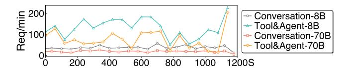
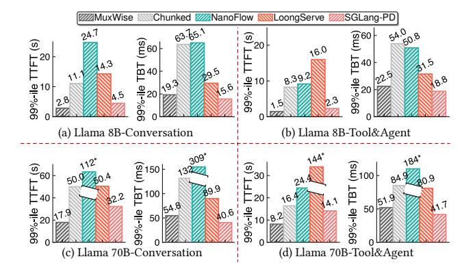

# 3.4 SLO-aware Dispatcher

With bubble-less multiplexing and contention-tolerant modeling, we introduce MuxWise's detailed dispatching policy.

3.4.1 Priorities of prefill and decode. In this work, we focus on the scheduling within a single serving instance. In MuxWise, we prioritize SLO attainment for the decode phase and process the prefill phase as early as possible. SLO attainment for the prefill phase is not directly guaranteed for two reasons. Firstly, although we prioritize the decode phase, we only allocate just-enough compute resources for it. Since the remaining compute resources are allocated to the prefill phase, its SLO is generally expected to be met. Secondly, when SLO violations occur for the prefill phase, it indicates that the inference load has exceeded the peak capacity of the current LLM serving instance. In such cases, further scheduling efforts would no longer improve performance.

This is also why the contention guard in the contentiontolerant estimator only provides a maximum slowdown factor for decode. When predicting the prefill phase, MuxWise does not need an accurate or worst-case estimate. It only requires that the predicted latency of the launched prefill layers exceeds that of the corresponding decode iteration, ensuring full utilization of the allocated compute resources.

3.4.2 Dispatching policy. Building on the above analysis, [Figure 12](#page-7-3) illustrates MuxWise's SLO-aware dispatching policy. The system makes scheduling decisions after each prefill batch completes and at the end of each decode iteration. Specifically, the dispatcher selects prefill layers either from the ongoing prefill batch or from a new batch in the request queue, and allocates compute resources between the prefill and decode phases.

As shown in [Figure 12,](#page-7-3) the dispatcher allocates a best-fit number of SMs (60%) to decode and assigns the remaining SMs (40%) to prefill phase P0. The resource partition satisfies the decode SLO and maximizes prefill throughput guided by the contention-tolerant estimator. To support layer-wise execution in the multiplex engine, the estimator computes the number of prefill layers to launch as  $N_{PL} = \lceil (T_d \times N_T)/T_P \rceil$ , where  $T_d$  is the estimated decode latency,  $T_P$  is the estimated prefill latency, and  $T_D$  is the number of transformer layers in the served LLM.

Once P0 finishes computation, it is merged into the decode batch, increasing the batch size to 20. The scheduler then retrieves a new prefill batch P1 and adjusts the partition to 20% SMs for prefill and 80% for decode to meet SLO targets.

Later, when a new prefill batch *P*2 arrives, it would normally wait for *P*1 to complete. However, because *P*1 has a long input length, this delay risks violating P2's SLO. To avoid this, MuxWise allows *P*2 to preempt *P*1, provided that preemption does not cause *P*1 to miss its own TTFT SLO.

MuxWise does not allow recursive preemption. For example, after P2 preempts prefill batch P1, no other batch may preempt P2. This design is reasonable, as short requests typically preempt long ones, and preempting a short request in turn would likely cause it to miss its SLO. MuxWise checks SLO attainment only when a prefill batch is preempted; otherwise, it prioritizes processing the active prefill batch as quickly as possible. Notably, preemption in MuxWise is optional. Even when disabled, MuxWise still delivers substantial performance improvements over the baselines.

## 4 Evaluation

## 4.1 Experimental Setup

Testbed. We mainly evaluate MuxWISE on a server equipped with 8 A100-80GB GPUs. The GPUs are interconnected via NVLINK, providing 600 GB/s of bandwidth. We also evaluate MuxWISE on two additional servers to demonstrate its effectiveness on newer GPUs and larger LLMs: one with 8 H100-SMX5-80GB GPUs and another with 8 H200-SMX5-141GB GPUs. These servers offer higher compute capability and larger GPU memory. All experiments are conducted with PyTorch 2.6.0 [31]. MuxWISE is implemented using SGLang [52] version 0.4.10post2. The GPU driver version is 570.124.06, and the CUDA version is 12.8.

*Models.* We primarily evaluate MuxWise using two LLMs from the Llama family [15, 37, 38]: Llama-8B and Llama-70B. These models differ in size and represent the most commonly hosted LLMs in the cloud. We also evaluate a larger MoE model, Qwen3-235B with 22B activated, to demonstrate MuxWise's generality.

**Baselines.** We compare MuxWise against 3 state-of-theart solutions for efficient LLM serving. Model parallelism techniques such as tensor parallelism [51] are employed to parallelize the deployed models. For MuxWise, we fix the tensor parallelism degree to 8. Details of each baseline's model parallelism configuration are provided when the baseline is

introduced. For all systems, the KV cache memory pool is configured as large as possible to maximize throughput.

- Chunked-prefill in SGLang [1]: This version of SGLang is equipped with chunked-prefill, as proposed by SARATHI-Serve [1]. We follow SARATHI-Serve's methodology to calculate the token budget for each workload prior to experiments. It is offline tuned under specific TBT targets for each model. Unlike SARATHI-Serve, which serially executes prefill and decode attention kernels, SGLang leverages Flashinfer [46], a high-performance inference kernel library, to fuse them into a single kernel. It is expected to deliver performance similar to POD-attention [21].
- NanoFlow [54]: This is an enhanced version of chunked-prefill with operator-level intra-GPU multiplexing, targeting near-optimal throughput under a relatively loose SLO requirement (200 ms). It requires a large token budget (at least 1024) to achieve this goal. However, such a token budget cannot meet the SLO requirements of modern LLM serving (≤ 100 ms). We use the same token budget as chunked-prefill for NanoFlow.
- LoongServe [44]: This is a dynamic disaggregated serving system. We adopt its model-parallelism configuration. For Llama-70B, sequence parallelism is set to 2 and tensor parallelism to 4. For Llama-8B, sequence parallelism is set to 4 and tensor parallelism to 2. It does not support new LLMs like MoE models.
- Disaggregated serving in SGLang (SGLang-PD in short): This is the latest implementation of static disaggregation with KV-cache sharing across phases and requests. The P:D ratio is 1:1, with tensor parallelism set to 4 for each instance. DistServe [53] does not support KV-cache sharing across requests, making it unsuitable for modern LLM services. We also evaluated Dynamo [14], which performed substantially worse than SGLang-PD. Therefore, we use SGLang-PD as the state-of-the-art baseline of static disaggregation for evaluation.

Metrics. MuxWise targets goodput improvement. So, following prior works [1, 32, 34, 53], we use tail latency (e.g., P99) to assess SLO attainment. Meanwhile, there is also another metric to measure the SLO guarantee during decode phase: TPOT (timer per output token). In comparison, TBT accounts the latency of each individual token, whereas TPOT is an average metric that may mask the poor performance of some tokens [42]. Thus, we choose TBT over TPOT for a stricter SLO metric. We set the TBT SLO target to 50ms for Llama3-8B and 100ms for Llama3-70B, following prior works [1, 34]. We regard MuxWise's ability to deliver better TTFTs under skewed workloads as an additional benefit of the new serving paradigm. Moreover, it breaks the first-come-first-serve model used in other baselines. Thus, we only evaluate TTFT per token in §4.4.3.

Figure 13. The two real-world workload traces after scaling.

**Figure 14.** 99%-*ile* TTFT and TBT for Llama-8B and Llama-70B on real-world Conversation and Tool&Agent workloads. Chunked represents chunked-prefill in SGLang. Values marked with \* are too large; we clip their corresponding bars, so the bar height only decodes their relative size.

