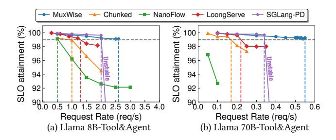
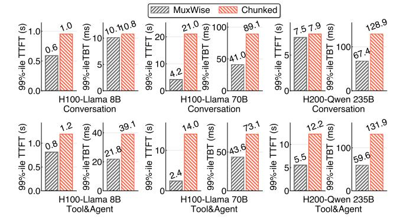
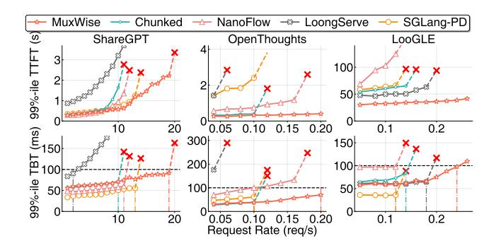

# 4.2 Evaluation on Real-world Workloads

**4.2.1 End-to-end Performance.** We begin by evaluating MuxWise with Llama-8B and Llama-70B under real-world workload traces. Figure 13 shows their request rates after scaling down, as they are originally from a large cluster. As illustrated, they show bursty request patterns (up to 13× spike within 1min).

Figure 14 shows the latency distribution of TTFT and TBT. Although the real-world traces are scaled down to a modest level, some baselines still easily reaches its peak throughput and enters an unstable state (NanoFlow in Figure 14-(c) and LoongServe in Figure 14-(d)). After omitting unstable results, MuxWise achieves average 99%-ile TTFT speedups of 3.57×, 5.98×, 4.65×, and 1.66× over chunked-prefill, NanoFlow, LoongServe, and SGLang-PD, respectively. MuxWise and the two disaggregated solutions consistently meet the TBT SLO, whereas chunked-prefill and NanoFlow fails in most cases. SGLang-PD achieves shorter TBT than MuxWise, as it statically reserves more compute resources for the decode instance.

Compared to chunked-prefill, MuxWise avoids the dilemma between SLO compliance and high utilization, bringing better performance for both prefill and decode phases. While tuning the token budget, we observe that either increasing or reducing it fails for SLO guarantee. This is because the reused length in prefill phase in the two workloads can reach up to 50K tokens. Further splitting the prefill into smaller chunks

**Table 3.** Results of other metrics for Llama-70B on Conversation workloads in Figure 14-(c).

|                     | TTF  | T (s) | TBT   | (ms) | E2F  | E (s) | TPOT  | (ms)  |
|---------------------|------|-------|-------|------|------|-------|-------|-------|
|                     | Avg. | P50   | Avg.  | ТВТ  | Avg. | P50   | Avg.  | P50   |
| MuxWise             | 3.1  | 1.4   | 30.2  | 25.0 | 13.1 | 12.2  | 31.1  | 28.3  |
| Chunked NanoFlow | 12.0 | 7.2   | 45.3  | 49.3 | 27.0 | 23.3  | 46.9  | 45.7  |
| NanoFlow            | 51.4 | 52.3  | 105.6 | 98.9 | 83.4 | 84.2  | 120.2 | 103.2 |
| LoongServe          | 17.7 | 14.7  | 61.0  | 58.3 | 38.4 | 35.8  | 62.3  | 60.6  |
| SGLang-PD           | 7.38 | 3.95  | 32.9  | 32.5 | 18.4 | 16.4  | 33.5  | 33.2  |

does not help control the TBT. MuxWise's PD multiplexing avoids this issue entirely.

NanoFlow performs worse than the original chunked-prefill. This is because, built atop chunked-prefill, NanoFlow is designed to overlap compute-bound kernels with memory-bound or communication kernels. To achieve this, it requires a large token budget (1024 in its paper) to ensure that chunked-prefill as a whole remains compute-bound. However, in Figure 14, the token budget has to be reduced to 256 to meet TBT SLO targets, where chunked-prefill is no longer compute-bound. The long reused context length in the two evaluated real-world traces further makes chunked-prefill harder to be compute-bound. Thus, NanoFlow degrades due to overlapping memory-bound kernels.

The situation worsen for NanoFLow with Llama-70B in Figure 14-(c&d). This could be attributed to the inherent model weight reload of intra-GPU overlapping. NanoFlow split each chunk into 2 nano batches , thus duplicating loading for each decode iteration [54]. When evaluating with Llama-70B, the reloading overhead is amplified due to the larger model size. Conversely, MuxWise duplicates loading only once during prefill, which typically co-runs with tens of decode iterations. Because prefill is compute-intensive and the reload is amortized over the entire phase, MuxWise imposes negligible bandwidth pressure, which is marginal relative to its overall benefits. While NanoFlow performs poorly on the two real-world workloads, it outperforms chunked-prefill for short input sequences without cross-request context length reuse(§4.3).

Against the two disaggregated solutions, MuxWise achieves significantly better TTFT. In LoongServe, instance scaling releases the KV cache needed for reuse in the prefill phase, causing redundant recomputation. In SGLang-PD, static disaggregation often leaves decode instances idle under fluctuating real-world workloads. In contrast, MuxWise avoids KV migration and adapts to dynamic workloads through intra-GPU compute partition reconfiguration.

**4.2.2 Other Latency Metrics.** In this experiment, we report results for other metrics, such as end-to-end latency and TPOT. We also present these results using other statistical measures, including average and P50 values. Table 3 shows the results on the Conversation workload with Llama-70B,

**Table 4.** Results of other metrics for Llama-70B on Tool&Agent workloads in Figure 14-(d).

|                                | TTF  | T (s) | ТВТ  | (ms) | E2F  | (s)  | TPO  | Γ (ms) |
|--------------------------------|------|-------|------|------|------|------|------|--------|
|                                | Avg. | P50   | Avg. | P50  | Avg. | P50  | Avg. | P50    |
| MuxWise Chunked NanoFlow | 1.3  | 1.0   | 27.2 | 24.1 | 4.0  | 1.6  | 33.1 | 27.7   |
| Chunked                        | 2.4  | 1.1   | 30.5 | 21.2 | 5.5  | 2.3  | 45.9 | 47.1   |
| NanoFlow                       | 2.8  | 1.2   | 58.8 | 42.4 | 7.4  | 2.5  | 70.3 | 62.6   |
| LoongServe                     | 59.9 | 56.0  | 52.4 | 50.8 | 65.2 | 61.0 | 56.2 | 54.6   |
| LoongServe SGLang-PD        | 2.1  | 1.5   | 31.6 | 31.0 | 5.2  | 2.3  | 37.1 | 33.7   |

while Table 4 shows the results on the Tool&Agent workload with Llama-70B in §4.2.1. Results in other settings are similar and are omitted due to space constraints.

As shown in the two tables, while MuxWise focuses on improving high goodput, it also consistently outperforms the baselines across the reported metrics. There is only one outlier in the P50 TBT of Table 4, and the values are very close. This can occur because the P50 TBT in chunked-prefill may correspond to the latency of a pure decode iteration.

4.2.3 SLO Attainment and Goodput. We also measure the SLO attainment of TBT and the corresponding goodput to evaluate the effectiveness of MuxWise in meeting SLO compliance. In this experiment, we extract requests from the Tool&Agent trace but replace their arrival timestamps with those generated by a Poisson process at varying rates, following prior work [44]. We stop testing once the serving system becomes unstable or fails to meet the TBT SLO target.

Figure 15 shows the SLO attainment results under gradually increasing workloads. Under the constraint of meeting the 99%-ile SLO guarantees, MuxWise achieves 2.6×, 5.2×, 2.0×, and 1.3× higher goodput than chunked-prefill, NanoFlow, LoongServe, and SGLang-PD, respectively for Llama-8B; and 3.06×, 2.62×, and 1.62× higher than chunked-prefill, LoongServe, and SGLang-PD for Llama-70B. NanoFlow never meets the SLO even with a small chunk size of 64 for Llama-70B; therefore, the corresponding goodput improvement is omitted. Table 5 further shows the corresponding token thorughput and GPU utilization of MuxWise and baselines. GPU utilization is an aggregated metric reported by NVIDIA Nsight Systems, that reflects the fraction of active SMs as well as the utilization of intra-SM resources.

Chunked-prefill, and NanoFlow fails to meet the TBT SLO even at lower request rates than the other two baselines. This is because chunking is largely ineffective at reducing TBT in real-world LLM services, where cross-request interactions are common. Compared to LoongServe, MuxWise achieves higher goodput by avoiding recomputation in multi-turn requests. Compared to SGLang-PD, MuxWise achieves higher goodput through a larger KV-cache pool and reduced idleness caused by static disaggregation. Meanwhile, MuxWise achieves shorter TTFT across all cases (up to 9.16×).

**Figure 15.** SLO attainment for Llama-8B and Llama-70B on Tool&Agent workload with varied request rates.

**Table 5.** Token throughput and GPU utilization for Llama-8B and Llama-70B on Tool&Agent workload under Goodput.

| Model     | L       | lama-8B         | Llama-70B |                 |  |
|-----------|---------|-----------------|-----------|-----------------|--|
| Metrics   | Token/s | GPU Util.       | Token/s   | GPU Util.       |  |
| MuxWise   | 25397   | 88.1            | 7430      | 84.0            |  |
| Chunked   | 9768    | 63.8            | 2269      | 66.1            |  |
| NanoFlow  | 4884    | 55.1            | -         | =               |  |
| LoogServe | 12698   | 75.3            | 2936      | 70.1            |  |
| SGLang-PD | 19535   | P(72.4)/D(83.4) | 4538      | P(67.1)/D(81.9) |  |

**Figure 16.** 99%-ile TTFT and TBT for Llama-8B and Llama-70B on a server with 8 H100 GPUs and 99%-ile TTFT and TBT for Qwen-235B on a server with 8 H200 GPUs.

4.2.4 More Advanced GPUs and Larger LLM. To demonstrate MuxWise's effectiveness on other GPUs and LLMs, we evaluate it with Llama-8B and Llama-70B on a server with 8 H100 GPUs, and with Qwen-235B on a server with H200 GPUs. In this experiment, we only compare MuxWise with chunked prefill. LoongServe does not support new MoE models like Qwen-235B, and disaggregated serving solutions are also infeasible for Qwen-235B, even though each H200 has 141 GB of GPU memory. Figure 16 shows the experimental results. Across all cases, MuxWise achieves an average 2.28× speedup on 99%-ile TTFT and an average 1.81× speedup on 99%-ile TBT. These consistent improvements demonstrate the generality of MuxWise's serving paradigm across diverse hardware and larger, newer LLMs.

**Figure 17.** 99%-*ile* TTFT and TBT with Llama-70B on three types of synthetic workloads.

