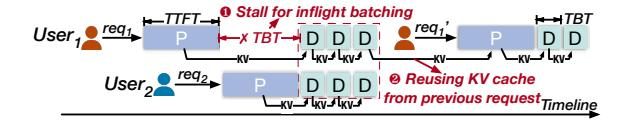
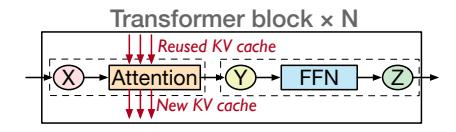

# **ACM Reference Format:**

Yukang Chen, Weihao Cui, Han Zhao, Ziyi Xu, Xiaoze Fan, Xusheng Chen, Yangjie Zhou, Shixuan Sun, Bingsheng He, and Quan Chen. 2026. Towards High-Goodput LLM Serving with Prefill-decode Multiplexing. In *Proceedings of the 31st ACM International Conference on Architectural Support for Programming Languages and Operating Systems, Volume 2 (ASPLOS '26), March 22–26, 2026, Pittsburgh, PA, USA.* ACM, New York, NY, USA, 18 pages. https://doi.org/10.1145/3779212.3790236

#### 1 Introduction

Large language models (LLM) services now perform well across diverse workloads [19, 30, 33]. At the request level, an LLM processes input in two phases: a prefill phase that produces the first token, followed by a decode phase that iteratively generates the remaining tokens. The ratio of input length (prefill) to output length (decode) varies across tasks [6, 43]. At the application level, tasks such as chatbot services or agent-based workloads [34] often consist of multiple turns of requests with shared context.

\*Equal contribution.

**Figure 1.** A typical workflow in LLM serving systems: User1 sends two consecutive requests, with the second reusing the context from the first. User2 sends 1 request.

To achieve high throughput for serving these workloads, existing LLM serving systems employ several optimizations. Figure 1 presents a typical workflow. While requests arrive at different times, inflight batching stalls the ongoing decode phase to prefill new requests and then processes all decode iterations together in a single batch. It greatly improves compute utilization for the memory-intensive decode phase [47]. Since multi-turn requests share context, LLM serving systems reuse intermediate results (i.e., the KV cache) both within and across requests through a KV cache pool [26, 52].

LLM services also impose stringent Service Level Objectives (SLOs). For instance, chatbot typically requires Time-To-First-Token (TTFT) under 500 ms for prefill and Time-Between-Tokens (TBT) under 100 ms for decode. Since prefill and decode interleave in an LLM serving system, SLO violations may arise. In Figure 1, inflight batching stalls ongoing decode. A long prefill can thus delay decode, potentially violating its SLO. To sustain high goodput-peak throughput with SLO guarantees-existing methods fall into two categories: disaggregated serving [32, 53] and chunked prefill [1].

As for disaggregated serving, Splitwise [32] separates the prefill and decode phases into distinct instances for SLO guarantees, which has two drawbacks. Firstly, it cannot adapt to serving dynamics. In Splitwise, GPUs are statically allocated at initialization. Under fluctuating request loads and diverse serving patterns, it often leads to resource underutilization. Secondly, it decreases goodput due to shrinking the KV cache pool. With the same number of GPUs, disaggregation allocates a separate cache pool for each instance, reducing the effective cache pool size. This lowers cache hit rate [45] (e.g., from 36.6% to 4.2%), leading to unnecessary recomputation and degraded goodput. Furthermore, while LoongServe [44] supports dynamic GPU allocation based on the request sequence length and execution phase, it cannot support the cross-request KV cache reuse, incurring significant recomputation overhead in multi-turn workloads.

Chunked-prefill [1] is another approach to meet decode SLOs. It splits the prefill phase into chunks within each GPU and fuses each chunk with a decode iteration. To ensure computational equivalence, each chunk reads the KV cache generated by all previous chunks. It ensures the decode SLOs by capping the token budget, defined as the sum of new tokens from the prefill chunk and the decode batch. By tuning

the chunk and decode batch sizes, it adapts to serving dynamics. Since it avoids disaggregation, it also prevents goodput loss from a reduced KV cache pool.

Unfortunately, chunking is not a free lunch. It creates a dilemma between SLO compliance and high utilization. Because prefill chunk and decode iteration must execute together, the token budget governs both decode SLO attainment and GPU saturation. Yet, finding a sweet budget in practice is infeasible. E.g., deploying a 70B LLM on 8 A100 GPUs requires a 4K budget to saturate the GPU, which is 8× larger than the SLO-compliant budget (256 for a 100 ms TBT SLO). Moreover, TBT in chunk-prefill is inflated by repetitive KV cache access from the prefill chunk. With extremely long reused context, common in multi-turn workloads, chunked-prefill may even fail to meet SLO guarantees (§2.3.2). Ultimately, chunked-prefill cannot sustain high goodput.

Achieving high-goodput LLM serving requires more flexible compute management. We propose intra-GPU prefill-decode (PD) multiplexing as a promising new serving paradigm. Specifically, the prefill and decode phases are executed on different streaming multiprocessors (SMs) within the GPUs. In the new paradigm, 1) compute partitions can be reconfigured with low overhead to adapt to serving dynamics; 2) multiplexed phases share GPU memory, keeping the KV cache pool efficient; 3) with spatial sharing, prefill and decode execute independently, avoiding the tradeoff between SLO compliance and utilization.

Realizing this paradigm is non-trivial. Firstly, phase coordination is still required to enable inflight batching and improve compute utilization. However, since prefill and decode latencies differ significantly, naive coordination often leaves GPU bubbles. Secondly, spatial multiplexing introduces unpredictable contention. Although existing approaches [10, 12, 13] partition compute, they provide little control over shared resources such as memory bandwidth.

To this end, we propose MuxWise, an LLM serving framework that achieves high goodput across diverse workloads. MuxWise comprises three modules: a *bubble-less multiplex engine*, a *contention-tolerant estimator*, and an *SLO-aware dispatcher*. The engine partitions prefill into layers with negligible overhead, aligning execution latencies for bubble-less multiplexing. The contention-tolerant estimator provides worst-case latency predictions by combining a solo-run predictor with a contention guard derived from one-time offline profiling. Built atop the engine and estimator, the SLO-aware dispatcher schedules diverse LLM requests efficiently by selecting multiplexing plans to maximize goodput.

We implement MuxWise on top of SGLang [52], extending it with PD multiplexing. MuxWise is evaluated extensively on both small and large LLMs using real-world workloads. Experiments show that MuxWise achieves an average 2.20× goodput improvement (up to 3.06×) over state-of-the-art solutions. In summary, our contributions are:

Figure 2. Main architecture of most LLMs.

**Table 1.** Diverse patterns of typical LLM tasks. Minimum, mean, and maximum values for each metric are reported. The input length includes the length of new and reused context.

|                   | Input length  | Output length | Reused length |
|-------------------|---------------|---------------|---------------|
| ShareGPT [4]      | 4/226/1024    | 4/195/1838    | \             |
| LooGLE [25]       | 3380/30k/81k  | 2/15/326      | \             |
| OpenThoughts [17] | 311/709/4633  | 684/8374/32k  | 243           |
| Conversation [34] | 891/7538/123k | 1/342/2000    | 0/4496/120k   |
| Tool&agent [34]   | 891/8596/123k | 1/182/2000    | 0/4905/120k   |

- We identify key requirements for LLM serving with high goodput through a detailed analysis of prior works.
- We propose a new LLM serving paradigm-PD multiplexingaligned with these requirements, and present a clean design to effectively serve LLMs with high goodput.
- We evaluate MuxWise under diverse workloads, demonstrating its superiority over state-of-the-art solutions.

