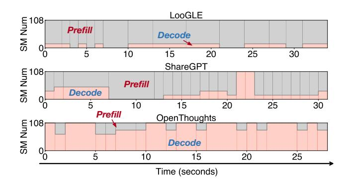
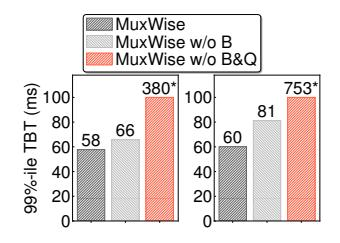
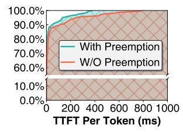

# 4.3 Evaluation on Diverse Synthetic Workloads

To better demonstrate MuxWise's effectiveness, we further evaluate it under three synthetic workloads. In the rest of the evaluation, we focus on Llama-70B due to space constraints, as results on other models are similar. Requests are generated by sampling inputs from ShareGPT [4], Openthoughts [17], and LooGLE [25], with arrival rates gradually increased following a Poisson process. Among these, only Openthoughts requests share a short system prompt. We select these workloads because they represent three typical patterns: moderate input and output, short input with ultra-long output, and ultra-long input with short output.

Figure 17 shows 99%-ile TTFT and TBT of MuxWise and three baselines. On ShareGPT, MuxWise achieves goodput improvements of 1.9×, 1.73×, 9.5×, 1.46× over chunked-prefill, NanoFlow, LoongServe, and SGLang-PD, respectively. On LooGLE, it achieves 1.71×, 2×, 1.33×, 2× over the four baselines. On Open-Thoughts, it achieves the same 2× improvement over chunked-prefill, NanoFlow and SGLang-PD, while Loongserve never meets SLO.

On ShareGPT, MuxWise, chunked-prefill, NanoFlow, and SGLang-PD all provide SLO guarantees at the beginning. SGLang-PD even achieves better TBT than MuxWise, as it statically reserves more compute. In contrast, MuxWise delivers shorter TTFT by reserving only best-fit SMs for decode. On OpenThoughts, LoongServe performs worse than the others, as it is designed for long-context workloads rather than requests with short inputs and long outputs.

NanoFlow outperforms chunked-prefill only on ShareGPT. On OpenThoughts, the system spends most of the time in the decode phase. Therefore, NanoFlow splits decode iterations to enable overlapping, leading to higher TBT than chunked-prefill. On LooGLE, it performs worse due to the small token budget used for long requests.

We also observe that SGLang-PD performs much worse on OpenThoughts and LooGLE than on ShareGPT. The causes differ across workloads. For OpenThoughts, since requests share little context, the system must still reserve slots for KV caches during prefill and decode. As the request rate

**Figure 18.** Change in compute partition between prefill and decode on LooGLE, ShareGPT, and OpenThoughts. Figures are sorted in descending order of prefill compute demand.

increases, prefill stalls once the KV cache pool runs out of space. For LooGLE, only four GPUs are available for prefill, causing requests to queue in the prefill instance.

4.3.1 Short Requests and Single GPU. Running Llama-8B on an A100 with ShareGPT, MuxWise improves goodput by 1.2× over chunked-prefill while maintaining similar TBT. This is because even when chunking rarely happens, satisfying a strict TBT SLO still forces chunked-prefill to use a small token budget, limiting GPU utilization and peak goodput. Notably, real-world conversation inputs are becoming significantly longer (e.g., 1.2K and 2.3K tokens in two recent conversation traces from cloud vendors [35, 41], compared with 226 tokens in the older ShareGPT dataset). The conversation in our evaluation is a multi-turn real-world trace, whose average length approaches to 7.5K. This trend is driven by the widespread adoption of techniques such as RAG [24], which increase the effective model input length by appending retrieved sequences to the user input.

#### 4.4 Ablation Study

4.4.1 Scheduling details of different tasks. We further evaluate MuxWise's dynamic scheduling of compute partitions by extracting scheduling details from runtime serving in §4.3. As shown in Figure 18, MuxWise makes different scheduling decisions for different workloads. On LooGLE, most SMs are allocated to prefill, while on OpenThoughts, MuxWise allocates the majority of SMs to decode. Results on ShareGPT lie between LooGLE and OpenThoughts. Overall, however, more SMs are allocated to prefill on ShareGPT, since decode is typically memory-bound and does not require as many SMs as prefill. Notably, we use Figure 18 to show that different partitions are required for different workloads. They are relatively static because the request rate is stable. In real-world traces, the workload could be bursty. Experimental results show that, during a bursty interval in Figure 13, MuxWise activated all the six configurations within 30s.

and without bubble-less mul- token with and without pretiplexing.

Figure 19. MuxWise with Figure 20. CDF of TTFT per emption.

#### 4.4.2 Effectiveness of Bubble-less Multiplex Engine.

As shown in Figure 9, bubbles commonly occur in the green context created for decode. In this experiment, we compare the TBT of MuxWise against its two variants. First, we disable layer-wise scheduling. Second, we further disable the query-based synchronization optimization. The workloads used are Tool&Agent under two different request rates.

Figure 19 presents the experimental results. As shown in the figure, disabling layer-wise execution slightly increases the TTFT of decode by approximately 10ms, which aligns with the typical kernel launch time for the prefill phase of Llama-70B. When query-based synchronization is further disabled, MuxWise suffers a significant degradation, 314ms for Llama-8B and 672ms for Llama-70B, due to frequent stalls waiting for the prefill phase to complete.

For further evaluation, we also collect the bubble ratio of MuxWise and chunked-prefill for the goodput results in Figure 15-a by profiling them with the NVIDIA Nsight Systems. The interval of the CUDA stream in the profiled timeline is treated as a bubble when it is not occupied by any GPU kernel. The bubble ratio is then defined as the proportion of all such bubbles in the compute stream. Since MuxWise has two active concurrent streams, we compute the bubble ratio for each stream and report their average as the final result. Notably, the bubble ratio is a temporal metric and does not reflect how GPU kernels utilize the parallel GPU resources they occupy.

MuxWise has a slightly higher bubble ratio (7.7% vs. 4.5%) due to its fine-grained kernel scheduling. These extra bubbles occurs when the system is purely processing decode iterations and all prefill layers are completed. Fortunately, these bubble do not degrade goodput, as there are no pending prefill launches and the decode iteration SLO is not violated. The reported GPU utilization in §4.2.3 also prove this.

4.4.3 Preemptive Scheduling for Long Request. We evaluate the benefit of the bubble-less multiplex engine for preemptive scheduling by mixing requests from ShareGPT and LooGLE (50% each). Requests are generated at a rate of 0.5 per second following a Poisson process. Figure 20 shows the CDF of TTFT per token with and without preemptive scheduling. As shown, MuxWise achieves a 1.96× speedup

on the 99%-ile TTFT per token, demonstrating that it can also be configured to support more advanced SLO-aware scheduling policies.

#### 4.5 Overhead for Realizing PD-Multiplexing

*Memory.* MuxWise introduces some memory overhead by integrating GreenContext into existing serving systems. Creating a group of green contexts requires only 4MB, which is negligible compared to the total memory of modern GPUs. However, integrating it with CUDA Graph incurs a 6.2% overhead for both Llama-8B and Llama-70B on servers with 8 A100 or 8 H100 GPUs. This arises because the serving system records kernel launches for each decode-phase batch size into a CUDA Graph, consuming extra GPU memory. In MuxWise, there are six partition configurations in total, and each decode-phase compute partition created by Green-Context adds memory usage for all recorded batch sizes. Given the impressive performance gains of MuxWise, this overhead is acceptable.

**Runtime.** MuxWise splits the prefill phase into multiple prefill layers to enable bubble-less scheduling. This may introduce extra overhead due to fine-grained kernel launches. We conduct an experiment to compare full prefill launching with layer-wise launching, where the prefill phase is split into the finest granularity. Across various configurations with different batch sizes and context lengths, the total overhead remains within 1.5%.

### Discussion

**Generality of MuxWise.** MuxWise generalizes to accelerators that support intra-process spatial sharing with lightweight dynamic adjustment, such as GreenContext [10] on NVIDIA GPUs (supported since the Pascal architecture) and hipExtStreamCreateWithCUMask() on AMD GPUs.

**Contexts where MuxWise excels.** MuxWise targets scenarios with strict SLO guarantees (e.g., a decode-phase SLO below 100ms). This is also the prevailing trend for achieving Model-as-a-Service in LLM serving. In this setting, MuxWise excels over existing works due to its efficient, fine-grained, and dynamic resource management between the prefill and decode phases. When the SLO target is loose or absent, such as in offline serving, MuxWise has no opportunity to outperform baselines such as chunked-prefill [55] or NanoFlow [54].

Large-scale deployment. While MuxWise is a singleinstance optimization for high-goodput LLM serving, it can still benefit large-scale distributed deployments. In such deployments, MuxWise is complementary to disaggregated serving, as it optimizes each individual instance. Specifically, low-utilization decode instances could be replaced

with MuxWise instances to exploit idle resources via spatially multiplexing prefill. If prefill instance serves short requests—resulting in low utilization—or multiplexing decode on it does not violate TTFT SLO, it can be also utilized for higher efficiency. However, when prefill instances consistently handle long requests (e.g., using chunked pipeline parallelism [34]) or decode multiplexing violates TTFT SLO, MuxWise offers limited benefit.

#### 6 Related Work

Multiplexing in LLM Serving. There are also prior works [16, 29] that multiplex the prefill and decode phases in LLM serving. WindServe [16] multiplexes prefill and decode using a normal CUDA stream, which leads to uncontrollable contention. It also does not address bubbles during scheduling. Our prototype implementation of WindServe shows that, on ShareGPT, MuxWise achieves a 1.61× goodput improvement under a 50ms TBT SLO on an A100 with Llama-8B. Tropical [29] replaces the decode instance in disaggregated serving with temporally multiplexed prefill and decode. It launches a full prefill only when sufficient slack exists. When developing MuxWise, we implemented an enhanced temporal-only variant that splits prefill into layers to fit small slacks. It performs at least 20% worse than MuxWise because it cannot spatially leverage wasted resources. There are also two similar community works [18]. Semi-PD [18] utilizes MPS for multiplexing. MPS enables inter-process spatial sharing but requires process restarts to adjust SM allocations. Semi-PD mitigates this by introducing a resident process and two additional inference engines, which adds significant complexity to existing frameworks. Bullet [28] relies on libsmctrl [7] to control SM allocation. While Bullet claims that it can dynamically change the SMs allocated to each CUDA graph, our trials with Bullet's open-sourced implementation show that the SM allocation for each CUDA graph does not change. This also aligns with the claim in libsmctrl [7] that it does not work with CUDA graph.

Compute management in LLM serving. There are two main approaches to compute management for improving system throughput under SLO constraints: disaggregationbased and fusion-based methods. On the one hand, Dist-Serve [53] and Splitwise [32] disaggregate LLM serving into separate prefill and decode instances, while LoongServe [44] improves adaptability by enabling dynamic switching between the two at runtime. On the other hand, chunk-prefill [2] splits the prefill phase into chunks and fuses each chunk with a decode iteration for execution. However, disaggregationbased methods incur significant resource waste due to the coupled management of compute and memory, whereas fusion-based methods fail to fully maximize system throughput under SLO constraints. In contrast, our work decouples compute and memory management and maximizes goodput through spatial multiplexing.

Memory management in LLM serving. To improve system throughput in multi-turn or context-heavy LLM workloads, several systems propose memory management techniques. PagedAttention [23] introduces a paged memory pool to enable KV cache reuse between prefill and decode phases. Parrot [26] and SGLang [52] leverage context-aware caching to maximize reuse of KV segments across requests. MuxWise enhances these approaches by preserving memory sharing across phases and requests.

Execution time modeling. Performance modeling under spatial sharing is highly challenging, and prior efforts [22, 36, 48, 49] mainly focus on predicting interference for specific operators. GPUlet [9] uses linear regression with L1 cache utilization and DRAM bandwidth as input features to estimate performance interference among colocated operators. HSM[50] and GDP[20] also adopt linear regression based on low-level metrics in the simulator for operator slowdown prediction.

Compute partition techniques. Existing GPU partitioning techniques can be broadly categorized into time-sharing and space-sharing approaches. Time-sharing is typically implemented via API remoting [8, 27]. However, time-sharing alone is insufficient to meet MuxWise's requirements, as the prefill and decode phases already interleave in a time-sharing manner. In contrast, NVIDIA provides MPS [13], MIG [12], and GreenContext [10] for spatial sharing. MPS and MIG support inter-process spatial multiplexing, while GreenContext [10] enables intra-process spatial multiplexing with precise SM partition [11]. MuxWise builds on GreenContext to implement its PD multiplexing approach.

## 7 Conclusion

LLM services requires high goodput, yet existing serving systems struggle due to various deficiencies. To address these issues, we present MuxWise, an LLM serving framework with high goodput. MuxWise leverages a promising new serving paradigm, intra-GPU PD multiplexing, to achieve more flexible compute management for prefill and decode phases in LLM serving. Experiments show that MuxWise improves goodput by 2.2× on average over state-of-the-art baselines. Despite the notable performance improvement, MuxWise also introduces a simple yet effective design for current LLM serving systems. We plan to open-source MuxWise after publication.

