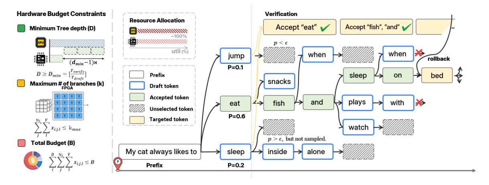

# 3.2 Limitations of Fixed Draft-Generation Low Acceptance and Frequent Rollback

The current approach [18] fails to effectively leverage hardware characteristics to generate more useful drafts. The earlier SpS method follows a "generate-then-verify immediately" paradigm, which forces both sides to wait for each other. As shown in Fig. 4, our profiling of LLaMA-7B on an RTX 4090 GPU reveals that utilization is only 51.72%, and sometimes drops below 10%. Meanwhile, the memory usage of both models remains constantly occupied. Recent works [19, 22] have also proposed tree-based verification, but they neglect hardware resource constraints and blindly generate a large number of drafts. More critically, they fail to exploit the confidence score of each token. As a result, their generated schemes often follow a fixed pattern and incur redundant computation. These limitations motivate us to develop a new parallel strategy.

**Figure 5. DFVG** draft-verify decoding with resource-aware constraints. FPGA generates speculative branches subject to depth, branching, and budget limits, and GPU verifies them in parallel, ensuring correctness and efficient utilization of resources.

