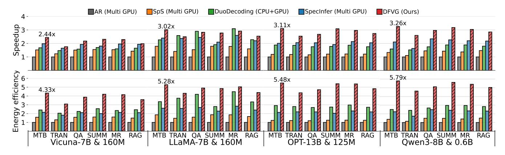
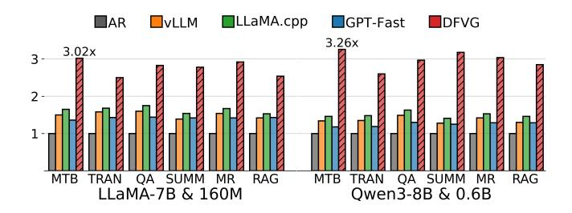
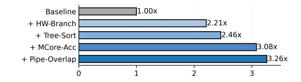
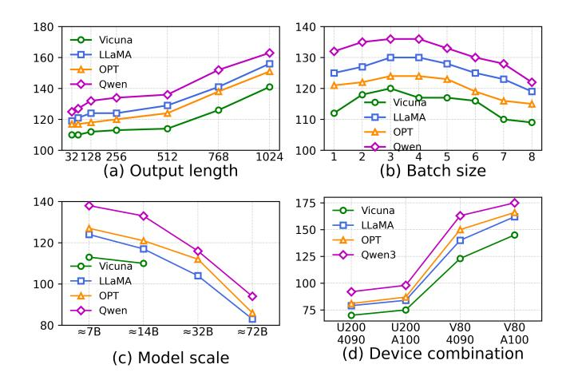
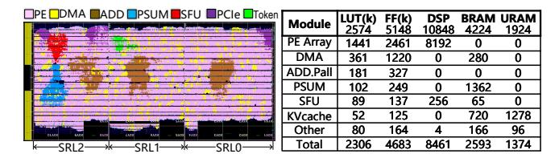

# 5.4 Cross-Device Compact Pipeline Scheduling

Fig. 11, illustrates the pipeline scheduling across devices. The process works as follows: (1) the FPGA first generates candidate tokens, including multiple branches with dynamic lengths; (2) the GPU immediately verifies these candidates, while the FPGA continues generating new drafts; (3) once verification finishes, the GPU sends the decision back to the FPGA, otherwise the FPGA keeps producing; (4) if the FPGA has not finished generating by the time verification ends, the GPU continues forward from the prefix to produce new tokens until the FPGA requests validation; (5) if a token is rejected, the FPGA rolls back, while the GPU simultaneously continues forward from the prefix to generate new tokens. In this way, the FPGA is kept fully utilized, continuously producing drafts even if some are later rejected, while the GPU is never idle, either verifying or forwarding. This achieves a tightly overlapped execution pipeline between devices.

**DFVG** realizes this cross-device pipeline with interrupt-driven coordination and fully asynchronous PCIe communication over a shared CPU memory region. When the FPGA produces new drafts, it writes token IDs and optional logits into a shared host buffer, updates status registers in its BAR space, and raises an interrupt to the CPU; the CPU then triggers DMA so that the GPU fetches the same buffer and

**Table 2.** Platform configurations of GPU, FPGA and CPU

| Hardware Platform | NVIDIA 4090 GPU  | NVIDIA A100 GPU  | AMD U200 FPGA | AMD V80 FPGA | Intel CPU Xeon4310 |
|----------------------|---------------------|---------------------|------------------|-----------------|-----------------------|
| Compute Units        | 512 Tensor Cores | 432 Tensor Cores | 6480 DSP48s   | 10848 DSP58s | 2 AVX-512          |
| Frequency (MHz)      | 2230                | 1410                | 300              | 300             | 2100                  |
| FP16 PCP (TOPS)      | 330                 | 312                 | 3.3              | 6.5             | 0.26                  |
| SRAM (MB)            | 72                  | 40                  | 43               | 84              | 18                    |
| DRAM (GB)            | 24                  | 80                  | 64               | 32 & 32         | 768                   |
| BW (GB/s)            | 1008                | 1935                | 76               | 51 & 820        | 21                    |
| PCIE (GB/s)          | 64                  | 64                  | 32               | 64              | 64                    |
| Power TDP (W)*       | 450                 | 400                 | 225              | 190             | 120                   |

\*TDP vs. runtime power: the V80 FPGA has a 190 W TDP, while the optimized **DFVG** design draws about 75 W during inference, well below the TDP limit.

**Table 3.** Workload configurations for target and draft models

| Target Model |      |       |    | Draft Model | Hidder Size |      | Num Layers |        |
|-----------------|------|-------|----|----------------|----------------|------|---------------|--------|
| Vicuna-7B       | 4096 | 11008 | 32 | Vicuna-160M    | 768            | 3072 | 12            | 32000  |
| LLaMA-7B        | 1096 | 11008 | 32 | LLaMA-160M     | 768            | 3072 | 12            | 32000  |
| OPT-13B         | 5120 | 20480 | 40 | OPT-125M       | 768            | 3072 | 12            | 50272  |
| Qwen3-8B        | 1094 | 12288 | 36 | Qwen3-0.6B     | 1024           | 3072 | 28            | 151936 |

performs verification, while also evaluating acceptance using Eq. (3). The GPU returns accepted prefixes, and the FPGA detects rollbacks by comparing the returned prefix length with its local sequence, resets its KV cache if necessary, and resumes execution from the verified prefix without stalling the pipeline. Because only compact token information and status metadata are exchanged over PCIe and transfers are fully overlapped with FPGA/GPU computation, these communication and rollback paths are kept off the critical path and do not become a throughput bottleneck in **DFVG**.

#### 6 Evaluation

#### 6.1 Experimental Setup

Implementation. We implement DFVG on a heterogeneous platform with draft models deployed on V80 FPGAs and verification models on GPUs. The FPGA implementation includes a custom micro-architecture designed in Verilog HDL synthesized at 300 MHz, along with an extended compiler supporting communication, dynamic draft configuration, and rollback recovery instructions. The GPU implementation features our TreeSort-Verify framework with unified KV-cache management and multi-GPU synchronization via NCCL. Detailed implementations are provided in the Appendix.

**Platforms.** We combine NVIDIA RTX 4090 and A100 GPUs with AMD U200 and V80 FPGAs, and use an Intel Xeon 4310 as the host CPU. The configuration parameters of the hardware platforms are summarized in Table 2. Unless otherwise noted, all experiments reported in Figs. 12–17 are conducted on a server equipped with an Intel Xeon 4310 CPU, an RTX 4090 GPU, and a Xilinx V80 FPGA.

**Energy Measurement.** Energy is defined as  $E = \bar{P}_{act} \times T$ , where  $\bar{P}_{act}$  is the average on-device runtime power and T

**Figure 12.** Dynamic Draft Mechanism with Qwen3-0.6B/Qwen3-8B: Length Distribution and Acceptance Stability.

the end-to-end inference time. FPGA and GPU power are sampled every 1 ms using Xilinx xbutil and nvidia-smi during steady-state inference after a warm-up phase.

Models and Datasets. We use popular open-source LLMs to evaluate our system. Table 3 provides detailed descriptions of the structures of different models, including Vicuna-7B-v1.3 [21], LLaMA-2-7B [23], OPT-13B [34], Qwen3-8B [28], as well as smaller draft models from the same families. In particular, Figs. 12 and 13 use the Qwen3-0.6B / Qwen3-8B draft-target model pair. For datasets, following Spec-Bench [26], we use MT-Bench (MT), Translation (TRAN), Summarization (SUMM), Question answering (QA), Math reasoning (MR), and Retrieval-Augmented Generation (RAG).

**Metrics.** The evaluation metrics mainly include end-to-end speedup, energy efficiency ratio. In addition, we also measure ablation and resource utilization to comprehensively demonstrate the system's advantages. Each experiment is repeated five times under identical thermal and scheduling conditions, and we report averaged results. Both the FPGA draft module and the GPU verifier operate deterministically with fixed top-k and temperature settings.

**Baseline.** All experiments are conducted with sufficient GPUs to ensure fair comparison:

- AR [20]: Autoregressive token-by-token decoding.
- **SpS** [4]: The original speculative decoding with draft generation and immediate sequential verification.
- **DuoDecoding** [13]: A heterogeneous approach that places the draft on CPU and the target on GPU for parallel decoding with preserved quality.
- SpecInfer [15]: A tree-based speculative decoding and verification framework that enables distributed LLM inference across multiple GPUs.
- vLLM [9], LLaMA.cpp [7], and GPT-Fast [17]: Efficient implementations leveraging PagedAttention, pure C/C++, and kernel/operator fusion.

#### 6.2 Algorithm Analysis

To more systematically reveal the efficiency advantages of the dynamic draft mechanism, we present two complementary perspectives in Fig. 12. The accepted draft length distribution shown in the left part of Fig. 12 reflects the highly dynamic nature of the generation process: most iterations

Figure 13. Effect of Hyperparameters on Acceptance Rate.

require only short drafts to pass, while a few iterations need longer drafts to achieve sufficient acceptance. This "long-tail" characteristic makes it difficult for static draft length strategies to accommodate both extremes—too short leads to frequent rollbacks, while too long causes computational waste. The right part of Fig. 12 further demonstrates the stable performance of our method in this dynamic environment: even when draft lengths fluctuate significantly across different iterations, the acceptance rate remains consistently high at 75%–85%. These results show that dynamic drafts can adaptively allocate computation over time. They mitigate the inherent mismatch in static strategies, where a fixed budget is used for tokens with highly variable difficulty, and improve overall efficiency without degrading generation quality.

To further validate its robustness, Fig. 13, analyzes two key hyperparameters: the confidence threshold  $\epsilon$  and the sampling temperature T. In the left part of Fig. 13, we observe that as the confidence threshold increases, the acceptance rate gradually decreases across all tasks, which is due to stricter verification criteria allowing fewer drafts to pass. However, it is worth noting that even under relatively high threshold conditions ( $\epsilon \leq 0.6$ ), the acceptance rate still remains above 75%. This indicates that our method achieves a good balance between prudence and efficiency, while being insensitive to moderate variations in confidence calibration, thereby ensuring stable efficiency in practical applications.

In the right part of Fig. 13, we analyze the effect of the sampling temperature T. As the temperature increases, the diversity of model outputs grows, but the deviation from the predicted drafts also increases, leading to a decline in acceptance rate. Nevertheless, the dynamic draft mechanism demonstrates strong resilience: within most practically used temperature ranges ( $T \leq 1$ ), the acceptance rate across different tasks remains stable above 80%. Only under extremely high temperatures does performance degrade significantly due to excessive randomization of outputs.

Rollbacks occur only when draft tokens are rejected by the verifier and are rare in practice. For the Qwen3-0.6B / Qwen3-8B model pair, the token-level acceptance rate remains between 75% and 85%, so rollback overhead accounts for only a small fraction of the total processing time.

In summary, the dynamic draft mechanism exhibits adaptive efficiency advantages in dynamic generation environments and maintains high robustness under variations of key

**Figure 14.** End-to-end performance comparison, where AR and SpS [4] denote autoregressive and speculative sampling, respectively. DuoDecoding [13] is a hybrid architecture deployed on a 16-core Intel Xeon CPU and a GPU, while SpecInfer [15] adopts a distributed multi-GPU deployment. For fairness, all experiments are conducted on two RTX 4090 GPUs, and speedup and energy efficiency are reported relative to AR as the baseline, on a wide range of models and six representative datasets.

**Figure 15.** Comparison of speedup with different inference frameworks: vLLM [9], LLaMA.cpp [7], and GPT-Fast [17]

**Figure 16.** Average per-token wall time distribution between the main stages. Draft and verification are measured independently as they overlap in the parallel execution pipeline.

hyperparameters, highlighting its universality and practical value in large-scale real-world inference scenarios.

#### 6.3 End-to-End Performance

In this section, the "end-to-end" metric refers to the full inference pipeline, from ingesting input token IDs to producing output token IDs. Throughput (tokens/s) is computed as the total number of generated tokens divided by the end-to-end latency, and all reported speedups are measured against baseline systems under this metric. As shown in Fig. 14, our system achieves a latency speedup of  $2.44 \times -3.26 \times$  and an energy efficiency improvement of  $4.33 \times -5.79 \times$ . We analyze the underlying reasons.

**Figure 17.** Comparison of acceleration contributions from different optimization techniques.

**Latency Speedup.** We summarize three key observations. First, from the model perspective, Vicuna-7B achieves a 2.44× speedup while Owen3-8B reaches 3.26×, mainly due to alignment gaps between small and large models. By generating more effective drafts through parallel branches, our method significantly improves the acceptance rate. Second, from the dataset perspective, the highest speedup is observed on MTB, since it involves multi-turn dialogues with a large number of generated tokens, allowing the FPGA-deployed drafting mechanism to fully exploit parallelism and reduce latency. Third, from the scaling perspective, while existing methods exhibit a clear drop in speedup when scaling up from Llama-7B to OPT-13B, our method maintains stable acceleration. This robustness stems from the extensive overlap between GPU verification and FPGA-based draft generation, which avoids pipeline idling.

Energy Efficiency. We highlight two key observations. First, due to shorter end-to-end runtime, the total energy consumption is reduced by about 3×. Compared with multi-GPU deployment, where an RTX 4090 reaches an average power consumption of 236W during long executions, our method significantly lowers total energy by reducing redundant computation through efficient algorithms and leveraging FPGA-based parallel draft generation for low-latency execution. Second, the runtime power consumption of the FPGA is extremely low, leading to an additional reduction of about 1.7×. With careful design and resource optimization,

Figure 18. Impact of variable factors on tokens per second

the FPGA achieves an average runtime power of only 75W, substantially lower than GPUs and CPUs.

Framework Advantage. As shown in Fig. 15, we observe that existing frameworks obtain about 1.5× speedup mainly through fine-grained optimizations on memory access and operator execution flow. However, this remains insufficient, since as more candidate tokens are generated, the drafts themselves gradually become a burden.

Wall Time Breakdown. We further decompose the measured runtime latency into three stages: draft generation, target verification, and communication overhead. As shown in Fig. 16, the drafting stage accounts for about 92%-96% of the total wall time, while the verification stage contributes around 96%-98%. Communication overhead remains within 1.08%-3.2%, which is negligible compared to the computation itself. This is because our dynamic drafting enables a tightly coupled pipeline that occasionally overlaps, effectively avoiding idle stages. Importantly, the drafting and verification stages run concurrently in a pipelined manner, so their individual wall time portions reported in Fig. 16 do not sum to the end-to-end latency; the pie chart illustrates their relative contribution to the overall computation rather than disjoint serial segments of runtime. This is because our dynamic drafting enables a tightly coupled pipeline that occasionally overlaps, effectively avoiding idle stages. These percentages reflect overlapped execution, not serialized wall time, and therefore do not add up to 100%.

**PCIe Communication. DFVG** uses a PCIe Gen4 ×16 link between the FPGA and GPU. Profiling shows that this PCIe Gen4 ×16 configuration already satisfies **DFVG**'s data-transfer requirements under typical acceptance rates (75%–85%), and the GPU verifier is compute-bound; therefore, upgrading to PCIe Gen5 would have negligible impact on end-to-end throughput or latency.

**Figure 19.** Resource utilization and post-implementation layout mapped onto the V80 FPGA.

**Figure 20.** Execution efficiency of FPGA operators balances loading and computation in matrix multiplication.

#### 6.4 Ablation Study

**Impact of Incremental Optimizations.** We conduct an incremental ablation study on Qwen3-8B to evaluate acceleration benefits, defined as follows:

- **HW-Branch**: Hardware-aware branching. It dynamically determines the number of branches according to the entropy of each token while considering hardware parallelism to generate as many drafts as possible.
- **TreeSort-Verify**: Sorts the token tree to transform irregular masks into compact block sparsity, reducing redundant attention computation of the target model.
- MCore-Acc: An FPGA-based multi-core accelerator, whose bandwidth is well matched to the computing capability. It optimizes the dataflow and computation pattern of the draft model, mapping multiple branches onto multi-cores for parallel draft generation.
- Pipe-Overlap: Through monitored and scheduled pipelining, the draft and verification are overlapped. Verification forwards new tokens during drafting, and drafting generates the next branches in verification.

The ablation results are shown in Fig. 17. Starting from the baseline, HW-Branch achieves a 2.21× speedup through hardware-aware branching. With Tree-Sort, the efficiency of attention computation is further improved, reaching 2.46×. Introducing MCore-Acc leverages FPGA multi-core parallelism, increasing the speedup to 3.08×. Finally, Pipe-Overlap overlaps drafting and verification to reduce idle cycles, achieving an overall  $3.26\times$  acceleration.

A further evaluation of the impact of various factors on system performance is presented in Fig. 18, where we analyze four aspects: (a) Variable Output Length. As the output length increases, more drafts are generated, yet the FPGA's parallel processing capability enables faster token generation. (b) Variable Batch Size. When the batch size is less than 4, the computational burden is negligible. However, as

it continues to increase, the combined overhead of drafting and verification accumulates, leading to a gradual decline in speed. (c) Variable Model Scale. When the model size is below approximately 14B, the speed remains relatively stable. In contrast, scaling from 32B to 72B causes a sharp increase in computation, resulting in a noticeable drop in throughput. (d) Variable Device Combination. The U200 is limited by bandwidth, yielding lower throughput. The V80, benefiting from HBM, achieves significant improvement, while the A100 demonstrates strong computational power but shows different trade-offs in bandwidth utilization compared with the FPGA. We use the U200 as a non-HBM FPGA baseline to isolate the impact of memory bandwidth: although the V80's HBM can be disabled, contrasting an HBM FPGA (V80) with a conventional DDR-based FPGA (U200) provides a clearer comparison between the two hardware classes.

## 6.5 Resource Utilization

We implemented the Overlay Processing Unit on the V80 FPGA, and the corresponding resource utilization and layout are shown in Fig. [19.](#page-11-1) The design occupies about 89.6% of LUTs and 90.9% of FFs, while consuming 8192 DSP units. In terms of memory, it uses 18 MB of BRAM and 67 MB of URAM (mainly for the KV-cache). PEs consume 55.9% of LUTs to support a two-BF16 packing strategy, thereby enhancing computational capability.. In addition, the system adopts the Xilinx Gen4 x16 PCIe IP, with an overhead of 0.03% LUTs and 12 URAMs, for high-speed CPU communication. The V80 card is compatible with standard CPU server chassis and only requires sufficient airflow for reliable cooling, which facilitates deployment in existing clusters.

The execution efficiency of each operator is shown in Fig. [20.](#page-11-2) In matrix multiplication tasks, both loading and computation reach about 86.2% – 97.5% efficiency, fully utilizing bandwidth and computational resources, mainly due to the increased branch parallelism in the token-by-token draft generation stage. The results confirm that draft generation on FPGA effectively exploits its parallelism advantages.

