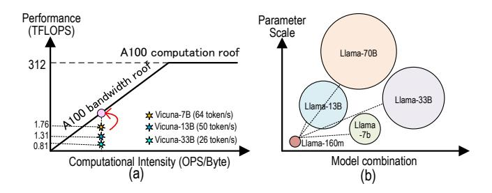
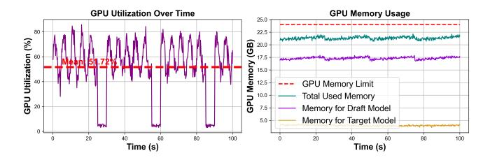

# Abstract

Speculative decoding is a promising paradigm that accelerates LLM inference by generating drafts and performing verification. However, such systems still face three major challenges: (1) The imbalance in resource requirements between draft and verification models result in low utilization and energy inefficiency when deployed together. (2) Fixed-pattern token trees produce many candidates but few valid paths, resulting in redundant drafts due to the lack of full leverage of the inherent confidence in dynamic generation. (3) Asynchronous execution with frequent alternation between the two stages suffers from idle waiting and rollback overhead. To address these issues, we propose DFVG, a heterogeneous speculative decoding architecture that offloads draft generation to FPGAs and verification to GPUs, exploiting their complementary strengths. We introduce three key contributions:

∗Contributed equally to this work.

†Corresponding author.

[This work is licensed under a Creative Commons Attribu-](https://creativecommons.org/licenses/by/4.0)

[tion 4.0 International License.](https://creativecommons.org/licenses/by/4.0)

ASPLOS '26, Pittsburgh, PA, USA © 2026 Copyright held by the owner/author(s). ACM ISBN 979-8-4007-2359-9/2026/03 <https://doi.org/10.1145/3779212.3790153>

(1) Heterogeneous architecture design that partitions speculative decoding into FPGA-based drafting and GPU-based verification, exploiting complementary hardware strengths with an overlap processor for high-throughput execution; (2) Hardware-aware dynamic draft generation that dynamically predicts speculative branches and token lengths based on model confidence while considering hardware parallelism limits; (3) Tightly-coupled heterogeneous pipeline with stagedecoupled scheduling that allocates execution windows between stages, combined with lightweight cross-device alignment and rollback prediction strategies. Comprehensive evaluation on mainstream models (OPT, LLaMA, Qwen) demonstrates DFVG achieves up to 3.26× speedup and 5.8× energy efficiency improvement over existing approaches. The source code at: <https://github.com/ShaoqiangLu/DFVG>

CCS Concepts: • Computer systems organization → Heterogeneous (hybrid) systems; • Hardware → Hardware accelerators; • Computing methodologies → Natural language processing.

Keywords: Speculative Decoding; Heterogeneous Computing; FPGA Acceleration; Software Hardware Co-design

#### ACM Reference Format:

Shaoqiang Lu, Yangbo Wei, Junhong Qian, Dongge Qin, Shiji Gao, Yizhi Ding, Qifan Wang, Chen Wu, Xiao Shi, and Lei He. 2026. DFVG: A Heterogeneous Architecture for Speculative Decoding with <u>Draft-on-FPGA</u> and <u>Verify-on-GPU</u>. In *Proceedings of the 31st ACM International Conference on Architectural Support for Programming Languages and Operating Systems, Volume 2 (ASPLOS '26), March 22–26, 2026, Pittsburgh, PA, USA.* ACM, New York, NY, USA, 16 pages. https://doi.org/10.1145/3779212.3790153

## 1 Introduction

Large Language Models (LLMs) have demonstrated remarkable capabilities across code generation, question answering, and open-ended text generation [1, 8, 16]. However, their reliance on autoregressive decoding—where each token requires a full forward pass—poses severe latency bottlenecks and limits hardware utilization [32, 37]. To address this, speculative decoding has emerged as a promising paradigm where a lightweight draft model generates multiple candidate tokens for parallel verification by the full model, delivering  $2\times-4\times$  speedups while preserving generation quality [26].

Recent efforts to improve speculative decoding span two fronts: algorithmic techniques and system-level optimizations. On the algorithm side, PARD [2] amortizes decoding by drafting multiple tokens per step. Lookahead [6] enables speculative generation without an auxiliary model using masked parallel decoding. EAGLE [11] rethinks the speculative process at the feature level to resolve uncertainty with minimal overhead. On the system side, Specinfer [15] leverages idle GPU resources by embedding the draft model into the offloading pipeline for interleaved execution. Ghidorah [24] distributes tasks across CPU/GPU with dynamic depth adjustment under unified memory. Dovetail [33] places the draft model on GPU and verifier on CPU to reduce bandwidth. AMUSD [14] decouples execution on separate GPUs. SpecPIM [10] co-designs computation and dataflow on PIM hardware to improve throughput and energy efficiency. DuoDec [13] deploys the draft and target models on CPU and GPU respectively, using hardware-aware draft budgeting to reduce generation latency. Table 1 summarizes their key architectural differences.

Despite progress in speculative decoding, existing systems still suffer from several critical challenges that fundamentally limit their efficiency and scalability. (1) Model disparity causes execution imbalance and inefficient hardware **utilization.** There exists a severe load imbalance stemming from the intrinsic heterogeneity between the draft and verify models [38]. The draft model is typically small, latencysensitive, and memory-light, while the verify model is large, compute-intensive, and memory-bandwidth-bound. When both are deployed on a homogeneous hardware substrate (e.g., GPU-only or CPU-only), their conflicting resource requirements lead to underutilization of compute and memory resources. For instance, running both models on a single GPU often causes memory contention and serialized workloads, while using CPU cores leads to poor throughput due to limited compute capability. Frequent switching or co-loading of

Table 1. Architecture Comparison for Speculative Decoding

| Research       | System       | HW-Aware Dynamic Tree-based Speed |       |        |               |  |
|----------------|--------------|-----------------------------------|-------|--------|---------------|--|
| Work           | Architecture | Decoding                          | Draft | Verify | Up            |  |
| Dovetail [33]  | CPU+GPU      | Х                                 | X     | Х      | 1.43×         |  |
| DuoDec [13]    | GPU+CPU      | ✓                                 | X     | ×      | 1.67×         |  |
| SpecInfer [15] | Multi-GPU    | X                                 | X     | ✓      | $2.40 \times$ |  |
| SpecPIM [10]   | PIM-Enabled  | X                                 | X     | ×      | 1.52×         |  |
| DFVG (Ours)    | FPGA+GPU     | ✓                                 | ✓     | ✓      | 3.26×         |  |

both models into limited on-chip memory also incurs significant loading overhead and cache thrashing, further stalling the decoding pipeline.

(2) Fixed-pattern token trees produce many candidates but few valid paths. Traditional speculative decoding systems employ predefined static branching strategies to construct token trees, failing to dynamically adjust branch counts based on model confidence and hardware resource constraints as shown in Fig. 1. This "one-size-fits-all" approach exhibits fundamental flaws: at high-confidence positions, static schemes cannot increase branches within hardware parallelism limits to fully exploit certainty; conversely, at low-confidence positions, they still generate numerous low-quality candidates according to preset rules, resulting in extremely low verification acceptance rates and potentially exceeding hardware processing capacity, leading to resource contention. The lack of adaptive capability that combines confidence-awareness with hardware-awareness prevents traditional methods from fully leveraging heterogeneous hardware advantages, resulting in low overall resource utilization efficiency of the speculative decoding pipeline.

(3) Decoupled execution and frequent rollbacks create pipeline inefficiencies and communication overhead. Most prior designs adopt a decoupled execution model where draft and verify stages run sequentially or independently without sufficient coordination. This creates two major inefficiencies: First, hardware remains idle during phase transitions—verifiers stall waiting for drafts or drafters finish early and block on feedback, causing pipeline bubbles and throughput loss [35]. Second, rollback is inherent to speculative decoding [3]. When draft tokens are rejected, the system must discard outputs and regenerate from the last accepted prefix, resulting in redundant computation and wasted bandwidth. This overhead is amplified when models operate on separate devices [5] (e.g., CPU↔GPU, FPGA↔GPU), where transfer latency becomes non-negligible. Without finegrained coordination and predictive control, low acceptance rates increase rollback frequency and make the pipeline vulnerable to synchronization delays [29], potentially causing rollback costs to outweigh speculative benefits.

To address these challenges, we propose **DFVG**, a heterogeneous speculative decoding framework that offloads draft generation to FPGA and keeps verification on GPU. As illustrated in Fig. 2, this architecture exploits the complementary strengths of both platforms: low-latency streaming on FPGA

Figure 1. Comparison of Speculative Decoding Approaches.

and compute-intensive execution on GPU. We introduce a heterogeneous pipeline scheduler that overlaps execution between devices, and a cross-device alignment mechanism that predicts acceptance and reduces rollback and synchronization overhead. Our contributions are as follows:

- Heterogeneous architecture design: a system that partitions speculative decoding into FPGA-based drafting and GPU-based verification stages, fully exploiting the complementary strengths of the two hardware types. An overlap processor is designed to optimize dataflow and parallelism in the draft phase, achieving high-throughput and energy-efficient inference.
- Hardware-aware dynamic draft: a confidence-driven branching mechanism that dynamically predicts the number of speculative branches and token lengths based on model confidence while considering hardware parallelism limits and memory constraints.
- Tightly-coupled heterogeneous pipeline: a stagedecoupled scheduling module that dynamically allocates execution windows between drafting and verification stages, combined with lightweight cross-device token alignment and accept-rate prediction strategies.
- Comprehensive evaluation: DFVG achieves up to 3.26× speedup and 5.8× energy efficiency improvement on mainstream models (OPT, LLaMA, Qwen) across FPGA-GPU platforms.

Figure 2. Overview of the DFVG architecture.

## 2 Background

## 2.1 Theoretical Foundations of Speculative Decoding

Speculative decoding represents an acceleration paradigm specifically designed for the autoregressive generation process of Large Language Models (LLMs) [25, 27]. Traditional autoregressive decoding can only generate one token at a time, requiring a complete forward pass, which leads to severe latency bottlenecks and insufficient hardware utilization. Speculative decoding addresses this problem through a "draft-first, verify-later" strategy. The core insight of this technique lies in the observation that lightweight models' predictions are highly consistent with heavyweight models in most cases, thus enabling the amortization of expensive large model computation overhead through this consistency.

Let the target large model be  $\mathcal{M}_p$  and the draft small model be  $\mathcal{M}_q$ , given a prefix sequence  $X_{1:j} = (x_1, \dots, x_j)$ . In each decoding iteration, the draft model first generates a candidate sequence of length  $\gamma$ :

$$\tilde{X}_{j+1:j+y} = {\tilde{x}_{j+1}, \dots, \tilde{x}_{j+y}} \sim \mathcal{M}_q(\cdot | X_{1:j})$$
 (1)

where the generation probability of each candidate token is  $q(\tilde{x}_{j+i}|X_{1:j+i-1})$ . Subsequently, the target model computes the true probability distributions for all candidate positions through a single forward pass:

$$p(x_{j+i}|X_{1:j+i-1}) (2)$$

## 2.2 Verification and Acceptance Mechanism

The core innovation of speculative decoding lies in its probabilistic acceptance mechanism, which ensures that the final output distribution is completely equivalent to the target model's native autoregressive decoding. For a candidate to-ken  $\tilde{t}_i$ , its acceptance probability is defined as:

$$\alpha_i = \min\left(1, \frac{p(\tilde{t}_i|X_{1:i-1})}{q(\tilde{t}_i|X_{1:i-1})}\right) \tag{3}$$

**Figure 3.** Roofline analysis of speculative decoding and model-size combinations.

This formula embodies the concept of importance sampling, correcting the distributional differences between the draft model and target model through probability ratios. When  $\alpha_i < 1$ , it indicates that the target model has lower confidence in this token compared to the draft model, and the token is rejected with probability  $1 - \alpha_i$ .

Furthermore, when token  $\tilde{t}_i$  is rejected, the system needs to resample from a corrected distribution:

$$p'(x_i|X_{1:i-1}) = \operatorname{norm}\left(\max(0, p(x_i|X_{1:i-1}) - q(x_i|X_{1:i-1}))\right) \tag{4}$$

This correction ensures the unbiasedness of the output distribution, making speculative decoding mathematically equivalent to standard autoregressive decoding.

## 2.3 Performance Modeling

The expected speedup of speculative decoding can be precisely modeled through Markov chain theory. Let  $\rho$  be the average acceptance rate and  $c = T_p/T_q$  be the model speed ratio, then the theoretical speedup is:

Speedup = 
$$\frac{c \cdot \gamma}{(1 - \rho) \cdot c \cdot \gamma + c \cdot \rho + 1}$$
 (5)

This formula reveals several important insights:  $\mathbf{0}$  when  $c\gg 1$  and  $\rho$  approaches 1, the speedup approximates  $\gamma$ ;  $\mathbf{0}$  there exists an optimal draft length  $\gamma^*$ , beyond which diminishing returns occur due to decreasing acceptance rates;  $\mathbf{0}$  the quality of the draft model (reflected by  $\rho$ ) is more critical than its absolute speed.

Despite model architectural differences, performance gaps, and occasional rollbacks, real-world systems still achieve  $2-4\times$  speedup without compromising output quality.

## 3 Bottleneck Analysis

To identify the limitations of existing speculative decoding architectures, we conduct a detailed analysis on representative LLM workloads. In this section, we reveal that practical deployments still suffer from Resource utilization imbalance, memory contention, and sequential dependencies between the draft and verification stages, which motivates our proposed heterogeneous design.

**Figure 4.** Breakdown of runtime and memory consumption for LLaMA-7B on RTX 4090 GPU [38].

