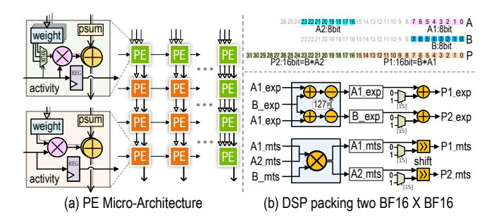
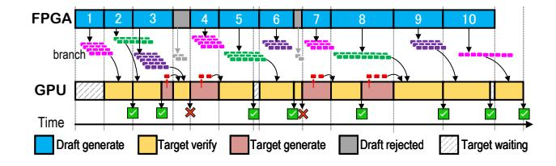

# <span id="page-5-0"></span>Algorithm 1 DFVG-based Speculative Decoding

**Require:** Input I, draft model  $M_{draft}$  (FPGA), verify model  $M_{LLM}$  (GPU)

```
Ensure: Output sequence S
 1: S \leftarrow I, Q \leftarrow \emptyset,
                                         idle_{GPU} \leftarrow True
 2: while EOS ∉ S do
            Draft: \mathcal{T} \leftarrow \text{BuildTree}_{ADAPT}(S, M_{\text{draft}})
            Q.\mathsf{push}(\mathcal{T})
 4:
            if idle_{GPU} and depth(\mathcal{T}) \geq D_{min} then
                   Verify:
 6:
                       \mathcal{T} \leftarrow Q.\mathsf{pop}()
 7.
                       \mathcal{T}_{\text{sorted}} \leftarrow \text{PathPacking}(\mathcal{T})
 8:
 9:
                       \mathcal{B} \leftarrow \text{GroupSiblings}(\mathcal{T}_{\text{sorted}})
                       O \leftarrow \text{ParallelBlockAttention}(\mathcal{B})
10:
                       V \leftarrow \text{VerifyTokens}(\mathcal{T}, O)
11:
                       S \leftarrow S \parallel V
            end if
13:
14: end while
15: return S
```

**Solution Strategy**: Considering the NP-hard complexity of integer programming problems and the strict real-time requirements of inference scenarios, we design a temperature-controlled probabilistic sampling greedy approximation algorithm. This algorithm maximizes expected benefits while introducing moderate exploration to avoid local optima caused by overly greedy strategies.

**Path Cumulative Probability Definition**: For any node (i, j) in the token tree selecting token l for branching, let its path from the root node to the current node be  $path(i, j) = \{(0, root), (1, a_1), (2, a_2), \dots, (i, j)\}$ . The cumulative verification probability of extending this path with token l is defined as:

$$P_{\text{cum}}(i,j,l) = p_{i,j,l} \cdot \prod_{(k,a_k) \in \text{path}(i,j), k>0} p_{k,\text{par}(a_k),a_k}$$
 (10)

where  $p_{k,par}(a_k)_{,a_k}$  represents the verification probability of node  $a_k$  at layer k being extended from its parent node. This metric reflects the credibility of the entire speculative path.

**Temperature-Controlled Probabilistic Sampling Mechanism**: To balance exploration and convergence, we adopt a softmax temperature-regulated probabilistic sampling strategy. For the candidate extension set at layer i,  $N_i = \{(i, j, l) : p_{i,j,l} > \tau_i\}$ , we use temperature parameter T for probability normalization:

$$\tilde{P}_{\text{cum}}^{(T)}(i,j,l) = \frac{\exp(P_{\text{cum}}(i,j,l)/T)}{\sum_{(i,j,l)\in\mathcal{N}_i} \exp(P_{\text{cum}}(i,j,l)/T)}$$
(11)

Subsequently, we employ Gumbel sampling for non-repetitive selection:

$$G_{i,j,l} = -\log(-\log(U_{i,j,l})) + \log(\tilde{P}_{\text{cum}}^{(T)}(i,j,l))$$
 (12)

$$S_i = \operatorname{argmax}_{k_i} \{ G_{i,j,l} : (i,j,l) \in \mathcal{N}_i \}$$
 (13)

where  $U_{i,j,l} \sim \text{Uniform}(0,1)$  are independent uniform random variables, and  $k_i = \min(k_{\max}, |\mathcal{N}_i|)$  is the actual number of selections at layer i. The temperature parameter T controls sampling randomness: as  $T \to 0$ , it degenerates to deterministic top-k selection, while larger T tends toward uniform exploration.

**Algorithm Complexity**: The algorithm has time complexity  $O(D \cdot k_{\max} \log k_{\max})$  and space complexity  $O(D \cdot k_{\max})$ . In concrete implementation,  $k_{\max}$  is set to integer multiples of FPGA parallel support numbers (such as 8, 16, 32, etc.).

## 4.3 TreeSort-Verify: Efficient Tree Verification via Path Reordering

Motivation: Traditional tree-based parallel decoding requires maintaining complex topology-aware causal masks for each token sequence, resulting in irregular memory access patterns during attention computation that cannot fully exploit GPU's vectorized computing capabilities. To address this issue, we propose the TreeSort-Verify mechanism, which transforms the causal masks of tree verification into efficient block-diagonal lower triangular matrix forms through intelligent node reordering. Fig. 6, illustrates the comparison between sequence-based decoding, tree-based decoding, and our approach. Unlike sequence-based methods that suffer from redundant KV-cache computation, and tree-based methods that lead to sparse and irregular masks, TreeSort-Verify sorts the speculative token tree and partitions it into parallelizable blocks, significantly improving efficiency.

**Core Reordering Strategy**: TreeSort-Verify reorganizes token sequences for verification using path-packing. Given the node set of the original token tree  $\mathcal{T} = \{t_1, t_2, \ldots, t_n\}$ , we define a reordering function  $\pi : \mathcal{T} \to \{1, 2, \ldots, n\}$  such that for any parent-child node pair  $(t_i, t_j)$ , if  $t_i$  is an ancestor of  $t_j$ , then  $\pi(t_i) < \pi(t_j)$ . The reordered causal mask matrix

<span id="page-6-0"></span>

**Figure 7.** Overall architecture of the Multi Compute Core Overlay Processor deployed on FPGA.

has a block-diagonal lower triangular structure:

$$M_{\text{reordered}}[i, j] = \begin{cases} 1, & \text{if } \pi(t_j) \le \pi(t_i) \text{ and } t_j \in \text{ancestors}(t_i) \\ 0, & \text{otherwise} \end{cases}$$

**Parallel Verification Acceleration**: After TreeSort-Verify reordering, tree attention computation is decomposed into multiple independent block computations. Let the reordered sequence be partitioned into K consecutive blocks  $\{B_1,\ldots,B_K\}$ , then the total attention output can be expressed as:

$$Att_{tree} = \bigoplus_{k=1}^{K} Att_{block}(Q_{B_k}, K_{B_k}, V_{B_k}, M_{B_k})$$
 (15)

where  $\bigoplus$  denotes recombination in original index order, and  $M_{B_k}$  is the standard lower triangular mask for the k-th block. This decomposition enables each block to independently invoke highly optimized cuBLAS GEMM kernels, significantly improving LLM verification computational efficiency.

**Memory-Friendly Verification Pattern**: TreeSort-Verify improves GPU memory locality by reorganizing tokens into consecutive blocks, enabling compact KV-cache storage and reducing bandwidth waste. Its block-diagonal structure supports pipelined parallel execution across GPU SMs, improving overall hardware utilization.

#### 5 DFVG Architecture

#### 5.1 Overview

The overall **DFVG** hardware architecture is illustrated in Fig. 2. It consists of three core components: A small-scale draft model deployed on the FPGA, where a carefully designed multi-core overlay processing engine executes in parallel to explore multiple branches simultaneously and rapidly generate candidate tokens. A large-scale target model running on the GPU, which performs a batch forward pass to compute the confidence scores of candidate tokens and

<span id="page-7-0"></span>

**Figure 8.** Mapping multiple branches to block events increases data reuse to match bandwidth with computation.

makes acceptance decisions for each token. A runtime management on the CPU, which coordinates the token flow and cross-device synchronization to ensure orderly pipeline execution. The system adopts a pipelined parallel execution strategy: while the GPU verifies candidate tokens, the FPGA concurrently generates the next tokens. Tokens are transferred across devices via PCIe interface and exchanged through shared host CPU memory using a ping-pong buffering mechanism, thereby ensuring efficient cross-device data movement and seamless integration of inference.

#### 5.2 Multi Compute Core Overlay Processor

**Motivation**: The draft stage tends to be limited by bandwidth. The underlying reason is that the tokens are generated autoregressively with sequence length reduced to one, where low data reuse leads to light computation, while frequent weight loading becomes the primary limitation. We propose an overlay processor to fully utilize bandwidth and optimize the computation dataflow.

The micro-architecture is shown in Fig. 7. The inference process fully utilizes HBM channels to feed weights and activations into each core, where systolic PE arrays perform the matrix multiplication. The partial sums from the cores are fused in a parallel adder tree and then accumulated over many rounds into the output buffer. A special function unit executes non-linear operations, including softmax, layer normalization, etc. Finally, the results are written back to off-chip memory. Furthermore, for speculative decoding, we design three key components: a KV-cache management module to prune tokens that are not accepted, a dynamic token management module to monitor GPU execution states and switch draft streams, and a branch management module to calculate token confidence scores for deciding the number of drafts to be generated next. These techniques leverage the algorithmic advantages of Section 4 and aware hardware.

**Multi-Branch Mapping:** Using a shared prefix, the draft model generates multiple tokens in parallel. Fig. 8 illustrates

<span id="page-7-2"></span>

**Figure 9.** PE micro-architecture with a multi-weight buffer for branch concatenation and DSP packing two BF16  $\times$  BF16

how these tokens are mapped to block events within our processor. (1) Linear: multiple branches increase weight reuse, boosting PE utilization. (2)  $Q \times K^T$ : First, the shared prefix is reused, and then in the pipeline only the loading address needs to be changed at the end, which allows the PEs to run extra cycles to produce a sequence length of L+1. (3)  $S \times V$ : The additional tokens are reduced back to length L during the accumulation at the last round, alignment with the original sequence. We adopt a ping-pong mechanism:

<span id="page-7-1"></span>
$$KER_{load} = \frac{PE_{Num} \times Data_{width}}{Band_{width}}$$
 (16)

$$IFM_{load} = KER_{load} + CAS \ Latency$$
 (17)

Where, CAS represents the read latency. The scheduling objective is to first ensure the single-cycle computational capability of the PE. Equation 16 indicates that the number of MACs required per cycle determines the amount of weight loading. Furthermore, the multi-cycle PE operation aims for data reuse equal to  $KER_{load}$ . However, due to the presence of CAS latency,  $IFM_{load}$  becomes slightly larger, enabling effective overlap between computation and data loading.

**PE Micro-architecture:** As shown in Fig. 9, the micro-architecture of the PE is designed with two key features. (1) Branch concatenation: parallel speculative branches lead to matrix concatenation, which typically occurs at the last few tokens. To enable fast switching, we introduce multiple weight buffer and additional wires, allowing the PE to select the correct path according to the feeding activations. (2) DSP packing: since BF16 has only 7 mantissa bits, splitting a single DSP is beneficial. This allows each DSP unit to support twice the parallelism while maintaining numerical accuracy, thereby boosting the compute throughput to double.

#### 5.3 Draft Model KV-Cache Management

As shown in Fig. 10, we adopt two methods to efficiently manage the KV-Cache of the draft model. (1) **Candidate buffering and pruning**: for each branch, we allocate an on-chip temporary buffer (temp buffer) to store dynamically generated KVs. The caching process proceeds in the order

<span id="page-8-0"></span>

**Figure 10.** KV Cache Management: Candidate Pruning and Contiguous Allocation.

<span id="page-8-1"></span>

**Figure 11.** Compact pipelined scheduling with overlapping execution of draft and target models.

of K and V, then layer, and finally round. Based on the verifier's decision, we prune the entire branch if necessary, and move the accepted tokens' KV entries into the prune buffer. This mechanism ensures timely cleanup of invalid cache and releases on-chip memory space. (2) **Contiguous allocation**: we maximize the utilization of on-chip RAM to store the KV of accepted tokens, and adopt a block-based accumulation strategy where KVs are stored until a certain amount is reached before being evicted in bulk.

