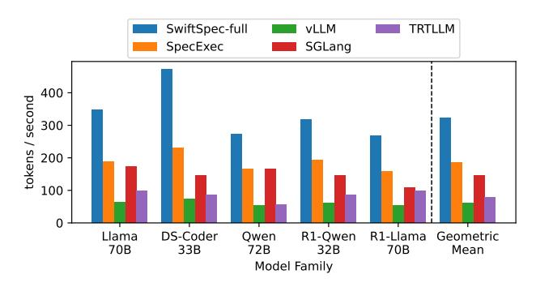

# 4 Experimental Evaluation

Our evaluation answers the following questions:

- What is SwiftSpec's performance compared to other speculative decoding systems? (§4.2)
- How much does disaggregated tree generation (with evolving tree cache) improve performance? (§4.3.1)
- How much do latency-optimized kernels improve the end-to-end performance? (§4.3.2)
- How do SwiftSpec's latency-optimized kernels compare to other work on kernel optimization? (§4.4)
- Are our design choices empirically justified? (§4.5)
- Does SwiftSpec compare to industry performance? (§4.6)
- Does SwiftSpec compare to bespoke draft models? (§4.7)

## 4.1 Experimental Setup and Methodology

**Cluster setup** We evaluate SwiftSpec and the baselines on one node with 8×H800 NVIDIA 80GB SXM GPUs connected by NVLink. We use all 8 GPUs to minimize the decoding latency for all of our experiments, except that, in §4.4, we show the performance improvement of our latency-optimized kernels under a subset of these GPUs.

**Models and model configurations** We five different pairs of models (Table 4) from different families, including Llama3

**Table 4.** The set of models in our evaluation.

| Target model                  | Draft model                            |
|-------------------------------|----------------------------------------|
| Llama-3-70b-Instruct          | Llama-3.2-3B, EAGLE-0.99B              |
| deepseek-coder-33b-instruct   | deepseek-coder-1.3b-instruct           |
| Qwen2-72B-Instruct            | Qwen2-1.5B-Instruct, EAGLE-1.05B       |
| DeepSeek-R1-Distill-Qwen-32B  | DeepSeek-R1-Distill-Qwen-1.5B          |
| DeepSeek-R1-Distill-Llama-70B | DeepSeek-R1-Distill-Llama-8B           |
| Llama-3.3-70b-Instruct        | Llama-3.3-instruct EAGLE3 1 |

 $^1{\rm This}$  model is specially trained for the target and only available for Llama-3.3-instruct, so we evaluate it in isolation in §4.7.

**Table 5.** The datasets used in our evaluation.

| Dataset Name           | Brief description              |  |  |
|------------------------|--------------------------------|--|--|
| Alpaca [38]            | human instructions             |  |  |
| GSM8K [7]              | grade school math              |  |  |
| HumanEval [6]          | code generation                |  |  |
| CNN/Daily Mail [29]    | mail content summurization     |  |  |
| Natural Questions [18] | open-domain question answering |  |  |
| MT-Bench [49]          | multi-turn conversation        |  |  |

**Table 6.** Comparison of different baselines attributes.

|          | EAGLE        | smaller draft | draft TP     | tree spec    |
|----------|--------------|---------------|--------------|--------------|
| vLLM     | <b>✓</b>     | ✓             | ×            | ×            |
| SGLang   | $\checkmark$ | ×             | $\checkmark$ | $\checkmark$ |
| TRT-LLM  | $\checkmark$ | ✓             | $\checkmark$ | ×            |
| SpecExec | ×            | $\checkmark$  | $\checkmark$ | $\checkmark$ |

[40], Deepseek-Coder [14], Qwen2 [45], Deepseek R1-Distilled Owen, and Deepseek R1-Distilled Llama [9]. Deepseek-Coder is a series of models that focus on coding, while the rest of the models families have general capabilities. From each model family, we pick a large model as the target model (generally having > 30B parameters) and a small model as the draft model (< 10B). For Llama3 and Qwen2 family, there are also trained EAGLE2 models, so we used those in the baselines, which supports EAGLE-based [21] speculative decoding. While SwiftSpec is applicable to any model precision, to push the absolute limit of decoding speed, we apply 4-bit AWQ quantization with a group size of 128 [23] to all the weights of the transformer layers in each family except the EAGLE models. We keep the BF16 precision for the embedding layers and the LM head operator. Each model uses BF16 to compute the attention and the linear operators (after weight de-quantization). We apply the same quantization to both the baseline and SwiftSpec, and therefore the computation of each single model in our system is equivalent to that of each baseline model.

**Datasets** We evaluate our with six different datasets from different domains. Table 5 shows a brief description of each. We select 80 queries from each data set (480 total) following the same procedure as used in the EAGLE2 paper [21]. Note that we only use the input prompts in each dataset, and we only use it for benchmarking purposes.

**Baseline systems** We compare against the following:

Figure 6. End-to-end single-request decoding speed.

- vLLM [19]: vLLM supports both EAGLE and a smaller model from the same model family as the draft model. However, it only supports sequence-based speculative decoding for both cases. We use version 0.7.2.
- SGLang [50]: SGLang supports the tree-based, EA-GLE2 draft model. Out of the five model families we consider, only two pairs (Llama 70B and Qwen 72B) have a corresponding EAGLE draft model. Thus, we benchmark auto-regressive generation for the other three model families. We use version 0.4.4.post3. While SGLang also supports EAGLE3 [22], the only publicly available modle with EAGLE3 support is LLaMA-3.3-70b-Instruct. Therefore, we compare with EAGLE3 in an isolated study (§4.7).
- TRT-LLM [30]: Under int4-awq precision, TRT-LLM only supports sequence-based speculative decoding with a smaller draft model. We use version 0.17.0.post1.
- SpecExec [37]: We implement the core ideas in Spec-Exec—sequential, tree-based speculative decoding with draft and target models using tensor parallelism across all GPUs and extend it to the models in Table 6. We choose SpecExec as it is faster than similar treebased methods like SpecInfer [28].

Table 6 shows the configurations of speculative decoding that each baseline supports. As shown in later benchmarks, the most competitive baselines are SGLang and SpecExec since they support serial tree-based speculative decoding for EAGLE and a smaller draft, respectively. For each baseline implementation of each model, we run them in an extensive set of configurations and choose the configuration that maximizes the average tokens per second across all the datasets. For our approach and the baselines, we perform greedy decoding i.e. temperature is 0.

#### 4.2 Single-request Decoding Speed

Figure 6 shows the end-to-end decoding speed of all approaches. Because vLLM and TRT-LLM only support sequence-based speculative decoding under int4-awq, their performance is not comparable with SGlang and SpecExec. For the

**Figure 7.** Decoding speed CDF comparing SwiftSpec and the most competitive baselines, SpecExec and SGLang, serving the Llama3-70B model across 480 queries. (to the right is faster)

**Figure 8.** Ablation studies comparing SwiftSpec components.

Llama 70B model and the Qwen 72B model, SGLang does support EAGLE speculative decoding and achieves comparable performance with SpecExec. Figure 6 shows that SwiftSpec consistently outperforms SpecExec (by an average of 1.75×) and SGLang (on average 2.23×), the two most competitive baselines. Figure 7 shows that, while serving Llama-3 70B model, SwiftSpec improves the average decoding speed without sacrificing the tail speed, having at least 1.7x speedup over the two most competitive baselines at the p95 tail. These results confirm that SwiftSpec achieves a substantially higher single request performance than prior work.

#### 4.3 Ablations: Understanding SwiftSpec Speedup

SwiftSpec is built off three key techniques: disaggregated tree generation, evolving tree cache, and fusing operations for low-latency under small batch sizes. We view the first two as inseparable: without the evolving tree cache with synchronization, we get no benefit from running the draft and targets in parallel because the caches quickly desynchronize and the draft model stops producing useful guesses. In this section then, we address the question of how much of SwiftSpec's performance comes from disaggregated tree generation (and evolving tree) and how much comes from the latency-optimized kernels.

To address these questions, we compare three configurations of SwiftSpec to SpecExec (the best prior baseline).

Specifically, we compare SwiftSpec (with all features), SwiftSpeconly-parallel-tree, and SwiftSpec-only-kernel-opt. SwiftSpeconly-parallel-tree uses standard kernels, but disaggregated tree generation and evolving tree cache (§3.1 and §3.2). SwiftSpeconlykernel-opt uses all the latency-optimized kernels (§3.3) but with serial speculative decoding (all GPUs run the draft model, then all run the target). Note that all SwiftSpec configurations and our SpecExec implementation contain our optimized attention kernels since a non-square mask is needed to support our tree expansion algorithm, which is not supported by other works. Figure 8 shows the comparison of all techniques and demonstrates that both disaggregated tree generation and the latency optimized kernels contribute significantly to SwiftSpec's end-to-end performance. We discuss the specifics of each in more detail next.

