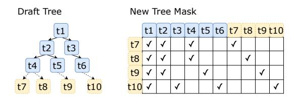
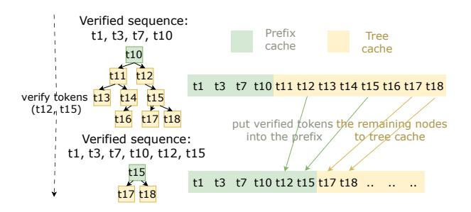

# 2.4 Key Limitations of Prior Work

This section describes how existing speculative decoding systems fall short in addressing the following key system challenges in single-request serving: (1) independent scalability of draft and target models, (2) KV cache consistency, and (3) kernel under utilization with low batch sizes. Table 2 summarizes the key differences. As shown in the table, SwiftSpec is the only solution that achieves parallel, tree-based speculation, maintaining a consistent KV-cache, and optimizing kernels for small batch size.

Independent scalability and parallelism. Tree-based speculative decoding typically runs the draft and target models sequentially. Therefore, we have to scale both the draft and target models across all GPUs; otherwise, some GPUs will be idle. However, using more GPUs for TP does not necessarily decrease latency. Table 1 diminishinig returns when we increase tensor parallelism. For example, the 70B model benefits from using 4 GPUs instead of 2, while there is no

benefit from using more than 2 GPUs for the smaller models (1B, 3B, 8B). Prior tree-based speculative decoding work (SpecInfer[28], EAGLE [21, 22], SpecExec [37]) fails to address this lack of scalability, while SwiftSpec's disaggregated tree generation does (§3.1).

Consistent KV-cache reuse. Keeping the KV cache consistent between draft trees and the target model is challenging when they run in parallel. For example, PipeInfer [1] uses trees, but if some draft trees are invalidated by the target model, every subsequent draft tree will be discarded, wasting compute and yielding low effective utilization. Our evolving tree cache addresses the need for KV cache consistency with maximized token reuse (§3.2).

Small Batch Kernel Efficiency. Table 3 shows the bandwidth and compute utilization for kernels in a LLama 70B transformer layer executed across 4 GPUs with batch-size 8. The bandwidth utilization for all-reduce refers to NVLink bandwidth, while for the other operators, it is the HBM bandwidth. At this batch size, all operators are communication-intensive, yet the bandwidth utilization is low (< 10%) for the all-reduce and attention operators because the communication volume is small. Therefore, time is mainly spent on synchronization and waiting for the first input.

Some frameworks (vLLM [19], SGLang [50], etc) use the NCCL LL protocol in the all reduce operator when communication volume is low. Still others, such as FlashInfer [46] and FlashAttention [8], optimize individual transformer kernels, but focused on larger batch size (e.g.  $\geq$  32, which is still large for single-request scenarios) While none of the prior works consider fusing low-latency communication with low batch size computation, our latency-optimized kernels realize the opportunity to holistically reduce latency for small batch sizes by organically combining the NCCL LL protocol and the compute pattern of the attention and GEMM operators (§3.3).

## 3 SwiftSpec Design and Architecture

SwiftSpec addresses the bottlenecks of **single-request full-node serving** to reduce *end-to-end* latency. Specifically, we identify the following **challenges and design principles:** 

P1 Asymmetric scaling. Draft and target models scale differently, so we **disaggregate** them (§3.1).

11

**Table 3.** Kernel utilization for a Llama 70B model on 4 GPUs.

| Operators       | Time (in us) | Comp. Util. (%) | Band. Util. (%) |
|-----------------|--------------|-----------------|-----------------|
| QKV projection  | 16.9         | 2.0%            | 18.7%           |
| mask attention  | 18.8         | <0.01%          | 6.5%            |
| O projection    | 10.8         | 2.5%            | 23.3%           |
| all reduce      | 12.0         | < 0.01%         | 8.5%            |
| SwiGLU          | 39.3         | 4.8%            | 44.6%           |
| down projection | 18.1         | 5.2%            | 48.5%           |
| all reduce      | 15.3         | <0.01%          | 6.6%            |

- P2 KV-cache waste. Miss-predicted branches cause expensive recomputation, so we introduce an evolving tree cache that maintains and reuses draft tokens (§3.2).
- P3 Small-batch communication latency. Separate NCCL collectives dominate per-token time; we fuse operations: directly incorporating NCCL-LL into GEMM and attention, while collapsing the SwiGLU operations into one, low-latency kernel (§3.3).

These principles yield the *first* single-node decoder that (1) scales draft and target independently, (2) preserves 100% of computed KV state for tree-based speculation, and (3) merges communication with computation, together producing stateof-the-art performance on an 8 GPU node (§4.6).

#### 3.1 Disaggregated tree generation

Overview. SwiftSpec runs the draft and target models on disjoint GPUs in an asynchronous pipeline. Each iteration overlaps draft-tree expansion with target verification of a selected subtree. The groups exchange only the verified token prefix and the next subtree to verify, while preserving KVcache consistency across rerooting without recomputation.

Because of scaling asymmetry, we disaggregate the draft and target models (**Design Principle** 1, above). Both use tensor parallelism (TP) within their assigned GPUs. This allows both to operate concurrently and removes the draft phase from the critical path. The two groups communicate using NVLink/cross-network interconnect.

**3.1.1 Algorithmic Overview.** Algorithm 1 details the interaction between draft and target models. We define bs as the target model batch size, w as the number of leaves for the draft tree (i.e., the draft model's batch size), *d* as the number of tree expansions in one round. Note that while the external request batch size is 1, the parameters bs and w refer to internal micro-batching (speculative branches) which is controlled by SwiftSpec. Both target and draft GPUs loop until generation ends, synchronizing at each iteration.

#### Draft worker (per iteration).

- 1. **Expand the draft tree:** The draft workers expand the draft tree d times, by running inference on w unexpanded leaves from the tree with the highest probabil-
- 2. **Synchronize:** It then synchronizes with the target worker to get the verified tokens.

generate w, batch size of target model bs if Is\_draft\_worker then while True do for i = 1 to d do 3 Expand the *w* most probable tree leaves; Get verified tokens from the target worker; 5 if target worker signals stop then 6 break: Update KV Cache and draft with verified tokens; 8 while Tree size < bs do Expand the *w* most probable leaves;

**Input:** Depth of tree to generate *d*, width of tree to

Get the most probable draft subtree of size bs; Send it to the target worker to verify; 13 else if Is target worker then

while True do 14 Get draft tokens from the draft tree worker: 15 Verify the draft tokens by batch inference; 16 17 if Reach the end of generation then Send the stop signal to the draft workers; 19 else Send the verified tokens to the draft workers;

- **Algorithm 1:** Disaggregated tree generation algorithm
  - 3. **Re-root and update cache:** Then it re-roots the draft tree by walking down the tree using the path representing the verified tokens and adjusts the KV cache to stay consistent (see next section).
  - 4. Select next subtree: Next, it grows the draft tree (if draft tree does not have sufficient nodes) and selects a sub-tree of size bs.
  - 5. **Send:** Finally, it sends the sub-tree to the target.

The target model gets the draft tokens from the tree and runs batch inferences to calculate the logits. After that, it samples through the logits to generate the tokens and then sends the verified tokens back to the draft worker.

3.1.2 Illustrated Example. Figure 2 shows three iterations. In each, the draft model grows the tree while the target model verifies a subtree. The tree is then re-rooted, and verified tokens are promoted to the KV cache (bs = 4, d = 3, w = 2). At the start, the draft tree is  $t_1, t_2, t_3, t_4, t_5, t_6$ , and the draft workers select the top bs = 4 tokens  $(t_1, t_2, t_3, t_5)$ to give as  $input_1$  to the target workers. During iteration 1, while the draft workers continue growing the tree with 6 new nodes, the target workers run inference on *input*1 and sample  $output_1 = (t_1, t_3, t_6)$ . Then, the draft workers verify that  $(t_1, t_3, t_6)$  is a valid path in the tree and re-root at  $t_6$ . With enough nodes remaining, they choose the next top 4 tokens  $(t_6, t_9, t_{10}, t_{11})$  as *input*2. During iteration 2, the draft workers grow 6 more nodes while the target workers process input2 and produce  $output_2 = (t_6, t_9, t_{16})$ . However,  $t_{16}$  is not yet in

**Figure 2.** Disaggregated tree generation. Target model runs in parallel with the draft model. At the end of each iteration, the draft model re-roots the draft tree and reorganizes the KV-cache based on verified tokens from the target model.

the tree, so the draft workers re-root at  $t_{16}$  and keep growing new nodes  $t_{17}$ ,  $t_{18}$ ,  $t_{19}$ ,  $t_{20}$ ,  $t_{21}$ , giving ( $t_{16}$ ,  $t_{17}$ ,  $t_{18}$ ,  $t_{20}$ ) as  $input_3$ . During iteration 3, a similar process continues, with the draft and target workers running in parallel, growing and verifying tokens as they build out the tree.

**3.1.3 Technical Details.** This section details some practical concerns for implementing the above, including: tree expansion, profile-guided GPU split, batch size selection, and non-square mask support. These details allow the disaggregated scheduler to generalize to any multi-GPU node.

**Maximum-likelihood tree expansion.** We use the logarithm of the softmax probability as the value of each node, and the sum of values from the root to each node as the weight. Thus, a higher weight means a higher probability that a token could be generated under the draft model distribution. We keep the pair (value, node) in a priority queue to get the k most probable leaves in  $O(k \log s)$ , where s is the number of probable leaves to consider.

**GPU** allocation for draft model and target model. Given a node of k GPUs, we will allocate  $x(1 \le x \le k-1)$  GPUs to the target model and (k-x) GPUs to the draft model. To determine which x to use, we profile before serving the queries. We try different xs to find which configuration yields the fastest average decoding speed. We found that if we fix the target model, the optimal x is smaller when we are using a more powerful target model (we analyze this in §4.5).

**Setting the internal batch size.** Larger bs, w will lead to higher acceptance ratio per iteration, but when bs, w get larger and larger, the margin gain on the acceptance ratio will decrease, and total running time will increase. We set bs = 8 and w = 8 empirically to balance the acceptance ratio and running time, based on our analysis in §4.5.

Setting the number of tree expansions d in one round. Before serving inference, we first profile the draft and target model latency. Denote  $t_{target}$  as one round of target model

**Figure 3.** Example of a non-square tree mask during draft tree expansion: yellow nodes are the leaves to expand, and the blue nodes are the existing tree nodes

**Figure 4.** KV cache management of the draft model: each time newly verified tokens get updated, the KV states of the verified tokens will be in the prefix of the KV cache (green), and the KV states of the draft tokens will follow (yellow).

inference, and  $t_{draft}$  as one round of draft tree expansion. Define  $r = \lfloor \frac{t_{target}}{t_{draft}} \rfloor$ . We set d = r or d = r + 1 so that draft tree expansion and the target model verification finish at nearly the same time to maximize parallelism.

Non-square mask support for attention. The attention operator in the target model uses a square mask, since the target model takes a tree each time, and each token will only mask out the attention with those tokens that are not the ancestors within the current input. This is similar to prior work [28]. However, for the draft model, this is not the case. Consider the example in Figure 3 with a current tree of size 6, and we want to calculate the logits of 4 probable leaves, then regarding the tree cache, we only calculate the attention of each leaf with its ancestor on the tree (and also all the data that is in the prefix cache). In this case, we need a mask of at least size (4, 10) to contain all the necessary information. Therefore, we support a non-square mask as input in our attention operator for the draft model.

This approach of disaggregating the draft and target models embodies our first design principle: each model group is provisioned to the knee of its own scaling curve (§2.1, Table 1).

#### 3.2 Evolving Tree Cache

To maintain draft and target model KV-cache consistency (**Design Principle 2**), we reorganize the draft model's cache so that it remains consistent between draft and target. Specifically, we maintain the following:

**KV-cache Invariant.** The *prefix cache* stores KV states for

the verified tokens contiguously, and the *tree cache* stores KV states for the remaining draft-tree nodes contiguously after the prefix. This layout preserves all reusable KV states across re-rooting and avoids recomputation.

**Re-organization of KV cache for verified tokens.** After the target workers sample the tokens, they send the verified tokens to the draft workers. The draft worker then updates the evolving tree cache as follows:

- Walk and re-root: It walks the tree using the verified tokens and re-roots at the last verified token.
- Re-organize KV states: If the last verified token exists in the current draft tree, it reorganizes the KV cache so that only the KV states of the valid subtree nodes remain in the tree cache. If the last verified token is not in the current draft tree, we start a new tree rooted at it.

Critically, even when some of the predicted tokens we send to the target worker are wrong, we can still reuse all the computed KV states in the subtree, avoiding any recomputation.

Figure 4 shows an example. Suppose the sequence  $(t_1, t_3, t_7, t_{10})$  is already verified, the prefix cache is the KV states of those tokens, and the KV states of the draft tree tokens are organized contiguously after the prefix. When we update the verified tokens to be  $(t_1, t_3, t_7, t_{10}, t_{12}, t_{15})$ , we walk down the draft tree using the newly verified tokens  $(t_{12}, t_{15})$ . Then we reach the node  $t_{15}$ , which means the nodes in the subtree,  $t_{17}$ ,  $t_{18}$ , are still useful. Therefore, we move  $t_{12}$ ,  $t_{15}$  to the prefix cache so that it stores the information of the same verified tokens as the target model. Finally, we reorganize the remaining subtree of  $t_{15}$  (i.e.  $t_{17}$ ,  $t_{18}$ ) into the next positions, discarding states that are no longer useful (e.g.  $t_{11}$ ).

If the draft tree does not have enough nodes to send back to the target worker, it expands *bs* nodes immediately using one draft model inference. In either case, the draft tree will have enough nodes to pass to target workers, therefore entering the next iteration, with the KV states synchronized across the draft model, the target model, and the draft tree.

#### 3.3 Latency-optimized Kernels

To reduce the inference time of both draft and target under low batch size (**Design Principle 3**), we design and implement *latency-optimized* operators for all-reduce, masked attention, and SwiGLU. While our design could be applied to any precision, we implement it for the int4 AWQ quantized model. We first introduce the NVIDIA Collective Communication Library's Low Latency (NCCL LL&LL128) protocol, which our work leverages heavily.

NCCL LL&LL128 protocol. SwiftSpec uses these communication primitives to reduce the latency of both inter- and intra-GPU communication. Since both protocols are similar, we use NCCL LL as an example to describe the functionalily.

In the NCCL LL protocol, the storeLL function takes a 64-bit integer *val* and a 32-bit integer flag, splits *val* into

**Figure 5.** Execution flow of fused GEMM all-reduce operator.

two 32-bit integers, and stores them with flag. The loadLL function takes a memory location and a flag. It polls the memory until it matches the expected flag, and then returns the 2 32-bit integers as a 64-bit integer.

Using those two functions, we have a communication scheme without any explicit synchronization. Assume that last time we store some value x as a flag, and this time we use x + 1. The other compute unit will know the data is ready when it sees x + 1, without any additional synchronization.

While LL wastes 50% bandwidth (with 4B data & 4B flag), it offers the flexibility of communicating in 4 byte chunks. In contrast, LL128 only wastes around 5% bandwidth (with 120B data / 8B flag), but it requires the data to be in 128 consecutive bytes of memory. In our latency-optimized kernels, we rely on both primitives to reduce synchronization overhead.

**Fused GEMM with all reduce.** To further reduce the data movement overhead and save the number of synchronization barriers, we fuse each all-reduce operation with the preceding GEMM operation. Figure 5 shows the computation and data flow within one thread block when we run GEMM fused with all reduce. Each thread block has three steps during execution:

- Each threadblock computes a contiguous set of columns and stores them in a global memory using LL.
- Then, one in four threadblocks stages these values and sends them across GPUs using LL128.
- Finally, each GPU waits for these values, aggregates them, and writes the final results to its local memory.

In step 1, SwiftSpec uses LL since a tile is too small and LL128 requires 128B of consecutive memory. In step 2, it uses LL128 to avoid bandwidth waste while maintaining low latency. Since all the data is sent and read using LL/LL128 protocol, there is no explicit synchronization between GPUs.

**Masked attention.** For the mask-attention operators, we fuse the position embedding with the attention calculation. Then, within one GPU, we first split the computation of the single attention head between different thread blocks. After the calculation, the threadblocks aggregate the sum using

the NCCL LL protocol within a single GPU. Similar to our Fused GEMM with all-reduce operators, we add up the results within one attention head without explicit synchronization across thread blocks or extra kernel launches.

**Fused SwiGLU.** This operator is of the form  $SwiGLU(x, W, V, b, c) = \sigma(xW + b) \oplus (xV + c)$ . We implement tile-based matrix multiplication, where each threadblock calculates the same tile of the two matrix multiplications. This avoids loading the input twice from the GPU HBM. Right after we get the output of the tiles, we calculate the sigmoid and dot product before putting the results back to the GPU memory, avoiding unnecessary data movement.

#### 3.4 Implementation Details

SwiftSpec is implemented as  $\sim 3$  K LOC of CUDA/C++ for its fused kernels and  $\sim 4$  K LOC of C++/Python for the tree-based runtime. The latency-optimized kernels are built with CUTLASS [39] and call the storeLL and loadLL primitives directly. Because CUDAGraphs require fixed–shape inputs, we pad every variable-length tree mask to a common tensor of shape  $(w, \max len)$ , so that a single CUDAGraph per draft width  $(w \leq 20)$  suffices for thousands of distinct masks. To support arbitrary assignment of GPUs to draft and target models rather than powers of two (e.g., 2 draft GPUs and 6 target GPUs) , we zero-pad matrix dimensions and attention-head counts so they divide evenly across GPUs, preserving numerical equivalence while retaining kernel efficiency.

