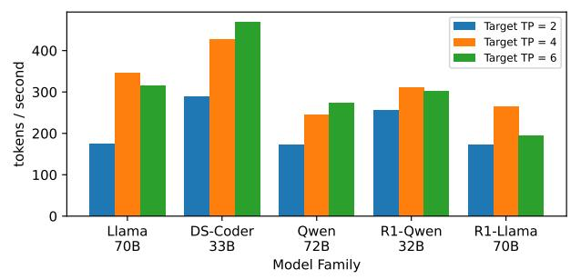

# **4.3.2 Effect of latency-optimized kernels.** Figure 8 shows that SwiftSpec outperforms SwiftSpec-only-parallel-tree by

**Table 7.** The average acceptance length, model inference time, and decoding speed under parallel and serial tree generation for model Qwen2-72B and draft model Qwen2-1.5B.

|          |                | model time |        | accep | tance le | ength f | or diff | erent d | latasets |
|----------|----------------|------------|--------|-------|----------|---------|---------|---------|----------|
|          | Decoding speed | target     | draft  | ALP   | GSM      | HE      | MT      | QA      | SUM      |
| parallel | 274 tokens/s   | 10.48ms    | 3.25ms | 2.92  | 3.78     | 3.92    | 3.11    | 2.74    | 3.56     |
| serial   | 200 tokens/s   | 10.34ms    | 3.73ms | 3.28  | 4.2      | 4.04    | 3.42    | 3.12    | 3.72     |

an average of 1.16×, and SwiftSpec-only-kernel-opt outperforms SpecExec by 1.21× (on average). Therefore, Swift-Spec's kernel optimizations on fused GEMM-all-reduce and SwiGLU kernel provide end-to-end speedup of at least 16% for both parallel and serial tree generation.

In summary, these ablations show that both disaggregated, parallel tree generation and latency optimal kernels are essential to achieving performance in single-request (and therefore low-batch size) LLM serving. The next section analyzes the effects of individual kernel optimizations in more detail.

## 4.4 Latency-optimized Operator Microbenchmarks

Table 8 shows the individual kernel times of our latencyoptimized kernels and other proposed kernels. We focus on the Llama3 model family as a specific example, but our optimizations generalize to the other model families we benchmark and achieve similar speedup.

Fused GEMM with all reduce Using tensor parallelism, in each Llama3 model layers uses two all-reduce operations: one in the attention block, and one in the MLP block. We fuse each all-reduce operation with the previous GEMM. In contrast, both vllm and TRTLLM use their one-shot all-reduce after the GEMM operations and as separate kernels. We sum up the time spent on two kernels as their total time. As shown in Table 8, our fused GEMM-all-reduce kernel consistently outperforms vllm and TRTLLM on all five model configurations. Our improvement is larger when the compute is lower. Specifically, for the fused GEMM in the attention block, latency is reduced by 23%-43% for all models, while in MLP block latency is reduced by 16%-25% for the smaller models.

Most of these improvements are from reducing latency (e.g., by removing barriers in favor of LL and LL128). However, the changes also improve memory bandwidth. Under Llama 70B across 4 GPUs, for example, the HBM utilization during GEMM with all-reduce in the attention block increases from 4.4% (vLLM) to 6.3% (Ours), and the NVLink utilization increases from 12.2% (vLLM) to 17.6% (Ours).

Attention operator We compare our implementation with two popular attention libraries: FlashAttention (FA) [8] and FlashInfer (FI) [46]. Because FA and FI only support square kernels, this section only investigates square masks, even though SwiftSpec supports a more general, non-square mask. We use BatchPrefillWithPagedKVCacheWrapper in FlashInfer. However, the kernel is not optimized for small numbers of attention heads, and, therefore, performs much

Table 8. Time per kernel of our optimized operator under batch size 8 across different TP configurations in the Llama family.

|             | Fused   | GEMM ( | attn)  | Fused  | GEMM   | (mlp)  |        | SwiGLU |        | Attn, | len(conte | ext)=500 | Attn, le | en(contex | ct)=1000 |
|-------------|---------|--------|--------|--------|--------|--------|--------|--------|--------|-------|-----------|----------|----------|-----------|----------|
|             | Ours    | vllm   | TRT    | Ours   | vllm   | TRT    | Ours   | vllm   | TRT    | Ours  | FI        | FA       | Ours     | FI        | FA       |
| 1B, tp = 4  | 5.9us   | 12.9us | 10.2us | 8.3us  | 18.8us | 11.0us | 5.8us  | 12.3us | 11.5us | 6.3us | 13.6us    | 13.8us   | 6.2us    | 22.8us    | 13.8us   |
| 3B, tp = 4  | 6.4us   | 12.3us | 10.0us | 8.7us  | 17.0us | 10.3us | 7.2us  | 12.5us | 11.8us | 6.2us | 19.1us    | 17.2us   | 8.0us    | 33.4us    | 18.3us   |
| 8B, tp = 4  | 7.7us   | 14.6us | 10.3us | 10.5us | 16.5us | 11.9us | 15.0us | 16.3us | 15us   | 6.4us | 19.4us    | 17.75us  | 8.1us    | 33.4us    | 18.13us  |
| 70B, tp = 4 | 11.72us | 16.9us | 15.5us | 24.3us | 25.4us | 26.1us | 49us   | 36.7us | 31.9us | 9.6us | 19.2us    | 19.0us   | 13.4us   | 33.2us    | 19.1us   |
| 70B, tp = 8 | 13.3us  | 25.7us | 17.2us | 19.9us | 29.5us | 20.7us | 23.6us | 22.5us | 22us   | 6.4us | 18.6us    | 17.8us   | 8.1us    | 32.7us    | 18.2us   |

**Figure 9.** Performance of SwiftSpec using different resource configurations for draft model and target model.

| Models                        | Target | Draft |
|-------------------------------|--------|-------|
| Llama-3-70b-Instruct          | 4      | 4     |
| deepseek-coder-33b-instruct   | 6      | 2     |
| Qwen2-72B-Instruct            | 4      | 4     |
| DeepSeek-R1-Distill-Qwen-32B  | 6      | 2     |
| DeepSeek-R1-Distill-Llama-70B | 4      | 4     |

**Table 9.** Optimal draft/target GPU split ratios across 8 GPUs for different models in SwiftSpec

worse than the other baselines. FA uses kernel <code>flash\_fwd\_splitkv\_kernel</code> to split each kv head across different threadblocks to compute the attention score and sum faster, and then it launches another kernel <code>flash\_fwd\_splitkv\_combine\_kernel</code> to aggregate the results across different threadblocks. In contrast, SwiftSpec fuses those two kernels into one, using the NCCL LL protocol for synchronization, reducing the overhead of both synchronization and kernel launch. Table 8 shows SwiftSpec's kernels consistently save 30% to 56% compared to FA under two representative context lengths, 500 and 1000, across different model configurations. The communication fusion technique also increases HBM utilization. For example, increasing from 6.5% (vLLM) to 14.6% (Ours) for context length 1000 under Llama 70B across 4 GPUs.

**SwiGLU operator** SwiftSpec fuses the four operations in the SwiGLU operator ( $SwiGLU(x, W, V, b, c) = \sigma(xW + b) \oplus (xV + c)$ ) into one, reducing data movement and kernel launches. Both vllm and TRTLLM fuse the dot product with  $\sigma$  activation. vllm also fuses the first two matrix multiplications. Table 8 shows SwiftSpec's SwiGLU optimization outperforms other baselines (reducing latency 39%-50%) when the model is small (1B, 3B). When the model is larger (for the 70B model), TRTLLM and vllm outperform SwiftSpec's kernel since they have more optimized kernels (e.g., a more intricate

layout of weight matrices), while our kernel is based on simple tile-based GEMM and uniform layout.

In summary, this breakdown shows that each of SwiftSpec's kernel optimizations provide state-of-the-art performance for small models, which is essential for draft models in speculative execution. Our kernel optimizations are also largely competitive for larger models, with the exception of SwiGLU.

#### 4.5 Justification of Design choices

Here we investigate key choices in SwiftSpec's setup, including configuration and resource allocations.

Choice about target batch size, draft batch size, depth Section 2.2 argues that increasing the draft model batch size over 8 only marginally increases the average acceptance length. For the target model, there is still an average increase of 24.5% when increasing from 8 to 16. However, for example, if we increase the Llama3-70B batch size from 8 to 16 under TP=4, the inference time will increase from 10.39 ms to 13.25 ms (by 29%). Thus, the increase in average acceptance length does not cover the increase in inference time. Furthermore, reducing the batch size to under 8 does not reduce the inference time (e.g. it takes 10.32ms under batch size 4) since the smallest first input dimension of the matrix multiplication tensor core operation is 8. As a result, we use batch size 8 for both our target model and draft model.

To choose d, the number of tree expansions each round, as reasoned in §3.1, we choose one of the two integers that are closest to the time ratio of a target model inference and one round of draft tree expansion. In the benchmark, for each model pair, we run SwiftSpec using those two different ds based on the draft and target model and choose the configuration with the higher decoding speed.

Draft model and target model resource allocation. Figure 9 illustrates how flexible allocation of GPU resources between draft and target models affects overall decoding performance. Specifically, it shows the performance of each model family when we allocate different numbers of GPUs to the target and draft models. We only consider TP=2,4,6 for the target model since even degree of tensor parallelism is more aligned to the attention operators and matrix multiplications and thus requires less padding. As shown in Table 9, for Deepseek-Coder 33B and Qwen2-72B, we find it best to use TP=6 for the target model and TP=2 for the draft model, and for other models, it is best to use TP=4 for both models since, for those model pairs, giving more compute to a more

**Table 10.** Single-request throughput for Llama-3-70B.

| System               | GPUs   | Spec. Type       | Tokens/s |
|----------------------|--------|------------------|----------|
| SGlang + EAGLE2 [50] | 8×H800 | Tree, sequential | 172      |
| NVIDIA Medusa [31]   | 8×H200 | Tree, sequential | 268      |
| SwiftSpec            | 8×H800 | Tree, disagg.    | 347      |

capable draft model increases the number of tree layers and thus the number of accepted tokens per round.

#### 4.6 Comparison with Industry Results

Table 10 contrasts SwiftSpec with two industrial-level, single-request LLM serving approaches. The first one relies on proprietary NVIDIA software: *Medusa* [31] a tree-based approach evaluated by NVIDIA on an 8× H200 system (which has signicantly more compute and memory capacity than our H800 systems). The second one is *SGLang* [50] v0.4.4.post3 with tree-based speculative decoding (also used above) using a trained EAGLE model. Table 10 shows:

- **SwiftSpec's higher absolute performance.** Swift-Spec delivers **1.3**× the speed of NVIDIA Medusa even though Medusa runs on newer, higher compute, higher memory–bandwidth *H200* GPUs, while we use *H800*.
- The benefits of disaggregation. Both NVIDIA Medusa and SGLang run the draft and target models *sequentially* on the same GPUs, so draft latency lies on the critical path. SwiftSpec's disaggregated approach removes this bottleneck.
- The kernel fusion advantage. Nvidia Medusa relies on TensorRT FP8 kernels but still launches NCCL collectives as separate operations; SGLang uses fused compute or communication operators but does not fuse different types of operators. SwiftSpec's GEMM+AR and attention kernels fuse different types of operators, avoiding one launch and one device barrier per layer.

These comparisons show that SwiftSpec not only outperforms the strongest open-source baselines (§4.2). It also exceeds the best proprietary systems reported to date, despite running on less-capable hardware.

#### 4.7 How does SwiftSpec compare to EAGLE3?

EAGLE3 is the newest method for speculative tree-based execution. It trains draft models for specific target models and thus the LLama3.3-70B-Instruct model is the only large model (>10B) with an EAGLE3 draft model. EAGLE3 trains its draft models to produce higher average acceptance length by using additional features from the target model's internal state. However, due to the stricter data dependency between draft and target, scalability is limited. This limitation is reflected in Table 11, which shows that SwiftSpec has a 1.44x speedup (both on average and at the 95-th percentile) over SGLang+EAGLE3. These results show that *despite EAGLE3's specially trained draft model, SwiftSpec's* disaggregation *keeps* 

**Table 11.** Single-request thruput for Llama-3.3-70B-Instruct.

|                      |             |                          | Т       | okens / s       |
|----------------------|-------------|--------------------------|---------|-----------------|
| System               | <b>GPUs</b> | Draft model              | Average | 95th percentile |
| SGlang + EAGLE3 [50] | 8×H800      | EAGLE3-LLaMA3.3-Instruct | 256     | 186             |
| SwiftSpec            | 8×H800      | Llama-3.2-3B-Instruct    | 369     | 268             |

the draft off the critical path and its kernel fusion reduces perround latency, producing this performance win.

#### 5 Discussion and Limitations

SwiftSpec targets *single-request latency* on a single GPU node guided by the three principles from §3 guide that design. We highlight limitations and outline future work.

- Applicability for lower-end GPUs While we evaluate our work in a high-end 8xH800 node to push the per-token speed boundary, our techniques are generally applicable on lower-end GPUs. For example, if the user is serving speculative decoding on a 2 consumer GPUs (e.g. RTX 3080) within one node, which is not connected by high-speed NVLink, TP through PCIe will have high overhead and thus bad performance. Our disaggregated tree generation and evolving tree cache could help reduce the per-token latency by locating target model and draft model on different GPUs without running TP. Besides, our fused attention kernel and SwiGLU could further reduce the target/draft model inference latency, contributing to a higher end-to-end decoding speed.
- EAGLE-style draft models. EAGLE2&3 [21, 22] take intermediate features from target model as input, creating a tight control dependency. Furthermore, those methods require training a draft model from scratch. In contrast, SwiftSpec's disaggregation (Principle 1) provides better performance in the cases tested (§4.7) with "out-of-box" draft models which are thus easily available. Broader comparison awaits additional releases of EAGLE3 trained draft models.
- Prefill / decode disaggregation & Compute disaggregation Some approaches disaggregate the prefill and decoding phases [33, 51], while some other approaches (e.g. DDiT [15], MegaScale-Infer [53]) balance the compute resources dedicated to different parts within one model. Our disaggregation and KV-cache management (Principle 2) focus on parallel execution of the draft and target models and is therefore complementary to those prior works. Integrating all these techniques would likely produce additional performance gain. [26, 48].
- High-throughput serving. Our fused kernels (Principle 3) are latency-optimized for small models and small batch sizes. In addition to single request serving, they can be useful when system demand is light [25]. For larger batches, communication and launch costs

are amortized so compute dominates, and throughputoriented kernels such as FlashInfer [46] can outperform SwiftSpec (Table 8). A future runtime could switch between SwiftSpec's and a large-batch path while still leveraging the disaggregated scheduler.

**Reproducibility.** Our code, data, and scripts will be released as open source after the anonymous review period.

#### 6 Conclusion

SwiftSpec shows that end-to-end LLM latency can be slashed by jointly applying three ideas: (1) disaggregation of draft and target GPU groups, (2) an evolving tree cache that guarantees KV-cache consistency and maximizes cache reuse, and (3) latency-optimized kernels that fuse NCCL-LL collectives into GEMM and attention, as well as fusing multiple operators in SwiGLU. Across five model families these techniques deliver 1.75× higher decoding speed than the strongest open-source baselines, and push Llama-3-70B to 347 tokens/s on an 8 × H800 node—surpassing NVIDIA Medusa on newer H200 hardware. Because each idea is orthogonal to weight precision and model architecture, we expect SwiftSpec's principles to extend to future speculative decoders that use different precision, new model families, or even more GPUs.

