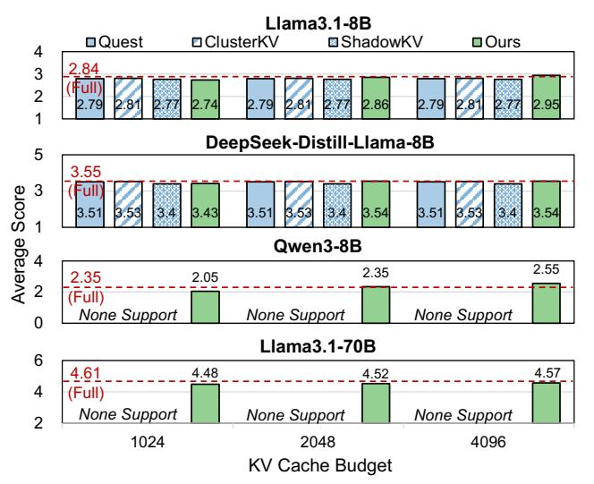

# 8 Evaluation

#### 8.1 Evaluation on Accuracy

8.1.1 Results in Long-context Input Scenario. Figure [8](#page-10-0) and Figure [9](#page-10-1) shows the accuracy results of four tasks in Long-Bench on Llama3.1-8B and Llama3.1-70B. Different from existing work, which selects tokens in each layer, we only select globally important tokens before each inference. Therefore, when the budget is small (i.e., 512), our accuracy is slightly lower than ClusterKV [\[30\]](#page-13-10). When the budget reaches 1k, SpeContext surpasses the baselines and reaches the accuracy of full attention.

8.1.2 Results in Long-context Reasoning Scenario. We use OpenAI GPT-4o to score the output generated from

Figure 9. Accuracy in LongBench on Llama3.1-70B.

SpeContext and baselines on six dimensions(relevance, accuracy, coherence, clarity, breadth and depth and reading experience). Figure [10](#page-11-0) shows the average scores, and the detailed score is in Table [6](#page-15-1) in Appendix [A.](#page-14-12) During experiments, we find that since Quest, ClusterKV and ShadowKV only preprocess the input and retain the KV pair of the newly generated tokens as mentioned in Section [3,](#page-5-2) the input content, which is only about 100 tokens and less than all the KV budgets, will be completely selected during inference. Therefore, the generated outputs with different KV budgets are the same, resulting in the same scores close to the score of the full attention, but with poor throughput due to the invalid KV optimization. We find that SpeContext might get higher score even than full attention in Figure [10\(](#page-11-0)e.g., Qwen3-8B with 4096 budget), and thus we profile the output of SpeContext and full attention and point out that the full attention suffers from repetition which significantly hurts its score while SpeContext with sparse attention mechanism mitigates this specific issue, obtaining higher score.

8.1.3 Results in Multi-round dialogue Scenario. For the multi-round dialogue dataset, ultrachat, we evaluate Distill-DeepSeek-Llama3-8B with different KV budgets and use the GPT-4o to score the output on six dimensions(relevance, accuracy, coherence, clarity, breadth and depth and reading experience). The detailed data is shown in Table [7](#page-15-2) in Appendix [A.](#page-14-12)

#### 8.2 Evaluation on Speedup and Throughput

Based on the accuracy evaluation, we select 2048 as the KV budget for the following evaluation. We only select DeepSeek-Distill-Llama-8B and Qwen3-8B for speedup evaluation because Llama3-8B and DeepSeek-Distill-Llama-8B share the same model architecture without impact on speed.

8.2.1 High-end GPU with multiple requests in cloud. We evaluate SpeContext in two cloud cases, single request and multiple requests, because Quest and ClusterKV only support the single request. Figure [11\(](#page-11-1)a) shows the result of

| Model                         | [In, Out]                                        | Full Attn(Eager)                                 | Full Attn(Flash Attn)                                                      | Full Attn(FlashInfer)                                                           | ShadowKV                                                                         | Ours                                                                               |
|-------------------------------|--------------------------------------------------|--------------------------------------------------|----------------------------------------------------------------------------|---------------------------------------------------------------------------------|----------------------------------------------------------------------------------|------------------------------------------------------------------------------------|
| DeepSeek-Distill -Llama-8B | [2k, 16k] [2k, 32k] [16k, 2k] [32k, 2k] | 45.57(4, 1.00×) 27.74(4, 1.00×) OOM OOM | 145.88(16, 3.20×) 87.74(8, 3.16×) 87.71(8, 1.00×) 46.89(6, 1.00×) | 490.04(16, 10.75×) 314.25(8, 11.32×) 320.41(8, 3.65×) 222.06(8, 4.74×) | 366.74(16, 8.05×) 240.47(16, 8.67×) 168.06(32, 1.92×) 132.07(64, 2.81×) | 824.22(32, 18.09×) 690.59(32, 24.89×) 526.47(16, 6.02×) 346.88(16, 7.40×) |
| Qwen3-8B                      | [2k, 16k] [2k, 32k] [16k, 2k] [32k, 2k] | 33.77(4, 1.00×) 19.28(4, 1.00×) OOM OOM | 129.67(16, 3.83×) 62.89(8, 3.26×) 60.31(8, 1.00×) 32.56(6, 1.00×) | 420.12(16, 12.44×) 254.92(8, 13.22×) 259.28(8, 4.29×) 156.92(6, 4.81×) | - - -                                                                      | 592.39(32, 17.54×) 424.92(32, 22.03×) 336.71(16, 5.58×) 210.75(16, 6.47×) |

Table 5. End-to-end throughput (tokens/s) of high-end GPU with multiple requests in cloud.

Figure 10. Average score on LongWriter benchmark.

a single request case. *SpeContext* outperforms others in the long-context reasoning scenario because *SpeContext* effectively reduces the KV cache in attention computation during generation and others use time-consuming preprocessing mentioned in Section 3.1, but is slightly slower than FlashInfer in long-context input scenario due to the time-consuming retrieval. The results of another case with multiple requests are shown in Table 5. The grey text is the number of requests and the green text is normalized speedup in throughput compared with full attention using Eager implementation in Huggingface. Experiments show that *SpeContext* achieves up to 24.89× and 2.20× throughput improvement compared with full attention(eager) and state-of-the-art implementation FlashInfer [51].

