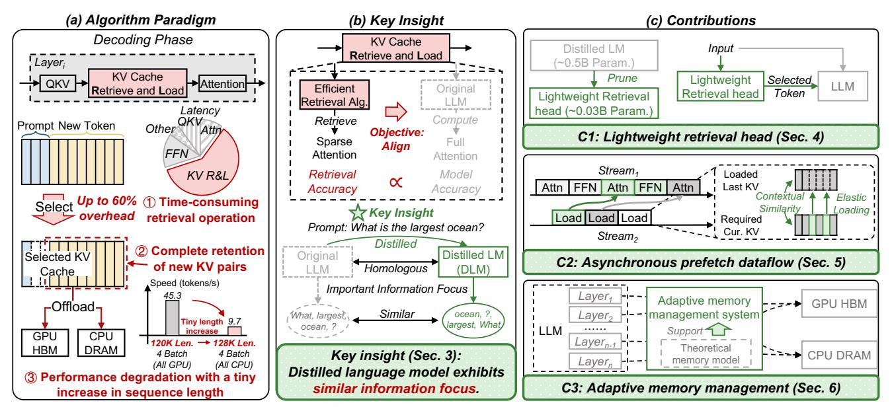
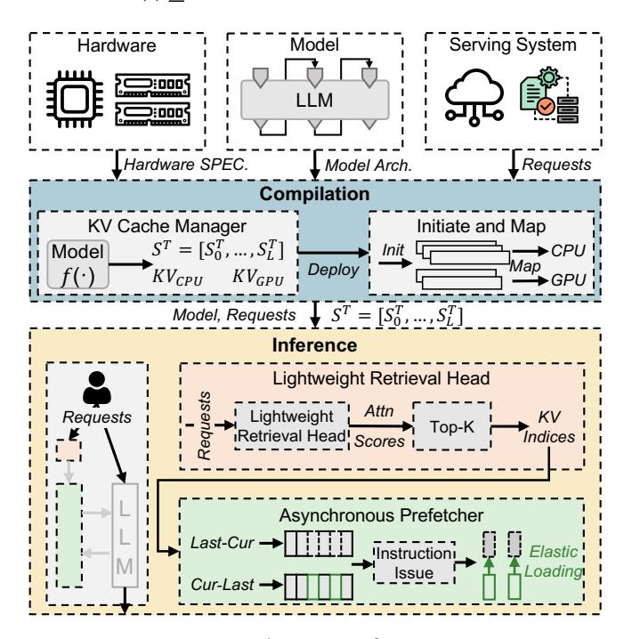

# Abstract

As test-time scaling in large language model(LLM) reasoning has been proven effective in enhancing the model performance through step-by-step generation, this long-context generation incurs substantial Key-Value(KV) cache, posing a critical bottleneck for practical applications deployment(e.g., Agents). While recent KV cache optimizations perform well in the long-context input scenario, the following problems remain unsolved if directly applied to long-context reasoning. (1) Time-consuming layer-wise retrieval operation. The retrieval operation, which selects the important KV pairs in each layer, brings the synchronization overhead that scales with model depth due to the data dependency, resulting in up to 60% latency overhead. (2) Complete retention of the newly generated KV cache. Existing works designed for long-context input choose to retain the KV pair of newly generated tokens to avoid repeated, time-consuming processing on the KV cache, rendering them ineffective in long-context reasoning. (3) Performance degradation with a tiny increase in sequence length. Existing offloading strategies determined before inference cannot adapt to the increasing sequence length, resulting in > 80% performance degradation with a tiny increase in sequence length.

∗Corresponding Author

[This work is licensed under a Creative Commons Attribution-](https://creativecommons.org/licenses/by-nc-nd/4.0)[NonCommercial-NoDerivatives 4.0 International License.](https://creativecommons.org/licenses/by-nc-nd/4.0)

ASPLOS '26, Pittsburgh, PA, USA © 2026 Copyright held by the owner/author(s). ACM ISBN 979-8-4007-2359-9/2026/03 <https://doi.org/10.1145/3779212.3790224>

In this paper, we point out that the objective of the retrieval algorithms is to align with the LLM, which is similar to the objective of knowledge distillation in LLMs. We analyze the similarity in information focus between the distilled language model(DLM) and the original LLM from the perspective of information theory, and thus propose a novel paradigm that leverages a DLM as the retrieval algorithm. Based on the insight, we present SpeContext, an algorithm and system co-design for long-context reasoning. (1) At the algorithm level, SpeContext proposes lightweight retrieval head based on the head-level attention weights of DLM, achieving > 90% parameters reduction by pruning the redundancy. (2) At the system level, SpeContext designs an asynchronous prefetch dataflow via the elastic loading strategy, effectively overlapping KV cache retrieval with the LLM computation. (3) At the compilation level, SpeContext constructs the theoretical memory model and implements an adaptive memory management system to achieve acceleration by maximizing GPU memory utilization. We deploy and evaluate SpeContext in two resource-constrained environments, cloud and edge. Extensive experiments show that, compared with the Huggingface and FlashInfer framework, SpeContext achieves up to 24.89× and 2.19× throughput improvement in cloud and 10.06× and 8.02× speedup in edge with negligible accuracy loss, pushing the Pareto frontier of accuracy and throughput.

CCS Concepts: • Computing methodologies → Natural language generation; Parallel algorithms; • Computer systems organization → Real-time operating systems; • Mathematics of computing → Information theory.

**Figure 1.** (a)(b) Pareto frontiers on KV cache selection in long-context input and reasoning scenarios.

*Keywords:* Large Language Models, Long-context Reasoning, Sparse Attention, KV Cache Selection, GPU

#### **ACM Reference Format:**

Jiaming Xu, Jiayi Pan, Hanzhen Wang, Yongkang Zhou, Jiancai Ye, Yu Wang, and Guohao Dai. 2026. SpeContext: Enabling Efficient Long-context Reasoning with Speculative Context Sparsity in LLMs. In Proceedings of the 31st ACM International Conference on Architectural Support for Programming Languages and Operating Systems, Volume 2 (ASPLOS '26), March 22–26, 2026, Pittsburgh, PA, USA. ACM, New York, NY, USA, 16 pages. https://doi.org/10.1145/3779212.3790224

#### 1 Introduction

Generative large language models(LLMs) mark a significant advancement in the pursuit of Artificial General Intelligence(AGI). Their successful application across various domains has greatly contributed to the rapid advancement of numerous downstream tasks (e.g., pharmaceutical [36], finance [25], and ecology [34]), and their remarkable capabilities have attracted widespread attention, spurring the development of a new wave of LLM-based software applications (e.g., AI agents [18]). As the scaling law gradually slows down, the test-time scaling [35] in LLM reasoning is emerging as a powerful tool in enhancing the model capabilities, especially in solving complex problems(e.g., mission planning [13, 18, 52] and mathematical derivation [1]), through step-by-step chain-of-thought generation [19]. Moreover, some latest works point out that as the length of the chainof-thought reasoning increases, the LLM capabilities, especially the mission planning(e.g., 8K reasoning length) and information search(5M search length) in AI agents [52], can be significantly improved.

To effectively support long-context reasoning, LLM providers have enhanced the long-context processing capabilities of their LLMs during pretraining, with context windows of over 100K tokens becoming a common standard (e.g., Kimi K2 with 128K [42] and OpenAI o3 with 200K [14]). Despite these algorithm advances, the computational and memory burden associated with Key-Value(KV) cache still prevents the efficient practical deployment. KV cache is a fundamental component in the LLM, which effectively reduces the computation by reusing past key-value pairs, but introduces significant memory overhead, which is proportional to the context length. Furthermore, during the autoregressive decoding, the generation of each new token requires reading the entire KV cache to compute attention weights, leading to severe latency overhead. For example, in the case of Llama3.1-8B [17] on a NVIDIA RTX 4090 GPU, generating a single token with a 16K context takes twice as long as generating a token with a 1k context, and theoretically generates 2GB of memory footprint for KV cache, which means that for an NVIDIA RTX 4090 GPU, only 3 requests can be processed in parallel at most shown in Figure 1. For the LLM cloud service vendors, the longer response and limited throughput will translate to higher infrastructure costs (e.g., energy and hardware consumption) and suboptimal user experiences [20].

Consequently, many previous works have explored various techniques for KV cache optimization, particularly in resource-constrained environments by reducing the KV cache involved during inference, encompassing algorithm optimization (e.g., permanent eviction [6, 46] and dynamic selection [30, 39, 40] of KV cache), system enhancement (e.g., customized CUDA kernel design [30, 39, 40]). These algorithms establish a paradigm centered on layer-wise retrieval operation during the decoding phase shown in Figure 2(a). LLM inference can be divided into two phases, the prefill and decoding phase detailed in Section 2. Most previous works [30, 39, 40] preprocess KV cache upon completion of the prefill phase, and the corresponding retrieval algorithms retrieve a subset of preprocessed KV cache for each generation during decoding phase.

However, the core trade-off of this paradigm is its departure from mathematical equivalence. By selectively computing attention over a fraction of the context, these methods inherently introduce computational shortcuts that can lead to a degradation in model accuracy. Therefore, as illustrated in Figure 1(a)(b), two Pareto frontiers in long-context input and reasoning scenarios are established, forcing a compromise between inference speed and model accuracy. Despite this paradigm performing well in the long-context input scenario, it still suffers from the following critical limitations during the *decoding* phase if directly applied in the long-context reasoning scenario.

**Challenge-1:** Time-consuming layer-wise retrieval operation. Figure 2(a) shows that the algorithm paradigm needs to perform the retrieval over the KV cache and load the

**Figure 2.** Overview of *SpeContext*. (a) Three challenges in existing algorithm paradigm in the long-context reasoning scenario. (b) Key Insight: Distilled language model exhibits similar information focus. (c) Contributions from Section 4 to Section 6

corresponding KV pairs based on the retrieval result before attention computation in each layer, resulting in the sequential dataflow due to data dependency. This serialization introduces substantial synchronization overhead, breaking the natural overlap between computation and memory access in the original pipeline. Furthermore, the retrieval operation is repeated in each layer during decoding, and thus the overhead scales linearly with model depth and quickly becomes bottleneck(up to 60% latency) shown in Figure 2(a).

Challenge-2: Complete retention of the newly generated KV cache. Existing works designed for the long-context input scenario preprocess the KV cache by complex and time-consuming algorithms(e.g., clustering [30] and quantization [39]) during the prefill phase(i.e., the KV cache of the prompt), and only retrieve the preprocessed KV cache and completely retain the newly generated KV pair during the decoding phase to avoid the repeated preprocessing shown in Figure 2(a). With the substantial retrieval overhead in each layer, performance thus degrades greatly in the long-context reasoning scenario, even worse than full attention(i.e., FlashInfer [51]), as shown in Figure 1(b).

Challenge-3: Performance degradation with a tiny increase in sequence length. In resource-constrained environments(e.g., low-end GPU with limited memory in edge and high-end GPU with multi-requests in cloud), KV cache tends to be offloaded to the lower-tier memory (e.g., from GPU HBM to CPU DRAM). However, existing systems determine the offloading strategy that either fully offloading or never offloading (e.g., ClusterKV [30]) before inference. Due to the inference dynamics in LLM reasoning, the predetermined strategy cannot adapt to the increasing sequence length during the autoregressive decoding, resulting in >

**Figure 3.** Architecture of *SpeContext*.

80% performance degradation with a tiny increase in sequence length.

In this paper, we point out that the core objective of the retrieval algorithms is to align with the LLM, especially in the information focus, and the retrieval accuracy directly influences the LLM performance(> 10% accuracy gap between Quest [40] and ClusterKV [30] using two different algorithms). Inspired by the objective of alignment in the output distribution in the LLM knowledge distillation [48],

we consider that due to the homology between the distilled LM and the original LLM, the information they focus on (*i.e.*, the important tokens) exhibits a high degree of similarity given the same inputs, and we also analyze this similarity through the mutual information [21] and the data processing inequality [4] in information theory [38]. Therefore, we propose a novel paradigm that leverages a DLM as the retrieval algorithm to efficiently retrieve important information focus shown in Figure 2(b). Based on the insight, we present *SpeContext*, an algorithm and system co-design for speculative context sparsity in long-context reasoning. The contributions of *SpeContext* can be summarized into three levels as follows.

- (1) Lightweight retrieval head design at the algorithm level. Based on the insight mentioned above, we integrate a DLM before the LLM inference shown in Figure 2(c)-C1, and explore the similarity of the focused tokens between the DLM and the original LLM based on the attention weights from two mapping dimensions, head-level and batch-level. Statistical data shows that there exists a higher similarity in the head-level dimension. Therefore, we design a lightweight retrieval head based on the head-level attention weights by pruning the redundant operations in DLM, achieving > 90% parameter reduction.
- (2) Asynchronous prefetch dataflow via elastic loading at the system level. We further point out that, different from the existing works, *SpeContext* selects the important KV pairs before the LLM inference through the lightweight retrieval head, eliminating the data dependency between the KV retrieval and loading during inference. Therefore, we design an asynchronous KV cache prefetch dataflow shown in Figure 2(c)-C2. The dataflow only requires several lines of code about KV positions modification on the original LLM pipeline. Furthermore, we observe that the retrieval results between adjacent token generation are similar, and thus propose an elastic loading strategy into the dataflow, which only loads the different KV pair required by the current generation, successfully reducing data transfer by up to 90%.
- (3) Adaptive memory management at the compilation level. The critical path of LLM inference in resource-constrained environments is dominated by the latency of CPU-GPU data transfer. We develop a theoretical memory overhead model that considers LLM, hardware, and workload to optimize memory usage and inference latency by maximizing the GPU memory utilization. Guided by the model, we propose an adaptive memory management system shown in Figure 2(c)-C3, which adaptively allocates memory to maximize the inference speed with increasing sequence length in LLM reasoning.

The architecture of *SpeContext* is shown in Figure 3. *SpeContext* begins when receiving the inference workload(*e.g.*, requests) processed by the serving system. In the compilation stage, the adaptive memory management system calculates the sequence length thresholds based on the theoretical

model and initializes the memory for the KV cache. During autoregressive inference, the lightweight retrieval head aims to identify critical KV pairs in all KV cache and obtain their indices. These indices are immediately fed to the asynchronous prefetcher for difference calculation, kicking off KV prefetching with elastic loading in parallel with the original LLM inference to enable the overlap of GPU computation and CPU-GPU data transfer.

We deploy and evaluate *SpeContext* in two resource-limited environments, a low-end GPU with limited memory in edge and a high-end GPU with multiple requests in cloud, targeting long-context input and reasoning scenarios. Extensive experiments demonstrate that, compared with the Huggingface and FlashInfer framework, *SpeContext* achieves 24.89× and 2.19× throughput improvement in the cloud environment and 10.06× and 8.02× speedup in the edge environment with negligible accuracy loss, pushing the Pareto frontier of accuracy and throughput for long-context input and reasoning scenarios.

## 2 Background and Related Work

#### 2.1 Large Language Model

Figure 4(a) shows that LLM inference is composed of two phases, *prefill* and *decoding* phase. The *prefill* phase processes the prompt to generate the first token and caches its key-value pairs. Subsequently, the *decoding* phase uses the KV cache to generate the new token autoregressively and appends the new key-value pair to the KV cache. Nowadays, mainstream LLMs select the Transformer decoder [44] as the backbone layer, which primarily includes two modules, the attention mechanism and the feed-forward network(FFN). The attention mechanism requires that the current token generation is solely dependent on previous tokens. The FFN aims to capture deeper features and handle nonlinear relationships.

#### 2.2 KV Cache Optimization

As illustrated in Figure 4(a), to reduce computation, existing LLM inference systems leverage the KV cache to store the keys and values generated from this previous content, but introduce the memory overhead that scales linearly with the context length (*e.g.*, 4GB memory footprint with 32K context in Llama3.1-8B [17]), posing significant challenges in resource-constrained environments.

Owing to the *softmax* operation in attention described in Equation 1, the attention weights exhibit approximate sparsity (*i.e.*, many values are close to zero). Capitalizing on this phenomenon, many techniques emerged to optimize the KV cache, such as permanent eviction and dynamic selection.

$$Attn\_weight = softmax(\frac{QK^T}{\sqrt{d}})$$
 (1)

Figure 4. (a) Inference dataflow of LLM. (b) Existing works on KV cache optimization.

**Permanent eviction.** Sliding Window [6] is a typical representative of permanent eviction and is still used in some industrial LLM deployments(*e.g.*, Gemma 3 [41]). It retains only a fixed number of the most recent KV pairs(*i.e.*, "window") and evicts the farthest ones as new tokens are generated(*i.e.* "sliding"). While this approach ensures a constant memory for the KV cache, it discards too much historical context, resulting in significant accuracy loss. StreamingLLM [46] represents a notable optimization on this paradigm. It builds on the insight that, due to the nature of the *softmax*, the initial few tokens accumulate a wealth of information, called "attention sink". Therefore, in addition to the sliding window, StreamingLLM perpetually retains these crucial initial KV pairs to improve the model accuracy.

**Dynamic selection.** To address the significant accuracy degradation caused by irreversible information loss in permanent eviction, some works [30, 39, 40] propose the dynamic selection, which retains the entire KV pairs or offloads them to lower-tier memory(e.g., CPU DRAM) in resourceconstrained environments, and retrieves the necessary KV pairs based on the input during inference. In order to minimize the retrieval overhead, most works require preprocessing the KV cache (e.g., paging [40], clustering [30], and quantization [39]). Given the substantial overhead of the preprocessing, most works only preprocess the KV cache of the input prompt after the prefill phase, and only retrieve the preprocessed KV cache during the decoding phase with the retention of newly generated KV pairs. Quest [40] is a representative work in dynamic selection, which partitions the KV cache into pages and creates a page vector by taking the element-wise maximum and minimum values. During retrieval, importance scores are computed only for these page vectors to select the Top-K pages. Subsequently, all KV pairs within the selected pages are loaded for computation. ClusterKV [30] improves upon Quest by employing clustering to categorize the KV cache. It uses the cluster centroids as the cluster vectors for the importance calculation,

leading to a notable accuracy improvement. Similarly, the ShadowKV [39] quantizes the key cache and computes attention between the query and the quantized keys. Based on the results, it selects the important KV pairs for computation. A common characteristic of all these approaches is their reliance on preprocessing the KV cache. This requirement is ill-suited for the long-context reasoning scenario, where the KV cache continuously grows during the *decoding* phase, making repeated preprocessing computationally expensive. In this paper, *SpeContext* aims to achieve the efficient long-context reasoning of LLM through the lightweight retrieval head on raw KV cache without complex preprocessing.

#### 2.3 Knowledge Distillation in LLMs

Knowledge Distillation is a typical technique to address the challenge of deploying the LLMs in some resource-constrained scenarios. Its primary goal is to compress a large "teacher" LLM into a smaller, more efficient "student" LLM while preserving high performance. The student LLM learns to mimic the outputs of the teacher LLM to achieve the alignment of the probability distributions by minizing the Kullback-Leibler Divergence [22] formulated as follows.

$$D_{KL}(P_T||P_S) = \sum_{i} P_T(x_i) log(\frac{P_T(x_i)}{P_S(x_i)})$$
 (2)

The  $P_T$  denotes the probability distribution of the teacher LLM, and the  $P_S$  denotes the probability distribution of the student model. Recently, knowledge distillation is further used to accelerate LLM inference through speculative decoding. The EAGLE family [26–28] is a representative work. It leverages a distilled small language model to autoregressively generate draft tokens, which are then fed into the LLM for parallel verification. Since the training objective of the distilled model is to align its output distribution with that of the LLM, the number of tokens passing verification is often greater than one, allowing the LLM to generate multiple tokens in a single forward inference.

#### 3 Motivation

#### 3.1 Two Core Questions of KV Selection

Question: What is the essential objective of retrieval algorithms?

**Answer:** The retrieval algorithms aim to efficiently align with the intrinsic properties on the LLM contextual focus.

Analysis: As mentioned in Section 2.2, permanent eviction strategies [6, 46] are typically informed by coarse-grained statistical and theoretical analysis of the attention mechanism. These works reveal intrinsic, input-agnostic properties of LLMs, such as the consistent focus on local context or specific absolute positions (e.g., the initial tokens [46]), leading to the design of fixed retrieval algorithms that are independent of the input query. In contrast, dynamic selection strategies [30, 39, 40] are based on fine-grained experimental analysis that the focus is highly dynamic and content-dependent. By leveraging the intrinsic properties of LLMs(e.g., representational similarity [30] and low-rank characteristics [39]), these works propose query-aware retrieval algorithms. As illustrated in Figure 2(b), we point out that the core of the retrieval algorithms is to first identify the intrinsic properties of the LLM on the contextual focus, and then align with these properties in an efficient way. The alignment degree between the retrieval algorithm and LLM decides retrieval accuracy, proportional to the model accuracy.

