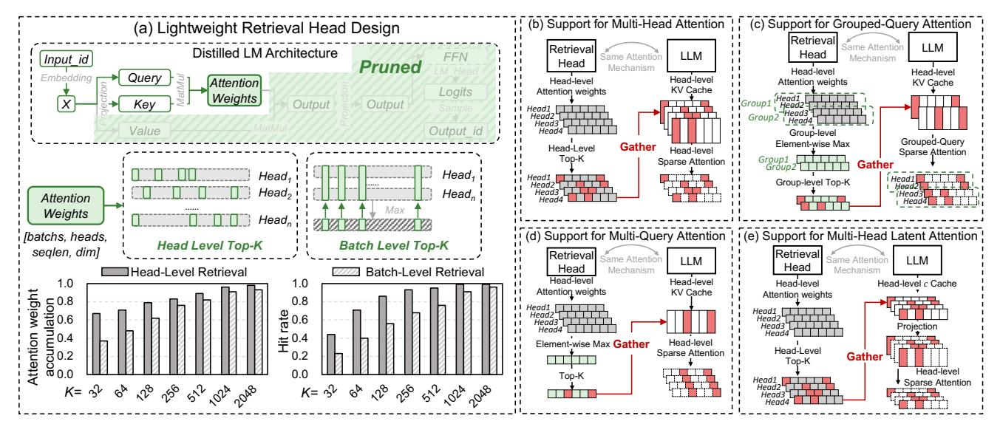
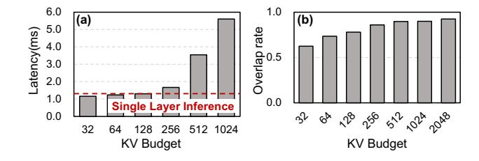
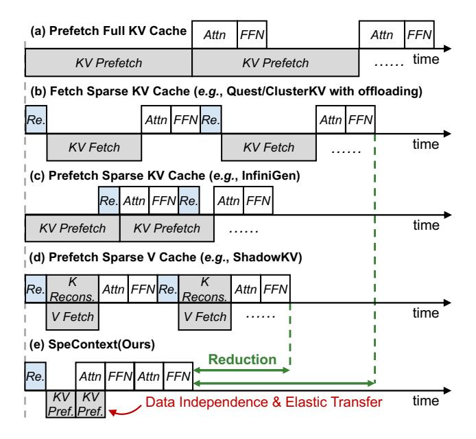

# Question: Why do the existing retrieval algorithms need complex and time-consuming preprocessing?

**Answer:** The primary purpose of preprocessing is to mitigate the computational overhead during retrieval.

**Analysis:** To retrieve the important KV pairs, most existing retrieval algorithms in each layer take matrix multiplication of  $Query \in R^{bsz \times heads \times dim}$  with  $Keys_{candidate} \in R^{dim \times heads \times len_{keys}}$  to get the importance scores, and then select the Top-K candidates for the final computation. Therefore, the retrieval overhead $(O_{tot})$  in a single LLM inference can be defined as follows.

$$O_{tot} = layers \times bsz \times heads \times dim \times len_{keys} \times O_{mul}$$
 (3)

As mentioned in Section 2.2, Quest and ClusterKV leverage preprocessing algorithms (e.g., paging and clustering) which select a single vector as the representative of several Keys, to reduce the length of candidate  $keys(len_{keys})$ . ShadowKV reduce the single multiplication overhead( $O_{mul}$ ) by quantizing the key vectors to low bit level. From Equation 3, if without preprocessing, the retrieval overhead is equivalent to the attention weights computation in Equation 1, losing the meaning of KV selection.

#### 3.2 Key Insight and Theoretical Analysis

**Key Insight.** Inspired by the alignment objective of knowledge distillation in LLM and its wide application across various domains(*e.g.*, speculative decoding [26–28] and early

exiting [47]), we consider that the goal of DLM in these works is to generate the probability distribution that resembles the original LLM. From the perspective of information, we intuitively consider that if the probability distribution is nearly the same, the contextual information focus(*i.e.*, the tokens contribute most to the result) in the DLM and the original LLM must be highly similar. Otherwise, any significant information discrepancy would prevent the alignment in the probability distribution.

**Theoretical Analysis.** As mentioned in Section 2.3, the objective of knowledge distillation in LLMs is to minimize the KL divergence of the probability distributions in Equation 2. We consider that this inherently requires the student model to learn the context information extraction strategy similar to that of the teacher model. This insight can be analyzed through mutual information [21] and the data processing inequality [4] in information theory [38]. Mutual information(I(X;Y)) measures the dependence between two variables. For a well-trained teacher model(T), there exists high mutual information between the output probability distribution  $(P_T)$  and the input context(C) (i.e.,  $I(C; P_T)$  is large). This means that the teacher's output is highly dependent on the context and not random guessing. Moreover, the information flow from the context(*C*) through the internal representation( $R_S$ ) of the student model(S) to output probability distribution ( $P_S$ ) forms a Markov chain [32]:

$$C \to R_S \to P_S$$
 (4)

According to the DPI, we can get

$$I(C, P_S) \le I(C, R_S) \tag{5}$$

This indicates that the amount of information about the context contained in the output cannot exceed the information captured by its internal representation. The distillation process drives  $P_S \to P_T$  by minimizing  $D_{KL}(P_T||P_S)$ . Since  $P_T$  has high mutual information with C, a successful distillation will ensure that  $P_S$  also exhibits high mutual information with C, i.e.,  $I(C, P_S) \to I(C; P_T)$ . To achieve a high level of  $I(C, P_S)$ , the DPI dictates that the student model must learn to generate an internal representation( $R_S$ ) that also captures significant contextual information in C, ensuring that  $I(C, R_S) \geq I(C, P_S)$ . Therefore, the student model must extract the contextual information that the teacher model deems important.

Building on the insight and analysis above, we propose a **novel paradigm that leverages the DLM of the original LLM as the retrieval algorithm**. This paradigm can transfer the information focus from the DLM to the original LLM during inference, eliminating layer-wise time-consuming retrieval detailed in Section 1 and complex preprocessing mentioned above, and thus effectively supporting the long-context reasoning scenario.

**Figure 5.** (a) We design the lightweight retrieval head by pruning redundancy and adopt the head-level attention weights for selection. (b) $\sim$ (e) The detailed implementations of four attention mechanisms supported by the lightweight retrieval head.

**Table 1.** Analysis on attention weights with short input.

|        | Budget | gsm8k      | QA         | Humaneval-code |
|--------|--------|------------|------------|----------------|
| Head-  | 32     | 0.74(0.13) | 0.86(0.10) | 0.75(0.13)     |
| Level  | 64     | 0.80(0.10) | 0.91(0.06) | 0.81(0.12)     |
| Batch- | 32     | 0.68(0.15) | 0.72(0.13) | 0.68(0.16)     |
| Level  | 64     | 0.72(0.12) | 0.79(0.10) | 0.75(0.12)     |

#### 4 Lightweight Retrieval Head Design

#### 4.1 Challenge: Time-consuming DLM

Based on the key insight mentioned above, we deploy the DLM before the original LLM to capture globally important tokens shown in Figure 3. In this paper, we utilize the DLM provided by EAGLE-3 [28], which has the complete LM architecture(including *tokenizer*, *embedding* and *LM\_Head*) with a single Transformer decoder layer. As shown in Figure 3, the DLM processes the same inputs as the LLM, and performs complete inference with the full KV cache, resulting in  $\sim 20\%$  additional overhead, especially for the LLM with large vocabulary(e.g.,  $> 1.2 \times 10^5$  tokens in Llama3-8B). Therefore, the key issue is **how to design a lightweight retrieval algorithm based on the DLM** to minimize the overhead.

#### 4.2 Insight and Analysis: Redundant Operation

We further point out that the role of the single-layer DLM is primarily to identify all important tokens in multi-layer LLM, which are often determined by the attention weights. For example, when LLM processes "What is the largest ocean?", the first layer in LLM might focus on "?" with 0.8 attention weight, and the second layer might focus on "What" with 0.9 attention weight, and third layer might focus on "largest" with 0.5 attention weight and "ocean" with 0.4 attention weight. However, the attention distribution of DLM

Table 2. Analysis on attention weights with long input.

|       | Budget | Longmagpie | HotpotQA   | RepoBench  |
|-------|--------|------------|------------|------------|
| Head- | 512    | 0.89(0.07) | 0.90(0.07) | 0.88(0.09) |
| Level | 1024   | 0.95(0.04) | 0.97(0.02) | 0.92(0.07) |
| Batch | 512    | 0.70(0.09) | 0.79(0.10) | 0.72(0.12) |
| Level | 1024   | 0.73(0.08) | 0.83(0.06) | 0.76(0.10) |
|       |        |            |            |            |

might be "What" with 0.2 attention weight, "is" with 0.1 attention weight, "largest" with 0.25 attention weight, "ocean" with 0.25 attention weight, "?" with 0.2 attention weight. Therefore, we do not expect or require the attention distribution of DLM to be identical to that in any of the LLM's layers, and as illustrated, it would be impossible for it to be. Our objective is to ensure a crucial outcome, "Do the tokens selected by the DLM capture high LLM attention weights?". We conduct experiments on the similarity between the DLM and the original LLM from two mapping dimensions in attention weights, batch-level and head-level in Figure 5(a), and demonstrate the mean and standard deviation of the sum of attention weights for selected tokens across diverse datasets(Math[gsm8k [8]], QA[QA [23], LongBench-HotpotQA [50]], Code[Humaneval-code [7], LongBenchrepobench [31]], Multi-doc[Longmagpie [16], LongBench-HotpotQA [50]]) in Table 1 and Table 2. The batch-level retrieval adopts a coarse-grained approach, retaining a single set of important tokens that apply to all attention heads. In contrast, the head-level retrieval is more fine-grained, retaining different important tokens for each attention head. As illustrated in Figure 5, the head-level retrieval exhibits a higher similarity of the important tokens and higher hit rate of the generated tokens. Therefore, we only need operations related to the calculation of attention weights (e.g., Query and Key generation), while other operations are redundant.

#### 4.3 Approach: Lightweight Retrieval Head

Building on the insight and analysis, we design the light-weight retrieval head based on the DLM. The retrieval head supports three mainstream LLM attention mechanisms (*i.e.*, Multi-Head Attention(MHA), Grouped-Query Attention(GQA), Multi-Query Attention(MQA), and Multi-Head Latent Attention(MLA)). The implementation details are as follows.

Implementation Details. As illustrated in Figure 3, we deploy the retrieval head before the original LLM and process the same input as the LLM. This retrieval head retains the essential components of DLM provided by EAGLE-3 [28], the embedding module and the QK projection weights. Although the original DLM only supports 2k context length, we enable it to process long context using the training-free method provided by YaRN [37]. During the inference, the retrieval head maintains a full Key (K) cache and calculates attention weights after the QK projection. Based on the analysis in Section 4.2, we perform the head-level retrieval of important tokens based on the attention weights and feef the selected tokens into the original LLM inference. The implementation of the head-level retrieval tailored for the different attention mechanisms is as follows.

**Support for MHA.** MHA was once a mainstream attention mechanism adopted by many LLMs(e.g., Llama-2 [43]). The number of heads for Keys(K) and Values(V) is the same as that of Queries(Q) in Figure 4(a). Since the attention mechanism of the retrieval head is the same as that of the original LLM, the retrieval head selects important tokens at the head level based on the attention weights shown in Figure 5(b). The selected tokens are then mapped to the attention computation of the original LLM by using the torch. gather operation to load the important KV cache into different heads.

**Support for GQA.** GQA is introduced to optimize the substantial KV cache overhead of MHA, and most mainstream LLMs(e.g., Llama3 [17] and Qwen3 [49]) have updated to GQA. As illustrated in Figure 5(c), GQA divides the query heads into groups, where all heads in the group share the same KV cache. Consequently, the number of heads in the KV cache is reduced to  $\frac{1}{\alpha}$  of the query heads, where  $\alpha$  is the number of groups. For computational convenience, the KV heads are often repeated  $\alpha$  times before the attention calculation, resulting in attention weights with the same number of heads as the query. This thus creates the mismatch between the attention weights of the retrieval head and the physical KV cache of original LLM in head numbers. To address this, as shown in Figure 5(c), we apply an element-wise maximum operation along the hidden dimension within the same group of heads in the attention weights, to generate the group-level attention weights. We then take the grouplevel attention weights for important token selection and subsequent operations, which are similar to MHA.

**Support for MQA.** MQA divides all heads of the query into a single group, where all heads share the same KV cache.

**Figure 6.** (a) The latency of prefetching with different KV budget and a LLM layer inference. (b) Overlap rate of selected tokens in adjacent generation with different KV budget.

Therefore, the implementation of *SpeContext* in MQA is similar to that in GQA shown in Figure 5(d), *i.e.*, *n* is changed to the number of all heads.

**Support for MLA.** MLA is a novel variant of MHA employed in a new series of models(e.g., DeepSeek-V3/R1 [29] and Kimi-K2 [42]). Instead of caching the full Key-Value pairs, MLA caches a lower-dimensional latent representation, denoted as c. During computation, the c is mapped to a higher dimensional space for the attention calculations. Since MLA does not reduce the number of attention heads, our retrieval remains similar to that in MHA. The primary difference lies that only the selected c cache is subjected to the increase in dimension as shown in Figure 5(e).

### 5 Asynchronous Prefetch Dataflow

#### 5.1 Motivation: Data independence

As previously mentioned in Section 1, inference engines will offload the KV cache to lower-tier memory in resource-constrained environments. As illustrated in Figure 7, existing KV cache retrieval works must load the required KV cache based on retrieval results for attention computation in each layer. This design introduces the synchronization and control caused by data dependencies. As mentioned in Section 3.2, the lightweight retrieval head in is deployed before LLM inference and dependent solely on the LLM input. eliminating the data dependency mentioned above. Consequently, we further propose the asynchronous dataflow through multiple CUDA streams, enabling concurrent execution of computation and KV cache prefetching shown in Figure 2(c)-C2.

#### 5.2 Challenge: Heavy Data transfer

However, due to the combination of limited memory bandwidth and the immense computational power of GPUs, a significant imbalance arises. As illustrated in Figure 6(a), for the large KV budget(*i.e.*, self-determined amount of KV cache for loading), the data transfer latency far exceeds the LLM inference latency As a result, in resource-constrained scenarios, the end-to-end inference latency becomes dominated by the I/O for loading the KV cache. Therefore, the key challenge is **how to reduce the data transfer time** (*i.e.*, **minimize the volume of KV cache loaded**) without sacrificing accuracy.

**Figure 7.** Elastic loading effectively reduces the KV transfer, making *SpeContext* outperform previous works.

#### 5.3 Insight: Contextual Similarity

Inspired by the contextual similarity explored in early exiting [47] and sparse activation [33], we conduct experiments to explore the relationship of the selected tokens between two adjacent token generation. As illustrated in Figure 6(b), statistical analysis reveals the high overlap(> 80%) in the important token selection between adjacent generation. This implies that for the subsequent generation, only about 20% of the KV cache on GPU requires to be updated. Consequently, we can maintain the accuracy by loading only 20% updating KV cache, effectively reducing the data transfer volume.

#### 5.4 Approach: Elastic Loading

Based on the contextual similarity, we propose the elastic loading strategy and integrate it into the asynchronous dataflow. Its objective is to reuse the KV cache already resident on the GPU from the previous generation and fetch only those not yet present. This strategy can be implemented with minimal code modifications to the existing asynchronous dataflow. The implementation details are as follows. We denote the set of important token indices in last generation as  $S_{last}$ . And we obtain the indices  $S_{now}$  for current generation by the retrieval head. The set of KV cache indices to be updated on GPUs can be calculated by the set difference  $S_{last} - S_{now}$  while the KV cache indices for elastic loading are calculated by  $S_{now} - S_{pre}$ . Because we maintain a fixed KV budget(i.e.,  $|S_{last}| = |S_{now}|$ ), it follows that  $|S_{last} - S_{now}| = |S_{now} - S_{last}|$ . Then  $S_{last}$  needs to be updated by  $S_{now}$ . Practically, we perform in-place updates for the required KV loading through Tensor.copy\_().

**Table 3.** Symbols mentioned in Section 6 and description.

| Category | Symbol      | Description                         |  |  |  |
|----------|-------------|-------------------------------------|--|--|--|
|          | $M_O$       | Memory size of original LLM         |  |  |  |
|          | $M_D$       | Memory size of DLM                  |  |  |  |
|          | L           | Number of layers in LLM             |  |  |  |
|          | D           | Head dimension in LLM               |  |  |  |
| Model    | H           | Number of KV heads in LLM           |  |  |  |
| Model    | S           | Current sequence length             |  |  |  |
|          | B           | KV cache retrieval budget           |  |  |  |
|          | $L_{CPU}$   | Number of layers of KV cache on CPU |  |  |  |
|          | $L_{GPU}$   | Number of layers of KV cache on GPU |  |  |  |
|          | α           | Groups of attention heads           |  |  |  |
| Hardware | $Mem_{GPU}$ | Size of GPU global memory           |  |  |  |
| Workload | R           | Requests                            |  |  |  |

