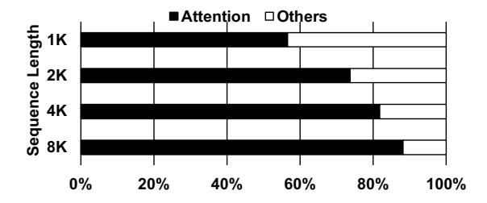

# 1 Introduction

The rapid growth of data makes data movement a major factor of system performance [\[49\]](#page-14-0). Data-intensive applications often require frequent and extensive data movement (I/O operations) across the memory hierarchy to retrieve and store data and results [\[35\]](#page-14-1). In many cases, I/O operations dominate execution time, making them a primary performance bottleneck at all levels of a computer system [\[19,](#page-13-0) [31,](#page-14-2) [45–](#page-14-3)[47,](#page-14-4) [65\]](#page-15-1). Transformer-based models, particularly those employing the self-attention mechanism [\[70\]](#page-15-2), are a prime example of this data movement bottleneck.

Self-attention has become a cornerstone of transformerbased models due to its ability to capture complex dependencies among input elements [\[70\]](#page-15-2). Long-sequence selfattention has emerged as a critical component for large language models (LLMs) across diverse applications [\[5,](#page-13-1) [6,](#page-13-2) [15,](#page-13-3) [25,](#page-14-5) [68,](#page-15-3) [69\]](#page-15-4), including multi-turn conversations, long-document analysis [\[7,](#page-13-4) [21,](#page-13-5) [33,](#page-14-6) [34,](#page-14-7) [76\]](#page-15-5), code completion [\[37,](#page-14-8) [43\]](#page-14-9), and

∗Both authors contributed equally to this work.

Figure 1. Latency breakdown of GPT-3 prefilling on RTX 6000 GPU (batch size 1).

multi-modal understanding [\[9,](#page-13-6) [40,](#page-14-10) [41\]](#page-14-11). With real-world scenarios increasingly requiring the processing of hundreds of thousands of tokens [\[74\]](#page-15-6), long-sequence self-attention has become crucial for capturing and utilizing global context.

However, achieving efficient exact self-attention for long sequences remains challenging because its memory complexity scales quadratically with sequence length [\[14,](#page-13-7) [67\]](#page-15-7). A major bottleneck of long-sequence self-attention is the massive I/O overhead across the memory hierarchy, which significantly impacts performance. Figure [1](#page-1-0) profiles the latency breakdown of GPT-3 model [\[6\]](#page-13-2) inference during the prefilling stage, where all input tokens run through the forward pass of the model to generate the first output token. The results show that exact self-attention accounts for at least 80% of the runtime at sequence lengths beyond 4K, making it the primary bottleneck as sequence length scales. To address these challenges, several approximate selfattention methods have been proposed to reduce I/O overhead, including sparsity-based techniques and lossy approximations [\[3,](#page-13-8) [13,](#page-13-9) [17,](#page-13-10) [33,](#page-14-6) [42,](#page-14-12) [59,](#page-15-8) [62\]](#page-15-9). However, these methods often require extensive fine-tuning, which limits their generalization. Moreover, they are less suitable for scenarios requiring exact self-attention [\[2,](#page-13-11) [56\]](#page-15-10).

To optimize the performance of exact long-sequence selfattention, existing acceleration efforts [\[12,](#page-13-12) [14,](#page-13-7) [32,](#page-14-13) [61\]](#page-15-11) focus on reducing I/O operations between on-chip and off-chip memory. FlashAttention [\[14\]](#page-13-7) and its successors [\[12,](#page-13-12) [61\]](#page-15-11) reduce I/O operations by leveraging tiling and recomputation, breaking attention computation into tiles while recomputing softmax-related values on demand to avoid storing large intermediate matrices. FLAT [\[32\]](#page-14-13) introduces a new dataflow that explores fusion opportunities between different operators and proposes a tiling approach across the fused operator to avoid recomputation and eliminate redundant memory accesses to intermediate results. While both methods aim to reduce I/O operations, neither provides a comprehensive I/O analysis, making exact long-sequence attention an ideal test case for I/O analysis. Without an I/O analysis, the selection of tiling sizes and scheduling strategies remains heuristic and does not adequately consider realistic hardware constraints, thus leading to suboptimal performance.

In this work, we first present a systematic and novel I/O analysis for tall-and-skinny Matrix-Matrix Multiplication (MMM), an important component of exact long-sequence self-attention, explicitly analyzing data movement across the memory hierarchy using the Red-Blue Pebble Game [\[31\]](#page-14-2). By reusing input data and partial output results between subcomputations, we explore the optimal tiling and scheduling strategy that minimizes I/O operations under the capacity constraint of on-chip memory.

Building on this I/O complexity analysis, we next extend our findings to exact long-sequence self-attention and introduce AttenIO, an I/O-driven accelerator that accelerates exact long-sequence attention for serving LLMs. Rather than assembling standard architectural components, AttenIO is a tightly integrated system that realizes the I/O optimizations through coordinated control of tiling, scheduling, three-level overlapping, and parallel execution for softmax. Accordingly, AttenIO incorporates three novel, I/O-driven optimizations: (1) Based on the I/O complexity analysis of tall-and-skinny MMM, we develop an I/O-optimal dataflow for exact longsequence self-attention to minimize I/O operations by carefully selecting tiling sizes and scheduling all attention operations. (2) Once the I/O-optimal dataflow is determined, we introduce a three-level fine-grained communicationcomputation overlapping mechanism for self-attention operations, which effectively reduces I/O stall time and significantly improves processing element (PE) utilization. (3) We observe that the I/O-optimal dataflow not only minimizes I/O operations but also enables parallel patterns within softmax execution. By integrating softmax computations directly into the parallel patterns, AttenIO enables efficient parallel execution, ensuring high computational efficiency.

We evaluate AttenIO against state-of-the-art (SOTA) exact self-attention dataflow baselines: FLAT [\[32\]](#page-14-13), Standard [\[52\]](#page-14-14), and FlashAttention-2 [\[12\]](#page-13-12). AttenIO achieves geometric mean speedups of 8.8× over FLAT, 2.5× over Standard, and 1.6× over FlashAttention-2 across varying sequence lengths. We further validate the practical effectiveness of AttenIO, showing that it accelerates the prefill stage of GPT-3 [\[6\]](#page-13-2) inference by as much as 2.3×. Furthermore, compared to a GPU deploying FlashAttention-3 [\[61\]](#page-15-11), AttenIO achieves up to 3.5× speedup. These results demonstrate that systematic I/O analysis provides a solid foundation for optimizing data-intensive workloads such as long-sequence self-attention and offers a generalizable strategy to mitigate I/O overhead across diverse domains.

We make the following contributions in this paper:

- We extend the Red-Blue Pebble Game to analyze the I/O complexity of tall-and-skinny MMM explicitly considering realistic hardware constraints.
- We introduce an I/O-optimal dataflow with tiling and scheduling strategies for exact long-sequence self-attention,

derived from the tall-and-skinny MMM analysis to minimize I/O operations.

- We develop a three-level communication-computation overlapping mechanism based on our I/O analysis to further reduce I/O stall times.
- We optimize softmax computations by leveraging parallel patterns to enable efficient parallel execution.
- We extensively evaluate AttenIO, demonstrating its superior performance over SOTA approaches across diverse configurations.

### 2 Background

### 2.1 Self-Attention Mechanism

The self-attention mechanism [70] is a fundamental component of transformer-based models, enabling them to capture complex dependencies within the input sequence. Self-attention transforms the input sequence into three matrices: queries (Q), keys (K), and values (V), where Q, K,  $V \in \mathbb{R}^{N \times d}$  with N representing the sequence length and d representing the head dimension. Modern long-sequence LLMs [1, 16] increasingly demand larger sequence lengths, often making N much greater than d ( $N \gg d$ ). As a result, the matrices Q, K, and V are typically tall-and-skinny matrices.

For exact long-sequence self-attention, the key computation involves performing a tall-and-skinny MMM between Q and the transpose of K to obtain the attention scores S:1

$$S = QK^T \in \mathbb{R}^{N \times N}.$$

Next, the softmax function is applied independently to each row of *S* to compute the attention weights *P*:

$$P = \operatorname{softmax}(S) \in \mathbb{R}^{N \times N}$$
.

Finally, the output matrix *O* is computed by multiplying *P* with *V*:

$$O = PV \in \mathbb{R}^{N \times d}$$

Self-attention exhibits quadratic memory complexity [14, 60], posing a significant challenge for modern hierarchical memory systems. Due to the limited capacity of on-chip memory, extensive data transfers occur between on-chip and off-chip memory, resulting in substantial I/O overhead. This bottleneck becomes a critical limitation in long-sequence LLM inference during prefilling, where attention processes all input tokens concurrently, dictating time-to-first-token latency [53, 74]. Moreover, the softmax function requires computing the exponential of each score and normalizing by the row-wise sum of these exponentials. This requirement prevents the direct use of general matrix fusion techniques [18, 36, 73], as they cannot guarantee numerically correct softmax results. Thus, minimizing I/O overhead while preserving softmax accuracy remains a challenge for accelerating exact long-sequence self-attention.

**Figure 2.** Forward pass dataflows of (a) FlashAttention-2 and FlashAttention-3, and (b) FLAT.

#### 2.2 Advances in Attention Acceleration

**2.2.1 FlashAttention.** FlashAttention [14] is an efficient dataflow for exact long-sequence attention that minimizes I/O operations within the GPU memory hierarchy. During the forward pass, FlashAttention partitions the input matrices (Q, K, V) into smaller blocks, allowing tiled attention computations to be performed on-chip. It employs the online softmax technique [48, 58], recomputing and updating attention outputs without materializing the full attention score matrix. This enables accurate softmax computation while minimizing frequent data transfers.

Figure 2(a) illustrates the forward pass dataflow of Flash-Attention-2 [12] and Flash-Attention-3 [61]. Matrices Q, K, and V are partitioned into smaller blocks  $Q_i$ ,  $K_j$ , and  $V_j$ . For each pair of query and key blocks  $(Q_i, K_j)$ , the attention score block  $S_i^{(j)}$  is computed as:

$$S_i^{(j)} = Q_i K_j^T.$$

A block-wise online softmax is then applied directly without additional data transfers, using intermediate statistics  $m_i$  and  $\ell_i$  to accurately normalize scores with incremental recomputation:

$$\begin{split} m_i^{\text{old}} &= m_i \quad \text{and} \quad m_i = \max(m_i^{\text{old}}, \operatorname{rowmax}(S_i^{(j)})), \\ \tilde{P}_i^{(j)} &= \exp(S_i^{(j)} - m_i), \\ \ell_i &= \exp(m_i^{\text{old}} - m_i)\ell_i + \operatorname{rowsum}(\tilde{P}_i^{(j)}). \end{split}$$

The partial output  $O_i$  is updated by multiplying  $\tilde{P}_i^{(j)}$  with  $V_j$ , aggregating results incrementally with previous partial outputs [22]:

$$O_i = \operatorname{diag}(\exp(m_i^{\operatorname{old}} - m_i))^{-1} O_i + \tilde{P}_i^{(j)} V_j.$$

After all  $K_j$ ,  $V_j$  blocks are processed for a given  $Q_i$ , a final adjustment completes the output:

$$O_i = \operatorname{diag}(\ell_i)^{-1}O_i$$
.

FlashAttention and its successors, based on the online softmax technique, ensure exact softmax computation while enabling memory-efficient block-wise execution. However,

&lt;sup>1For clarity, we omit the typical scaling factor of  $1/\sqrt{d}$  applied to  $QK^T$ .

tiling sizes are chosen heuristically without a systematic analysis linking input dimensions, on-chip memory capacity, and I/O operations. In contrast, AttenIO leverages systematic I/O analysis to guide tiling and scheduling, further minimizing I/O operations for exact long-sequence attention.

2.2.2 FLAT. FLAT [\[32\]](#page-14-13) employs a fundamentally different approach by utilizing a row-granularity dataflow to maintain softmax dependencies. As shown in Figure [2\(](#page-2-1)b), FLAT computes and stores intermediate attention scores on-chip until a complete row batch is fully processed, then applies the row-wise softmax directly on-chip. FLAT fuses row-wise operations to retain intermediate results in on-chip memory, reducing I/O operations while preserving inter-operator dependencies and avoiding recomputation.

However, this intuitive row-granularity dataflow introduces trade-offs. Storing batches of complete rows on-chip limits on-chip memory availability for other operations, often necessitating smaller tile sizes. These smaller tiles increase the number of iterations over the and matrices, resulting in higher I/O overhead. Additionally, smaller tiles can underutilize computational resources (detailed in Section [6\)](#page-9-0). These trade-offs motivate our systematic I/O analysis to optimize exact long-sequence attention.

### 2.3 Challenges and Opportunities

The FlashAttention series [\[12,](#page-13-12) [14,](#page-13-7) [61\]](#page-15-11) and FLAT [\[32\]](#page-14-13) propose dataflows to reduce I/O for exact long-sequence selfattention, but their effectiveness depends heavily on tiling sizes and scheduling. The I/O-optimal dataflow must align with the dimensions of the input matrices and the available on-chip memory. However, existing efforts typically rely on heuristic tuning or empirical exploration without a comprehensive I/O analysis, leading to suboptimal I/O performance under specific hardware and workload constraints. The Red-Blue Pebble Game [\[31\]](#page-14-2) provides a theoretical foundation for analyzing data movement across memory hierarchies and offers insights into data reuse and dependency patterns. It has been successfully applied to optimizing FFT [\[31\]](#page-14-2), matrix multiplication [\[35\]](#page-14-1) and CNN [\[8\]](#page-13-17). Building on this model, we derive an I/O-optimal dataflow that analytically determines tiling and scheduling for exact long-sequence self-attention.

Even when I/O operations are reduced through dataflow optimizations, I/O stalls can still occur due to long-latency off-chip memory accesses. Moreover, computational resources may idle while waiting for data transfers to complete [\[29\]](#page-14-18), leading to suboptimal hardware utilization. Therefore, given a dataflow for long-sequence self-attention, it remains crucial to analyze intra-dataflow dependencies to identify opportunities for fine-grained communication-computation overlapping. We extend our I/O-optimal dataflow analysis

x0 x1 x2 f(x2 f(x ) 1 f(x ) 0) y0 y1 y2 x0 x1 x2 y0 y1 y2 z0 z1 z2 f(x0,y0) f(x1,y1) f(x2,y2) Map Zip

Figure 3. Two example parallel patterns: Map and Zip.

Element-wise func3on f Element-wise func3on f (mul3-collec3on)

to identify overlapping opportunities between data movement and computation. Such fine-grained communicationcomputation overlapping hides I/O latency and significantly improves computational resource utilization.

Softmax computation introduces another key bottleneck in long-sequence attention due to its row-wise normalization and strict data dependencies. Both FlashAttention and FLAT are constrained by these dependencies and thus struggle to fully exploit parallelism in softmax operations. An I/O-optimal dataflow must not only minimize I/O operations but also enable parallel patterns within softmax execution. Parallel patterns provide structured abstractions that effectively represent a wide range of machine learning computations [\[20,](#page-13-18) [54,](#page-14-19) [55\]](#page-15-15). As illustrated in Figure [3,](#page-3-0) identifying and exploiting parallel patterns such as Map and Zip allows softmax to be decomposed into parallel-friendly, pipelinable units, further improving the performance of long-sequence self-attention.

