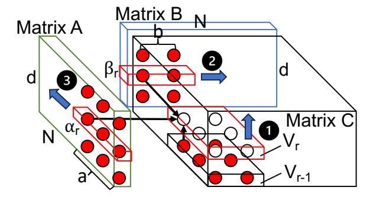
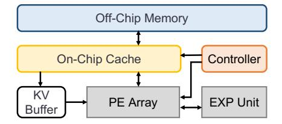
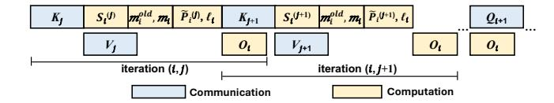

# 3 I/O-Optimal Dataflow

### 3.1 Preliminary: Red-Blue Pebble Game

The Red-Blue Pebble Game [\[31\]](#page-14-2) is a model designed to estimate the minimum volume of data movement between two levels of memory in a hierarchical memory system. It represents the computational process of an application using a computational directed acyclic graph (CDAG), where each vertex ( ∈ ) represents either a data entry or an operation that generates a data entry. Edges in the CDAG indicate dependencies between data elements. The memory hierarchy consists of a theoretically unlimited slow memory and a fast memory with a limited capacity of elements.

In this model, a red pebble on a CDAG vertex indicates that the associated data entry or computational result is stored in fast memory, while a blue pebble denotes storage in slow memory. Initially, blue pebbles are placed on vertices associated with input data. The model enforces a constraint of red pebbles that can be used concurrently, reflecting the limited capacity of fast memory. A legitimate computation sequence involves manipulating the pebbles to indicate the following: loading data into fast memory (red pebbling), storing data in slow memory (blue pebbling), performing computations (placing red pebbles on vertices dependent on

**Table 1.** Key Notations.

<span id="page-4-0"></span>

| Symbol                                | Meaning                                                             |  |
|---------------------------------------|---------------------------------------------------------------------|--|
| M                                     | Fast memory capacity (elements on-chip)                             |  |
| N, d                                  | Dimensions, with $N \gg d$                                          |  |
| $\mathcal{A},\mathcal{B},\mathcal{C}$ | CDAG subsets for <i>A</i> , <i>B</i> , and partial sums of <i>C</i> |  |
| $V_r$                                 | Subcomputation $r$ (subset of CDAG vertices, $V_r \subseteq C$ )    |  |
| $\Gamma_r$                            | Predecessor set in $C$ with children in $V_r$                       |  |
| $D_r$                                 | Dominator set of $V_r$                                              |  |
| $\alpha_r, \beta_r, \gamma_r$         | Projections of $V_r$ onto $A$ , $B$ , and $C$                       |  |
| $V_{IR,r}, V_{FR,r}$                  | Immediate reuse set and future reuse set used by $V_r$              |  |
| $W_{B,r}$                             | Vertices written back after $V_r$                                   |  |
| a, b                                  | Tiling sizes for $A$ and $B$                                        |  |
| $t_{\alpha}$                          | Number of subcomputations reusing a block of $A$                    |  |
| $\rho_r$                              | Compute-to-I/O ratio of $V_r$                                       |  |
| $T_r$                                 | I/O operations of $V_r$                                             |  |
| h                                     | Number of subcomputations in tall-and-skinny MMM                    |  |
| T                                     | Total I/O operations in tall-and-skinny MMM                         |  |
| $T_{Att}$                             | Total I/O operations in long-sequence attention                     |  |

antecedent vertices with red pebbles), and freeing up memory resources (pebble removal). The sequence concludes when all output vertices are marked with blue pebbles.

The Red-Blue Pebbling Game has been successfully used to derive the I/O complexity of general MMM [35], guiding optimal tiling and scheduling strategies. Consider the matrix multiplication C = AB, where  $A \in \mathbb{R}^{m \times k}$ ,  $B \in \mathbb{R}^{k \times n}$ , and  $C \in \mathbb{R}^{m \times n}$ . Assuming each matrix element is one word and  $M < \min\{mn, mk, nk\}$ , none of these matrices fit into fast memory. The optimal I/O complexity of general MMM is thus proven to be  $O\left(\frac{mnk}{\sqrt{M}}\right)$ .

### 3.2 I/O Optimality of Tall-and-Skinny MMM

We analyze the I/O complexity of tall-and-skinny MMM, a fundamental computation in exact long-sequence self-attention. Consider the matrix multiplication C = AB, where  $A \in \mathbb{R}^{N \times d}$ ,  $B \in \mathbb{R}^{d \times N}$ , and  $C \in \mathbb{R}^{N \times N}$ , with  $N \gg d$ . We assume the onchip fast memory capacity M satisfies d < M < Nd. Our goal is to determine optimal tile sizes for matrices A and B by exploiting data reuse, thereby maximizing the compute-to-I/O ratio and reducing I/O operations between fast (on-chip) and slow (off-chip) memories. For clarity, key notations are summarized explicitly in Table 1.

**Vertices and Edges in CDAG.** To analyze the I/O complexity using the Red-Blue Pebble Game, we represent the computation C = AB by a CDAG G = (V, E). The vertex set V consists of three subsets:  $\mathcal{A}$ ,  $\mathcal{B}$ , and C, corresponding respectively to elements of matrices A, B, and the  $N^2d$  intermediate partial results of matrix C. Each vertex  $v \in V$  is represented by a tuple (F, U), where  $F \in \{\mathcal{A}, \mathcal{B}, C\}$  indicates the subset, and U specifies the coordinates within the corresponding matrix. Specifically, vertices in subsets  $\mathcal{A}$  and  $\mathcal{B}$  have two-dimensional coordinates representing their matrix indices,

while vertices in subset C have three-dimensional coordinates representing partial computations. An element  $C(t_1, t_2)$  of matrix C is computed through a sequence of partial updates as  $C(t_1, t_2, t_3) = C(t_1, t_2, t_3 - 1) + A(t_1, t_3) \times B(t_3, t_2)$ . Therefore, for each vertex  $v = (C, (t_1, t_2, t_3))$  with  $t_3 > 1$ , the corresponding edges in the edge set E are  $((\mathcal{A}, (t_1, t_3)), v), ((\mathcal{B}, (t_3, t_2)), v)$ , and  $((C, (t_1, t_2, t_3 - 1)), v)$ .

Given the tall-and-skinny MMM CDAG G = (V, E), the CDAG can be partitioned into a sequence of subcomputations  $V_1, V_2, \ldots, V_h$ , corresponding to an execution order (scheduling) of the CDAG, satisfying the following conditions:

- 1. **Pairwise disjointness**:  $V_i \cap V_j = \emptyset$ , for all  $i \neq j$ .
- 2. Complete coverage:  $\bigcup_{i=1}^{h} V_i = V$ .
- 3. **No cyclic dependencies**: There exist no cyclic dependencies among the subcomputations.

**Dominator Set.** A dominator set  $D_i$  of a subcomputation  $V_i$  is the set of vertices in V such that every path from any input vertex of G to a vertex in  $V_i$  contains at least one vertex in  $D_i$ . For a given subcomputation  $V_r \subseteq C$ , let its projection onto matrix A be  $\alpha_r = \phi_a(V_r)$ , onto matrix B be  $\beta_r = \phi_b(V_r)$ , and onto matrix C be  $\gamma_r = \phi_c(V_r)$ . We further define  $\Gamma_r \subset C$  as the set of vertices in C that have at least one child in  $V_r$ . Thus, the sets  $\alpha_r$ ,  $\beta_r$ , and  $\Gamma_r$  represent the inputs of  $V_r$  originating respectively from matrices A, B, and the preceding partial results in C. Together, these sets form the minimal dominator set  $D_r$  for subcomputation  $V_r$ :

$$D_r = \alpha_r \cup \beta_r \cup \Gamma_r$$
.

Since the projection of both  $V_r$  and  $\Gamma_r$  onto matrix C equals  $\gamma_r$ , the minimal size of  $D_r$  is computed as:

<span id="page-4-1"></span>
$$|D_r| = |\alpha_r| + |\beta_r| + |\gamma_r|. \tag{1}$$

**Takeaway:**  $|D_r|$  represents the minimal amount of data that must be resident in fast memory to perform the subcomputation  $V_r$ .

**Reuse Set.** Assuming each subcomputation  $V_r \subseteq C$  has equal sizes  $[a \times b \times 1]$ , such that  $|\alpha_r| = a$  and  $|\beta_r| = b$ , the number of computations performed by  $V_r$  is:

<span id="page-4-2"></span>
$$|V_r| = |\alpha_r||\beta_r| = \text{ab.} \tag{2}$$

The total number of subcomputations h can be expressed as:

$$h = \frac{N^2 d}{\mathsf{ab}}.\tag{3}$$

Upon completion of  $V_r$ , red pebbles have three possibilities: they can be immediately reused in the subsequent subcomputation, contributing to the immediate reuse set  $V_{IR,r+1}$  of  $V_{r+1}$ ; they may still hold red pebbles, waiting to be reused by a future subcomputation  $V_u$  (u > r + 1), thus contributing to the future reuse set  $V_{FR,u}$  of  $V_u$ ; or they must be stored back, represented by the set  $W_{B,r}$ , requiring the assignment of blue pebbles.

Consider two successive computations,  $V_r$  and  $V_{r+1}$ . After the subcomputation  $V_r$ , the sets  $\alpha_r$ ,  $\beta_r$ , and  $V_r$  may contain

elements placed with red pebbles. For the dominator set of  $V_{r+1}$ , the size is given by  $|D_{r+1}| = |\alpha_{r+1}| + |\beta_{r+1}| + |\gamma_{r+1}|$ . The immediate reuse set  $V_{IR,r+1}$  is determined by the intersection of these sets, leading to the inequality:

$$|V_{IR,r+1}| \leq |\alpha_r \cap \alpha_{r+1}| + |\beta_r \cap \beta_{r+1}| + |\gamma_r \cap \gamma_{r+1}|.$$

The maximized immediate reuse set  $V_{IR,r+1}$  is achieved only if at most one of the overlapping projections  $\alpha_r \cap \alpha_{r+1}$ ,  $\beta_r \cap \beta_{r+1}$ , or  $\gamma_r \cap \gamma_{r+1}$  is not empty, and only if  $\gamma_r = \gamma_{r+1}$  (the proof is provided in [35]). In this case, the output of  $V_r$  is immediately reused by  $V_{r+1}$ , maximizing the immediate reuse set and eliminating any need to store the outputs of  $V_r$  back to slow memory. Therefore,  $W_{B,r} = \emptyset$ . When this maximum immediate reuse is achieved, we have:

<span id="page-5-0"></span>
$$|V_{IR,r+1}| = |\gamma_r \cap \gamma_{r+1}| = |\gamma_r| = |\gamma_{r+1}|,$$
 (4)

<span id="page-5-1"></span>
$$|W_{B,r}| = |\gamma_r \setminus \gamma_{r+1}| = 0. \tag{5}$$

Besides immediate reuse, which involves output reuse, future reuse refers to the reuse of input data. If  $\alpha_r$  holds red pebbles and they are never removed until they are fully used by  $t_{\alpha}$  subcomputations, then after subcomputation  $V_r$ , the future subcomputation  $V_u$ , where  $\alpha_u = \alpha_r$ , can reuse the red pebbles placed in  $\alpha_r$  directly. Similarly,  $\beta_r$  can also hold red pebbles after  $V_r$  for reuse by further subcomputations. However, there is no single subcomputation  $V_u$  for which both  $\alpha_u = \alpha_r$  and  $\beta_u = \beta_r$ , making it impossible to concurrently reuse  $\alpha_r$  and  $\beta_r$ . Consequently, retaining red pebbles from only one input matrix in fast memory minimizes the consumption of valuable fast memory capacity. Since matrices A and B have the same dimensions, we consider an optimized dataflow that ensures each vertex of matrix A is fully reused by  $t_{\alpha}$  subcomputations. Therefore, each subcomputation requesting  $\alpha_r$  as input contributes  $\frac{|\alpha_r|}{t_\alpha}$  to the loading from matrix A. Assuming  $\alpha_r$  is reused by  $V_u$ , we use  $|V_{FR,u}|$ to reflect the contributions from all other subcomputations except  $V_u$  that request  $\alpha_r$  as input, thus we have:

<span id="page-5-2"></span>
$$|V_{FR,u}| = \left(1 - \frac{1}{t_{\alpha}}\right) |\alpha_r|. \tag{6}$$

**Takeaway:** Immediate reuse reduces I/O by retaining computed results (outputs) in fast memory for immediate use by subsequent subcomputations, whereas future reuse reduces I/O by holding input data in fast memory until they have been fully utilized across multiple subcomputations. Together, maximizing both forms of reuse directly increases the compute-to-I/O ratio.

**Maximized Compute-to-I/O Ratio**. We define the number of computations performed by  $V_r$  for each I/O operation between two levels of memory as the compute-to-I/O ratio. Let  $\rho_r$  represent the maximized compute-to-I/O ratio of  $V_r$  in tall-and-skinny MMM, given by:

$$\rho_r = \frac{|V_r|}{|D_r| - |V_{IR|r}| - |V_{ER|r}| + |W_{R|r}|}.$$
 (7)

<span id="page-5-5"></span>

**Figure 4.** CDAG of a tall-and-skinny MMM with optimized scheduling to minimize I/O operations. Red pebbles indicate data elements resident in on-chip fast memory. The red frame in matrix C delineates the current subcomputation  $V_r$ .

Considering Equations 1, 2, 4, 5, and 6, we have:

<span id="page-5-3"></span>
$$\rho_r = \frac{|\alpha_r||\beta_r|}{\frac{|\alpha_r|}{t_r} + |\beta_r|} = \frac{\mathsf{ab}}{\frac{\mathsf{a}}{t_\alpha} + \mathsf{b}}.\tag{8}$$

We define  $T_r$  as the minimized number of I/O operations required by  $V_r$ . According to Equation 8, we have:

<span id="page-5-4"></span>
$$T_r = \frac{|V_r|}{\rho_r} = \frac{\mathsf{a}}{t_\alpha} + \mathsf{b} \tag{9}$$

Let T denote the total I/O operations across all h subcomputations for tall-and-skinny MMM. Considering Equation 9 and following the definition of the Red-Blue Pebble Game [31], where  $N^2$  final output vertices of matrix C must be placed in blue pebbles and stored back in slow memory, resulting in an additional  $N^2$  additional I/O operations. Thus, the I/O lower bound of tall-and-skinny MMM is expressed as:

<span id="page-5-6"></span>
$$T \ge \sum_{i=1}^{h} T_i + N^2 = \frac{N^2 d}{\mathsf{a}\mathsf{b}} \times \left(\frac{\mathsf{a}}{t_\alpha} + \mathsf{b}\right) + N^2. \tag{10}$$

**Takeaway:** The compute-to-I/O ratio  $\rho_r$  directly measures computational efficiency relative to data movement. Maximizing  $\rho_r$  leads directly to achieving the I/O lower bound for tall-and-skinny MMM.

Attainability of the I/O Lower Bound. Figure 4 depicts a tall-and-skinny MMM scheduling that aligns with the analysis of the I/O lower bound. This scheduling provides a concrete illustration of how immediate and future reuse can be maximized in practice. The tall-and-skinny matrices A and B are tiled into blocks of size  $a \times d$  and  $b \times d$ , respectively. Initially, ad elements of matrix A and bd elements of matrix B are loaded into the on-chip fast memory with red pebbles. To maximize immediate reuse, the entire tall-and-skinny MMM CDAG is partitioned into  $\frac{N^2d}{ab}$  subcomputations. Each subcomputation generates ab partial outputs, ensuring that the outputs of one subcomputation (except the vertices in the top layer) are reused on-chip by the next subcomputation without any I/O operations (1). Upon completing d subcomputations, the final ab outputs of matrix C (the top layer

vertices) are stored back to slow memory, and the next bd elements of the subsequent block of matrix B are loaded into fast memory, while the current block of matrix A remains in fast memory for future reuse in the next d subcomputations (2). After matrix B is fully traversed, indicating that the corresponding block of matrix A has been fully reused by all possible subcomputations. Then, the process continues by loading the next block of matrix A into the fast memory (3) and repeating the steps until all calculations are completed.

To minimize I/O operations in tall-and-skinny MMM, we need to determine the tiling sizes a and b to maximize  $\rho_r$  while considering the capacity constraint of the fast memory. As shown in Figure 4, in order to execute  $V_r$ , at most ad + bd + ab vertices can be placed in red pebbles concurrently. Thus, we have:

maximize 
$$\rho_r = \frac{ab}{\frac{a}{t_{\alpha}} + b}$$
subject to: 
$$ad + bd + ab \le M,$$

$$t_{\alpha} = \frac{N}{b},$$

$$a, b \in \mathbb{N}_+.$$

$$(11)$$

The maximum  $\rho_r$  is achieved with the largest possible a, where  $a = \frac{M-d}{d+1}$  and b = 1. Substituting the optimal tiling sizes a and b into Equation 10 yields the final I/O lower bound of tall-and-skinny MMM:

$$T \ge Nd + \frac{N^2d(d+1)}{M-d} + N^2.$$
 (12)

Thus, excluding the constant  $N^2$  outputs that must be stored back, the optimal I/O complexity for tall-and-skinny MMM is  $O\left(\frac{N^2d^2}{M}\right)$ . Comparing this with the optimal I/O complexity of general MMM [35],  $O\left(\frac{N^2d}{\sqrt{M}}\right)$ , the crossover occurs at  $\sqrt{M}=d$ 

Note that  $\sqrt{M}>d$  always holds in practice, which aligns with modern on-chip memory capacities and the long-sequence self-attention mechanism. Therefore, exploiting both immediate and future reuse is not only theoretically optimal but also practically relevant, and is essential for achieving lower I/O complexity in tall-and-skinny MMMs.

**Takeaway:** Optimal tiling sizes, determined by the fast-memory capacity M, maximize  $\rho_r$  and achieve the I/O lower bound for tall-and-skinny MMM in practice, significantly reducing I/O operations.

### <span id="page-6-1"></span>3.3 Dataflow of Exact Long-Sequence Attention

Inspired by the I/O analysis of tall-and-skinny MMM, we develop an I/O-optimal dataflow for exact long-sequence self-attention that explicitly exploits both immediate and future reuse. Algorithm 1 details the proposed scheduling and tiling strategy. Leveraging block-wise online softmax [48,

```
Algorithm 1 I/O-Optimal Forward Pass Dataflow for Long-Sequence Attention
 Matrices Q, K, V \in \mathbb{R}^{N \times d} in off-chip slow memory, on-chip fast memory of size M.
 1: Set block sizes a = \left\lfloor \frac{M-d}{2d+4} \right\rfloor, b = 1.
 2: Divide Q into x = \left[\frac{N}{a}\right] blocks, of size a \times d each.
 3: Divide K, V into y = \begin{bmatrix} N \\ \overline{b} \end{bmatrix} blocks, of size b \times d each.
 4: for 0 \le i < x do
 5: Initialize O_{\mathbf{t}} = (0) \in \mathbb{R}^{a \times d} and \ell_i, m_i = (0), (-\infty) \in \mathbb{R}^a on-chip
       Load Q_l \in \mathbb{R}^{a \times d} from off-chip slow memory to on-chip fast memory
       for 0 \le j < y do
         Load K_i \in \mathbb{R}^{b \times d} from off-chip slow memory to on-chip fast memory.
          Compute S_i^{(j)} = Q_i K_i^T \in \mathbb{R}^{a \times b}.
          Update m_i^{old} = m_i and update m_i = max (m_i^{old}, rowmax(S_i^{(j)})).
10:
          Compute \tilde{P}_i^{(j)} = exp(S_i^{(j)} - m_i) \in \mathbb{R}^{a \times b}, \ell_i = exp(m_i^{old} - m_i)\ell_i + \text{rowsum}(\tilde{P}_i^{(j)}) \in \mathbb{R}^a.
11:
           Load V_i \in \mathbb{R}^{b \times d} from off-chip slow memory to on-chip fast memory.
          \text{Update } O_i = diag \left(exp \left(m_i^{old} - m_i\right)\right)^{-1} O_i + \tilde{P}_i^{(j)} V_i \in \mathbb{R}^{\mathsf{a} \times d}.
13:
14: end for
```

15: Compute O<sub>i</sub> = diag(l<sub>i</sub>)<sup>-1</sup> O<sub>i</sub>
16: Store O<sub>i</sub> to the off-chip slow memory.

<span id="page-6-0"></span>17: end for

58] enables accurate softmax computations while minimizing I/O operations in attention score computations [14].

**Scheduling.** Initially, we divide the matrices Q, K, and Vinto blocks of size  $a \times d$ ,  $b \times d$ , and  $b \times d$ , respectively (lines 2-3). We then structure the process of self-attention into two key stages related to I/O operations: (1) computation of attention scores (S), and (2) computation of outputs (O). These stages are executed iteratively to process the entire self-attention mechanism. In the first stage, a block of Q (ad elements) (loaded if the previous block of Q cannot be reused) and a block of *K* (b*d* elements) are loaded into fast memory (lines 6 and 8). The multiplication of these two blocks is then performed in d steps, and the partial attention scores (ab elements) from the current step are aggregated immediately with existing partial attention scores in fast memory (if any) on chip, as illustrated in Figure 5(a). These updated scores remain in fast memory for immediate reuse in the next step (line 9). Once the final attention scores  $S_i^{(j)}$  are completed, the process proceeds to applying the online softmax to the corresponding block for P (lines 10-11). The second stage begins after the online softmax computation. The block of  $\tilde{P}$ (ab elements) is used to weight the corresponding block of V. This involves loading bd elements of V into fast memory (line 12). The multiplication between these two blocks is then computed, as shown in Figure 5(b). After computation, ad results are immediately aggregated with existing partial outputs (if any) and kept in fast memory for subsequent updates (line 13).

During execution, the block of Q remains in fast memory for future reuse, while new blocks of K and V are loaded sequentially into fast memory, alternating between the first and second stages. This iterative process continues until all blocks of K and V have been traversed and the current block

<span id="page-7-0"></span>

**Figure 5.** I/O-optimal CDAGs for long-sequence attention (a) computation of attention scores (*S*) with immediate reuse of partial results, and (b) computation of outputs (*O*).

of *Q* has been fully reused. Subsequently, a new block of *Q* is loaded, and the traversal of *K* and *V* is repeated.

**Tiling.** With respect to the total I/O operations described in Algorithm 1, all elements of Q are loaded into fast memory once, accounting for Nd I/O operations. The elements of K and V are loaded into fast memory  $\frac{N}{a}$  times each, contributing to a total of  $2Nd \times \frac{N}{a}$  I/O operations. Additionally, the outputs of O must be written back to slow memory, resulting in Nd I/O operations. Thus, the total number of I/O operations  $T_{Att}$  for exact long-sequence self-attention is:

<span id="page-7-1"></span>
$$T_{Att} = 2Nd\left(1 + \frac{N}{\mathsf{a}}\right). \tag{13}$$

In order to achieve the minimized  $T_{Att}$ , the tiling sizes a and b must be determined by considering the capacity constraint of the fast memory (M). Note that blocks of K and V do not need to be resident in fast memory simultaneously. Therefore, the fast memory must hold at least ad elements of Q, bd elements of K or V, ab elements for storing partial results of S or  $\tilde{P}$  after online softmax, ad elements for storing partial results of O, and intermediate vectors  $m_i^{\text{old}}$ ,  $m_i$ ,  $\ell_i$  for online softmax, totaling 3a elements. Hence, the optimization problem is formulated as:

minimize 
$$T_{Att} = 2Nd\left(1 + \frac{N}{a}\right)$$
  
subject to:  $ad + bd + ab + ad + 3a \le M$  (14)  
 $a, b \in \mathbb{N}_+$ .

The minimum  $T_{Att}$  is achieved by maximizing a, where a =  $\frac{M-d}{2d+4}$  and b = 1. By substituting the optimal tiling sizes a and b into Equation 13, we obtain the optimized I/O operations for exact long-sequence self-attention:

$$T_{Att} = 2Nd + \frac{4N^2d(d+2)}{M-d}. (15)$$

<span id="page-7-2"></span>

Figure 6. Overview of AttenIO.

<span id="page-7-3"></span>

**Figure 7.** Three levels of communication-computation overlapping.

**Takeaway:** The proposed scheduling and tiling strategy for exact long-sequence self-attention achieves the I/O optimality derived from tall-and-skinny MMM analysis, making the results practically achievable.

