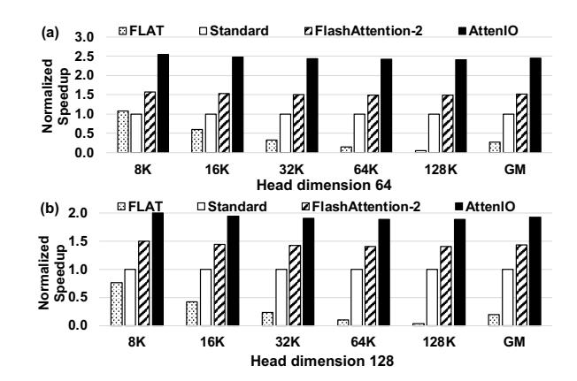
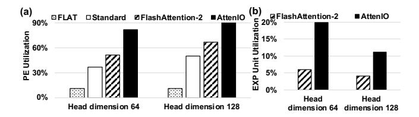
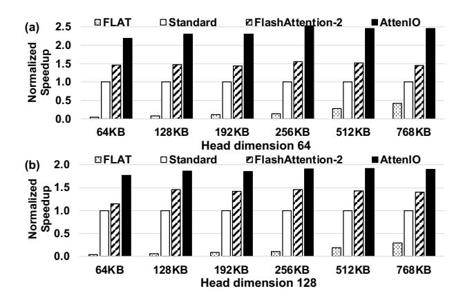

# 5 Evaluation Methodology

Table 2 presents the detailed hardware configuration of AttenIO. We implement the core components of AttenIO in RTL and synthesize them using Synopsys Design Compiler with the TSMC 22 nm technology standard cell library, operating at a frequency of 1 GHz, to obtain power and area statistics. We use CACTI 7.0 [4] to model the latency, power, and area of the on-chip memory components, including on-chip cache and the KV buffer. Performance is evaluated using a cycle-accurate simulator that integrates detailed models for computation, memory accesses, and dataflow execution. For off-chip memory, all HBM timing parameters are derived from DRAMSim3 [38], assuming an HBM bandwidth of 128 GB/s. The simulator takes hardware configurations and model parameters as input and reports execution time, data movement between on-chip and off-chip memory, PE utilization, and softmax efficiency for performance compari-

We compare AttenIO against three state-of-the-art dataflow baselines: Standard, FLAT [32], and FlashAttention-2 [12]2. To ensure fairness, all dataflows are evaluated on the same hardware configuration as AttenIO, summarized in Table 2. Standard follows the default execution flow for exact self-attention [52], while FLAT adopts a row-granularity dataflow [32]. For Standard and FLAT, we tune their tiling sizes using the Red-Blue Pebble Game analysis for general MMM [35], adapting them to different on-chip cache sizes to ensure fair evaluation. FlashAttention-2 employs a blockwise online softmax dataflow. To determine the adaptive tiling sizes, we follow the strategy of FlashAttention [14], which defines the tiling parameters as explicit functions of the available on-chip cache capacity M and head dimension d. Specifically, the row tile size is set to  $B_r = \min(\lceil M/(4d) \rceil, d)$ ,

**Figure 10.** Speedup comparison of FLAT, Standard, FlashAttention-2, and AttenIO.

and the column tile size is set to  $B_c = \lceil M/(4d) \rceil$ . We adhere strictly to the original dataflow and tiling strategy, ensuring proper adaptation to the target hardware configuration.

We evaluate sequence lengths (*N*) ranging from 8K to 128K, with a hidden dimension of 2048 and head dimensions (*d*) of 64 and 128. The data precision for all evaluations is FP16.3 Moreover, to demonstrate the real-world impact, we measure inference latency during the prefilling stage of GPT-3 [6]. Finally, to assess the performance of AttenIO against GPUs, we compare AttenIO with two implementations on an NVIDIA H100 GPU: FlashAttention-2 (optimized by cuDNN [10] specifically for H100 GPUs) and FlashAttention-3 [61]4. For a fair comparison, we scale the hardware resources of AttenIO to match the peak throughput of the H100 GPU.

### 6 Experiment Results

### 6.1 Exact Attention Performance

Figure 10 compares AttenIO with the dataflows Standard, FLAT, and FlashAttention-2 under identical hardware configurations, across varying sequence lengths and head dimensions. Speedups are normalized to Standard. We make three major observations. First, AttenIO consistently outperforms all baselines for all configurations. For a head dimension of 64, AttenIO achieves geometric mean speedups of 8.8×, 2.5×, and 1.6× over FLAT, Standard, and FlashAttention-2, respectively. When the head dimension increases to 128, AttenIO achieves speedups of 9.9×, 1.9×, and 1.3×, respectively. Second, FlashAttention-2, which utilizes online softmax and a block-wise dataflow, demonstrates better performance compared to FLAT and Standard. Although both AttenIO and FlashAttention-2 employ online softmax, AttenIO performs better due to its optimized tiling based on comprehensive

&lt;sup>2FlashAttention-3 [61] uses the same forward dataflow as FlashAttention-2; thus, we use FlashAttention-2 as the representative baseline.

 $^3$  Our I/O analysis adapts to varying data precision, as precision directly affects the fast memory capacity M, enabling tile sizes to scale accordingly.  $^4$  FlashAttention-3 incorporates hardware-specific optimizations for the NVIDIA Hopper GPU architecture.

**Figure 11.** Normalized I/O operations of FLAT, Standard, FlashAttention-2, and AttenIO.

I/O analysis and I/O-driven optimizations. Third, although FLAT employs a row-granularity dataflow and fuses operations involving softmax and MMM, its performance struggles with longer sequence lengths and the larger head dimension, highlighting the limitations of a heuristic dataflow design.

### 6.2 Detailed Analysis

**Data Movement.** To evaluate the effectiveness of the I/O-optimal dataflow of AttenIO, we measure the volume of data movement (in bytes) between the on-chip cache and off-chip memory. Minimizing data movement is critical to improving the efficiency of attention mechanisms. Figure 11 presents the normalized data movement during exact self-attention across various evaluated configurations. We observe that AttenIO consistently incurs significantly lower data movement than the baselines across all evaluated sequence lengths. For a head dimension of 64, FLAT incurs 273.7× more data movement on geometric mean, while Standard and FlashAttention-2 incur 57.0× and 26.8× more, respectively. For a head dimension of 128, FLAT, Standard, and FlashAttention-2 incur 148.8×, 16.4×, and 7.3× more data movement than AttenIO, respectively. The substantial difference in data movement highlights the advantage of using a comprehensive I/O analysis to guide tiling. Unlike the heuristic tiling in FlashAttention-2, AttenIO considers both the input dimensions and the capacity limitations of on-chip cache to guarantee minimal I/O operations. Additionally, we observe that data movement of FLAT increases significantly with larger input sequence lengths and higher head dimensions. Even when the on-chip cache can store several rows of intermediate activations, storing long rows with limited cache capacity reduces data reuse opportunities during MMMs, which increases I/O operations. If the cache cannot hold even a single row, FLAT must offload partial results to off-chip memory, further reducing fusion efficiency.

**6.2.2 Hardware Utilization.** Figure 12(a) presents the geometric mean PE array utilization across all input sequence

**Figure 12.** Utilization comparisons: (a) PE utilization, and (b) EXP unit utilization.

**Figure 13.** Computation time and memory stall time breakdown of AttenIO.

lengths for AttenIO and the baselines. PE array utilization is defined as the percentage of time the PE array actively performs computations relative to total execution time. AttenIO consistently achieves the highest utilization among all baselines, reaching 82.1% for a head dimension of 64 and 90.3% for 128. The high PE utilization of AttenIO is attributed to its I/O-optimal dataflow, which minimizes I/O operations, and its fine-grained communication-computation overlapping, which further reduces I/O stalls. Figure 12(b) compares the utilization of the EXP unit between FlashAttention-2 and AttenIO, both employing online softmax. For a head dimension of 64, AttenIO achieves a utilization of 19.9%, which is 3.3× higher than FlashAttention-2. For a head dimension of 128, the EXP unit utilization of AttenIO is 11.2%, which is 2.7× higher than FlashAttention-2. AttenIO integrates softmax computations within its parallel patterns, fully utilizing data-level parallelism and enabling more efficient parallel processing. This results in pipelining between the PE array and the EXP unit, leading to a combined PE and EXP unit utilization that exceeds 100%.

Figure 13 presents the breakdown of execution time for AttenIO across different sequence lengths and head dimensions. We separate execution time into computation time, during which at least one of the PE array or the EXP unit is actively executing, and memory stall time. We observe that memory stall time remains consistently below 1% for all evaluated configurations, and decreases further as the sequence length increases. For a head dimension of 64, the memory stall fraction drops from 0.32% at 8K to 0.02% at 128K, while for a head dimension of 128, it decreases from 0.33% to 0.02%. The consistently low stall fraction confirms that AttenIO not only effectively mitigates data movement between the on-chip cache and off-chip memory through

Figure 14. Overall speedup comparison of FLAT, Standard, FlashAttention-2, and AttenIO across varying cache sizes.

the I/O-optimal dataflow, but also further hides data movement latency via control mechanisms such as three-level communication-computation overlapping and parallel softmax execution, allowing computation to proceed with minimal interruption. We further compare the energy efficiency of AttenIO and FlashAttention-2. AttenIO achieves average improvements of 1.5× and 1.3× over FlashAttention-2 for head dimensions of 64 and 128, respectively.

### 6.3 Performance with Different Cache Sizes

To understand the generalization capability of AttenIO, Figure [14](#page-11-0) shows the geometric mean speedup of AttenIO and the baselines in executing exact attention across various input sequence lengths for each cache size. AttenIO consistently outperforms the baselines across all cache sizes. Specifically, for a head dimension of 64, AttenIO achieves stable speedups ranging from 2.2× to 2.5×, while the second-best, FlashAttention-2, achieves speedups ranging from 1.4× to 1.5×. For a head dimension of 128, AttenIO achieves speedups ranging from 1.8× to 1.9×, while FlashAttention-2 achieves speedups between 1.2× and 1.5×. These results validate the importance of I/O analysis considering matrix dimensions and hardware constraints, and confirm that communicationcomputation overlapping and parallel softmax execution improve the robustness and efficiency of AttenIO.

