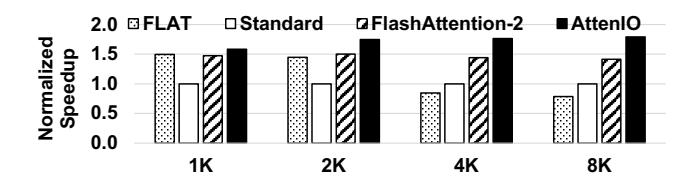

# 6.4 Performance with Block-Wise Causal Mask

In auto-regressive language modeling, a causal mask ensures each token attends only to itself and preceding tokens [\[11,](#page-13-21) [77\]](#page-15-18). We implement a block-wise causal mask [\[14\]](#page-13-7), where any block of containing only elements with column indices exceeding row indices can be skipped entirely. Figure [15](#page-11-1) illustrates the performance gains of AttenIO over FlashAttention-2 when a block-wise causal mask is applied. We make three key observations. First, AttenIO consistently outperforms FlashAttention-2 across all sequence lengths and head dimensions. Second, as the input sequence length increases, the

Figure 15. Speedup of AttenIO over FlashAttention-2 with a block-wise causal mask.

Figure 16. Performance comparison of long-sequence prefilling across different sequence lengths.

performance gain of AttenIO over FlashAttention-2 becomes more pronounced. Third, AttenIO achieves geometric mean speedups of 1.6× and 1.3× over FlashAttention-2 for head dimensions of 64 and 128, respectively. These improvements align with the speedups observed without a causal mask, demonstrating the robustness and generality of AttenIO.

### 6.5 Prefilling Efficiency

We measure the prefilling latency during GPT-3 [\[6\]](#page-13-2) inference, where self-attention is the main bottleneck. Figure [16](#page-11-2) presents the normalized speedup across varying sequence lengths. Across all evaluated sequence lengths, AttenIO exhibits performance gains due to its I/O analysis-guided dataflow and optimizations. At a sequence length of 8K, AttenIO achieves speedups of 2.3×, 1.8×, and 1.3× over FLAT, Standard, and FlashAttention-2, respectively. These results demonstrate that AttenIO effectively reduces prefilling latency, thereby minimizing initial token-generation delays.

### 6.6 Comparison with GPU Implementations

Figure [17](#page-12-0) compares the performance of AttenIO in executing exact attention with SOTA GPU implementations, including cuDNN-optimized FlashAttention-2 and FlashAttention-3. For a head dimension of 64, AttenIO achieves a geometric mean speedup of 3.4× over FlashAttention-2 (cuDNN) and 3.0× over FlashAttention-3. For a head dimension of 128, AttenIO obtains a speedup of 2.4× over both implementations. Overall, these results demonstrate that AttenIO substantially outperforms SOTA GPU-optimized attention methods.

